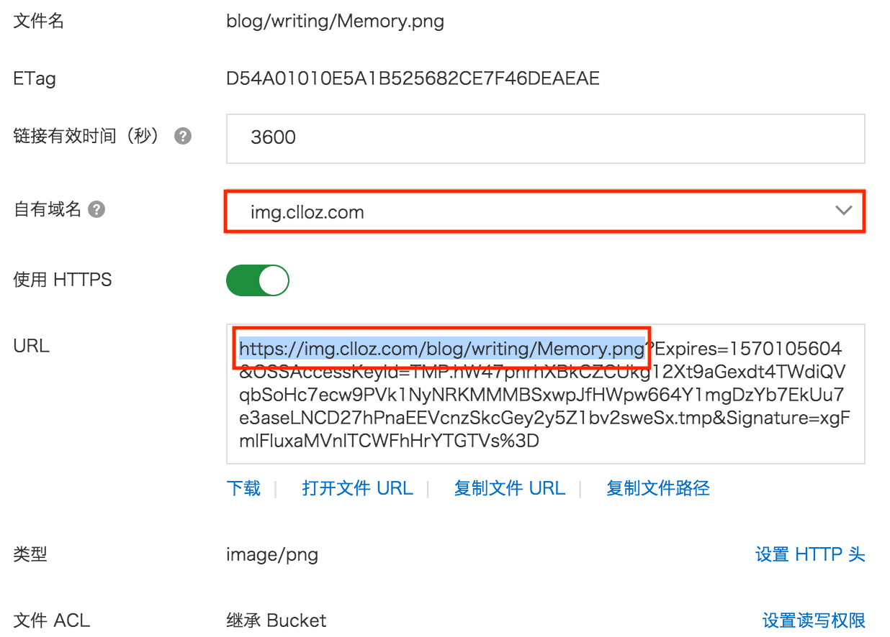

\[toc\]

## 前言

我的网站是部署在阿里云上面的，使用差不多两年了，随着自己对于建站的知识了解的更多，以及网络和 `web服务器` 的更多的了解，在解决问题的过程中也遇到过不少坑。这篇文章说一下阿里云的 `oss` 和 `cdn` 的配置问题。

## 关于搭建个人网站

其实我搭建个人网站主要是让自己在建站的过程中了解一个网站的开发，部署过程，从实践中来学习，因为看书或者看别人的文章有很多细节是无法了解的，自己试过了才知道会遇到哪些问题，以及哪些自己不知道的知识点。就好像看别人做菜感觉很简单，真的上手发现很多东西其实并不像表面那样简单，有很多细节别人得心应手没有讲，但是你并不知道，甚至连切菜都不同的菜不同的切法。同时自己搭建个人网站也能把自己的一些学习笔记记录下来，和别人分享，把自己对于网站的一些想法付诸实践，也是挺有趣的。

虽然可能个人网站的访问量不会很大，不过能用上的东西还是尽量用上，比如 `cdn`，`https`，比如对象存储，虽然对于我们的这种没什么人访问的网站可能并没有什么本质的区别，但是在使用的过程中我们会去了解这些内容，能学到很多。

## CDN

`cdn` 其实说简单点就是我们网站的资源存储在一台服务器上，不论哪个用户从什么地方发起请求最后都要到我们的服务器去取对应的资源，这样可能会造成拥堵和延迟，为了解决这个问题才有 `Content Delivery Network 内容分发网络`，将源站内容分发至最接近用户的节点，使用户可就近取得所需内容，提高用户访问的响应速度和成功率。解决因分布、带宽、服务器性能带来的访问延迟问题，适用于站点加速、点播、直播等场景。

最简单的CDN网络由一个DNS服务器和几台缓存服务器组成： 1. 当用户点击网站页面上的内容URL，经过本地DNS系统解析，DNS系统会最终将域名的解析权交给CNAME指向的CDN专用DNS服务器。 2. CDN的DNS服务器将CDN的全局负载均衡设备IP地址返回用户。 3. 用户向CDN的全局负载均衡设备发起内容URL访问请求。 4. CDN全局负载均衡设备根据用户IP地址，以及用户请求的内容URL，选择一台用户所属区域的区域负载均衡设备，告诉用户向这台设备发起请求。 5. 区域负载均衡设备会为用户选择一台合适的缓存服务器提供服务，选择的依据包括：根据用户IP地址，判断哪一台服务器距用户最近；根据用户所请求的URL中携带的内容名称，判断哪一台服务器上有用户所需内容；查询各个服务器当前的负载情况，判断哪一台服务器尚有服务能力。基于以上这些条件的综合分析之后，区域负载均衡设备会向全局负载均衡设备返回一台缓存服务器的IP地址。 6. 全局负载均衡设备把服务器的IP地址返回给用户。 7. 用户向缓存服务器发起请求，缓存服务器响应用户请求，将用户所需内容传送到用户终端。如果这台缓存服务器上并没有用户想要的内容，而区域均衡设备依然将它分配给了用户，那么这台服务器就要向它的上一级缓存服务器请求内容，直至追溯到网站的源服务器将内容拉到本地。

以上就是 `cdn` 的一些基础只是，`cdn` 最主要的目的就是加速网站的访问。

## 对象存储

阿里云的 `oss` 就是对象存储的一种实现，对象存储是和快存储，文件存储相对应的概念，想了解对象存储的可以看知乎上的这个问题 [块存储、文件存储、对象存储这三者的本质差别是什么？](https://www.zhihu.com/question/21536660 "块存储、文件存储、对象存储这三者的本质差别是什么？")，我一般是用来放一些网站要用的图片、视频以及其他小文件。

## OSS 和 CDN 相关问题

`oss` 和 `cdn` 的配置都很简单，而且阿里云的文档也很详细，我就不介绍了，下面把我遇到的一些问题跟大家说一说。

## OSS 跨域

关于跨域的问题可以看我的这篇文章：[浏览器同源策略和跨域方法](https://www.clloz.com/programming/front-end/js/2019/05/09/cors/ "浏览器同源策略和跨域方法") 如果你想要在页面上有对 `oss` 资源的请求，或者是脚本中要请求对应资源，都会因为浏览器的同源策略而请求失败，比如我在我的服务器上就有一个文件夹专门放文章要用到的页面实例，之前做的一个音乐播放器要访问 `oss` 上的图片和音频文件，就报错了。我们可以在 `阿里云控制台 -> 对象存储OSS -> 对应bucket -> 基础设置 -> 跨域设置` 中来配置我们的对应的域名，比如我可以配置 `*.clloz.com` 来完成跨域访问。

## 网站字体跨域问题

配置了 `cdn` 以后，我们的页面会到 `cdn` 服务器去请求字体文件，此时我们的 `origin` 是我们的网站域名，所以访问字体文件会导致跨域，解决方法是我们在 `cdn` 控制台对应域名的配置中选择 `缓存配置 -> http头`，然后添加 `Access-Control-Allow-Origin`，值为 `*` 或者你的网站域名。需要注意的是这里是服务器请求 `cdn` 服务器的资源导致跨域，而不是服务器上的资源被请求跨域，所以在服务器上配置是无效的。

## 配置防盗链

当没有为 `oss` 绑定 `cdn` 域名的时候，我们可以直接在 `oss` 里面配置，不过这样的做法不好，我咨询过阿里云的工程师，他们还是建议把 `oss` 的 `bucket` 设置为私有，然后通过 `cdn` 来访问 `bucket` 中的资源。需要注意的是，当 `bucket` 设置为私有以后，我们通过设置白名单来访问 `bucket` 上的资源都是有时间限制的，所以一定要通过 `cdn` 访问。当我们为 `bucket` 配置了 `cdn` 以后，我们就可以通过 `cdn` 的域名来访问对应资源，我们打开 `oss` 中的文件还是能看到长长的链接后面跟着 `expire` 等各种参数，但其实我们只要选择自由域名，后面的参数不要管就可以了，相当于 `oss` 为 `cdn` 开辟了一个绿色通道，我们虽然访问私有的 `oss` 有各种限制，但是通过 `cdn` 我们可以直接访问，这里也体现出 `cdn` 的另一个有点，对网站其实有一定的保护作用，因为很多内容的访问都是访问的 `cdn` 服务器，请求并不会发送到真正的服务器。当 `cdn` 和 `oss` 绑定以后，对 `cdn` 的配置会覆盖 `oss` 的配置，比如 `cdn` 和 `oss` 都可以设置白名单，但是真正生效的是 `cdn` 的。

## 工单系统

最后说一下阿里云的工单系统，我用过几次，总的来说体验还是不错的，反应很及时，问题也都解决了，如果你的服务器遇到什么问题，不妨试一试。

## 总结

以上就是我对 `cdn` 和 `oss` 的一些理解和使用心得，希望对你有用。

## 参考文章

1. [阿里云云栖社区知乎回答](https://www.zhihu.com/question/36514327/answer/193768864 "阿里云云栖社区知乎回答")