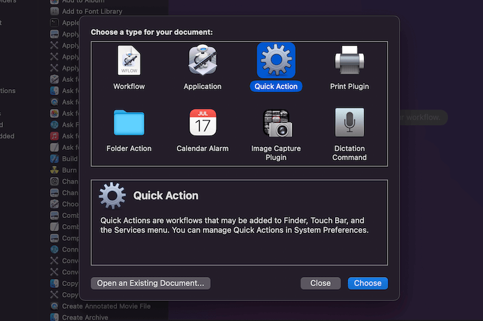
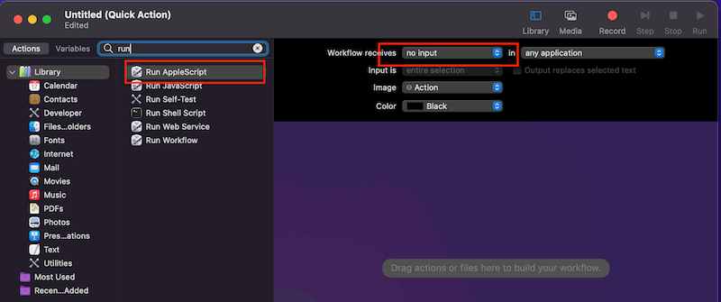

\[toc\]

## 前言

以前写过 [Mac设置terminal快捷键](https://www.clloz.com/programming/assorted/2018/10/23/terminal-shortcut/ "Mac设置terminal快捷键") 讲了一下用 `automator` 来添加 `quick action` 来用快捷键启动终端，今天在讲一下如何设置 `Apple Music` 的全局快捷键来执行上一曲，下一曲和播放暂停。

## 添加 Quick Action

整个操作过程和添加终端的快捷键差不多，不过现在 `automator` 的界面和原来有些不同，原来齿轮图标是叫 `Service`，现在叫 `Quick Action`。我们打开 `automator`，然后在顶部任务栏中选择 `File -> New` 或者直接点解弹出界面的 `New Docment`，然后选择其中的 `Quick Action`，如下图



然后将右侧的 `Workflow Recieve` 选择为 `no input`，在左侧的 `Actions` 中找到 `Run AppleScript`，然后双击，在右侧弹出的脚本输入框中输入脚本即可。



脚本如下：

```javascript
# 下一首
tell application "Music"
    if it is running then
        play (next track)
    end if
end tell

# 上一首
tell application "Music"
    if it is running then
    play (previous track)
    end if
end tell

# 播放暂停
tell application "Music"
    if it is running then
        set isPlaying to the player state
        if (isPlaying = playing) then
            pause
        else
            play
        end if
    end if
end tell
```

> 注意，这里我把三个脚本写在一起了，请根据注释分别创建三个 `Quick Action`，注意不要把注释复制进去

粘贴好脚本后可以点击一下 `▶️` 按钮看看脚本能不能生效，如果没问题就可以保存脚本了，保存一个自己喜欢的名字。`Quick Action` 的保存路径在 `/Users/Clloz/Library/Services`，可以进去重命名。

之后就是设置快捷键了，和设置 `terminal` 快捷键一样，我们可以进入 `System Preferences->Keyboard->Shortcuts->Services->General`，在里面找到刚刚创建的三个 `Quick Action` 的名字，设置快捷键即可。需要注意的是，由于这里设置的是全局快捷键，建议设置得复杂一点，如果设置的太简单很可能和其他应用的快捷键冲突导致不生效。

## 参考文章

1. [不使用第三方程序在 mac 上用快捷键全局控制 Spotify](https://sspai.com/post/58907 "不使用第三方程序在 mac 上用快捷键全局控制 Spotify")