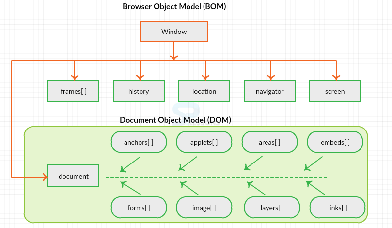
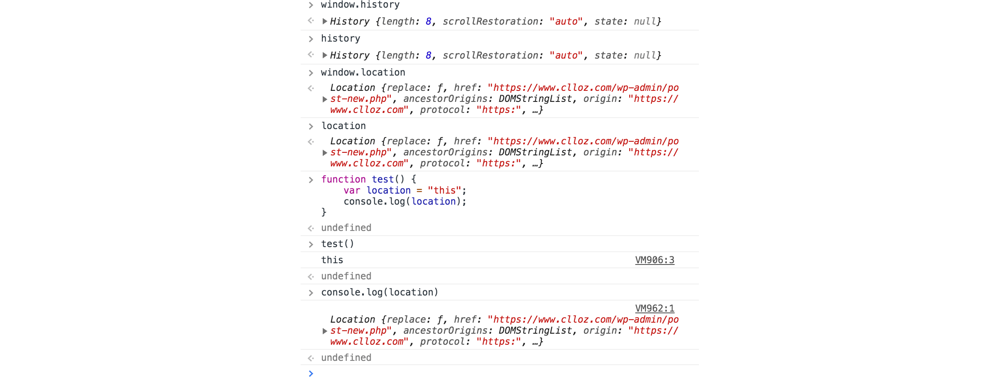
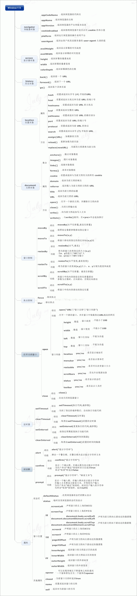

\[toc\]

## 前言

`BOM` ( `browser object model` )并没有像 `DOM` 一样有一个现行的标准，应该是为了对应 `DOM` 而产生的一个概念，可以理解为浏览器向 `Javascript` 暴露的控制浏览器行为的 `API`，比如经常使用的 `window对象，location对象`，因为主流浏览器都实现了这些属性和方法，所以被大家称为 `BOM`。

## window对象

`window` 对象是 `BOM` 中最重要的一个对象，它表示了一个浏览器实例，浏览器的每一个tag都有一个 `window` 对象。 `window` 对象是 `JavaScript` 访问浏览器窗口属性和方法的接口，更重要的一点是它是 `ECMAScript` 中 `Global` 对象在浏览器环境中的实现。所有全局的变量，对象和方法都会自动的成为 `window` 对象的成员，全局变量就是 `window` 对象的属性，全局函数就是 `window` 对象的方法，包括 `document` 对象也是 `window` 对象的一个属性(指向当前窗口对应的 `HTML` 文档的引用），我们可以通过 `window.document` 来访问这个只读属性。包括我们后面说到的 `history，navigator， location， screen` 对象也都是 `window` 对象的属性，这也体现了 `window` 就是 `Global` 对象。

```javascript
var age = 24;

function printName(){
    console.log(age);
}

console.log(window.age); //24
window.printName(); //24
```

BOM和DOM的关系如下图：



可能有些同学发现我们平时使用 `location` 对象是不加 `window.` 的，在控制台打印它们也没有什么区别，返回的是同一个对象，其实理论上在全局执行环境中，`window` 的属性是可以直接访问的，不加 `window.` 前缀，但是在非全局执行环境中，也就是在函数中这样做就可能出错，因为如果你在函数中定义了一个同名的变量，由于这个变量在作用域链中的位置更靠前，所以输出的将会是你声明的这个变量。比如下图这种情况：



> 用var声明的全局属性不能被 `delete` 操作符删除，而通过 `window.property` 来声明的属性则可以被删除。`let` 和 `const` 声明的的属性无论是否是全局的都不能被删除。

## 窗口调用和控制

`window` 对象提供了一套操作窗口的属性和方法,比较常用的有如下几种：

| 名称 | 属性/方法 | 是否只读 | 功能 |
| --- | --- | --- | --- |
| window.innerHeight | 属性 | 只读 | 返回浏览器窗口的内容区域的高度,包含水平滚动条(如果有的话) |
| window.innerWidth | 属性 | 只读 | 浏览器窗口的内容区域的宽度,包含垂直滚动条(如果有的话) |
| window.outerHeight | 属性 | 只读 | 返回浏览器窗口的外部高度 |
| window.outerWidth | 属性 | 只读 | 返回浏览器窗口的外部宽度 |
| window.closed | 属性 | 只读 | 返回窗口是否关闭的布尔值 |
| window.document | 属性 | 只读 | 返回当前窗口所包含的文档的引用 |
| window.localStorage | 属性 | 只读 | 返回用来存储只能在创建它的源下访问的数据的本地存储对象的引用 |
| window.sessionStorage | 属性 | 只读 | 返回用来存储只能在创建它的源下访问的数据的session storage对象的引用 |
| window.screen | 属性 | 只读 | 返回screen对象的引用 |
| window.screenX | 属性 | 只读 | 返回浏览器左边框到显示器左边框的距离 |
| window.screenY | 属性 | 只读 | 返回浏览器上边框到显示器上边框的距离 |
| window.scrollX | 属性 | 只读 | 返回水平方向上页面滚动的像素数 |
| window.scrollY | 属性 | 只读 | 返回垂直方向上页面滚动的像素数 |
| window.btoa() | 方法 |  | 从 String 对象中创建一个 base-64 编码的 ASCII 字符串，其中字符串中的每个字符都被视为一个二进制数据字节 |
| window.atob() | 方法 |  | 对用base-64编码过的字符串进行解码 |
| window.close() | 方法 |  | 关闭当前窗口 |
| window.getComputedStyle() | 方法 |  | 返回目标元素经浏览器计算后的样式对象，支持伪类 |
| window.getSelection() | 方法 |  | 返回一个 Selection 对象，表示用户选择的文本范围或光标的当前位置。 |
| window.prompt() | 方法 |  | 显示一个输入框，点击确定返回用户输入字符串，点击取消返回null |
| window.confirm() | 方法 |  | 显示一个确认框，点击确定返回true，点击取消返回false |
| window.scroll() | 方法 |  | 滚动窗口到指定的坐标，从初始坐标 `(0, 0)` 开始 |
| window.scrollBy() | 方法 |  | 从当前位置滚动窗口一定距离 |
| window.scrollTo() | 方法 |  | 和scroll()方法相同 |
| window.stop() | 方法 |  | 停止页面的加载 |

更全的 `Window` 对象属性和方法查看[MDN](https://developer.mozilla.org/en-US/docs/Web/API/Window "MDN")。

> 从 `Firefox 7`，依据下面的规则，不能再调整浏览器内一个窗口的默认大小了：1. 不能调整非 `window.open` 方法打开的窗口或 `Tab` 的大小。2. 当一个窗口内包含有一个以上的 `Tab` 时，不能调正窗口的大小。所以 `window.resizeBy和window.resizeTo` 都无法使用。

## 超时调用和间歇调用

`window` 对象有两个方法 `setTimeout()` 和 `setInterval()`,可以让代码超时执行或者间歇调用。

`setTimeout()` 接收两个参数，要执行的代码和超时的时间。第一个参数要执行的时间可以是 `javascript` 字符串（就和在 `eval()` 函数中使用的字符串一样）也可以是匿名函数或者函数引用，和 `eval()` 一样，不推荐用字符串的形式。虽然第二个参数叫做超时时间，但是并不意味着经过超时时间代码就会执行，而是经过超时时间，代码被加入执行的队列，如果前面的所有任务都执行完了，那么我们的函数也会立即执行，但如果队列里的任务还在执行中，那么我们要等待前面的任务执行完成才能执行。详细的内容会在 `event loop` 的文章中分析，不过下一段代码可以表现出执行的规律。

```javascript
function sleep(delay) {
    var start = (new Date()).getTime();
    while ((new Date()).getTime() - start < delay) {  //死循环，只是在测试中使用
        continue;
    }
}

function test() {
    console.log('111', new Date().getTime());
    setTimeout(function () {
        console.log(123, new Date().getTime());
    }, 3000) //设置超时时间为1000和3000看看有什么区别
    sleep(2000);
    console.log(222);
}

test()
```

`setTimeout` 方法会返回一个超时调用的 `ID`，这个超时调用 `ID` 是计划执 行代码的唯一标识符，可以通过它来取消超时调用。要取消尚未执行的超时调用计划，可以调用 `clearTimeout()` 方法并将相应的超时调用 `ID` 作为参数传递给它。

> 超时调用的代码都是在全局作用域中执行的，因此函数中 `this` 的值在非严格模 式下指向 `window` 对象，在严格模式下是 `undefined`。

间歇调用与超时调用类似，只不过它会按照指定的时间间隔重复执行代码，直至间歇调用被取消或 者页面被卸载。一般认为，使用超时调用来模拟间歇调用的是一种最佳模式。在开 发环境下，很少使用真正的间歇调用，原因是后一个间歇调用可能会在前一个间歇调用结束之前启动。

## location对象

## location 对象的属性

`location` 对象也是非常常用的 `BOM` 对象，比如我们常用的 `location.href` ,它提供了与当前窗口中加载的文档有关的信息，还提供了一 些导航功能。`window` 和 `document` 对象都有对 `location` 对象的引用，也就是我们可以用 `window.location` 和 `document.location` 来访问 `location` 对象。`location` 对象的用处不只表现在它保存着当前文档的信息，还表现在它将 `URL` 解析为独立的片段，让开发人员可以通过不同的属性访问这些片段。具体属性见下表：

| 属性名 | 例子 | 说明 |
| --- | --- | --- |
| href | `"https://www.clloz.com"` | 返回当前页面的完整URL，`location.toString()` 效果相同 |
| protocol | `"https:"` | 返回当前页面使用的协议 |
| host | `"www.clloz.com"` | 返回当前页面域名，如有有端口号会加上`":port"` |
| hostname | `"www.clloz.com"` | 返回不带端口号的域名 |
| port | `"8080"` | 返回当前页面的端口号，如果没有则返回空字符串 |
| pathname | `"/s/programming/"` | 返回URL中的路径部分，开头有一个`/` |
| search | `"?q=javascript"` | 返回url中的参数部分，开头有`?` |
| hash | `#content` | 返回URL中的hash(#号后跟零或多个字符)，如果URL 中不包含散列，则返回空字符串 |

`location` 的这些属性都不是只读的，通过给这些属性赋值，我们能够改变当前的 `URL` ，每个属性作用不同，我们假设初始 `URL` 为 `https://www.clloz.com/study`： 1. `location.hash = "#section1";`将URL变为`https://www.clloz.com/study/#section1` 2. `location.search = "?q=javascript";`见URL变为`https://www.clloz.com/study/?q=javascript"` 3. `location.hostname = "www.google.com"`将URL变为`https://www.google.com/study/` 4. `location.pathname = "dir"`将URL变为`https://www.clloz.com/dir/` 5. `location.port = 8080`将URL变为`https://www.clloz.com:8080/study/`

除了 `hash` 属性，其他的四种属性每次被修改，当前页面都会以新 `URL` 重载。

除了属性给出的这些可以直接访问的信息外，我们也可以用对一些参数加工获得我们需要的内容，比如经常需要用到的，获取 `url` 后的参数：

```javascript
function getQueryStringArgs() {
    var qs = location.search.length > 0 ? location.search.substring(1) : "";
    var args = {};
    var items = qs.length ? qs.split('&') : [];
    var item = null, name = null, value = null;
    var i = 0, len = items.length;
    for (i = 0; i < len; i++) {
        item = items[i].split("=");
        name = decodeURIComponent(item[0]);
        value = decodeURIComponent(item[1]);
        if (name.length) {
            args[name] = value;
        }
    }
    return args;
}
```

## location对象的方法

`location` 对象有三个主要的方法： 1. `location.assign()` : 接受一个 `URL` 字符串作为参数，打开新的 `URL` 并在浏览器的历史记录中生成一条记录，作用和对 `location.href` 或者 `window.location` 直接赋值没有区别。 2. `location.replace()` : 接受一个 `URL` 字符串作为参数，用该 `URL` 替换当前的 `URL` 并载入界面，与 `location.assign()` 方法不同的是，用户无法利用后退按钮来回到替换前的页面. 3. `location.reload()` ：有一个可选参数 `true`，如果不传入参数，会用比较有效率的方式加载，如果页面没有改变，直接从缓存中加载。如果传入了参数 `true`，会强制从服务器重新加载。

## history对象

`history` 对象允许操作浏览器的曾经在标签页或者框架里访问的会话历史记录。主要有三个方法： 1. `history.go()` ：接受一个数字参数，通过当前页面的相对位置从浏览器历史记录( 会话记录 )加载页面。比如：参数为 `-1` 的时候为上一页，参数为 `1` 的时候为下一页. 当整数参数超出界限时( 原文为`When integerDelta is out of bounds` )，例如: 如果当前页为第一页，前面已经没有页面了，我传参的值为 `-1`，那么这个方法没有任何效果也不会报错。调用没有参数的 `go()` 方法或者不是整数的参数时也没有效果。( 这点与支持字符串作为 `url` 参数的 `IE` 有点不同)。 2. `history.back()`：前往上一页, 用户可点击浏览器左上角的返回按钮模拟此方法. 等价于 `history.go(-1)`. 3. `history.forward()` ：在浏览器历史记录里前往下一页，用户可点击浏览器左上角的前进按钮模拟此方法. 等价于 `history.go(1)`.

## navigator对象

`navigator` 对象表示用户代理的状态和标识。 它允许脚本查询它和注册自己进行一些活动。可以使用只读的 `window.navigator` 属性检索 `navigator` 对象。 具体内容查看[MDN-navigator](https://developer.mozilla.org/zh-CN/docs/Web/API/Navigator "MDN-navigator")

## 总结

`BOM` 对象是浏览器厂商实现的一套接口，没有形成标准，最主要的是 `window` 对象，它不仅表示浏览器的实例，同时也是 `ECMAScript` 中的`Global`对象。掌握 `BOM` 最主要的是知道 `BOM` 以及 `DOM` 的关系，以及对常用的属性和方法的熟练使用。

## window对象属性方法图

