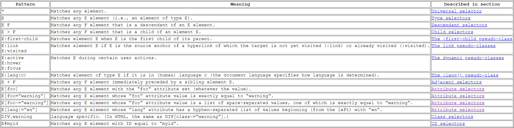
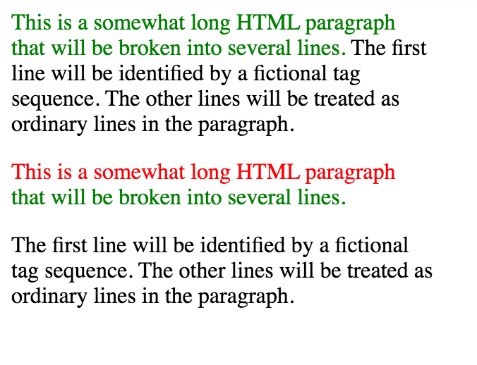
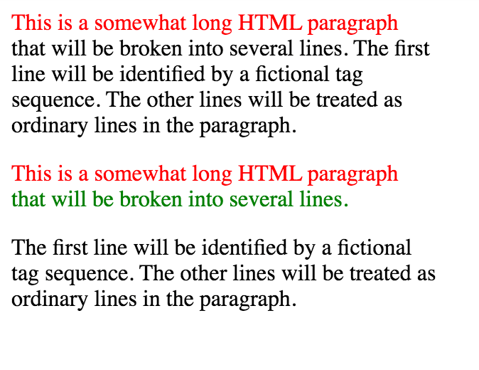
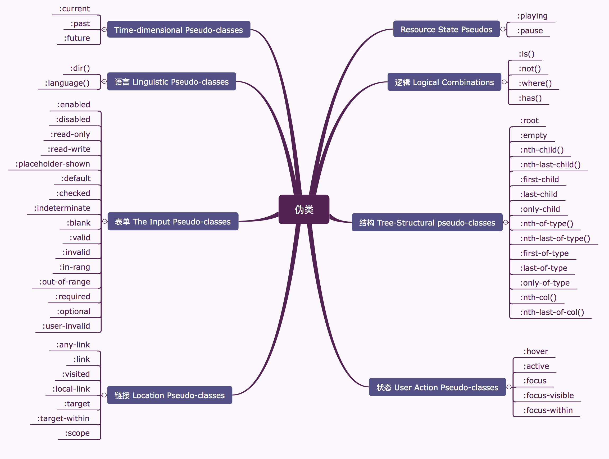

\[toc\]

## 前言

去年曾经仔细地学习了一下[css2.2的规范](https://www.w3.org/TR/CSS22/selector.html)。其中，选择器，属性的赋值、层叠和继承，盒模型，**_视觉格式化模型_** 几章是最重要的，其实去看这个规范的原因很简单，自己在使用 `css` 的过程中，经常出现让自己很迷惑的问题，比如 `inline-block` 布局为什么两个块之间出现空隙，`vertical-align` 怎么有时有用有时没用，行内元素的高度怎么计算的等等，以往遇到这些问题只能依靠搜索引擎，但是依然不得要领，后面就到 `w3c` 去找规范看了看，其实内容也不是非常多，但是要理解透彻还是要结合不断的实践，不然感觉看懂了，理解了，很快又会忘了。

## 什么是 CSS 选择器

CSS选择器是我们在前端写样式的时候每天都要用到的，刚接触 `CSS` 的时候就会用到 `类选择器`，`ID选择器`，`子选择器`，`后代选择器`等等，说白了选择器的目的就是准确地定位到我们想要赋予样式的元素，我们只要掌握 `CSS` 的语法和模式匹配的规则，那么我们在使用选择器的时候就能够得心应手了。

## 模式匹配 Pattern matching

模式匹配的规则看下图，不管你的选择器是简单的类型选择器，还是丰富的上下文选择器，如果模式中的所有条件对于某个元素都为真，那么选择器就会匹配该元素。这里面有我们熟悉的类型选择器（标签），后代选择器，子选择器，兄弟选择器，属性选择器，伪类选择器。其实我们平时用的最多的类选择器和ID选择器，在 `HTML` 里面也属于属性选择器的范畴，比如途中的E#myid写成E\[id="myid"\]也是可以匹配的。 [](https://img.clloz.com/blog/cs/css-selector1.png "CSS选择器模式匹配规则")

## 选择器语法

在我刚开始写 `CSS` 的时候，类型和属性，属性和属性之间，是否有空格，逗号，把我搞得很迷糊，踩了不少坑，晚上文章虽多却很少有写的透彻的。其实这也就是选择器语法的问题。复杂的选择器也是由简单选择器通过连接符来构成的，简单选择器包括：类型选择器（标签选择器），属性选择器（包括类选择器和ID选择器），伪类，伪元素，通配符选择器。而连接符一般就是空白符，`>` 和 `+` ，不过要注意的是我们一般使用 `>` 和`+` 也会在它们和选择器之间留空白符比如 `.a > .b` 而不会写成 `.a>.b`，主要是为了可读性。除了上面说到的三个连接符，还有一个逗号需要提一下，在规范中被称之为分组（ `grouping` ），就是当几组选择器具有相同的声明的时候我们可以把他们当作一个分组来处理，比如：

```css
h1 { font-family: sans-serif }

h2 { font-family: sans-serif }

h3 { font-family: sans-serif }

h1, h2, h3 { font-family: sans-serif }
```

他们是等价的。

> 所有 `CSS` 关键字都是 `ASCII case-insensitive` 的。

## 选择器类型

1. 简单选择器 `simple selector`：单个元素的单个条件。包括 `type selector, universal selector, attribute selector, class selector, ID selector, pseudo-class`。
2. 复合选择器 `compound selector`：一组没有被关系符分隔的简单选择器，表示单个元素的多个同时发生的条件。`type selector` 和 `universal selector` 必须放在最前面，并且只能允许有一个 `universal selector` 或 `type selector`。一个元素要匹配复合选择器就要匹配其中的所有简单选择器。
3. 关系符 `combinator`：关系符是处于两个复合选择器之间的一个表示关系的条件。有后代关系符 `descendant combinator` （用空格表示），子代关系符 `child combinator`（用 `>` 表示），相邻兄弟关系符 `next-sibling combinator` （用 `+` 表示）和 兄弟关系符 `subsequent-sibling combinator`（用 `~` 表示）。
4. 复杂选择器 `complex selector`：即一个或多个复合选择器和关系符组成的选择器。

关于相邻兄弟选择器和兄弟选择器这里说明一下区别：

```html
<!-- 对于math + p这样的相邻兄弟选择器，只有当p紧跟在math后面的时候才会匹配 -->
<div>
    <math></math>
    <p> </p>
</div>

<!-- 对于h1 ~ pre这样的兄弟选择器，pre不需要紧跟在h1后面，只要共享父元素即可匹配 -->
<h1>Definition of the function a</h1>
<p>Function a(x) has to be applied to all figures in the table.</p>
<pre>function a(x) = 12x/13.5</pre>
```

## 通配符选择器，类型选择器

通配符选择器就是选择所有元素，一般是不建议使用的。类型选择器就是我们理解的标签选择器，他可以匹配文档树中所有该类型元素。

## 后代选择器

当我们想要选择某个元素的后代元素，比如匹配所有 `h1` 元素包裹的 `em` 元素，我们就会用 `h1 em { color: red;}` 这种表达方式，后代元素可以有多层，一个后代选择器由两个或者多个选择器由用空白符隔开的选择器组成，注意，此处的多个选择器不一定非要是简单选择器，比如我们可以这样 `p .a.b.c { color: blue;}`来选择被p包裹的同时具有 `a`，`b`，`c` 三个类的元素。还有一个场景就是当我们想选择某个元素的所有非子元素的后代的时候我们可以这样写 `div * p {display: inline-block;}`，需要注意，这里的 `*` 不是连接符，而是通配符选择器。

## 子选择器

子选择器匹配某个元素的子集元素，子选择器可以和后代选择器类比，子选择器是后代选择器的子集，因为它只检索一层，而后代选择器则要检索对应元素的全部子元素。子选择器用连接符 `>` 连接两个或多个选择器，同样这里的选择器不一定是简单选择器。不同类型的选择器是可以一起使用的，比如 `div ul > li p {font-size: 1.2em}` 匹配了作为 `div` 后代的无序列表 `ul` 的子级`li` 的后代 `p` 元素。

## 一般兄弟选择器

`~` 组合器选择兄弟元素，也就是说，后一个节点在前一个节点后面的任意位置，并且共享同一个父节点。语法：`A ~ B`，例子：`p ~ span` 匹配同一父元素下，`<p>` 元素后的所有 `<span>` 元素。注意 `B` 必须是在 `A` 后面。

## 紧邻兄弟选择器

`+` 组合器选择相邻元素，即后一个元素紧跟在前一个之后，并且共享同一个父节点。语法：`A + B`，例子：`h2 + p` 会匹配所有紧邻在 `<h2>` 元素后的 `<p>` 元素。注意先后顺序， `B` 必须在 `A` 后面。

## 属性选择器

属性选择器有几种表达方式 1. `[attr]` : 匹配拥有属性 `attr` 的元素，无论属性值是多少； 2. `[attr=val]`: 匹配拥有属性 `attr` 且属性值为 `val` 的元素； 3. `[attr~=val]` : 匹配拥有属性 `attr` 且 `attr` 属性值中包含 `val` 的元素（ `DOM` 元素的属性可以包含多个属性值，每一个属性值对应一个属性节点，我们常用的 `class` 属性就可以有多个值，用逗号分隔开，该条规则同样适用于 `attr` 属性值只有一项的元素）。 4. `[attr|=val]` :匹配一个有 `attr` 属性且值 以 `val` 开头后面紧跟着 `-` ( `U+002D` )的元素。`*[lang|="en"] {color: red;}` 就会匹配下面代码的前三行。

```html
<p lang="en">Hello!</p>
<p lang="en-us">Greetings!</p>
<p lang="en-au">G'day!</p>
<p lang="fr">Bonjour!</p>
<p lang="cy-en">Jrooana!</p>
```

5. `[attr^="val"]` : 匹配拥有属性 `attr` 且属性值是以 `val` 开头的元素。
6. `[attr$="val"]` : 匹配拥有属性 `attr` 且属性值是以 `val` 结尾的元素。
7. `[attr*="val"]`: 匹配拥有 `attr` 属性，且属性值包含 `val` 的元素。（只要 `attr` 属性中的任意一项包含val字符串就匹配该模式）

> `5`，`6`，`7` 三项都是在 `CSS2.1` 规范之后发布的。

##### 类选择器

类选择器其实也是属性选择器的一种，我们平时使用的 `.` 其实和刚刚属性选择器中的第三个表达方式 `[attr~=val]` 是同样的作用。当我们需要同时匹配多个属性的时候，我们可以将多个属性写到一起，不适用空白符 `p.marine.pastoral { color: green }`。

##### ID 选择器

注意，一个元素只能拥有一个 `id`，并且文档树中的元素不可以具有相同的 `ID`，如果同一个元素两次设置 `ID`，那么只有前面一个生效；如果两个元素设置了相同的 `ID`，他们的样式都会生效，但是如果你用 `js` 获取 `ID` 对应的元素只有第一个会被返回。

## 伪元素和伪类

伪元素和伪类在`CSS2.2` 中的第五章 `Selector` 中进行了介绍。但也有一个独立的[Selectors Level 3](https://drafts.csswg.org/selectors-3/#context "Selectors Level 3")标准，现在 `CSS` 很多模块都是单独的标准。

`CSS 2.2` 中，样式通常是根据元素在文档树中的位置添加的。这种简单模型在大多数情况下足够了，但在有些常见的排版场景下可能无法根据文档树的结构来添加样式。例如，`HTML 4` 中，没有元素对应的是一个段落的第一行。

为了允许根据文档树之外的信息来格式化，`CSS` 引入了伪元素和伪类的概念。伪元素建立了对超出文档语言指定的文档树的抽象。例如，文档语言不提供访问元素内容的第一个字母或者第一行的机制。CSS伪元素允许样式表设计者引用这个通过其它方式无法访问的信息。伪元素也给样式表设计者提供了一种给源文档中不存在的内容赋予样式的方法（例如，`::before` 和 `::after` 伪元素提供了访问生成的内容的方法）

伪类根据元素的特征分类，而不是名字，属性或者内容。原则上，这些特征无法从文档树推断得出。伪类可以是动态的，用户与文档交互时，一个元素可能获得或者失去一个伪类。`:first-child` 是个特例，可以根据文档树推断出来，而且 `:lang()`在某些情况下也能根据文档树推断出来。伪元素和伪类都不会出现在源文档或者文档树中，伪类允许出现在选择器的任何位置，而一个伪元素只能跟在选择器的最后一个简单选择器后面。

有些伪类是互斥的，而其它的可以同时用在一个元素上。在规则冲突的情况下，常规层叠顺序决定结果。需要注意的是伪类和伪元素同样参与优先级的计算，伪类和普通类相同，伪元素和普通元素相同。

## 伪元素

伪元素有单独的标准：[CSS Pseudo-Elements Module Level 4](https://www.w3.org/TR/css-pseudo-4/#first-letter-pseudo "CSS Pseudo-Elements Module Level 4")。目前兼容性达到可用的伪元素一共有四个 `::first-letter`，`::first-line`，`::before`，`::after`。

`::first-line`表示的是 `contents of the first formatted line of its originating element.`。必须作用于包含块 `block container` 才能生效。一个元素的 `first formatted line` 一定是在它的流内块级后代内（这里的块级不是元素，而是块盒即可）。比如 `display` 为 `table-cell` 或者 `inline-block` 的后代流内元素的第一行就不会匹配到 `::first-line`。

```html
<!-- div::first-line{color: red;} 生效的是 etcetera -->
<div><p style="display: inline-block">hello<br>goodbye</p> etcetera</div>
```

上面的代码如果我们给 `div` 设置了一个宽度，让 `etcetera` 不在第一行出现，那么这个元素就没有能够匹配 `::first-line` 的部分了。

还有一点需要注意的是，直接出现在块级元素中的文本按视觉格式化模型来说应该是生成的 `anonymous inline box`，内部也应该是行内格式上下文，不过依然能够匹配 `::first-line` 的样式，这里是和标准有些出入的。

```html
<!-- div::first-line{color: red;} 会对div内的文本生效 -->
<div>this is a test this is another test</div>
```

再来看下面两个例子的比较

```html
<style>
    div {
      width: 300px;
    }

    div::first-line {
      color: red;
    }
    div span {
      color: green;
    }

    div p {
      color: green;
    }
</style>
<div><span>This is a somewhat long HTML
paragraph that will be broken into several
lines.</span> The first line will be identified
by a fictional tag sequence. The other lines
will be treated as ordinary lines in the
paragraph.</div>

<div><p>This is a somewhat long HTML
paragraph that will be broken into several
lines.</p> The first line will be identified
by a fictional tag sequence. The other lines
will be treated as ordinary lines in the
paragraph.</div>
```html

最后的效果如下图：



如果我们将第一个 `div span` 的 `color: green` 注释掉，得到的结果如下图：



如果我们在第二个 `div` 的 `p` 元素之前插入一个空的 `div` ，则 `div::first-line` 失效。

综合以上的例子，我自己对 `first-line` 做一个总结：`first-line` 只对 `block container` 生效，生效位置就是 `the first formatted line of its originating element`。`first formatted line` 的规则：

1. 如果内部是行内格式上下文，则表示渲染后的第一行，若第一行文本有行内级元素额外设置了样式，则会覆盖 `::first-line`。
2. 如果内部是块级格式上下文，则表示渲染后的第一行中非 `tabel-cell` 和 `inline-block` 的部分。
3. 注意所谓的渲染后的第一行内可能没有文本，比如一个空的 `span` 或者 `p` 元素甚至就元素内部开头的 `br` ，但它们对应的就是 `first formatted line`。如 `<p><br>First...`，这里的第一行对应的就是 `p` 和 `br` 之间的内容，后面的 `First` 并不能匹配 `::first-line`。
4. 如果第一行存在元素嵌套则递归调用者几条规则。

* * *

讲清楚了 `::first-line` 以后 `::first-letter` 就简单了，`first-letter` 就是 `the first formatted line of originating element` 的第一个字母。但是需要注意的是，有些 `::first-line` 生效的情况 `::first-letter` 也不存在。比如 `<div><p style="display: inline-block">hello<br>goodbye</p> etcetera</div>` 就没有 `::first-letter`。类似 `<div><br> this is a test</div>` 同样也没有 `::first-letter`。

* * *

`::before` 和 `::after` ：只要他们的 `content` 不为 `none`，他们的表现就像 `originating element` 的紧邻的子元素一样。他们也可以像普通的文档元素一样设置样式，虽然他们并不在文档树中。

需要特别注意的是 `::before` 和 `::after` 一样会参与 `::first-line` 和 `::first-letter` 的计算。比如下面的例子中的第一个 `N` 就会设为红色。

```html
<style>
    p.note::before { content: "Note: " }
    p::first-letter{color: red}
</style>
<p class="note">test</p>
```

## 伪类 Pseudo-classes

伪类是简单选择器，它允许基于文档树之外的信息进行选择，或者使用其他简单的选择器可能难以表达或无法表达这些信息。它们也可以是动态的，即在用户与文档交互时元素可以获取或丢失伪类的意义上，而无需更改文档本身。伪类不会出现在文档源或文档树中，也不会对其进行修改。

伪类的语法为一个 `:`，后跟伪类的名称作为 `CSS` 标识符，如果是函数型伪类，则包含一对括号，其中包含它的参数（比如 `:lang()` 就是一个 `functional pseudo-class`，而 `:valid` 就是一个 `regular pseudo-class`）。我将目前标准中的所有伪类都整理出来，见下图。



注意伪类和伪元素不一样，他不是依附于某个文档元素的。伪元素的 `::` 前必须由一个文档元素，但是不是所有伪类伪类不是这样。比如 `:root`，`div :first-child` 都是合法的伪类使用方法，前者表示根元素，后者表示 `div` 的第一个子元素。而当使用 `div p:first-child` 则表示 `div` 的第一个子元素要同时是一个 `p` 元素才能匹配，即`p:first-child` 组成了一个复合选择器，这里要把`:first-child` 当做一个普通的**类**。

不过直接使用伪类而不使用其他简单选择器复合的话（比如 `div :first-child` 等），在嵌套情况比较复杂的时候是比较难分析的，比如下面的例子。

```html
<style>
    ul :last-child {
      color: red;
      font-weight: bold;
    }
    ul :nth-last-child(1) {
      color: blue;
    }
</style>
<ul>
  <li>Item 1
    <ul>
      <li>Item 3.1</li>
      <li>Item 3.2</li>
      <li>Item 3.3</li>
    </ul>
  </li>
  <li>Item 2
    <ul>
      <li>Item 3.1</li>
      <li>Item 3.2</li>
      <li>Item 3.3</li>
    </ul>
  </li>
  <li>Item 3</li>
</ul>
```

最外层的 `ul` 选择了 `item3` 没有问题，内层嵌套的 `ul` 内部所有子元素全部都被选中。原因就是内部的 `ul` 都是 `li` 的 `last-child`，所以样式就应用到了整个 `ul` 上。如果我们把选择器改成 `ul > *:last-child` 就没有问题。

所以还是建议大家使用伪类的时候用 `p:first-child` 这样的复合选择器，如果确实有找不同类型的子元素需求，则可以像上面的例子中一样用后代关系符和通配符选择器 `ul > *:last-child`。

##### 结构伪类

1. `:root`：匹配文档的根元素。一般的 html 文件的根元素是 html 元素，而 SVG 或 XML 文件的根元素则可能是其他元素。
2. `:empty`：匹配除空格外没有孩子（包括元素，`HTML entity`，文本节点） 的元素。
3. `:nth-child(an + b)`: 根据位置匹配兄弟元素，`n` 为自然数，`a` 和 `b` 都必须为整数，并且元素的第一个子元素的下标为 `1`。标准中还有一种 `of` 语法，不过目前只有 `safari` 支持。一般使用都会添加父元素，否则会在全部文档生效。比如 `div p:nth-child(2n + 1)`，匹配 `div` 内处于奇数位的 `p` 元素，注意的是要同时满足奇数和 `p` 才能匹配。注意这里的计算都是以元素为单位，`<br>` 也是元素。`2n` 与 `even` 等价，`2n+1` 与 `odd` 等价。下面举了一个简单的例子，更多示例请查看[:nth-child() - MDN](https://developer.mozilla.org/zh-CN/docs/Web/CSS/:nth-child ":nth-child() - MDN")
    
    ```html
    <!-- 1, 5, 7 生效 -->
    <style>
        div p:nth-child(2n+1) {color: red}
        div::before{content: 'test'}
    </style>
    <div>
      <p>1</p>
      <span>2</span>
      <span>3</span>
      <p>4</p>
      <p>5</p>
      <p>6</p>
      <p>7</p>
    </div>
    ```
    
4. `:nth-last-child()`: 和 `:nth-child()` 类似，不同的是从末尾开始计数。
    
5. `:first-child`: 匹配一组兄弟元素中的第一个，比如 `div > p:first-child` 表示匹配 `div` 的 `p` 子元素中的第一个，要同时满足 `p` 和第一个。需要注意的是 `div > p:first-child` ， `div p:first-child` 和 `div :first-child`（有空格）的不同。
    
    ```html
    <!-- 1 和 2 都生效 -->
    <style>
        div :first-child {
          color: red;
        }
    </style>
    
    <div>
      <div>1</div>
      <div>
        <div>2</div>
      </div>
    </div>
    ```
    
6. `:last-child`: 匹配一组兄弟元素中的最后一个。
    
7. `:only-child`: 匹配一个没有兄弟元素的元素。比如 `div > p:only-child` 表示当 `div` 中只有一个 `p` 元素时匹配。和 `:first-child:last-child` 或 `:nth-child(1):nth-last-child(1)` 效果相同，不过前者的优先级更低。
8. `:nth-of-type()`：语法和 `:nth-child()` 类似，但是它的选择范围不再是所有兄弟元素，而是根据给定的类型筛选出相同类型的标签作为范围。比如 `img:nth-of-type(2n + 1)` 就表示匹配所有奇数位置的 `img` 兄弟元素。
9. `:nth-last-of-type()`: 和 `:nth-of-type()` 类型，不过是从末尾开始计数。比如 `body > h2:nth-of-type(n+2):nth-last-of-type(n+2)` 选中 `body` 中除了第一个和最后一个的 `h2` 元素，等价于 `body > h2:not(:first-of-type):not(:last-of-type)`。
10. `:first-of-type`: 等价于 `:nth-of-type(1)`。
11. `:last-of-type`: 等价于 `:nth-last-of-type(1)`。
12. `:only-of type`: 等价于 `:first-of-type:last-of-type`

##### 逻辑伪类

1. `:is()`: 原来的名字是 `:match()`，一些旧的浏览器上用的是 `:any()`。该伪类函数将选择器列表作为参数，并选择该列表中任意一个选择器可以选择的元素。这对于以更紧凑的形式编写大型选择器非常有用。
2. `:not()`: 该伪类函数用来匹配不符合一组选择器的元素。由于它的作用是防止特定的元素被选中，它也被称为反选伪类（`negation pseudo-class`）。需要注意的是，内部参数不能有伪元素，也不能有 `:not()` 本身。
3. `:where()`: 该伪类和 `:is()` 的语法和功能完全按相同，不同的是 `:is()` 的优先级是由参数列表中优先级最高的选择器决定的，而 `:where()` 的优先级总是 `0`。目前只有 `firefox` 实现了这个伪类。
4. `:has()`: 对某个元素，参数对应的选择器至少匹配个子元素。比如 `a:has(> img)` 匹配含有子元素 `img` 的 `a` 元素。目前没有浏览器实现。

##### 状态伪类

1. `:hover`: 适用于用户使用指示设备虚指一个元素（鼠标指针虚指在某个元素但没有激活）的情况。这个样式会被任何与链接相关的伪类重写，像 `:link`, `:visited`, 和 `:active` 等。为了确保生效，`:hover`规则需要放在 `:link` 和 `:visited` 规则之后，但是在 `:active` 规则之前，按照 `LVHA` 的循顺序声明 `:link－:visited－:hover－:active`。
2. `:active`: 匹配被用户激活的元素。它让页面能在浏览器监测到激活时给出反馈。当用鼠标交互时，它代表的是用户按下按键和松开按键之间的时间。一般被用在 `<a>` 和 `<button>` 元素中. 这个伪类的一些其他适用对象包括包含激活元素的元素，以及可以通过他们关联的 `<label>` 标签被激活的表格元素。
3. `:focus`: 示获得焦点的元素（如表单输入）。当用户点击或触摸元素或通过键盘的 `tab` 键选择它时会被触发。
4. `:focus-within`: 表示一个元素获得焦点，或，该元素的后代元素获得焦点。换句话说，元素自身或者它的某个后代匹配 `:focus` 伪类。该选择器非常实用。举个通俗的例子：表单中的某个 `<input>` 字段获得焦点时，整个表单的 `<form>` 元素都可被高亮。
5. `:focus-visible`: 实验功能，当元素匹配 `:focus` 伪类并且客户端( `UA` )的启发式引擎决定焦点应当可见(在这种情况下很多浏览器默认显示“焦点框”。)时，`:focus-visible` 伪类将生效。这个选择器可以有效地根据用户的输入方式(鼠标或键盘)展示不同形式的焦点。

##### 链接伪类

1. `:link`: 选中元素当中的链接.
2. `:any-link`: 匹配一个有链接锚点的元素，而不管它是否被访问过，也就是说，它会匹配每一个有 `href` 属性的 `<a>`、`<area>` 或 `<link>` 元素。因此，它会匹配到所有的 `:link` 或 `:visited`。
3. `:visited`: 匹配用户已访问过的链接。出于隐私原因，可以使用此选择器修改的样式非常有限。
4. `:target`: 匹配一个唯一的页面元素(目标元素)，其 `id` 与当前 `URL` 片段匹配 。比如当前页面 `URL` 为 `http://www.example.com/index.html#section2`，则 `:target` 将会匹配一个 `id` 为 `section2` 的元素。
5. `:scope`: 表示作为选择器要匹配的参考点元素。当前，在样式表中使用时, `:scope` 等效于 `:root`，因为目前尚无一种方法来显式建立作用域元素。当从 `DOM API` 使用，如（`querySelector(), querySelectorAll(), matches(), 或 Element.closest()`）, `:scope` 匹配你调用 `API` 的元素。

##### 表单伪类

1. `:enabled`: 表示任何被启用的（`enabled`）元素。如果一个元素能够被激活（如选择、点击或接受文本输入），或者能够获取焦点，则该元素是启用的。元素也有一个禁用的状态（`disabled state`），在被禁用时，元素不能被激活或获取焦点。
2. `:disabled`: 表示任何被禁用的元素。如果一个元素不能被激活（如选择、点击或接受文本输入）或获取焦点，则该元素处于被禁用状态。元素还有一个启用状态（`enabled state`），在启用状态下，元素可以被激活或获取焦点。
3. `:read-only`: 表示元素不可被用户编辑的状态（如锁定的文本输入框）。
4. `:read-write`: 匹配可以被用户编辑的元素。
5. `:placeholder-shown`: 在 `<input>` 或 `<textarea>` 元素显示 `placeholder text` 时生效。
6. `:default`: 表示一组相关元素中的默认表单元素，可以理解为给默认选项一个特殊状态，告诉用户哪个选项是默认的。该选择器可以在 `<button>, <input type="checkbox">, <input type="radio">, 以及 <option>` 上使用。
7. `:checked`: 表示任何处于选中状态的`radio`, `checkbox` 或 `select` 元素中的`option HTML`元素。用户通过勾选/选中元素或取消勾选/取消选中，来改变该元素的 `:checked` 状态。
8. `:indeterminate`: 表示状态不确定的表单元素。`indeterminate` 属性可以用 `JavaScript` 进行设置，布尔型。这个属性可以影响的元素包括 `indeterminate` 属性为 `true` 的 `checkbox`；同 `name` 的所有 `radio` 都未被选中或没设置 `name` 的 `radio`；状态不确定的 `<progress>` 元素。
9. `:blank`: 匹配用户输入为空的输入框，如 `<input>` 和 `<textarea>`。目前尚未有浏览器支持。
10. `:valid`: 内容验证正确的 `<input>` 或其他 `<form>` 元素。这能简单地将校验字段展示为一种能让用户辨别出其输入数据的正确性的样式。
11. `:invalid`: 任意内容未通过验证的 `<input>` 或其他 `<form>` 元素。可以突出显示用户的错误输入。
12. `:in-range/:out-range`: 代表一个 `<input>` 元素，其当前值处于属性 `min` 和 `max` 限定的范围之内/之外。该伪类仅适用于那些拥有（或可以接受）取值范围设定的元素，包括 `type` 为 `date`，`time`，`week`，`month`，`datetime-local`，`number` 和 `range`。
13. `:required`: 任意设置了 `required` 属性的 `<input>` ，`<select>` , 或 `<textarea>` 元素。 这个伪类对于高亮显示在提交表单之前必须具有有效数据的字段非常有用。
14. `:optional`: 表示任意没有 `required` 属性的 `<input>`，`<select>` 或 `<textarea>` 元素使用它。该伪类可让表单展示可选字段并且渲染其外观。

##### 语言相关伪类

1. `:dir()`: 匹配特定文字书写方向的元素。试验性功能，只有 `firefox` 实现。
2. `:lang()`: 基于元素语言来匹配页面元素。可以用 `quotes` 属性来根据语言设置引号。

## 总结

`CSS` 的标准目前还是非常快的变化阶段，我们主要还是掌握一些核心用法，一些特别的用法可能会持续在标准中发生变化，如果

## 参考文章

1. [总结伪类与伪元素](http://www.alloyteam.com/2016/05/summary-of-pseudo-classes-and-pseudo-elements/#prettyPhoto "总结伪类与伪元素")
2. CSS 标准文档
3. [CSS 参考 - MDN](https://developer.mozilla.org/zh-CN/docs/Web/CSS/Reference "CSS 参考 - MDN")