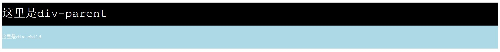

\[toc\]

## 前言

在使用css的时候单位是我们经常要处理的一个细节，`px，em，percentage，number，rem，vh，vw`等等，不同的单位可能渲染机制不同，如果对于单位的渲染机制理解不到位很可能会让我们在写样式的过程中遇到一些摸不着头脑的问题。

## 绝对长度单位

我没有使用过，只是在文档中看到，这些单位远在CSS出现之前就出现了，主要是在印刷排版上使用，包括`in，pt，pc，cm，mm`，他们之间的关系为`1in = 2.54cm = 25.4mm = 72pt = 6pc`，`in` 表示 `inch`，英寸，这些单位基本上只在打印上使用，对于我们现代的 `dpi` 屏幕，不是很方便。比如 `pt`（`point`）指的是`1/72`英寸，如果想转化成 `px` 怎么算呢，`1px` 为 `1` 像素，而计算机的 `dpi` 就是每英寸的像素数，他们之间的转化关系就是`px/dpi*72 = pt`。似乎在 `IOS` 开发上会遇到这个问题，不过在前端开发过程中很少用到这些绝对长度单位。

## px

上面也有说到，`px` 是相对长度单位，`px` 的具体宽度取决于屏幕的 `dpi`（`dots per inch`）：每英寸像素数。但是在我们写样式的过程中，`px` 也是一种绝对单位，因为只要我们设置了确定了的 `px` 大小，那么该元素在该设备上的大小就确定了，不会因为其他元素（比如父元素）的属性而改变。

## 相对长度单位

相对长度单位包括`em,ex,ch,rem，vw，vh`等其中 `em` 和 `rem` 我们使用比较多，`ch` 表示字符 `0` 的宽度，而 `ex` 表示字符 `x` 的高度，使用场景比较少。相对长度的单位的一个重要特点是子元素不会继承父元素的设定的该相对属性值，而是继承父元素的计算值。比如如下代码：

```html
<div style="font-size: 40px; line-height: 2em;background-color: black; color: white;">
    这里是div-parent
    <div style="font-size: 16px; background-color: lightblue;">
        这里是div-child
    </div>
</div>
```

我们可以看到两个div嵌套，第一个 `div` 的字体大小为`40px`，第二个为`16px`，我们设置了父元素的`line-height：2em`，相当于字体的 `200%`，`line-height` 属性是可以继承的，但是我们发现父元素和子元素的行高是一样的，都是`80px`，这跟我们的预想不一样，我们直觉觉得子元素继承了父元素的`line-height: 2em`，那么他的行高应该是`16*2=32px`，但是并不是这样，这就是上面说的相对长度单位其子元素只会继承出元素的计算值而不会继承相对值，或者你可以理解为子元素确实继承了父元素的`line-height：2em`的属性，但是，这个 `2em` 是根据父元素的字体大小来计算的。



## rem (root em)

`rem` 和 `em` 类似的，但是他的计算是根据 `HTML` 根元素的字体大小来计算值的。`em` 由于其工作方式可能在多个元素中表现不同，但是 `rem` 在整个文档中的表现都是一致的，很多场景下非常有用。

## vh，vw，vmax，vmin

这几个属性和 `rem` 一样都是 `2013` 年提出的新单位，目前已经得到广泛的支持和运用，他们都是相对于视窗的宽度和高度进行计算的，比如 `1vh` 就是视窗高度的 `1%`，而 `1vw` 就是视窗宽度的 `1%`，`vmax` 是 `vh` 和 `vw` 中较大的那一个，`vmin` 是 `vh` 和 `vw` 中较小的那一个。这几个单位在做响应式的页面的时候尤其有用。

## 无单位数值

在上面的 `line-height` 问题中我们除了使用绝对长度单位和 `rem` 单位以外，还可以使用无单位数值，比如 `2em` 转化为 `2`，一样可以解决继承问题。无单位数值会被子元素继承，并且计算是根绝当前元素的字体大小来计算的，效果如下。

