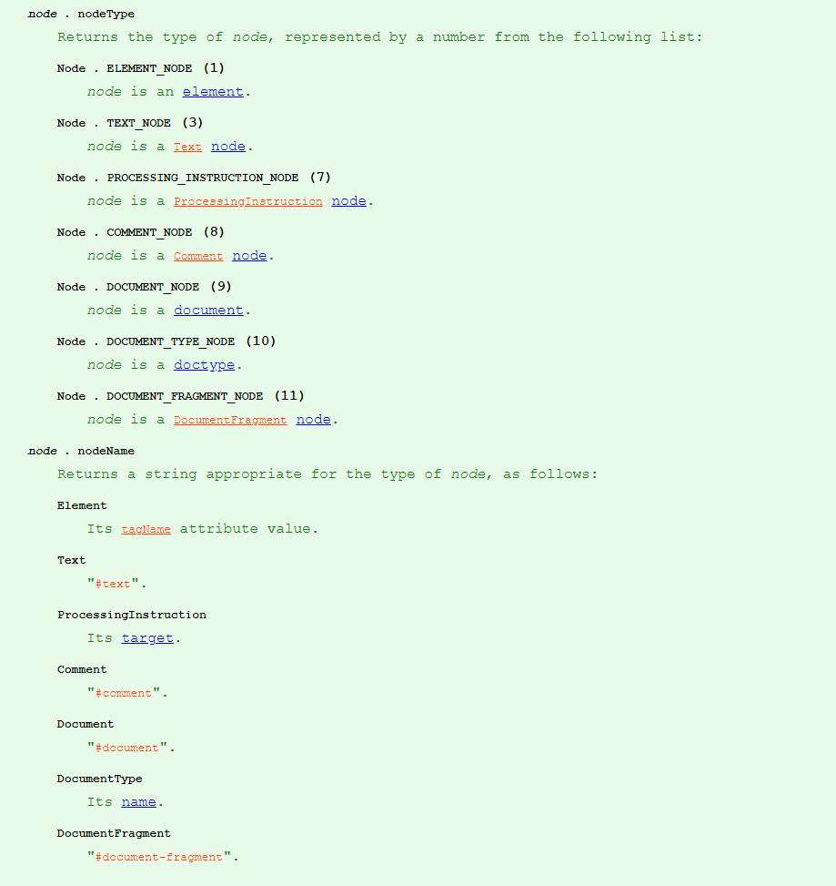

## 前言

`Javascript DOM编程艺术` 一直被认为是入门 `JS`，了解基本概念以及 `DOM` 的一本不错的书，不过这本书已经很老了，它的第一版是 `2006` 年出版，第二版是 `2012` 年出版，前端技术和浏览器在这些年已经发生了翻天覆地的变化，书中一些内容对于初学者我觉得已经非常不必要了，而且读起来让人感觉很不流畅，比如作者不遗余力的强调你的代码要能够平稳退化（就是在浏览器不支持 `JS`，或者浏览器版本不一的情况下你的页面都能够正常地展示），作者是按照当时的市场情况以及浏览器厂商之间的差异来写的，希望程序员养成良好的习惯，写出比较健壮的代码。但是现在看来就有点像是在看当年微软和网景的浏览器大战一样，已经是历史了，如今的浏览器厂商都在积极向标准和统一靠拢，现在的前端已经不会在需要检测时候谁的浏览器或者哪家浏览器厂商是否支持`document.getElementsByTagName`。诚然作者这种对待代码的态度是非常好的，我们在现在依然要关注不同浏览器之间的差异，以及对自己的代码保持精益求精的态度，但是如果现在的前端小白看这本书大可不必要把很多精力放到那些平稳退化的代码上去，更多的关注 `JS` 的基础知识和实现才是最重要的。而且书中还出现了几处我认为有错误的地方。

## 本书的要点

本书一直强调的两点是渐进增强（ `progressive enhancement` ）和平稳退化，虽然我开头说了书中说的平稳退化对于今天的浏览器已经不重要，大家大可不必花过多精力来学习书中这部分内容，但是作者在书中强调的这两点思想还是非常有用的，不论是对于我们写代码还是学习知识都是非常有用的思想。就像现在大家都去学习 `MVVM` 的框架了，`jQuery` 已经渐渐离我们远去，但是去了解一下 `jQuery` 的实现以及当中包含的思想我觉得还是有意义的，这样你能了解它为什么被淘汰了，而 `MVVM` 的框架又是解决了什么需求才流行起来的。同样 `JS` 的基础也是，任何高级的框架都是建立在这些基础之上的，学习 `JS`，学习 `DOM`，学习 `BOM` 和浏览器渲染机制，学习计算机网络，才是真正最核心的，因为任何框架都会有被淘汰的一天，但是这些内容确是短期内不会发生巨变的，很多前端只是抓着框架做需求，不关注真正核心的内容，所以前端一直处在鄙视链的底层是不无道理的，人太多，水平太低。

前两章讲了 `Javascript` 的历史和基础语法，老样子了，几乎每一本JS的书都要讲一讲 `JS` 以及浏览器的那些历史。这本书对于基础语法讲的内容很少，也就是数据类型，语句和很少的对象以及函数的内容，旨在让你能够跟着书本完成后面的一些小任务。

第三章的 `DOM` 就是主要讲解了三种节点类型，获取 `DOM` 元素的几种方法以及获取和设置属性的方法，这里需要提的是书中写的`nodeType`为 `2` 的属性节点在 `DOM4` 的 `SPEC` 中已经被取消了，也就是属性现在已经属于节点了。即使在 `DOM4` 之前，`ChildNodes` 也是不能获取属性节点的，大家还是使用`setAttribute`和`getAttribute`来操作属性，只不过在新的标准中直接移除了属性节点。

第四章到第七章是一个页面的渐进增强的实现，每一章向前推进一点，让你一步一步实现一个更完善的网页，运用之前学到的一些 `DOM` 操作方法实现一个点击链接展示对应图片的网页，这一部分我认为还是不错的，不过大可不必以书中的代码为标准，了解它的思想即可，书中的代码太多的大段验证浏览器兼容性的代码，看上去长篇大论，其实实现功能的很简单，看着只觉得啰嗦。自己实现一遍，在看一看书中大概的思路看看自己有什么没想到的再修改修改即可，条条大路通罗马，不必生搬硬套，能实现完善功能即可。第四章实现点击更换图片属性，更换文本节点内容，主要知识点为 `DOM` 的获取，属性的获取与设置，获取子节点的方法，节点类型以及更换文本节点内容，同时还有`Javascript` 如何通过事件和 `DOM` 进行交互。第五章引出结构，样式，操作分离的思想，`CSS` 负责样式，`HTML` 负责结构，`JS` 则负责操作，把内嵌的样式和`onclick`都分离出来形成独立的文件，大家各司其职，增强代码的可读性和可维护性，这一章提到的减少 `DOM` 查询是很重要的，因为搜索 `DOM` 树是很耗费性能的，我们应该尽量较少 `DOM` 查询。第七章主要是讲了创建元素或者文本节点已经把创建的内容插入到 `DOM` 树中去，顺带提到了两个现在不怎么使用的方法`document.write`和`innerHTML`，需要注意的是`document.write`如果在文档渲染完成后在调用或`document.open`，会将当前文档的内容全部抹去，而`innerHTML`方法很容易抹去元素内部的元素节点，可能造成DOM操作的报错。

第八章依然是运用之前任务中的一些方法来实现一些小功能，大同小异。第九章介绍了如何运用 `JS` 操作样式，需要注意的是`style`属性只能操作内嵌在 `HTML` 内的行内样式，对于外联的样式以及写在`head`中的`<style>`标签中的样式是无法检索到的，对于这些属性我们需要使用`window.getCurrentStyle()`方法来获取元素的属性，`jQuery`的 `$.css()` 方法也是用原生的该方法来实现的。第十章讲了动画，主要是用`setTimeout`方法来实现，这一张我认为讲的还是不错的，对于动画的解释和说明还是挺深入浅出的，包括刚接触`setTimeout`容易犯的忘记`clearTimeout`错误也给出了象印的解答，让初学者能够知道什么样的动画才是合格的。第 `11` 张稍微说了一下 `HTML5`，蜻蜓点水，真的要了解 `HTML5` 这点内容太少了。最后一章是一个网站的制作，综合了前面的绝大多数知识点，实现这个网站说明本书讲的基本知识点你已经能够运用了。

## 几点问题

本书年代久远，还是存在几个问题的 1. `window.onload`的问题，书中说写在`</body>`之前的 `JS` 一样可能在 `DOM` 没有构建完成前执行，按现在的浏览器渲染策略，应该已经不用担心这个问题，浏览器自上而下解析 `HTML`，`CSS` 和 `JS` 都能够阻塞渲染，但是如果把 `JS` 写在文档树最后应当是不会阻塞渲染的。 2. 属性节点从标准中取消，如今元素的属性在 `DOM4` 中已经不作为一种节点了，上文已经提到。 3. 第八章有个一个 `lastChild` 的实现错误。

## 总结

这本书首先是已经过时了，已经不适合当前版本，而且最重要的一点我认为作为一本引导初学者入门的书籍，它显得太小心翼翼了，如果一个初学者看这本书总觉得战战兢兢，实现一个功能这么多前置条件。我认为一本入门书籍不应该是星际争霸这样的处处抠细节的类型，而应该是真三国无双这种大刀阔斧类型的，教给新人使用工具，至于他具体用的怎么样，怎么用好，还是得靠自己的经验和总结，教给他们过多细节，一是吸收不了，二是没有太多意义，只有在自己的工作中遇到了问题，才会明白“原来这里应该这么处理”。我刚开始学吉他的时候 `G` 和弦怎么也按不好，我去网上搜教程，看指头怎么放，看了教程给我的感觉就是，我的手好像跟别人长得不一样~，我只能强行用右手把左手扳到对应的弦上，可是这样很痛苦，后来我慢慢爬爬格子，练了一段时间，自然就会按了，按的很轻松，自从有了这个经验之后我学习就不像以前那么钻牛角尖了，有些内容不是靠别人教的，而是自己在不断的练习中自然而然的掌握的，强行去教这些内容只能说是本末倒置了，遇到一些难以理解的内容可能是你的前置技能点还没学呢，等你把前置的内容学扎实了，自然水到渠成了。我的建议是不建议用这本书入门，如果你已经有了一定的经验，在来略读这本书，看看里面有没有什么值得自己借鉴的地方。