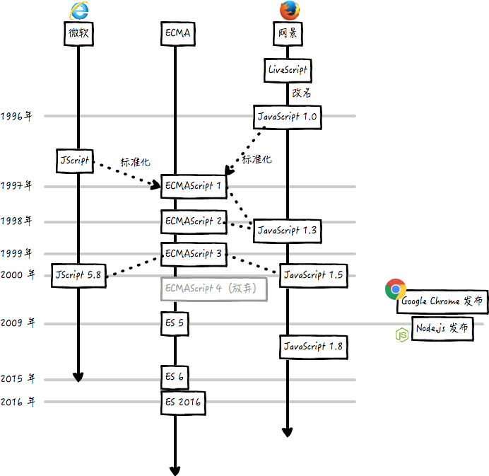

\[toc\]

## 前言

`ECMAScript`，简称 `ES`，是由 `ecma-international`（前身为欧洲计算机制造商协会,英文名称是 `European Computer Manufacturers Association`）按照 `ECMA-262` 和 `ISO/IEC 16262` 标准制定的一种脚本语言规范。本文讲一讲 `ES` 标准的发展历史以及几个重要版本的特性。

> `ES` 是语言的标准 `Standard`，浏览器厂商根据标准的实现 `Implementation` 有多种，比如网景的`JavaScript` 和 微软的 `JScript`，后来随着浏览器和标准的发展以及浏览器厂商之间的妥协，逐渐合并为现在的 `JavaScript`，但实际上 `JavaScript` 是 `ECMA-262` 标准的实现和扩展。

## 历史和发展

上图直观的展示了 `JavaScript` 标准和实现的发展时间轴。

事实上 `JavaScript` 的发展历程是比较奇葩的，`1995` 年浏览器厂商网景出于需求要开发一种能在浏览器使用的脚本语言，于是招募了布兰登·艾克，其在该年五月花了十天时间设计出了 `JavaScript` 的原型，这门语言最初是叫 `Mocha`，然后在同年发布的 `Netscape Navigator 2.0` 中被改名为 `LiveScript`，又随着 `12月` 发布的 `Netscape Navigator 2.0 Beta 3` 被改名为 `JavaScript`，一直沿用至今。使用这个名字的原因也只是当时网景和 `Sun` 结为开发联盟，为了搭上 `Java` 这个热词，导致了很多人对这个名字产生误解，其实 `JavaScript` 和 `Java` 没什么关系。

`JavaScript` 在浏览器上取得了成功，微软也马上跟进，在自己的 `Internet Explorer 3` 上推出了自己的 `JScript`。接着就是二者各行其是，很长一段时间，各大浏览器厂商的实现都不尽相同，对于语言标准化的推进造成非常大的阻力，也成为开发者的灾难，要让自己的网页兼容不同的浏览器需要耗费非常大的精力。

`1996` 年 `11` 月，网景正式向 `ECMA`（欧洲计算机制造商协会）提交语言标准。`1997` 年 `6` 月，`ECMA` 以 `JavaScript` 语言为基础制定了 `ECMAScript` 标准规范 `ECMA-262`。`JavaScript` 成为了 `ECMAScript` 最著名的实现之一。

## ES 版本

| 版本 | 发表日期 | 与前版本的差异 |
| --- | --- | --- |
| 1 | 1997年6月 | 首版 |
| 2 | 1998年6月 | 格式修正，以使得其形式与ISO/IEC16262国际标准一致 |
| 3 | 1999年12月 | 强大的正则表达式，更好的词法作用域链处理，新的控制指令，异常处理，错误定义更加明确，数据输出的格式化及其它改变 |
| 4 | 放弃 | 由于关于语言的复杂性出现分歧，第4版本被放弃，其中的部分成为了第5版本及Harmony的基础 |
| 5 | 2009年12月 | 新增“严格模式（strict mode）”，一个子集用作提供更彻底的错误检查,以避免结构出错。澄清了许多第3版本的模糊规范，并适应了与规范不一致的真实世界实现的行为。增加了部分新功能，如getters及setters，支持JSON以及在对象属性上更完整的反射 |
| 5.1 | 2011年6月 | ECMAScript标5.1版形式上完全一致于国际标准ISO/IEC 16262:2011。 |
| 6 | 2015年6月 | ECMAScript 2015（ES2015），第 6 版，最早被称作是 ECMAScript 6（ES6），添加了类和模块的语法，其他特性包括迭代器，Python风格的生成器和生成器表达式，箭头函数，二进制数据，静态类型数组，集合（maps，sets 和 weak maps），promise，reflection 和 proxies。作为最早的 ECMAScript Harmony 版本，也被叫做ES6 Harmony。 |
| 7 | 2016年6月 | ECMAScript 2016（ES2016），第 7 版，多个新的概念和语言特性 |
| 8 | 2017年6月 | ECMAScript 2017（ES2017），第 8 版，多个新的概念和语言特性 |
| 9 | 2018年6月 | ECMAScript 2018 （ES2018），第 9 版，包含了异步循环，生成器，新的正则表达式特性和 rest/spread 语法。 |
| 10 | 2019年6月 | ECMAScript 2019 （ES2019），第 10 版 |
| 11 | 2020年6月 | ECMAScript 2020 （ES2020），第 11 版 |

其中比较重要的几个版本分别是 `ES3`， `ES5`，`ES6`，现在的标准制定委员会[TC39](https://github.com/tc39 "TC39")希望是每年提供一些新的特性，而不是进行非常巨大的改动，这样标准和实现更加能够协同。

从 `ES3` 到 `ES5` 经过了十年，各大厂商对于标准的跟进也是兴趣缺缺。我个人认为还是需求导致的，说白了就是目前有的就够用了，整个 `10` 年，除了 `05` 年的 `Ajax` 并没有什么太多的新技术和新需求出现。但是从 `10` 年开始，随着智能手机，平板电脑的出现，以及个人电脑性能的不断提升，我们在各种设备商能做的事情越来越多，而且前端作为直接与用户交互的一个重要部分，也随着这股浪潮出现了爆炸式的增长，需求的增加自然推动了新的技术的产生和标准化的需求，后面标准的更新就越来越频繁了。

想要查看各个版本的标准的新特性以及浏览器的支持情况可以查看 [compat-table](https://kangax.github.io/compat-table/es6/ "compat-table")

## TC39 和 ECMAScript

标准的制定是一个比较长的过程，可以参考 [关于查看W3C文档](https://mp.weixin.qq.com/s/BJNb3vlvdOP1pLgGq46-nw "关于查看W3C文档")。

`ECMAScript` 的标准制定主要是由 `TC39` 这个组织进行的，该组织主要由各个主流浏览器厂商的代表构成。一个标准的落地基本都是从 `stage0` 到 `stage4`。分别对应 `strawman`，`proposal`，`draft` ，`candidate` 和 `finished`，可以参考 [精读 TC39 与 ECMAScript 提案](https://zhuanlan.zhihu.com/p/27762556 "精读 TC39 与 ECMAScript 提案")。

一般来说最新的标准我们可以到 [TC39 - lastest ecma262](https://tc39.es/ecma262/ "TC39 - lastest ecma262")， `stage3` 的一些特性我们可以到 [proposals - tc39](https://github.com/tc39/proposals "proposals - tc39") 查看。

## 参考文章

1. [闲谈一下，ES3、ES4、ES5、ES6 分别是什么](https://www.cnblogs.com/xiaomowang/p/12312655.html "闲谈一下，ES3、ES4、ES5、ES6 分别是什么")
2. [ECMAScript-wiki](https://zh.wikipedia.org/wiki/ECMAScript "ECMAScript-wiki")
3. [谈谈JavaScript版本演进史及ES3、ES5区别和特性](https://blog.csdn.net/chuangxin/article/details/85088485 "谈谈JavaScript版本演进史及ES3、ES5区别和特性")