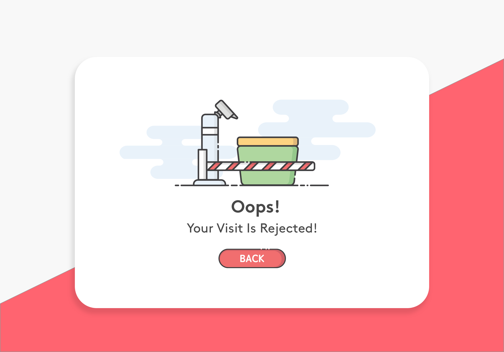
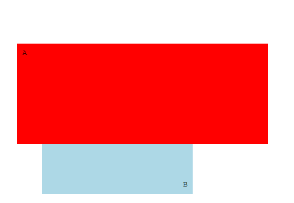

\[toc\]

## 前言

用户访问我们的网站，如果访问了禁止访问的目录，或者输入了错误的链接，那么我们的网站会返回错误代码，如 `403`，`404`，`Wrodpress` 默认是提供了 `404` 的模板的，但是我觉得不是很好看，`apache` 的配置未见也可以通过 `errorDocument` 来配置错误代码对应的页面，所以我决定自定义 `403`，`404` 的错误页面。由于设计能力有限，在网上找了一下 `Error Pages` 的设计，在站酷上找到了一款比较符合我审美的设计，设计来源于站酷用户[珈蓝十四夜](https://www.zcool.com.cn/u/1700883 "珈蓝十四夜")的投稿作品[Error Pages](https://www.zcool.com.cn/work/ZMjA5NTk2OTI=.html "Error Pages")，作品很简洁，风格也很可爱,作者同时提供了 `pc` 版和手机版。准备就用这个设计来制作页面。

## 页面结构

我的大概想法是分成三块，背景用 `css` 实现，中间部分的白框内容直接把图抠下来，用作中间一块的 `background-image` ，最后把 `back` 按钮扣下来作为跳转到首页的按钮，中间部分用绝对定位居中就可以了，最后用媒体查询区分一下手机版和 `pc` 版就可以了。

## 背景的实现

这个背景被斜线分成两块，上半部分是白色，下半部分是红色，首先想到的是定义一个背景白色的 `div`，然后用 `CSS3` 的 `transform` 属性，让该 `div` 绕着左下角的点旋转,大概效果如下图(用 `tansfrom` 和 `transition` 实现)

不过这样做要注意的两点是，元素 `A` 的宽度和高度要足够大，并且要保证在旋转过程中，任何一个角都不能进入元素 `B` 内，特别是左下角的角，要计算好元素 `A` 的旋转所需的长度，设置一个负的 `margin-left`，同理高度和 `margin-top` 也要计算。因为实际实现过程中，元素 `B` 就是我们的 `body`，我们要考虑不同的显示器，元素 `A` 的长度要足够长，不然在分辨率非常大的显示器上，元素 `A` 的右下角会进入 `body`。最后，要给 `body` 加上属性`overflow: hidden;`，不然会出现横向的滚动条。

旋转实例点击[rotate页面](https://www.clloz.com/study/transform.html)

## PC 和手机端的自适应

中间部分我用了绝对定位居中，阴影用 `box-shadow` 来实现，背景图的样式设置为`background-color: white;background-image: url('403.png');background-size: contain;background-repeat: no-repeat;`，然后用媒体查询改变一下图片的 `url` 就可以了。

`403` 页面的实例可以点击 [403页面](https://www.clloz.com/study/403.html)

## 总结

由于水平有限，只想到这些方法，如果你觉得代码有什么问题或者有更好的解决方法，欢迎指点:kissing\_heart: