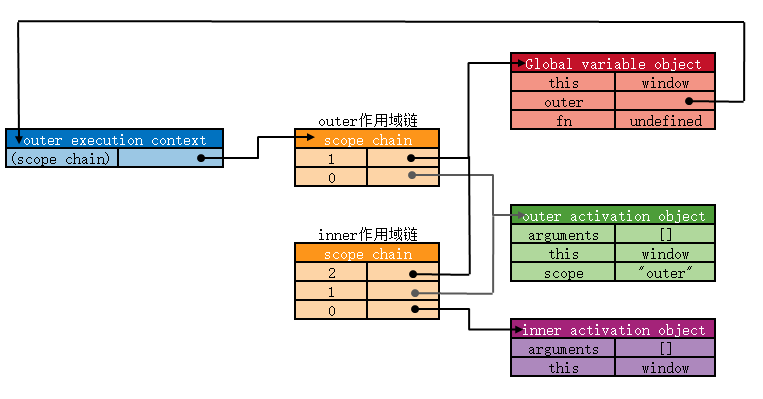
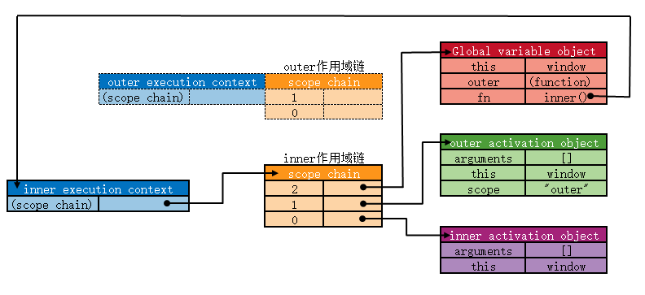

\[toc\]

## 前言

`JS` 中的执行环境和作用域链是非常重要的概念，它们是 `JS` 引擎在处理 `JS` 代码的时候对变量和函数的处理方式，这两个概念的正确理解能够帮助我们更好地理解和预测代码的行为。

## 执行环境

执行环境定义了变量或者函数有权访问的数据集合，每一个执行环境都有一个与之关联的变量对象，该执行环境中定义的所有变量和函数都保存在这个对象中。我们无法直接访问这个对象，这个对象只是在解析器处理数据的时候使用。

我们平时说的全局变量就是在最外围的一个执行环境中定义的变量，全局执行环境根据 `ECMAScript` 的不同实现而有不同的表示，在 `Web` 浏览器中，全局执行环境就是 `window` 对象，所有的全局变量和函数就是作为 `window` 对象的属性和方法创建的。在 `nodejs` 的实现中，全局执行环境就是`global` 对象。 除了全局执行环境，每个函数都有自己的执行环境，当执行流进入一个函数时，函数的环境就会被推入一个环境栈中，而函数执行之后，栈将其环境弹出，把控制权返回给之前的执行环境。也就是说某个执行环境中的代码全部执行完毕之后，该环境就被销毁，保存在其中的所有变量和函数定义也随之销毁，全局执行环境直到应用程序额推出——例如网页或浏览器被关闭时才被销毁。

## 作用域链

前面说到每个执行环境都有一个变量对象来保存环境中定义的变量和函数，环境是层层嵌套的，所以当代码进入到一个新的环境开始执行时，会创建变量对象的一个作用域链，把嵌套的执行环境之间的变量对象做一个有序的联系。作用域链最主要的作用是确保当前执行环境有权访问的变量和函数，并且有序地查找。在作用域链的最前端始终是当前正在执行的代码所处的执行环境的变量对象，如果这个环境是一个函数，就把函数的活动对象作为其变量对象，在函数中没有定义新的变量时，这个活动独享就是函数的 `arguments` 对象。作用域链的下一个变量都西昂来自于当前执行环境的包含环境，依次类推，逐层嵌套，知道全局执行环境；全局执行环境的变量对象始终都是作用域链中的最后一个都对象。

当我们的代码在执行的时候，遇到的每一个标识符解析都会沿着作用域链一级一级地进行搜索，从作用域链的前端（当前执行环境的变量对象）逐级向后回溯，知道找到标识符为止，如果在作用域链上没有找到这个标识符，通常会导致错误。我们经常遇到的 `Uncaught ReferenceError: x is not defined` 就是这个错误在浏览器中的表现。

JS解释器在执行时会将变量和函数进行声明提前，在声明函数的时候，会给函数一个 `[[scope]]` 属性，这个属性中包含了当前函数所有包含环境的变量对象，也就是我们的函数在声明提前的时候就已经生成了他的包含环境的作用域链了，然后当函数执行的时候会把自己的 `arguments` 和内部定义的函数和变量打包成一个变量对象加到 `scope chain` 的最后。

> 函数参数也被当做变量来对待，因此起访问规则与执行环境中的其他变量相同。

作用域链的这种特性理解起来其实也是比较直观的，但是在实际的代码中由于情况非常多，有时候有些行为还是比较反直觉或者说容易产生误解的。比如下面的情况：

1. 作用域链看的是函数定义的位置而不是执行的位置

```javascript
var x = 10
bar()
function foo() {
  console.log(x)
}
function bar(){
  var x = 30
  foo()
}
```

在这个例子里面，可能会有人误以为 `bar()` 会输出 `30`，我们只要理解函数其实是保存在堆中，我们给函数命名只是一个指向函数堆中地址的一个引用，当我们执行函数的时候根据这个引用去堆中找对应的函数执行。所以无论我们在哪里执行函数，函数的位置都是不变的，我们看作用域链也是，我们确定作用域链不是看函数是在哪里执行，而是要看函数是在哪里定义，作用域链可以认为是函数声明时就已经生成了。

> 个人认为 `ECMAScript` 这样处理作用域链是为了作用域链能够保持不变而不用一直维护，并且根据环境的嵌套保持一致性。

## 闭包

除了全局执行环境的变量对象是始终存在的，其他局部函数的变量对象都只在函数的执行过程中存在，一般来讲，函数执行完毕之后，局部活动对象就被销毁了，内存中仅仅保存全局执行环境的变量对象，但是闭包的情况是不同的。

闭包指的是有权访问另一个函数作用域中的变量的函数，比如下面这样：

```javascript
 function outer(){
     var scope = "outer";
     return function (){
        return scope;
     }
  }
var fn = outer();
fn();
```

在一个函数内部定义的函数会将包含函数（即外部函数）的活动对象添加到他的作用域链中，因此在 `outer` 函数内部定义的匿名函数（我们下面把这个匿名函数称为 `inner` 函数）的作用域链中，实际上会包含外部函数 `outer()` 的活动对象，下图可以看书当代码执行时，`outer` 和 `inner` 函数的作用域链。

[](https://img.clloz.com/blog/writing/scope-chain1.png "scope-chain1")

当匿名函数从 `outer()` 中被返回后，`inner()` 函数仍然可以访问在 `outer()` 中定义的所有变量，也就是说，当 `outer()` 函数执行完毕后，其活动对象也不会被销毁，因为匿名函数的作用域链依然在引用这个活动对象。换句话说，当 `outer()` 函数执行完毕返回后，其执行环境和作用域链都被销毁，但它的活动对象依然保存在内存中，如果匿名函数不销毁，则这个活动对象会一直存在于内存中。

js中的对象都是保存在堆中，我们在代码中写的都是对对象的引用，作用域链中也是，所以上面说的 `outer()` 函数执行完毕后作用域链被销毁但是对象还存在，其实销毁的只是引用， `js` 中的垃圾处理机制的一种策略是引用计数，当某个变量或对象的引用次数为 `0` 的时候内存会被收回。`outer` 函数的变量对象的引用有两个一个是 `outer` 的作用域链和匿名函数的作用域链，所以只要匿名函数不被销毁，这个引用就一直存在，`outer()` 的活动对象也会一直存在。

轮子哥在知乎给过一个比较容易理解的说法：“闭”的意思不是封闭内部状态，而是封闭外部状态，一个函数如何能够封闭外部状态呢，当外部状态的 `scope` 失效的时候，它自己还保留了一份。

[](https://img.clloz.com/blog/writing/scope-chain2.png "scope-chain2")

> 由于闭包会携带包含它的函数的作用域，因此回避其他函数占用更多的内存。过度使用闭包可能会导致内存占用过多，只在必要的时候使用闭包。

## ES3 执行上下文

对于 ES3 中的执行上下文，我们可以用下面这个列表来概括程序执行的整个过程：

1. 函数被调用
2. 在执行具体的函数代码之前，创建了执行上下文
3. 进入执行上下文的创建阶段：
    
    1. 初始化作用域链
    2. 创建 arguments object 检查上下文中的参数，初始化名称和值并创建引用副本
    3. 扫描上下文找到所有函数声明：
        
        1. 对于每个找到的函数，用它们的原生函数名，在变量对象中创建一个属性，该属性里存放的是一个指向实际内存地址的指针
        2. 如果函数名称已经存在了，属性的引用指针将会被覆盖
    4. 扫描上下文找到所有 var 的变量声明：
        
        1. 对于每个找到的变量声明，用它们的原生变量名，在变量对象中创建一个属性，并且使用 undefined 来初始化
        2. 如果变量名作为属性在变量对象中已存在，则不做任何处理并接着扫描
    5. 确定 this 值
4. 进入执行上下文的执行阶段：
    
    1. 在上下文中运行/解释函数代码，并在代码逐行执行时分配变量值。

## ES5 执行上下文

`ES6` 将变量对象（活动对象）拆分成了两个概念：词法环境组件（ `LexicalEnvironment component`） 和 变量环境组件（ `VariableEnvironment component`）。简单来说 词法环境是一种持有 **标识符—变量映射** 的结构。这里的 标识符指的是变量/函数的名字，而变量是对实际对象（包含函数类型对象）或原始数据的引用。变量环境也是一个词法环境 ，所以它有着词法环境的所有特性。之所以在 `ES5` 的规范力要单独分出一个变量环境的概念是为 `ES6` 服务的： 在 `ES6` 中，词法环境组件和变量环境的一个不同就是前者被用来存储函数声明和变量（`let` 和 `const`）绑定，而后者只用来存储 `var` 变量绑定。

> 在上下文创建阶段，引擎检查代码找出变量和函数声明，变量最初会设置为 `undefined`（`var` 情况下），或者未初始化（`let` 和 `const` 情况下）。这就是为什么你可以在声明之前访问 `var` 定义的变量（虽然是 `undefined`），但是在声明之前访问 let 和 const 的变量会得到一个引用错误。

对于 ES5 中的执行上下文，我们可以用下面这个列表来概括程序执行的整个过程：

1. 程序启动，全局上下文被创建
    
    1. 创建全局上下文的 词法环境
        
        1. 创建 对象环境记录器 ，它用来定义出现在 全局上下文 中的变量和函数的关系（负责处理 let 和 const 定义的变量）
        2. 创建 外部环境引用，值为 null
    2. 创建全局上下文的 变量环境
        
        1. 创建 对象环境记录器，它持有 变量声明语句 在执行上下文中创建的绑定关系（负责处理 var 定义的变量，初始值为 undefined 造成声明提升）
        2. 创建 外部环境引用，值为 null
    3. 确定 this 值为全局对象（以浏览器为例，就是 window ）
2. 函数被调用，函数上下文被创建
    
    1. 创建函数上下文的 词法环境
        
        1. 创建 声明式环境记录器 ，存储变量、函数和参数，它包含了一个传递给函数的 arguments 对象（此对象存储索引和参数的映射）和传递给函数的参数的 length。（负责处理 let 和 const 定义的变量）
        2. 创建 外部环境引用，值为全局对象，或者为父级词法环境（作用域）
    2. 创建函数上下文的 变量环境
        
        1. 创建 声明式环境记录器 ，存储变量、函数和参数，它包含了一个传递给函数的 arguments 对象（此对象存储索引和参数的映射）和传递给函数的参数的 length。（负责处理 var 定义的变量，初始值为 undefined 造成声明提升）
        2. 创建 外部环境引用，值为全局对象，或者为父级词法环境（作用域）
    3. 确定 this 值
3. 进入函数执行上下文的执行阶段：
    
    1. 在上下文中运行/解释函数代码，并在代码逐行执行时分配变量值。

> **关于执行上下文的标准一直在变化，目前 `EcmaScript 2021`** 标准中又移除了关于词法环境和变量环境的概念，一切以标准为主，我个人建议还是按照 `ES3` 的概念理解，然后 `let` 和 `const` 使用单独的规则。

## 总结

任何一种编程语言都有作用域的概念，我们的程序是围绕着变量操作的，那么在设计语言的时候，变量如何储存，储存到哪里，我们的程序如何找到对应的变量就是一个首先要解决的问题。而作用域就是语言设计者针对这个问题编写的一套设计良好的规则来存储并搜索对象，这就是作用域的概念。而 `JS` 中的这个规则就是作用域链，我们在编写程序的时候也需要知道我们的变量（以及函数）是如何储存，以及 `JS` 引擎在遇到标识符解析的时候是按照什么规则来搜索变量或者函数的，只有这样我们才能写出更可靠的代码。

## 参考文章

1. [执行上下文](https://juejin.im/post/6844904158957404167#heading-16 "执行上下文")