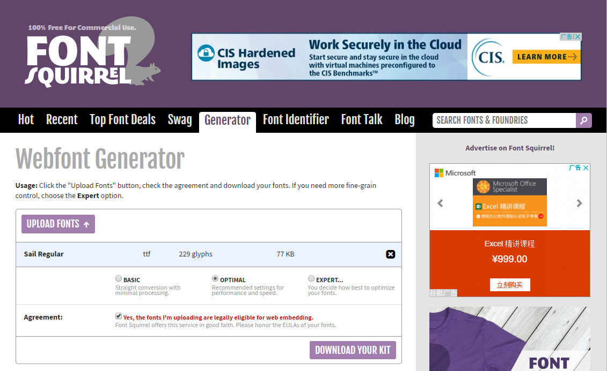
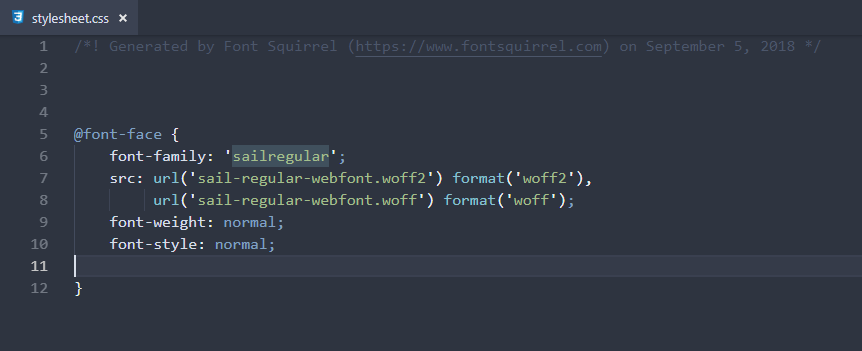

\[toc\]

## 前言

今天在看别人的博客的时候，看到了一款很有趣的字体，[Sail](https://www.fontsquirrel.com/fonts/list/find_fonts?q%5Bterm%5D=sail&q%5Bsearch_check%5D=Y "Sail")（点击查看），字体的样子大概就是文章标题这样，我觉得还蛮有趣的，就去 `google` 上搜索了一下，不仅找到了这款字体，还找到了一个有用的网站[FontSquirrel](https://www.fontsquirrel.com/ "FontSquirrel")，这个网站上都是免费字体，我看了一下，很多字体都很棒，同时能进行字体的格式转换，这篇文章就跟大家分享一下。

> 网站的字体都是英文字体，不支持中文，所以如果你的网站英文比较多，可以去找一款自己喜欢的字体。

## 转换字体格式

在网站的导航栏选择 `Generator`，点击 `Upload` 上传自己的字体文件，比如我下载 `sail` 字体就是只有一个 `otf` 文件，上传完成之后可以点击`download your kit`来下载网站生成的字体包，这个字体包中不仅包含了字体文件，而且有 `html` 和 `css` 文件可以让你预览字体

打开下载的文件夹中的 `Html` 可以看到你所要使用的字体的预览，如果你要在 `css` 中使用字体，只要将字体复制到对应的位置，将 `stylesheet.css` 中的`@font-face`复制到对应的 `css` 文件，记得修改字体文件的路径，我是将字体文件放在阿里云上了。

现在你已经可以在自己的网站上使用自己喜欢的字体了。