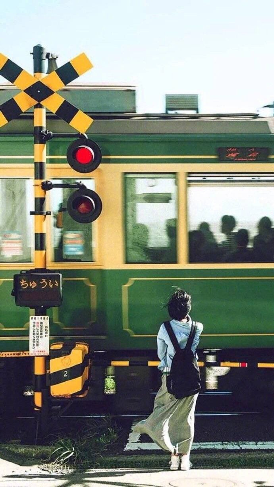

**一切都在变，不变只有时间的流逝。** **时间，让深的东西越深，浅的东西越浅。**

—— 「比海更深」

## 一些感受

过完这个春节，按我们这边虚岁的说法，我已经28岁了，人生已经走过1/3了。父母也都越过了50的年纪，我妈很讨厌白发，现在也是要定期去染一下头发，我爸的脸倒是不显老，只是头上也是零星的白发。古人说50知天命，父母却似乎什么变化也没有，日复一日地重复着他们没有波澜的生活。但即使是我这么亲近的人，我也发现，父母老了。

去年一整年都在家，我也偶尔跟母亲交谈，似乎时不时听到她提到谁谁谁去世了，母亲不免感叹一波世事无常，故人就这样离去了。我的家族不大，家里除了前些年去世的老外婆（外婆的妈妈），其他人都身体健康，或奋斗人生，或安享晚年，我的人生还没经历过亲近的人离开人世，对人的离开没有实感。虽然母亲说的人我大多不熟悉，大部分是母亲的同学或者故乡的乡亲，但是这变化还是让我实在地感觉到，母亲已经年过半百，她的圈子中已经有人慢慢离开了，母亲在我的不知不觉中也走过自己的壮年，时间就是这么不近人情。

之前看看小池彻平的访谈，他从自己的家乡来到东京做艺人，一次听到自己上京的弟弟对自己说，妈妈一个人在家感叹，他一年回一次家，算起来到自己去世大概也只能看儿子十几次了。我想任何在外的小孩听到这段话都想要落泪吧。我把这段话说给母亲听，母亲也是一样，有些帐不算还好，仔细想想又令人意外。树欲静而风不止，子欲养而亲不待从来也不是危言耸听，只是父母始终牵挂着自己而自己偶尔才能想起父母而已。

在我的感觉里，父母和我高中的时候没有太多的变化，我也开玩笑说爸妈的脸都不是很显老，只是他们头上的白发，脸上的点点皱纹，和体力的退化都在告诉我他们变老了。父母老了，人却越来越温柔了，他们已经无法来带我走我的人生了，他们已经尽了全力。但一如比海更深中的树木希林，他们依然在做自己所能做的想给自己的孩子一点帮助，跟他们比起来，我的人生目前只是一个大大的不及格。父亲依然起早贪黑，母亲也还在上着班，一切也只是因为自己的儿子成家立业的两个任务一个都还没完成。

我出生在这样的家庭真的非常幸运，父母从农村出来，虽然自己没什么文化，但母亲无比重视教育，将自己的所有精力和经济都投资到了我的身上，我才有机会上好的高中和大学，我考上大学的时候我想是父母这一生最幸福的时刻，此后一直走着下坡路。前几天还和母亲提起，上初中的时候我住校，每两周回来一次，每次都免不了和母亲吵架，我现在都记不起是因为什么事情了，只记得有次和母亲吵架最后从去学校的班车上被拽下来了，母亲却记得这事。我们这个小县城，车站经常有许多出租车司机来拉客，生意不好做，我以前特别不待见这些拉客的司机，以为他们总是不分青红皂白拉着你问你去哪，即使你明确告诉他们你不需要，他们还是不遗余力的问你，我那时候看到他们总是摆一副臭脸。那天也是在车站有出租车来拉客，我那天可能心情也不是很好，对出租车司机的态度非常差，我那时候年纪也还小，不懂得生活的艰辛，出来谋生的司机也很不容易，对那个司机出言不逊。母亲非常生气，大意跟我说：“你如果这样的话，学也不用上了，送你去上学你就学成这样吗，别人出来讨生活不容易，你要是觉得好做，我去买十分报纸在大街上，你把这十份报纸卖了，你看看容不容易。”我那个年纪还其实还不太理解生活的真面目，但是父母是白手起家带着几百块到城市里生活，生活的狰狞面目他们是有切身体会的。我虽然不理解，但当时应该也知道母亲是对的，最后坐了下一班车去了学校。这件事以及母亲说的话我都已经忘记了，母亲总是在我的思想出现偏差的时候严厉地纠正我。正如这件往事一样，我最感谢的不仅是母亲为了让我接受最好的教育而作出的牺牲和努力，还有她教我如何做人，虽然母亲只有初中文化，但是她对世事和人生都有自己的理解，也把她的这些理解传递给了我。我今天的思想也正是脱胎于母亲的这些教诲。她不是一个完美的人，她也有许多缺点，但我想她已经作出了最大的努力，我真的非常感激她对我的教诲。她用自己一生的努力让我看到了她不曾看到的世界，我却还什么都没回馈给她，她依然每天为我操心着。

我总是跟妈妈说希望她和爸爸60岁的时候能够过上无忧无虑的晚年生活，不用再为任何事操心，过上为自己考虑的生活。我希望那一天早一点，毕竟外婆也已经76岁，外公82岁，我也要多给母亲一些尽孝道的时间。

新的一年加油把！为自己的人生涂上新的一抹亮色，早日画上那道彩虹！ :sparkling\_heart:

