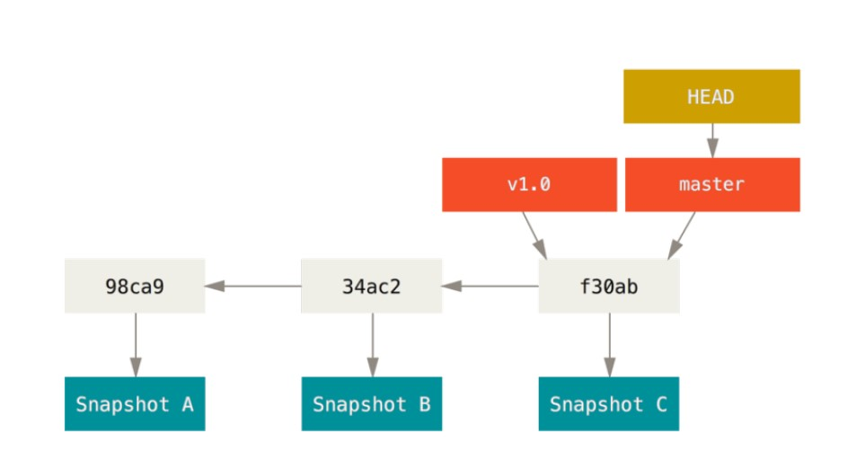
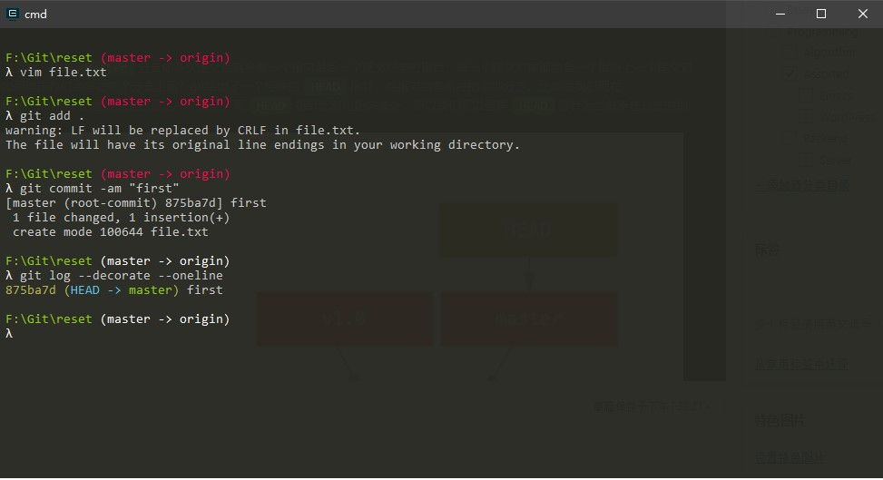
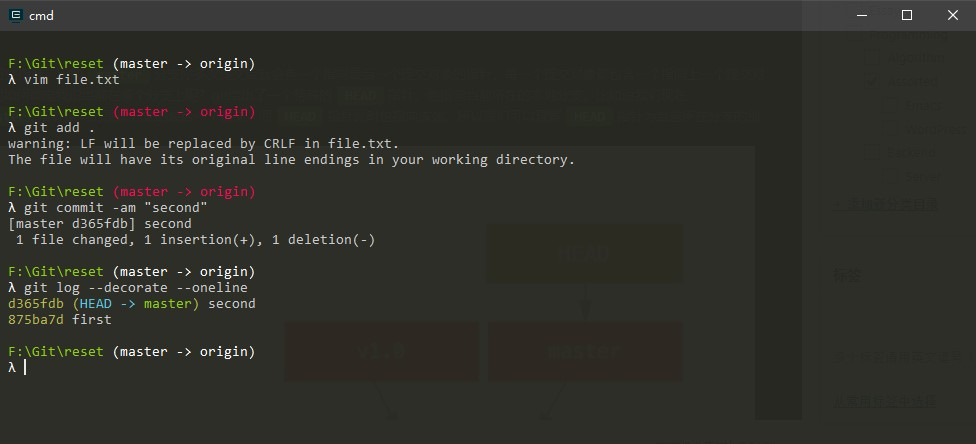
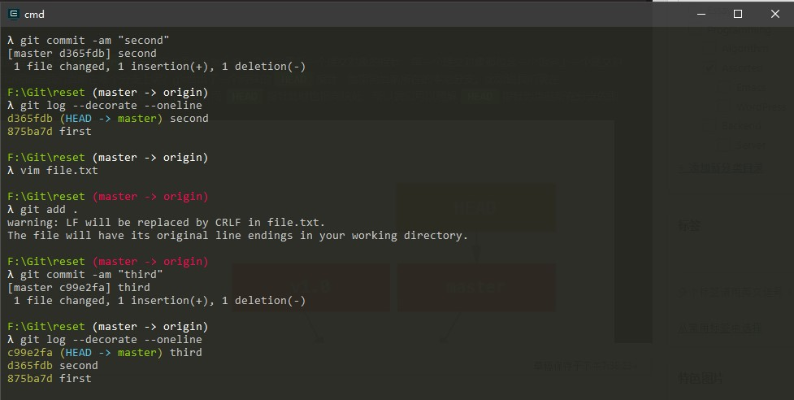
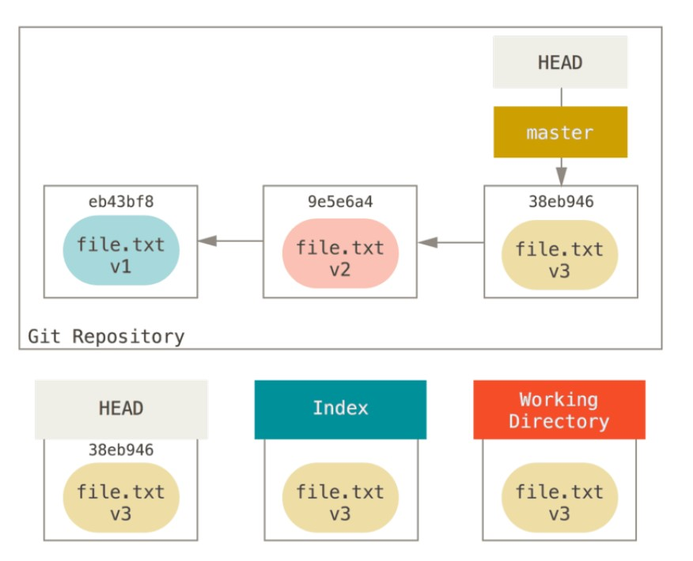
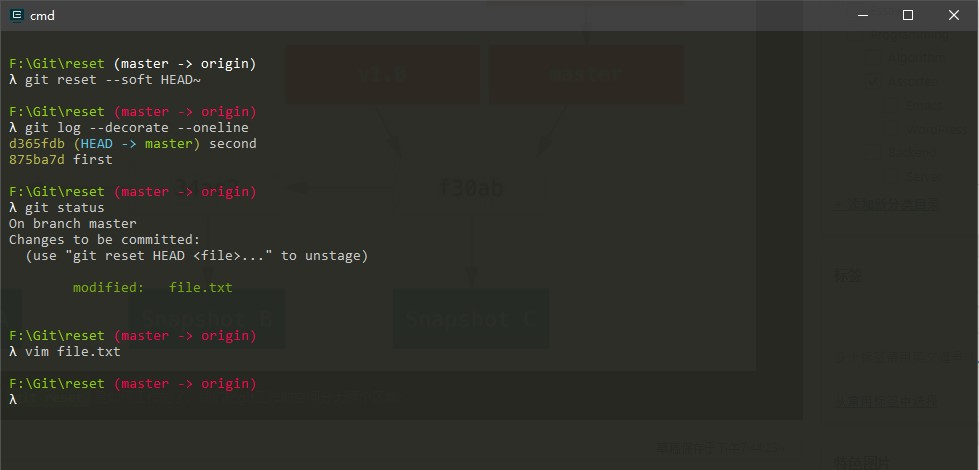
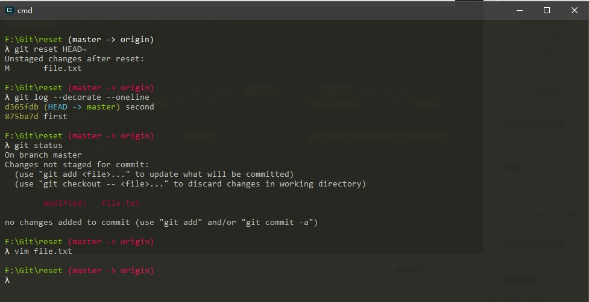

\[toc\]

## 前言

`git` 中的撤销操作是我们经常要用到的操作，比如说当我们 `add` 某个文件到暂存区后可能想要撤回，或者是我们已经 `commit` 了但是 `push` 的时候想取消这次 `commit`，这是主要是用`git reset`，`git checkout`和`git revert`三个命令。

## git reset

`Git` 的分支本质上是指向提交对象的可变指针，比如`master`分支你多次提交后就会有一个指向最后一个提交对象的指针，每一个提交对象都包含一个指向上一个提交对象的指针，这就是 `git` 分支的本质。而如何确定我们当前在哪个分支上呢？`git` 给出了一个特殊的`HEAD`指针，他指向当前所在的本地分支。比如说我们现在在`master`分支，我们知道`master`指针指向的是该分支的最后一个提交，而`HEAD`指针此时也指向该处，所以我们可以理解`HEAD`指针为当前所在分支的别名。如下图： 

理解了这些内容，我们就可以来理解`git reset`是如何工作的了。我们把git工作的空间分为两个区域： 1. 已经 `commit` 的文件和修改后未 `add` 的文件，这一类文件都在工作目录（`Working Dictionary`） 2. 已经 `add` 还未 `commit` 的文件在暂存区（`Index`）

还有一个 `Head` 指针指向当前所在分支的最后一次提交对象。比如上图中的 `HEAD` 和 `master` 指针本来是指向`34ac2`对象，此时`f30ab`对象正在暂存区，当`f30ab`提交完成以后， `HEAD` 和 `master` 的指针就指向了新的提交，而`34ac2`则成为了最新提交的父节点。而我们的`git reset`指令就是操作`HEAD`指针，移动它的位置来实现撤销。下面我们用一个具体的例子来说明。

我们在一个空的 `git` 仓库中新建一个文件：`file.txt`。用 `vim` 编辑当前文件在当中输入字符串`first`，提交文件。此时我们用`git log --decorate --oneline`可以看到我们的 `master` 指针和 `HEAD` 指针都指向我们的第一次提交对象。 

然后我们再次修改文件，在文件中加入字符串`second`，再次提交文件，调用上面的指令，我们会发现此时 `HEAD` 和 `master` 指针都指向我们的第二次提交。 

再次重复上述操作，第三次修改提交。 

此时我们的整个git树应该是这样的： 

此时我们开始执行`reset`指令： 首先执行`git reset --soft HEAD~`： 我们发现HEAD和master指针指向了second，并且查看我们的`file.txt`文件，我们会发现文件中依然保持这第三次修改，只不过文件从已经commit的状态被重新拉到了缓存区，所以我们可以看出`--soft`下的指令只是向后倒退了一小步，把我们最后一个commit给取消了。 

然后我们重新提交文件，让git状态重新进入到三次提交的状态。然后执行`git reset HEAD~`指令（这条指令没有加参数，其实有一个默认参数 `--mixed`）：执行完指令后，我们发现 `HEAD` 和 `master` 指针又是指向了我们的第二次提交对象，而我们的 `file` 文件依然没有改变，但是这次它从没有 `commit` 的状态变成了没有 `add` 的状态，我们可以看出`--mixed` 比 `--soft` 又向后倒退了一小步，把 `git` 状态回复到了我们刚刚修改完文件还没有加入暂存区的状态。 

最后我们依然重新回到三次提交的状态然后执行`git reset --hard HEAD~`指令：我们发现这次 `HEAD` 和 `master` 指针依然是指向我们第二次的提交对象，我们检查`git status`发现没有任何状态，在查看`file.txt`，我们发现我们第三次的修改消失了，也就是说`--hard`指令把我们的状态直接从第三次提交完成回退到了第二次提交刚刚完成的状态，我们刚刚最后一次做的修改也消失了。

综合上面的测试，做一个总结：

- `--soft` – 缓存区和工作目录都不会被改变
- `--mixed` – 默认选项。缓存区和你指定的提交同步，但工作目录不受影响
- `--hard` – 缓存区和工作目录都同步到你指定的提交

## git revert

`git revert` 我们用相同的方法进行测试，我们可以发现`git revert`并不是后退，而是把文件回到要回退的状态重新提交，如刚刚我们一共执行了三次提交，`git revert HEAD~`以后会将文件回复到第二次提交的状态，重新提交，也就变成了第四次提交，可见 `revert` 还是比较安全的，我们没有丢失任何历史记录，而 `reset` 将我们回滚的记录丢掉了。

> 需要注意的是，当revert同一个文件的时候会出现冲突，需要手动修改冲突，然后手动提交