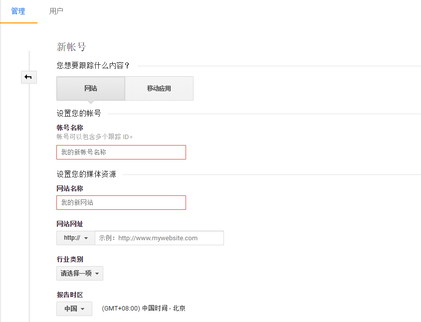
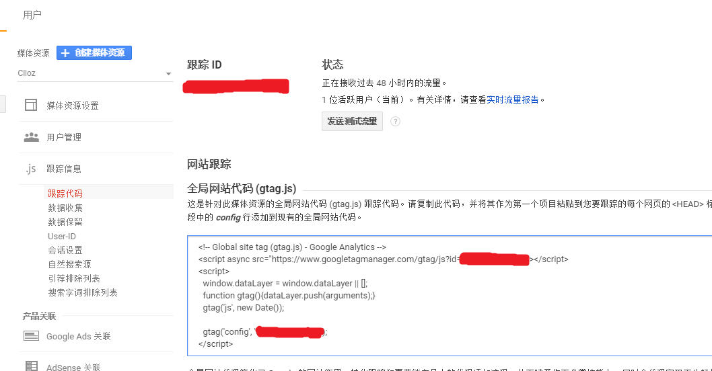
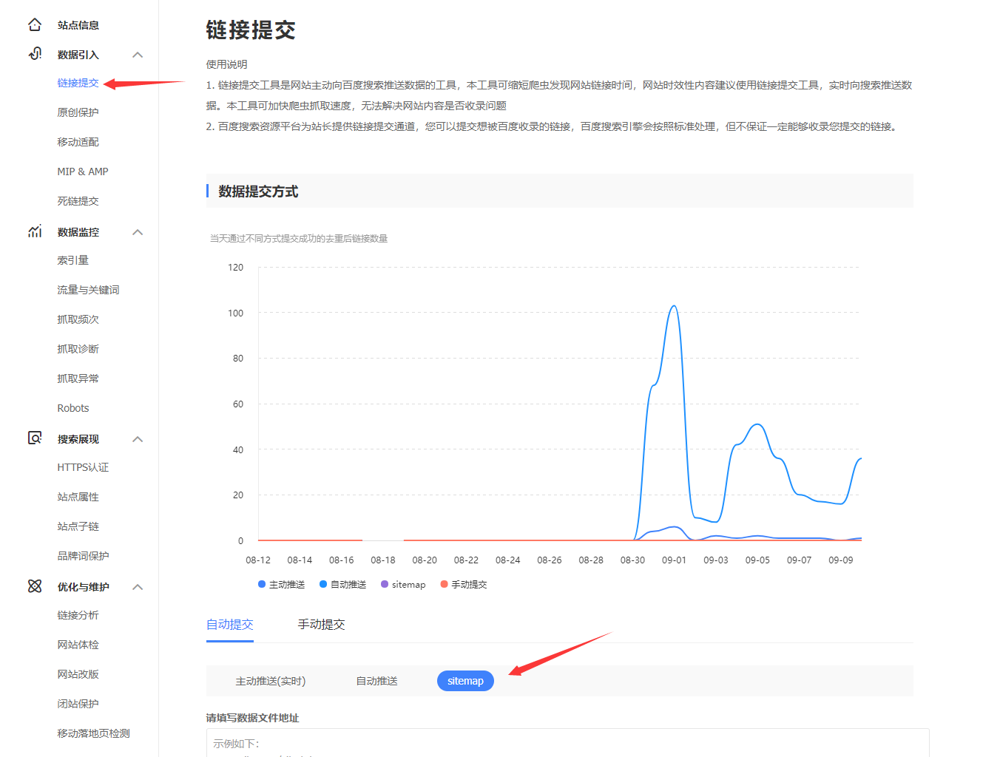

\[toc\]

## 前言

今天试了下添加 `Google Analytics` 来统计网站的一些信息，`Google Analytics` 提供了非常丰富的数据统计，让你能够对自己的网站能够有非常全面的了解。然后试了一下 `sitemap`，用了 `Google XML Sitemaps` 插件，使用非常方便，来进一步提高自己的 `seo` 效率。这两样东西使用都非常简单，在此简单记录一下。

## Google Analytics 的使用

如果你没有谷歌账号的话需要先注册一个账号，如果你没有靠谱的科学上网工具可以看我的这篇文章：[科学上网](https://www.clloz.com/programming/assorted/2018/09/07/shadowsocks/ "科学上网")，然后登录[Google Analytics](https://analytics.google.com/analytics/web/ "Google Analytics")创建账号

创建完成后，在`管理 --> 媒体资源 --> 跟踪信息 --> 跟踪代码`中可以看到全局网站代码

将页面中对应 `js` 代码复制后放到你 `wordpress` 当前所用主题的文件夹下 `footer.php` 文件中的`</body>`之前，具体路径为`/var/www/html/wp-content/themes/theme-name/footer.php`，完成这些以后你就可以在 `Google Analytics` 的首页看到自己的网站统计信息了，比如当前多少人在访问，访客们来自哪里，用的什么设备，什么语言，访客们是通过 `facebook` 推荐还是搜索引擎来到你的网站的，你最受欢迎的页面是哪个等等。

## Google XML Sitemaps 插件

作为一个安装两百万的插件，应该是非常靠谱的，`sitemap` 能让搜索引擎了解你的网站结构，从而更好地分析你的网站，对 `seo` 是有益的。这个插件的使用也是十分简单的，只要安装启用就可以了。这款插件的设置十分丰富，不过我感觉就默认就可以了，安装完插件后你可以访问`http://www.domian.com/sitemap.xml`来查看插件生成的 `sub-sitemap` 了。 设置直接默认就可以了，有两点设置单独说一下 1. 关于 `robots.txt`，如果你自己编写了一个 `robots.txt` 文件，请将这个选项去掉，如果没有，你可以保持默认，`Google XML Sitemaps` 插件会为你自动生成一个虚拟 `robots.txt` 文件。 2. 如果你的网站中有一些内容是自己额外增加的，比如在根目录下面自己添加了一些 `html` 文件，可以通过插件的“附加页面”功能，将这些页面加入 `sitemap`，以便搜索引擎抓取。

## 提交 sitemap.xml 到 Google 和百度

## 提交到 Google Search Console

在 `Search Console` 主页添加自己的网站，然后在菜单中的 `sitemaps` 栏中提交自己的 `sitemaps url`。

## 提交到百度搜索资源平台

在百度`搜索资源平台 --> 链接提交 --> 自动提交`中选择 `sitemap` 然后填写自己的 `sitemap url` 即可。 

## 总结

博客上线一个多星期了，`sitemap` 搞定后，网站的 `seo` 基本都搞得差不多了，不过目前在百度首页居然是 `cdn` 的域名，有点不解，`google` 上就很正常，百度反而花的精力多，什么熊掌号，搜索资源平台都搞了，希望过段时间能好吧。それじゃ。