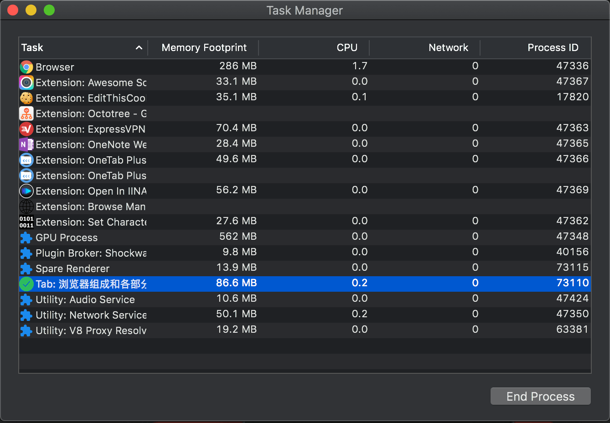
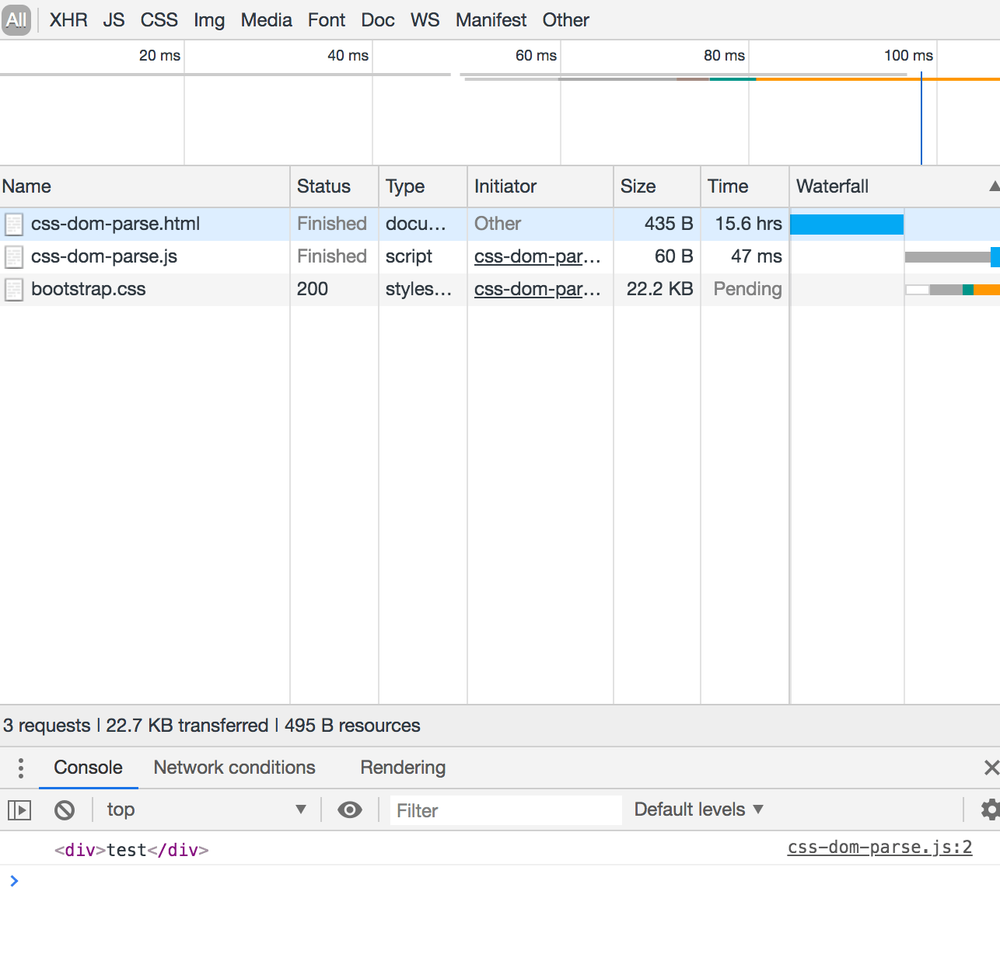
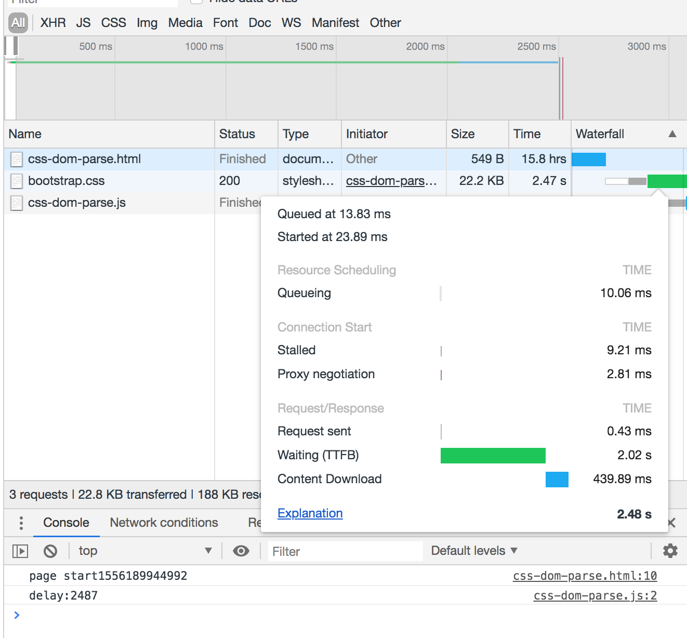
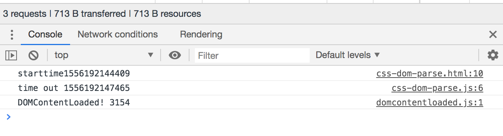

\[toc\]

## 前言

**本文由于作者水平有限，肯定有错误之处，如果你看到，希望能够指出，感谢。**

相信大家都听过一道经典的面试题：“在浏览器输入 `URL` 后回车之后发生了什么”，我一直想解答这个问题，不过这个题目涉及的知识面非常广，想要解答需要一定的知识储备。这篇文章我们讨论这个问题中的一部分，当浏览器拿到服务器传回的 `html` 文档后如何处理文档然后呈现在显示器上呢？

本文主要讲的是浏览器端如何解析渲染文档，如果想看网络方面的内容可以参考我的另外两篇文章：

1. [从URL输入到页面展现](https://www.clloz.com/programming/front-end/2018/12/05/url/ "从URL输入到页面展现")
2. [前端网络基础和HTTP](https://www.clloz.com/programming/network/2019/05/02/http/ "前端网络基础和HTTP")

在进入正题之前我们来想几个问题，然后在跟着问题的脚步来分析： 1. 我们都知道 `DOM`，`CSS` 的加载和渲染和 `JS` 的执行之间存在阻塞，阻塞发生的时候浏览器会加载其他页面资源吗 2. 都说 `JS` 是单线程的，那么 `Event Loop` 线程是什么呢，为什么 `JS` 要设计成单线程呢 3. `setTimeout` 是如何执行的，为什么 `setTimeout` 的 `delay` 和执行时间不同 4. 浏览器的具体渲染流程是什么样的

希望我写完这篇文章和你看完这篇文章之后都能解答这几个问题。

## 浏览器

在解决问题之前，我们要先了解我们的对象：浏览器。浏览器的功能很简单，就是根据我们给出的 `URI`，替我们向服务器发出请求，获取服务器上的资源并在展示给我们。这里的资源主要是 `HTML` 文档也可以是图片，`pdf` 或其他类型的文件，取决于我们给出的 `URI` 采取的协议以及请求的文件类型。

## 浏览器的主要组件

1. 用户界面（ `The userinterface` ）：包括地址栏、前进/后退按钮、书签菜单等。除了浏览器主窗口显示的您请求的页面外，其他显示的各个部分都属于用户界面。
2. 浏览器引擎（ `The browser engine` ）：用户页面和渲染引擎的中间层，负责在用户界面和渲染引擎之间传递信息。
3. 渲染引擎（ `The rendering engine` ）：负责请求并渲染显示内容，这是最核心的一个部分，也就是我们常说的浏览器内核。比如请求的是 `HTML` 文档，那么渲染引擎负责解析 `HTML` 和 `CSS` ，并将解析的结果显示到显示器上。
4. 网络组件：用于网络调用，比如 `http` 请求，是渲染引擎的一部分
5. 用户界面后端（ `UI backend` ）：用于绘制一些小部件，是渲染引擎的一部分。
6. `JavaScript` 解释器（ `JavaScript Interpreter` ）：解析并执行 `JavaScript` 代码，是渲染引擎的一部分
7. 数据存储（ `Data Storage` ）：浏览器需要保存各种类型的数据到本地，比如 `cookies`， `localStorage`, `IndexedDB`, `WebSQL and FileSystem`.


这些组件之间是如何配合工作的呢，我们都知道 `chrome` 是内存杀手，那么我们打开的多个 `tab` 又是如何分配资源的，不同的 `tab` 之间会争夺资源吗？

## 进程与线程

很多前端开发人员都知道 `JavaScript` 是单线程语言，但具体是什么单线程呢，其实说的是 `JS` 引擎，也就是上面的 `JavaScript` 解释器是单线程的，那么这个单线程到底是什么意思呢，我们要来说说线程和进程的概念和关系，以及浏览器中的进程与线程。

进程 `process` 和线程 `thread` 在大学的操作系统课程上讲的很多，不过可能很多同学忘记了，那么我们来说说进程和线程的概念。

我们的计算机中的所有计算都是在 `cpu` 中完成的，`cpu` 的计算速度非常快，大部分的设备是完全跟不上 `cpu`的速度的，那么怎么办呢。用金字塔式存储体系来根据信息处理的紧急程度分开存储，它们一般从下到上越来越小，越来越快，越来越贵。如下图：


大部分人都知道计算机有硬盘和内存，而我们的软件一般就安装在硬盘中，在硬盘中的数据是我们最不急需处理的，它们就静静地呆在那里。当我们想要运行一个程序，这些文件就被装载到内存中去了，而对于内存中最急需处理的文件会被传输到 `CPU` 的高速缓存中，也就是我们买 `CPU` 的时候会看到三级，二级，一级缓存，而在这些缓存中的文件最后会被依次传到 `CPU` 的寄存器中让 `CPU` 执行，只有寄存器的速度勉强能跟上 `CPU`。

但是我们可以同时开很多软件，同时做很多工作，比如我可以一边听着音乐，一边修改着 `Word`，同时还在后台开着浏览器后台播放着直播，不仅如此，我们的操作系统还有很多程序需要运行。那么它们是按照什么顺序进 `CPU` 运行的呢。我们前面已经说过 `CPU` 非常快，所以当我们的程序进入 `CPU` 运行的时候，其他资源比如显卡都应该就位了，这些资源就构成了程序执行的上下文。这个程序执行上下文就是我们的进程，也就是操作系统分配系统资源的最小单位，说白了进程就是操作系统用来管理程序和计算机资源之间的分配关系的手段。当我们的程序终于等到能够进入CPU运行的机会，先装载执行上下文，然后执行程序，程序执行完成或系统分配的时间结束，就必须保存执行上下文，让排队的下一个进程进入计算。`CPU` 就不断重复着装载上下文，执行程序，保存上下文的过程。

那么线程是什么呢，当我们的程序终于获得 `CPU` 的临幸，我们当然希望我们的程序能尽快执行完成。如果我们的程序只有一个逻辑要执行，那么我们其实只需要一个线程就可以了，但如果有几个并行的任务需要执行，我们可以借助多核 `CPU` 同时开多个线程，在一个执行上下文中共享系统分配的资源，来协同更快地完成任务。（单核 `CPU` 也有多线程，操作系统在不同的线程之间快速切换，在进程间交替运行，减少 `CPU` 闲置的时间）

> 操作系统对进程的处理和资源的分配会复杂很多，我们只是了解一下大致的概念。阮一峰的博客有一篇更形象一点的比喻，大家可以借助比喻帮助理解：[进程与线程的一个简单解释](https://www.ruanyifeng.com/blog/2013/04/processes_and_threads.html "进程与线程的一个简单解释")

## 浏览器的进程

现在大家应该已经对进程和线程有一定的了解了，那么我们来说一说浏览器的进程和线程，首先我们要说，浏览器程序是多进程的，我们的每一个标签页（ `tab` ）都是一个独立的进程。我们可以打开 `Chrome` 的 `more tools` 中的 `task manager`，就可以看到当前浏览器的进程。



上图是我只打开了一个 `tab` 显示的进程，我们可以看到有一个 `Browser` 进程，一个 `GPU Process` 进程，一个`Plugin Broker` 进程，一个 `Audio Service` 进程，一个 `Network Service` 进程，一个打开的 `tab` 对应的渲染进程，一个 `Spare Renderer` 进程 和若干个 `Extension` 进程。

我们结合上面浏览器的主要组件来看（以 `Chrome` 为例）：

1. `Browser` 进程：控制 `chrome` 应用界面的一些组件，比如地址栏，书签栏，前进后退按钮等。还控制一些浏览器的不可见部分，比如网络请求和文件访问等。
2. `Renderer` 进程（浏览器内核）：控制标签页内部网页要显示的一切，也就是我们访问的内容都是有渲染引擎控制，比如页面渲染，脚本执行，事件的处理。在 `chrome`，每一个 `tab` 都是一个独立的渲染进程，渲染引擎在其中工作。它会计算出我们的页面最后需要绘制成什么样子，然后交给 `GPU` 进程进行绘制。
3. `Plugin` 进程：控制网站应用的插件，比如 `flash`。
4. `GPU` 进程：独立于其他进程处理 `GPU` 任务，它被独立出来是因为 `GPU` 处理来自不同程序的请求。渲染引擎最后渲染出的内容要交给 `GPU` 进程绘制到显示器上。


> 第四点翻译的可能有点问题，原文[Inside look at modern web browser](https://developers.google.com/web/updates/2018/09/inside-browser-part1 "Inside look at modern web browser")，这个系列文章非常不错，推荐大家看看。

多进程什么好处呢，最简单的比方，我打开了三个 `tab` 浏览三个网页，每个页面都有单独的渲染进程，如果其中一个页面的代码非常糟糕崩溃了，那么你的另外两个页面不会受到影响，你依然可以继续浏览。而如果三个页面共享一个进程，那么你的两外两个页面也将崩溃。

> 不过正因为如此，`chrome` 简直是内存杀手，相信大家都有体会。

## 渲染引擎（浏览器内核）

> 也有一些说法是把渲染引擎和 `JS` 引擎分开，它们共同组成内核，我是以 [How Browsers Work](https://www.html5rocks.com/en/tutorials/internals/howbrowserswork/ "How Browsers Work") 这篇文章和 `Chrome` 的结构为准。

对于我们前端来说，最重要的就是渲染引擎以及它工作的渲染进程，这是我们打交道最多的地方，学期其他的浏览器知识能让我们更清楚渲染引擎在浏览器中的定位和工作流程。渲染引擎也就是我们经常说的浏览器内核。目前主要的浏览器内核如下几种：

- `Trident/EdgeHTML`： `Trident` 是微软的IE浏览器使用的渲染引擎，它是从从早期一款商业性的专利网页浏览器 `Spyglass Mosaic` 派生出来的。`Window 10` 发布之后，微软将其内置的浏览器命名为 `Edge`，而 `Edge` 浏览器的渲染引擎便是 `EdgeHTML`。在 `2019` 年，微软宣布 `Edge` 浏览器将采用 `Chromium` 的内核 `Blink`。
- `Webkit`：`WebKit` 是苹果公司的 `Safari` 浏览器使用的渲染引擎，是 `KDE`（`Linux` 桌面系统）小组的 `KHTML` 引擎的一个开源的分支。早期的 `Chrome` 也是使用的 `Webkit` 引擎。
- `Chromium/Blink`：`Chromium` 是谷歌公司的一个开源浏览器项目，每隔一段时间，谷歌会在最新的比较稳定的 `Chromium` 版本上加入一些其他的功能使之成为新版本的 `Chrome` 浏览器。而 `Chromium` 的渲染引擎采用的是 `Blink`，其前身是 `Webkit`。`Blink` 是从早期的 `Webkit` 项目（而非后来的 `Webkit2`）复制出来另外维护的一个新的分支项目。
- `Presto`：`Presto` 是挪威 `Opera Software ASA` 公司的 `Opera` 浏览器使用的渲染引擎，后来该公司为了减少研发成本，在 `2013` 年跟随 `Chrome` 浏览器将渲染引擎改为 `Blink`。
- `Gecko`：`Gecko` 是 `Mozilla` 公司的 `FireFox` 浏览器使用的渲染引擎，它是一款开源的跨平台渲染引擎，可以在 `Windows`、 `BSD`、`Linux` 和 `Mac OS X` 中使用。

现在的浏览器内核可以说是谷歌一家独大，特别是在微软也宣布投向 `Chromium`。关于浏览器内核的详细可以参考知乎的这个回答 [浏览器内核真的很复杂吗？- 龙泉寺](https://www.zhihu.com/question/290767285/answer/1200063036 "浏览器内核真的很复杂吗？- 龙泉寺")，我这里只是做一个简单的介绍。

渲染进程是多线程的，那到底有哪些线程，分别做什么工作呢？

1. `GUI` 渲染线程
    
    - 负责渲染浏览器界面，解析`HTML` ，`CSS` ，构建 `DOM` 树和 `RenderObject` 树，布局和绘制等。
    - 当界面需要重绘（ `Repaint` ）或由于某种操作引发回流( `reflow` )时，该线程就会执行。
    - 注意，`GUI` 渲染线程与 `JS` 引擎线程是互斥的，当 `JS` 引擎执行时 `GUI` 线程会被挂起（相当于被冻结了），`GUI` 更新会被保存在一个队列中等到 `JS` 引擎空闲时立即被执行。
2. `JavaScript` 引擎
    
    - 负责处理 `Javascript` 脚本程序，`JavaScript` 引擎是一个专门处理 `JavaScript` 脚本的虚拟机，一般会附带在网页浏览器之中，现在有 `NodeJS` 让我们在服务端也能使用 `JavaScript`。（例如 `V8` 引擎），`JS` 引擎是基于事件驱动单线程执行的， `JavaScript` 引擎一直等待着任务队列中任务的到来，然后加以处理，浏览器无论什么时候都只有一个 `JavaScript` 线程在运行 `JavaScript` 程序。
3. 事件触发线程
    
    - 管理 `Event Loop`，`Event Loop` 的标准是在[HTML5](https://html.spec.whatwg.org/multipage/webappapis.html#event-loops "HTML5")中，是渲染引擎的一个线程来处理，所以并不和 `JS` 单线程执行矛盾。
    - 当一个事件被触发时，该线程会把事件添加到待处理队列的队尾，等待 `JavaScript` 引擎的处理。这些事件可来自 `JavaScript` 引擎当前执行的代码块如 `setTimeout` 、也可来自浏览器内核的其他线程如鼠标点击、`Ajax` 异步请求等，但由于 `JavaScript` 的单线程关系，所有这些事件都得排队等待 `JavaScript` 引擎处理（当线程中没有执行任何同步代码的前提下才会执行异步代码）。
4. 定时器触发线程
    
    - 浏览器定时计数器并不是由 `JavaScript` 引擎计数的,（因为 `JavaScript` 引擎是单线程的, 如果处于阻塞线程状态就会影响记计时的准确），因此通过单独线程来计时并触发定时（计时完毕后，添加到事件队列中，等待 `JS` 引擎空闲后执行）。`W3C` 在 `HTML` 标准中规定，规定要求 `setTimeout` 中低于 `4ms` 的时间间隔算为 `4ms` 。
5. 异步请求线程
    
    - `XMLHttpRequest` 在连接后是通过浏览器新开一个线程请求
    - 检测到状态变更时，如果设置有回调函数，异步线程就产生状态变更事件，将这个回调再放入事件队列中。再由 `JavaScript` 引擎执行。

其中前三个是常驻线程，是所有浏览器内核必须实现的，后两个线程执行完就会终止。在 `Chrome` 中，每一个 `tab` 都是一个独立的渲染进程，都有独立的渲染引擎在工作。

> 关于JS引擎为什么是单线程的，因为大部分程序控制 `UI` 的都会是单一单线程，因为 `JS` 主要使用场景是与用户交互和操作 `DOM`，如果两个线程同时操作一个 `DOM` 会很复杂。而H5也提供了多线程方法 `web worker`，可以创建多个线程，但是子线程完全受控于主线程且不得操作 `DOM` 。

## JavaScript 引擎

渲染引擎中最重要的就是 `JavaScript` 引擎，`JavaScript` 作为一门动态弱类型语言，一般来说引擎就是解释器 `Interpreter`，直接解析并将代码运行结果输出。像 `Java、C++、C` 这样的静态语言才需要经过编译到机器码或字节码的过程。

- 编译型语言：程序在执行之前需要一个专门的编译过程，把程序编译成为机器语言的文件（如 `exe` 文件），运行时不需要重新编译，直接用编译后的文件就行了。优点：执行效率高。缺点：跨平台性差。
- 解释型语言：程序不需要编译，程序在运行的过程中才用解释器编译成机器语言，边编译边执行。优点：跨平台性好。缺点：执行效率低。

但是现代的 `JavaScript` 引擎，比如说 `V8`，它其实为了提高 `JS` 的运行性能，在运行之前会先将 `JS` 编译为本地的机器码（`native machine code`），然后再去执行机器码，也就是 `JIT（Just-in-time）`。

`JavaScript` 引擎和渲染引擎之间是可以交互的，浏览器提供了相当丰富的 `Web API` 让 `JavaScript` 能操作 `DOM`，`BOM`，能够绑定事件，发起请求等等。渲染引擎也可以通过事件循环让 `JS` 引擎执行代码。

目前主要的 `JavaScript` 引擎有如下几种：

- `V8(Google)`，用 `C++` 编写，开放源代码，`Google` (丹麦)研发小组在 `2006` 年开始研发 `V8` ，部分的原因是 `Google` 对既有 `JavaScript` 引擎的执行速度不满意, 在 `2008` 年推出 `Chrome`，也用于 `Node.js`, 巨大的速度优势，迅速占领市场.。`2017` 年 `Chrome` 的市场占有达到 `59%`。
- `JavaScriptCore(Apple)`，开放源代码，用于 `webkit` 型浏览器，如 `Safari` ，`2008` 年实现了编译器和字节码解释器，升级为了 `SquirrelFish`。苹果内部代号为 `Nitro` 的 `JavaScript` 引擎也是基于 `JavaScriptCore` 引擎的。
- `Rhino`，由 `Mozilla` 基金会管理，开放源代码，完全以 `Java` 编写，用于 `HTMLUnit`。
- `SpiderMonkey(Mozilla)`，第一款 `JavaScript` 引擎，早期用于 `Netscape Navigator`，现时用于 `Mozilla Firefox`。
- `Chakra (Microsoft)`：`JScript` 引擎，用于 `Internet Explorer`。
- `Chakra (Microsoft)`：`JavaScript` 引擎，用于 `Microsoft Edge`。目前 `Edge` 已经使用 `Chromium`。
- `KJS`，`KDE` 的 `ECMAScript／JavaScript` 引擎，最初由哈里·波顿开发，用于 `KDE` 项目的 `Konqueror` 网页浏览器中。
- `Hermes`：`Facebook` 在 `ChainReact 2019` 大会上正式推出了新一代 `JavaScript` 执行引擎 `Hermes`。`Hermes` 是一款小巧轻便的 `JavaScript` 引擎，专门针对在 `Android` 上运行 `React Native` 进行了优化。对于许多应用程序，只需启用 `Hermes` 即可缩短启动时间、减少内存使用量并缩小应用程序大小，此外因为它采用 `JavaScript` 标准实现，所以很容易在 `React Native` 应用中集成。
- `QuickJS`：`QuickJS` 是一个小型并且可嵌入的 `Javascript` 引擎，它支持 `ES2020` 规范，包括模块，异步生成器和代理器，由 `Bellard` 开发。

## 渲染过程

浏览器接收到服务器返回的 `HTML` 文档后就开始解析并渲染 `HTML` 文档，主要流程如下： 1. 解析 `HTML` 文档，将元素按层次转化成一棵 `DOM`树，根节点为 `document`。 2. 解析 `CSS` 样式文件（包括外部 `CSS`文件和样式元素以及 `js` 生成的样式），获取样式数据，生成 `CSSOM`。 3. 结合 `CSSOM` 和 `DOM`树计算出节点的样式，生成渲染树（ `render tree` ），渲染树包含多个带有样式属性的矩形，这些矩形的排列顺讯就是它们在屏幕上显示的顺序。 4. 进入布局阶段，从根节点递归调用，计算每一个元素的大小、位置等，给每个节点所应该出现在屏幕上的精确坐标。 5. 遍历渲染树，每个节点将使用 `UI` 后端层来绘制。

对于渲染引擎的渲染细节感兴趣的同学可以看看这篇文章，[How browsers work](https://www.html5rocks.com/en/tutorials/internals/howbrowserswork/ "How browsers work")，中文翻译的不是很好，推荐大家结合英文看。


## Reflow 和 Repaint

1. `Reflow` : 元素的盒模型或者布局发生了变化，浏览器需要重新计算其大小和位置。
2. `Repaint` : 当一个元素的外观发生改变，但没有改变布局,重新把元素外观绘制出来的过程，叫做重绘。

我们可以发现 `Reflow` 对应的是渲染过程中的第四步，而 `Repaint` 对应的是渲染过程的第五步。直白一点说就是当 `DOM` 被修改后需要重新计算渲染树 `render tree` 的一部分或者全部的时候，我们就需要 `Reflow`，而如果元素的修改不影响渲染树，那么只要 `Repaint` 就可以了。回流必将引起重绘，重绘不一定会引起回流。

显而易见，`Reflow` 的成本要比 `Repaint` 高得多，`DOM Tree` 里的每个结点都会有 `reflow`方法，一个结点的 `reflow` 很有可能导致子结点，甚至父点以及同级结点的 `reflow`。

会导致 `Reflow` 的操作：

- 页面首次渲染
- 浏览器窗口大小发生改变
- 元素尺寸或位置发生改变
- 元素内容变化（文字数量或图片大小等等）
- 元素字体大小变化
- 添加或者删除可见的 `DOM` 元素
- 激活 `CSS` 伪类（例如：`:hover`）
- 查询某些属性或调用某些方法

一些常用且会导致 `Reflow` 的属性和方法：

`clientWidth、clientHeight、clientTop、clientLeft、offsetWidth、offsetHeight、offsetTop、offsetLeft、scrollWidth、scrollHeight、scrollTop、scrollLeft、scrollIntoView()、scrollIntoViewIfNeeded()、getComputedStyle()、getBoundingClientRect()、scrollTo()`

当页面中元素样式的改变并不影响它在文档流中的位置时（例如：`color、background-color、visibility`等），浏览器会将新样式赋予给元素并重新绘制它，这个过程称为重绘。

`Reflow` 和 `Repaint` 对性能可能造成很大的影响：有时即使仅仅回流一个单一的元素，它的父元素以及任何跟随它的元素也会产生 `Reflow`。

现代浏览器会对频繁的回流或重绘操作进行优化：浏览器会维护一个队列，把所有引起回流和重绘的操作放入队列中，如果队列中的任务数量或者时间间隔达到一个阈值的，浏览器就会将队列清空，进行一次批处理，这样可以把多次回流和重绘变成一次。比如下面的代码我们对同一个元素连续进行 `transform` 的话，浏览器只会执行最后一个。如果我们想看到两段动画效果则要借助 `setTimiout`。

```javascript
<div class="cube"></div>
<button>transform</button>
<script>
    let cube = document.querySelector('.cube');
let btn = document.querySelector('button');
btn.addEventListener('click', e => {
    cube.style.transform = 'translateX(30px)';
    setTimeout(() => {
        // cube.style.transform = 'translateX(-30px)';
        console.log('timeout');
    }, 0);
    cube.style.transform = 'translateX(-30px)';
});
</script>
```

当访问以下属性或方法时，浏览器会立刻清空队列：

- `clientWidth、clientHeight、clientTop、clientLeft`
- `offsetWidth、offsetHeight、offsetTop、offsetLeft`
- `scrollWidth、scrollHeight、scrollTop、scrollLeft`
- `width、height`
- `getComputedStyle()`
- `getBoundingClientRect()`

因为队列中可能会有影响到这些属性或方法返回值的操作，即使你希望获取的信息与队列中操作引发的改变无关，浏览器也会强行清空队列，确保你拿到的值是最精确的。

现在的浏览器已经对渲染的过程尽可能的优化，不过我们还是可以在编码的过程只能够注意一些细节：

- `CSS`
    
    - 避免使用 `table` 布局。浏览器使用流式布局，对 `Render Tree` 的计算通常只需要遍历一次就可以完成，但 `table` 及其内部元素除外，他们可能需要多次计算，通常要花 `3` 倍于同等元素的时间
    - 尽可能在 `DOM` 树的最末端改变 `class`。
    - 避免设置多层内联样式。
    - 将动画效果应用到 `position` 属性为 `absolute` 或 `fixed` 的元素上。
    - 避免使用 `CSS` 表达式（例如：`calc()`）。
- `javascript`
    
    - 避免频繁操作样式，最好一次性重写 `style` 属性，或者将样式列表定义为 `class` 并一次性更改 `class` 属性。
    - 避免频繁操作 `DOM`，创建一个 `documentFragment`，在它上面应用所有 `DOM` 操作，最后再把它添加到文档中。
    - 也可以先为元素设置 `display: none`，操作结束后再把它显示出来。因为在 `display` 属性为 `none` 的元素上进行的 `DOM` 操作不会引发回流和重绘。
    - 避免频繁读取会引发回流/重绘的属性，如果确实需要多次使用，就用一个变量缓存起来。
    - 对具有复杂动画的元素使用绝对定位，使它脱离文档流，否则会引起父元素及后续元素频繁回流。

## DOM, CSS, JS的阻塞

渲染过程并不像上面描述的那么简单，特别是页面的绘制是一件开销非常大的事情，所以浏览器尽量最有效率的绘制，避免那些没必要的重绘和回流。要避免这个问题，`DOM` 加载和解析，`CSS` 加载和解析，和 `JS` 的加载执行之间的顺序和阻塞就非常重要，如果处理不当，页面很可能要重绘。因为渲染树是 `DOM` 和 `CSS` 结合生成的，而 `JS` 可以操作 `DOM` 和样式，必须处理好三者之间的逻辑。

## load 和 DOMContentLoaded

在分析具体情况之前我们先说两个事件 `DOMContentLoaded` 和 `load`。

- `load`：当一个资源及其依赖资源已完成加载时，将触发 `load` 事件，也就是当页面的 `html`、`css`、`js`、图片等资源都已经加载完之后才会触发 `load` 事件。
- `DOMContentLoaded` ：当初始的 `HTML` 文档被完全加载和解析完成之后就会被触发，而无需等待样式表、图像和子框架的完成加载。

上面两个说法都是 `MDN` 给出的，但是其实具体结合加载和解析的阻塞情况会不一样（结合下面的阻塞情况来看这几点）： 1. 因为 `js` 会阻塞 `DOM` 的解析，所以当文档解析完成触发 `DOMContentLoaded` 事件的时候，文档中所有的同步的 `js` 任务都已经执行完毕。 2. 因为 `CSS` 会阻塞 `JS` 而不会阻塞 `DOM` 解析，并且 `JS` 的执行会让该 `JS` 之前的以加载 `DOM` 和 `CSS` 渲染，所有在 `DOMContentLoaded` 事件触发时，所有在 `JS` 之前的 `CSS` 已经加载并渲染完成。 3. 当 `DOMContentLoaded` 事件触发时，文档解析完毕，页面的 `DOM` 树已经构建完成，所有页面上的 `JS` 同步任务执行完成，所有在 `JS` 之前的 `CSS` 都已经加载并渲染完成。（页面每遇到一个 `script` 标签都会把当前已经构建的 `DOM` 树和 `CSSOM`树结合渲染一次） 4. 当 `DOMContentLoaded` 事件触发之后，浏览器会继续加载在 `JS` 之后的 `CSS`，以及在JS中同步添加的 `img，css，js` 文件，当这些资源全部加载完成，会进行 `load` 事件触发之前的最后一次渲染，之后load事件被触发。

这段代码可以验证，同步的 `js` 代码中的外部资源文件（ `js`，`css`，`img` ）都加载（由异步请求线程完成的异步加载）完毕后才会触发 `load` 事件，加载速度可以通过设置 `network throttling` 配置，把加载速度设置非常慢，可以看到资源文件加载完成以后load事件才触发。而异步事件 `setTimeout` 回调函数中的资源文件则会在 `load` 事件触发后在执行，不会阻塞 `load` 的触发。

```html
<!DOCTYPE html>
<html lang="en">
  <head>
    <meta charset="UTF-8" />
    <title>Test</title>
    <script defer src="js/test.js"></script>
  </head>
  <body>
    <div id="test"></div>

    <script>
      let script = document.createElement("link");
      script.setAttribute("rel", "stylesheet");
      script.setAttribute(
        "href",
        'https://cdn.bootcss.com/bootstrap/4.0.0-alpha.6/css/bootstrap.css'
      );

      var a = document.body.appendChild(script);

      // setTimeout(function() {
      //   let script = document.createElement("link");
      //   script.setAttribute("rel", "stylesheet");
      //   script.setAttribute(
      //     "href",
      //     'https://cdn.bootcss.com/bootstrap/4.0.0-alpha.6/css/bootstrap.css'
      //   );
      //   var a = document.body.appendChild(script);
      //   console.log("setTimeout...");
      // }, 3000);

      window.onload = function() {
        console.log("window load...");
      };
    </script>
  </body>
</html>
```

> 下面有提到预加载监视器 `preload scanner`，浏览器对同一域名下的最大并发连接数不超过 `6` 个。超过 `6` 个的话，剩余的将会在队列中等待，这就是为什么我们要将资源放到不同的域名下，也是为了充分利用该机制，最大程度的并发下载所需资源，尽快的完成页面的渲染。 下载和加载在浏览器渲染过程中应该是相同的意思。

**2020-10-23补充** 按照一般的理论来说，`DOMContentLoaded` 是在文档解析完成，也就是 `DOM` 树构建完成的时候就会触发，也就是样式表的加载与否不会影响 `DOMContentLoaded` 事件发生的时间，但是经过实际的测试我发现浏览请的行为并不一致。比如下面的代码，我让服务器延迟 `5000ms` 返回 `css` 文件，按理说这个 `css` 不会影响 `DOMContentLoaded` 的发生时间，但是在 `Chrome` 中，只要你将这个 `css` 放到 `body` 中就会出现 `DOMContentLoaded` 知道 `CSS` 文件加载完成才触发，但是把 `link` 放到 `head` 中就不会。在 `safari` 中则是立即触发 `DOMContentLoaded` 事件。`Opera` 的表现跟 `chrome` 一致。`firefox` 虽然也是 `css` 加载完成后触发，但是它先渲染出 `div` 本来的绿色，`css` 请求回来后再渲染成 `蓝色`，其他几个浏览器则是全部只有一次渲染，就是只有 `css` 回来之后才渲染 `div`，直接显示蓝色。

```html
<!DOCTYPE html>
<html lang="en">
    <head>
        <meta charset="UTF-8" />
        <title>Title</title>
        <style>
            div {
                width: 100px;
                height: 100px;
                background: lightgreen;
            }
        </style>
        <!-- <link rel="stylesheet" href="/css/sleep5000-common.css" /> -->
        <!-- <script defer src="/js/blok.js"></script> -->
    </head>
    <body>
        <!-- <link rel="stylesheet" href="/css/sleep5000-common.css" /> -->
        <button>click</button>
        <script defer src="/js/block.js"></script>
        <link rel="stylesheet" href="/css/sleep5000-common.css" /> <!-- 服务器延迟返回，设置div为蓝色 -->
        <div></div>
    </body>
</html>

```

```javascript
//block.js
console.log('DOMContentLoaded');
```

所以我进行一个简单的总结就是：放在 `body` 之前的 `link` 不会阻塞 `DOM` 的解析（`DOMContentLoaded` 不会等待 `CSS` 加载），但是会阻塞渲染，渲染会在 `CSS` 请求成功以后再渲染，在之前浏览器将是白屏。而放在 `body` 中和 `body` 后的 `CSS` 则会同时阻止 `DOM` 的解析和渲染，`DOMContentLoaded` 会等待 `CSS` 的加载，`link` 之前的元素会成功渲染，但是 `link` 之后的元素会等待 `CSS` 加载成功后才渲染。从某个角度看，`body` 中的 `link` 和 `script` 的处理逻辑是一致的。当然具体的行为每个浏览器并不完全相同。

为了验证自己的想法我又写了一个例子，我用几个 `link` 分别将几个 `div` 隔开，调节 `chorme devtools` 的 `network throttling` 为 `slow 3g` 你也可以设置自己想要的速度。然后看看这些元素的渲染顺序。

```html
<!DOCTYPE html>
<html lang="en">
    <head>
        <meta charset="UTF-8" />
        <meta name="viewport" content="width=device-width, initial-scale=1.0" />
        <meta http-equiv="X-UA-Compatible" content="ie=edge" />
        <title>css-dom-parse</title>
        <script defer src="parse.js"></script>
        <style>
            div {
                height: 100px;
                width: 100px;
            }
            .red {
                background: red;
            }
            .black {
                background: black;
            }
            .green {
                background: green;
            }
        </style>
    </head>
    <body>
        <div>test</div>
        <!-- <script defer src="parse1.js"></script> -->
        <link href="https://cdn.bootcss.com/bootstrap/4.0.0-alpha.6/css/bootstrap.css" rel="stylesheet" />
        <div class="red"></div>
        <link href="https://cdn.bootcdn.net/ajax/libs/twitter-bootstrap/4.5.3/css/bootstrap.css" rel="stylesheet" />
        <div class="green"></div>
        <link
            href="https://cdn.bootcdn.net/ajax/libs/twitter-bootstrap/4.5.3/css/bootstrap-grid.css"
            rel="stylesheet"
        />
        <div class="black"></div>
    </body>
</html>
```

三个 `bootstrap` 的 `css` 文件，加载的顺序是 `3 1 2`，加载是并行的，而渲染是等到全部加载完才开始，渲染顺序就是从上到下。

## 阻塞关系

总的原则就是一点 `JS` 引擎和渲染引擎是互斥的。

1. 外部资源文件的加载不会被阻塞（js，css，image） 我们的 `HTML` 文档一般都会包含外部链接，引入资源文件，包括 `js`，`css`，图片等，我们的主线程会一个一个的请求这些链接，不过现代浏览器一般会有一个预加载监视器 `preload scanner` 来加速这些链接的加载，因为我们的文档解析需要事件，所以提前发送请求获取资源文件会提高效率。这个预加载监视器会找到 `` 和 `<link>` 之类的标签，发送给网络线程请求资源。


2. `CSS` 不会阻塞 `DOM` 解析 这一点其实很好理解，`CSS` 不会引起 `DOM`的变化，它们两个只要尽早解析完成，然后生成渲染树就可以了，并行加载并不影响。我们可以设计一个场景模拟出这个状态，现在 `chrome` 中把 `network throttling` 设置一个较小的数值（我设置的 `50kb/s` ），然后加载一个稍大的 `CSS`，然后在 `css` 之前用一个 `defer` 属性的 `js` 获取页面上的 `DOM`（ `defer` 属性表示这个 `js` 会在 `DOMContentLoaded` 事件发生后立即执行），如果能够在 `css` 加载好之前获取 `dom` 节点，说明 `CSS` 是不会阻塞 `DOM` 解析的。

```html
<!DOCTYPE html>
<html lang="en">
<head>
    <meta charset="UTF-8">
    <meta name="viewport" content="width=device-width, initial-scale=1.0">
    <meta http-equiv="X-UA-Compatible" content="ie=edge">
    <title>css-dom-parse</title>
    <script defer src="css-dom-parse.js"></script>
    <link href="https://cdn.bootcss.com/bootstrap/4.0.0-alpha.6/css/bootstrap.css" rel="stylesheet">
</head>
<body>
    <div>test</div>
</body>
</html>
```

```javascript
//css-dom-parse.js
const div = document.querySelector('div');
console.log(div);
```

结果如下图



此时我们的 `css` 还没加载完成，但是我们可以看到 `console` 选项卡里面 `div` 标签已经被打印出来了，说明，此时 `DOM` 已经解析完成触发 `DOMContentLoaded` 事件。

**2020-10-23 补充** 在多个浏览器中测试，如果把 `link` 标签放到 `body` 中将会阻塞 `DOM` 解析（只有 `safari` 不会），详细的例子可以参考上面的 `DOMContentLoaded` 章节最后的补充部分。

3. `CSS` 会阻塞 `DOM` 渲染 因为 `DOM` 的渲染需要 `DOM` 树和 `CSSOM` 树共同来生成渲染树，所以在 `CSS` 加载完成之前， `DOM` 是不会进行渲染的。还是用上面那个例子，我们会发现 `CSS` 没有加载完成时，页面上是不显示 `test` 的，而当 `CSS` 加载完成的瞬间，标签就被渲染到页面上了。
    
4. `CSS` 会阻塞 `JS` 这一点可能大家有点疑惑，但是仔细想一想，我们的脚本可以在文档解析阶段请求样式信息，如果此时我们的样式还没有加载和解析，那么脚本必然会获得错误的结果，这样会产生很多问题，目前的浏览器做法就是在 `CSS`加载解析的过程中会阻塞 `JS` 的加载执行。虽然我们不常遇到这样的情况，但是也要清楚为什么会发生这样的情况。我们还用刚刚的方法，不过这次我们需要快速看到结果，可以把速度设置的快一点，`network throttling` 设置为 `slow 3G`，代码如下：
    

```html
<!DOCTYPE html>
<html lang="en">
<head>
    <meta charset="UTF-8">
    <meta name="viewport" content="width=device-width, initial-scale=1.0">
    <meta http-equiv="X-UA-Compatible" content="ie=edge">
    <title>css-dom-parse</title>
    <script>
        var starttime = new Date().getTime();
        console.log("page start" + starttime);
    </script>
    <link href="https://cdn.bootcss.com/bootstrap/4.0.0-alpha.6/css/bootstrap.css" rel="stylesheet">
    <script src="css-dom-parse.js"></script>
</head>
<body>
    <div>test</div>
</body>
</html>
```

```javascript
var endtime = new Date().getTime();
console.log("delay:" + (endtime - starttime));
```

我们在 `CSS` 加载之前记录时间并保存到全局变量 `starttime` 中，然后在 `CSS` 之后加载一个 `JS` 文件，当这个 `JS` 文件执行的时候，我们输出执行时间并计算时间差。结果如下图：  我们把时间线拖到页面加载的最开始，我们发现 `html` 和 `js`都已经加载完毕，但是 `css` 的请求还没有完成，而我们在看看输出的时间，我们的 `js` 是在 `2487ms` 后才执行，正是 `css` 加载完成后才执行的 `js`。

5. `JS` 会阻塞渲染引擎 当解析起遇到 `script` 标签时，文档会立即停止解析直到脚本执行完毕，如果脚本是外部的，还要加上从服务器下载的时间。这里注意一个比较细节的部分，渲染引擎此时不会继续往下解析和渲染 `DOM` 了，在下载脚本的过程中，我们还是可以堆页面上已经渲染的 `DOM` 进行操作，一旦下载完成，`JS` 引擎开始执行脚本，整个浏览器就处于卡死状态，我们只能等脚本执行完成才能继续和页面交互。

下面的例子中，我在给页面的一个 `button` 元素绑定了点击事件，点击以后会 `console.log(123)`，然后在这个 `button` 下方我引入了一个 `script`，我在服务器上设置 `5000ms` 后才返回这个脚本，模拟下载超大脚本或网速很慢的情况。然后这个脚本的执行则是一个非常大的数组操作，也要花费一点时间。这个脚本后面还有一个新的 `div` 元素。当页面开始加载后 `btn` 会先加载出来并成功绑定事件，此时我们点击 `btn` 能够成功输出 `123`，此时已经开始从服务器下载脚本了，在下载脚本的这段时间内我们依然能够点击按钮。一旦 `DOM` 成功返回（我在脚本开头执行了一个 `console.log`），我们点击 `DOM` 就没有反应了，也就是浏览器 **卡死** 了。并且如果我们添加多个 `script` 标签我们可以发现请求是并行的，现代浏览器也对这种 **卡死** 进行了优化，它会在卡死的这段时间查看后面的 `DOM` 是否有资源要加载，如果有就进行提前加载。

```html
<button>click</button>
<script>
    let btn = document.querySelector('button');
    btn.addEventListener('click', e => {
        console.log(123);
    });
</script>
<script src="/js/sleep5000-logDiv.js"></script>
<script src="https://cdn.bootcdn.net/ajax/libs/jquery/3.5.1/jquery.js"></script>
<div></div>
```

```javascript
const div = document.querySelector('div');
console.log(div);
const arr = [];
for (let i = 0; i < 100000000; i++) {
    arr.push(i);
    arr.splice(i % 3, i % 7, i % 5);
}
```

服务端代码参考：[how js css block Dom](https://github.com/ljf0113/how-js-and-css-block-dom/blob/master/index.js "how js css block Dom")，这种现象的因为我们的脚本会操作 `DOM`，所以在脚本跑完之前浏览器不知道脚本会把 `DOM` 改成什么样，所以就等脚本执行完再进行解析。还有一个简单测试的例子，我们用一个有 `defer` 属性的 `js` 在 `DOMContentLoaded` 的时候输出内容，然后再写一个一定时常的死循环，看看输出结果。代码如下：

```html
<!DOCTYPE html>
<html lang="en">
<head>
    <meta charset="UTF-8">
    <meta name="viewport" content="width=device-width, initial-scale=1.0">
    <meta http-equiv="X-UA-Compatible" content="ie=edge">
    <title>css-dom-parse</title>
    <script>
        var starttime = new Date().getTime();
        console.log('starttime' + starttime);
    </script>
    <script defer src="domcontentloaded.js"></script>
    <script src="css-dom-parse.js"></script>
</head>
<body>
    <div>test</div>
</body>
</html>
```

```javascript
//domcontentloaded.js
console.log("DOMContentLoaded! " + (new Date().getTime() - starttime));

//css-dom-parse.js
var now = new Date().getTime();

while (new Date().getTime() - now < 3000) {
    continue;
}
console.log("time out" + new Date().getTime());
```

结果如下图:  可以看出 `DOMContentLoaded` 事件一直等到 `JS` 执行完成以后才触发。

6. 浏览器解析到非 `defer` 和 `async` 的 `script` 标签会立即触发一次渲染 这个机制可能很多朋友不是很清楚，当我们的浏览器在解析文档的过程中遇到 `script` 标签（ `body` 中的，因为 `body` 之前并没有需要渲染到页面上的元素），他会立即把已经解析的部分渲染了，这当然是个比较极端的情况，一般良好的代码不会遇到。大概是因为解析到一半的时候渲染树还没有，如果此时 `JS` 要操作的 `DOM` 的话，浏览器不知道如何处理，只能先把当前内容渲染了。测试代码如下：

```html
<!DOCTYPE html>
<html lang="en">
  <head>
    <meta charset="UTF-8" />
    <title>Test</title>
    <script>
      console.log("page start" + new Date().getTime());
    </script>
    <style>
      div {
        background: lightblue;
        width: 500px;
        height: 500px;
      }
    </style>
  </head>
  <body>
    <div>test3</div>
    <script src="js/test.js"></script>
    <style>
      div {
        background: lightgray;
      }
    </style>
    <script src="js/test1.js"></script>
    <style>
      div {
        background: lightpink;
      }
    </style>
  </body>
</html>
```

```javascript
//test.js 和 test1.js相同，都是执行三秒
var now = new Date().getTime();

while (new Date().getTime() - now < 3000) {
    continue;
}
console.log("js11 start" + new Date().getTime());
```

执行后我们会发现 `div` 先被渲染成 `lightblue`，三秒后被渲染成 `lightgray`，再过三秒被渲染成 `lightpink`。

> `CSS` 虽然不会阻塞 `DOM` 解析，但是如果在 `CSS` 后有一个 `JS`，`CSS` 会阻塞这个 `JS`，而这个 `JS` 会阻塞 `DOM`，所以有时候会造成 `CSS` 阻塞 `DOM` 的错觉。

对这个阻塞分析进行一个总结：

1. `head` 中 `link` 只阻塞 `DOM` 的渲染而不阻塞 `DOM` 的解析。
2. `body` 中的 `link` 会同时组织 `DOM` 的解析和渲染。
3. `link` 无论在 `body` 还是在 `head` 中都会阻塞 `js` 的执行。
4. `js` 会阻塞 `DOM` 的解析和渲染，`js` 在加载过程中不会卡死页面，在执行过程中会卡死页面，无法进行交互。
5. 浏览器解析到非 `defer` 和 `async` 的 `script` 标签会立即触发一次渲染

## 白屏时间

阻塞的第六种情况说到每次 `<script>` 的执行渲染引擎都会将当前已经解析的 `DOM` 和 `CSSOM` 立即合并成一棵 `Render` 树进行一次渲染，而第一个 `body` 中的 `<script>` 标签引发的渲染就是页面结束白屏的时间点。如果渲染引擎解析到第一个 `script` 标签时，对应的 `js` 文件还没有加载到本地，那么会立即进行渲染，如果已经加载好，那么会在 `JS` 引擎执行完这段脚本之后立即进行渲染。下面的代码可以测试这个机制(依然是把 `network throttling` 设置慢速，让css的加载时间较长以达到测试的效果：

```html
<!DOCTYPE html>
<html lang="en">
  <head>
    <meta charset="UTF-8" />
    <title>Test</title>
    <script defer src="js/test.js"></script>
  </head>
  <body>
    <div id="test">test1</div>

    <script>
      var start = new Date().getTime();
      while (new Date().getTime() - start < 500) {
        continue;
      };
      console.log("time out");
    </script>
    <link rel="stylesheet" href="https://cdn.bootcss.com/bootstrap/4.0.0-alpha.6/css/bootstrap.css">
    <script>
      console.log(123);
    </script>
  </body>
</html>
```

```javascript
//test.js
console.log('domcontentloaded');
```

当timeout输出时，div正好被渲染出来，此时 `bootstrap` 的 `css` 依然在加载中，因为 `css` 的加载阻塞了下面的 `console.log(123)` 的执行，当css加载完毕后，`console.log(123)` 执行，然后触发 `DOMContentLoaded` 时间，最后 `defer` 属性的js执行。

> `window` 的 `performance` 属性可以帮助我们了解页面的加载时间。

关于白屏时间和首屏时间我并没有找到非常严格的定义，一般来说是称为 `first paint`，也就是说在白屏时间结束之前，页面上没有渲染出任何东西，这个在 `chrome devtools` 中的 `performance` 中都能看到， 总的规则就是如果第一脚本前的 `JS` 和 `CSS` 加载完了，`body` 中的脚本还未下载完成，那么浏览器就会利用构建好的局部 `CSSOM` 和 `DOM` 提前渲染第一脚本前的内容（触发 `FP`）；如果第一脚本前的 `JS` 和 `CSS` 都还没下载完成，`body` 中的脚本就已经下载完了，那么浏览器就会在所有 `JS` 脚本都执行完之后才触发 `FP`。详细的分析可以看这篇文章 [Chrome的First Paint触发的时机探究](https://cloud.tencent.com/developer/article/1124484 "Chrome的First Paint触发的时机探究")，写的非常细致。

其实特别纠结白屏时间也不必，我们最关注的还是页面从请求到能和用户交互的时间，这中间涉及的内容也很多，后面会单独在研究性能的文章中讨论。

## defer和async的区别

上面有几段代码用了 `defer` 属性，其实还有个属性 `async`，这里说一下这两个属性。 1. `<script src="script.js"></script>`：没有 `defer` 或 `async`，浏览器会立即加载并执行指定的脚本，“立即”指的是在渲染该 `script` 标签之下的文档元素之前，也就是说不等待后续载入的文档元素，读到就加载并执行。 2. `<script async src="script.js"></script>`：有 `async`，加载和渲染后续文档元素的过程将和 `script.js` 的加载并行进行（异步），一旦加载成功就中断渲染引擎的渲染，立即执行脚本。 3. `<script defer src="myscript.js"></script>`：有 `defer`，加载后续文档元素的过程将和 `script.js` 的加载并行进行（异步），但是 `script.js` 的执行要在所有元素解析完成之后，`DOMContentLoaded` 事件触发之前完成。

把所有脚本都丢到 `</body>` 之前是最佳实践，因为对于旧浏览器来说这是唯一的优化选择，可以保证非脚本的其他一切元素能够以最快的速度得到加载和解析。

 1. `defer` 和 `async` 在网络读取（加载）过程中是一样的，都是异步的（相较于 `HTML` 解析） 2. 两者差别在于脚本加载完之后何时执行，显然 `defer` 是最接近我们对于应用脚本加载和执行的要求的 3. `defer` 是按照加载顺序执行脚本的 4. `async` 则是乱序执行的，对它来说脚本的加载和执行是紧紧挨着的，所以不管你声明的顺序如何，只要它加载完了就会立刻执行 5. `async` 对于应用脚本的用处不大，因为它完全不考虑依赖（哪怕是最低级的顺序执行），不过它对于那些可以不依赖任何脚本或不被任何脚本依赖的脚本来说却是非常合适的，最典型的例子：`Google Analytics`

> `Event Loop` 的分析见另一片文章 [事件循环 Event Loop](https://www.clloz.com/programming/front-end/js/2020/11/01/event-loop/ "事件循环 Event Loop")

## 总结

本文只是阅读的文章结合自己的一点见解，只是浏览器的渲染过程的一点皮毛，而且在前端技术日新月异的今天，浏览器也在不断地进步和优化，想要更好的掌握其原理还需要不断学习。

## 参考文章

1. [原来 CSS 与 JS 是这样阻塞 DOM 解析和渲染的](https://juejin.im/post/59c60691518825396f4f71a1 "https://juejin.im/post/59c60691518825396f4f71a1")
2. [css加载会造成阻塞吗？](https://zhuanlan.zhihu.com/p/43282197 "https://zhuanlan.zhihu.com/p/43282197")
3. [defer和async的区别](https://segmentfault.com/q/1010000000640869 "https://segmentfault.com/q/1010000000640869")
4. [从浏览器多进程到JS单线程，JS运行机制最全面的一次梳理](http://www.dailichun.com/2018/01/21/js_singlethread_eventloop.html "从浏览器多进程到JS单线程，JS运行机制最全面的一次梳理")
5. [浏览器的工作原理](https://www.html5rocks.com/zh/tutorials/internals/howbrowserswork/#Introduction "浏览器的工作原理")
6. [浏览器渲染原理（性能优化之如何减少重排和重绘）](https://juejin.im/post/5c35cf62f265da615e05a67d "浏览器渲染原理（性能优化之如何减少重排和重绘）")
7. [再谈 load 与 DOMContentLoaded](https://juejin.im/post/5b2a508ae51d4558de5bd5d1 "再谈 load 与 DOMContentLoaded")