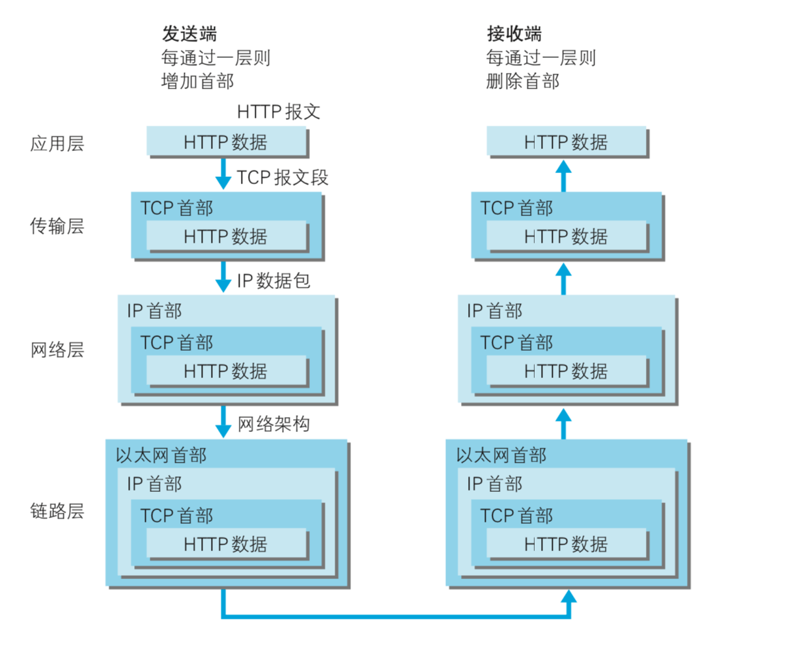
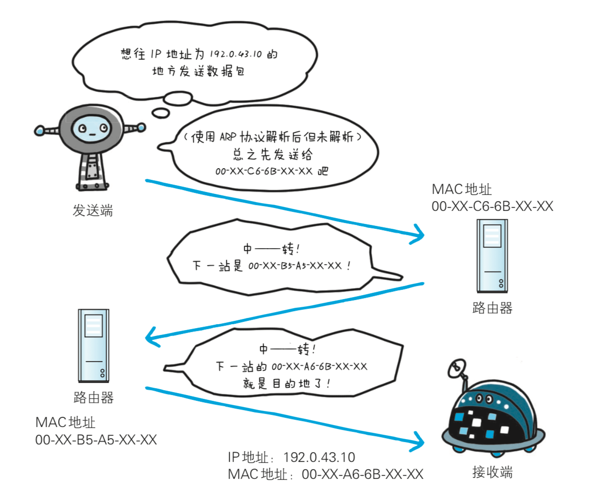
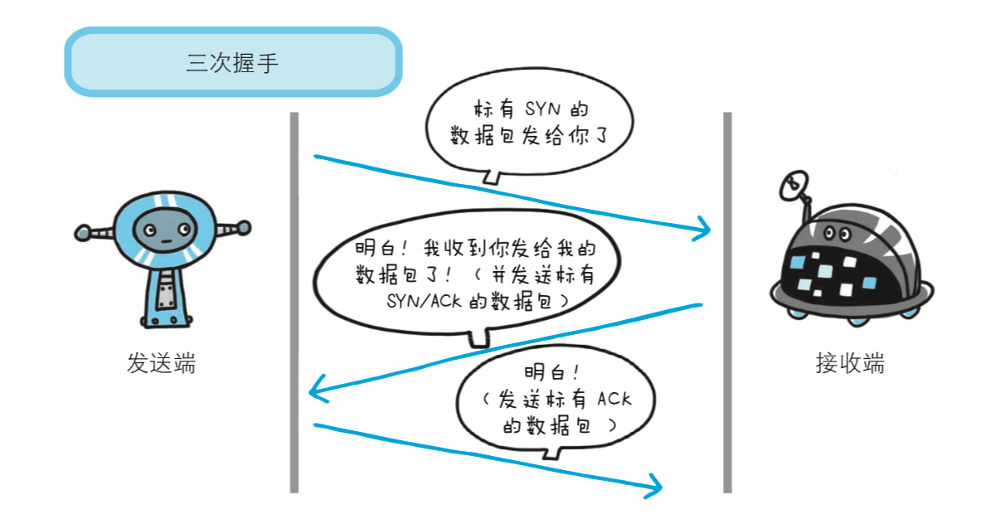
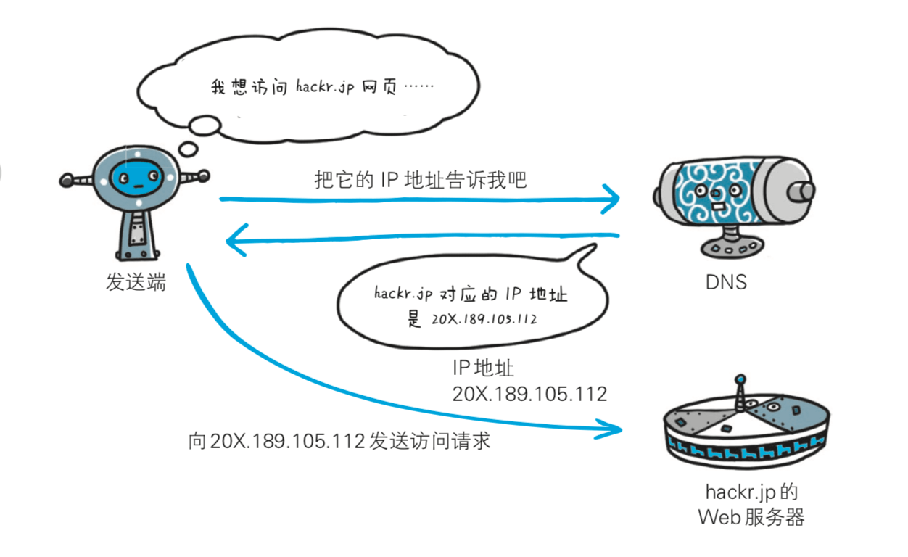
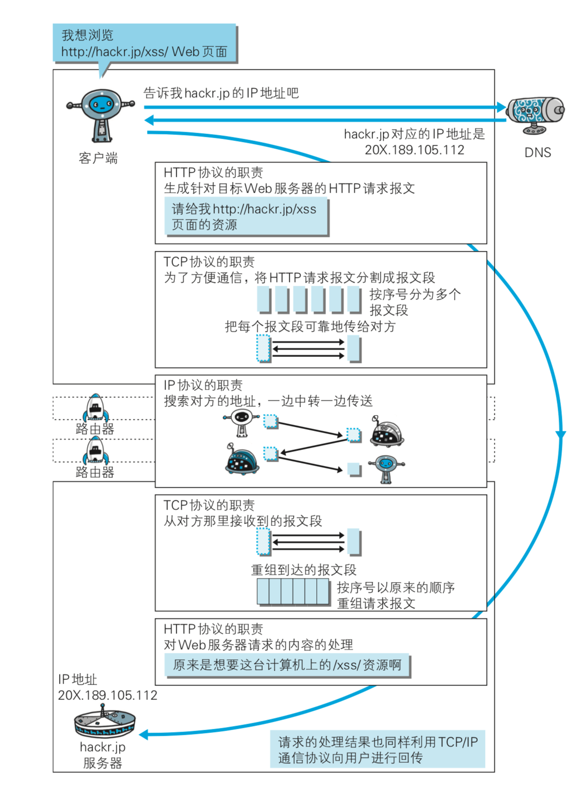
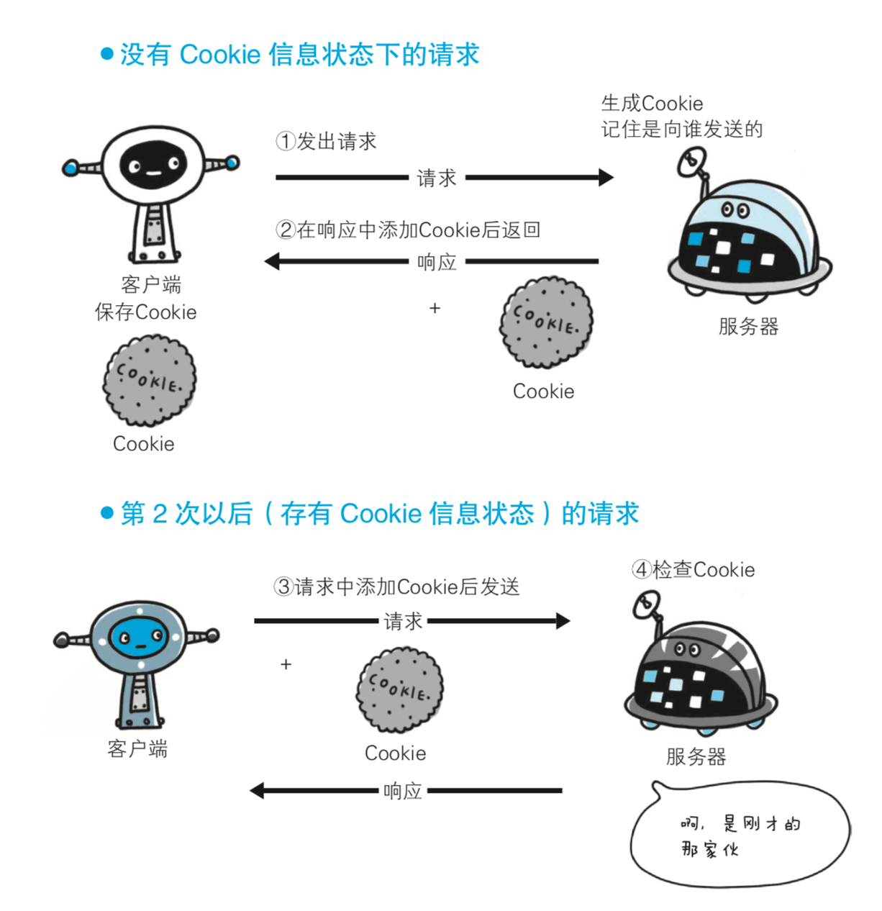
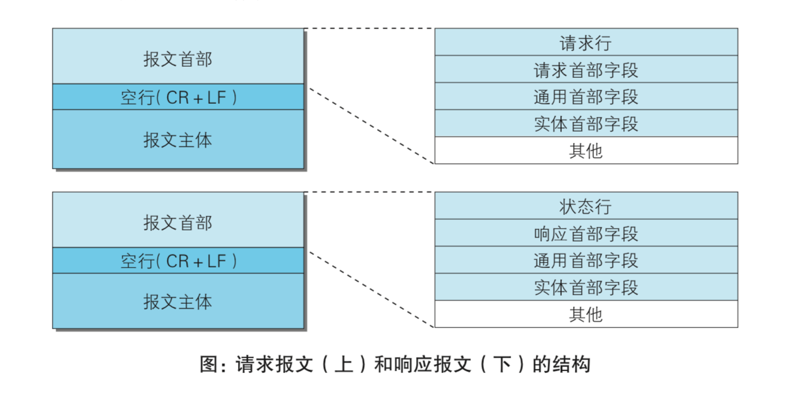
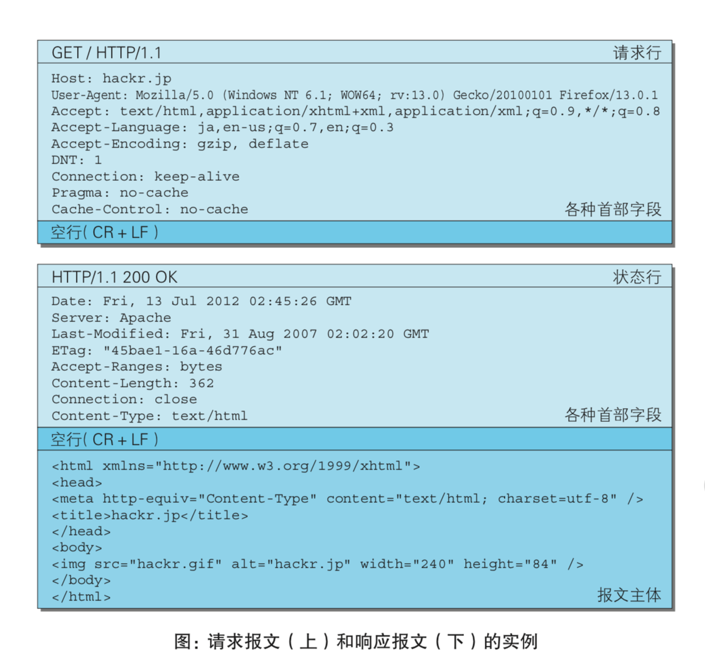
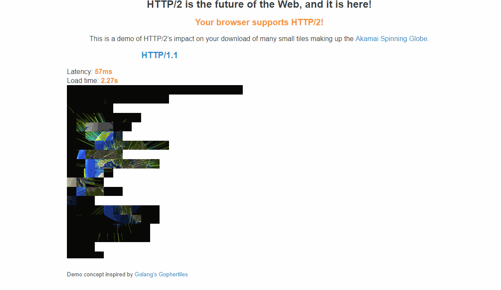

\[toc\]

## 前言

在[浏览器渲染过程及JS引擎浅析](https://www.clloz.com/programming/front-end/js/2019/04/25/how-browser-work/ "浏览器渲染过程及JS引擎浅析")这篇文章里，解答了 `在浏览器输入url回车后发生了什么` 问题中的一部分，也就是浏览器获得了服务器返回的 `html` 文档(实际可能是其他类型的资源）后的一系列行为。但是还有一部分行为并没有涉及，就是浏览器是如何和服务器通信的，以及数据是怎么传输的。在 `图解HTTP` 这本书里面很好地解答了这部分问题。

本文主要是讲网络知识，关于 `在浏览器输入url回车后发生了什么` 可以参考另一篇文章 [从URL输入到页面展现](https://www.clloz.com/programming/front-end/2018/12/05/url/ "从URL输入到页面展现")

**文章较长，主要内容是计算机网络的基础和HTTP协议**

## web 和 http 产生的背景

还是老样子，学习一个东西之前，我们先来了解以下他是为了解决什么问题而产生的，以及它是如何解决这些问题的。

## 什么是web

我们经常听到这个词，也经常说 `web` 开发，可是什么是 `web` 呢，是网页吗？我们平时见到的 `www(worldwideweb)` 和 `web` 指的是同一个东西，我们叫他万维网，是一个透过互联网访问的，由许多互相链接的超文本组成的系统，是1989年伯纳斯·李发明的。简单的说就是整个借助互联网形成访问超文本的系统构成这个所谓的 `web` 或是称作 `www`，为了在互联网上实现访问超文本设计的技术和程序都算是 `web` 系统的一部分，比如 `http` 超文本传输协议，`html` 超文本标记语言、浏览器、`web` 服务器等。而 `www(worldwideweb)` 这个名称则是来自于1990年伯纳斯·李写的世界上第一款网页浏览器和编辑器，它的名字就叫 `worldwideweb`，同时他也实现了第一个 `web` 服务器。

> 超文本的意思就是能够显示在电子设备上的包含超链接的文本（以及多媒体内容），允许从当前文本切换到超链接所指向的文字，超文本文档通过超链接互相连结。`html` 称为超文本标记语言，`http` 称为超文本传输协议，它们都是为了在 `web` 上浏览超文本产生的技术。

## 互联网、英特网和万维网

互联网 `internet` 是指凡是能彼此通信的设备组成的网络就叫互联网。英特网 `Internet` 指的是利用 `TCP/IP` 通讯协定所创建的各种网络，是国际上最大的互联网，也称“国际互联网”。万维网 `www` 是一个由许多互相链接的超文本组成的系统，通过因特网访问。在此定义下，万维网是因特网的一项服务，因特网是互联网的一种。国际互联网是互联网中的一个，也有独立于国际互联网之外的互联网，比如朝鲜的光明网。`web` 是一个依靠互联网访问超文本的系统，是互联网提供的服务之一，其他的服务比如邮件，文件共享等。

## web 产生的原因

在 `web` 产生之前，计算机和网络只是极少数人使用的，当时出现的需求是希望能够实现借助超文本在全世界研究者中间共享知识和信息的需求，伯纳斯·李为了实现这个需求构建了 `web` 的三个关键技术： 1. 超文本标记语言 `HTML` 2. 统一资源定位符 `URL` 3. 超文本传输协议 `HTTP`

## 为什么要有 http

计算机与网络设备要相互通信，双方就必须基于相同的方法。比如，如何探测到通信目标、由哪一边先发起通信、使用哪种语言进行通 信、怎样结束通信等规则都需要事先确定。不同的硬件、操作系统之间 的通信，所有的这一切都需要一种规则。而我们就把这种规则称为协议 `protocol`。协议中存在各式各样的内容。从电缆的规格到 `IP` 地址的选定方法、 寻找异地用户的方法、双方建立通信的顺序，以及 `Web` 页面显示需要 处理的步骤，等等。而 `http` 协议就是众多网络协议中的一种，它产生的目的就是为了确定 `web` 中传输超文本的具体标准，让这一共享知识的设想能够实现。

## web技术的标准化

随着 `web` 的诞生，浏览器和 `web` 服务器都开始飞速发展，浏览器方面由微软和网景齐头并进，而 `web` 服务器则由 `apache` 开疆拓土（ `apache` 如今已经成为 `web` 服务器的标准之一）。之后 `web` 技术不断的迅猛发展，并爆发了微软和网景之间的浏览器大战，两者无视标准的恶性竞争也让人们意识到 `web` 标准化的重要性，并成为了 `web` 业界一直到今天都在努力的目标。

而作为 `web` 技术中重要一环的 `http` 协议被正式标准化是在1996年，版本为 `http/1.0`，被记载于 `RFC1945`，该协议标准至今被广泛应用于 `web` 服务器。1997 年 1 月公布的 `HTTP/1.1` 是目前主流的 `HTTP` 协议版本。当初 的标准是 `RFC2068`，之后发布的修订版 `RFC2616` 就是 `HTTP/1.1` 的最新版本。 而新一代 `HTTP/2` 标准于2015年5月以 `RFC 7540` 正式发表。`HTTP/2` 的标准化工作由`Chrome`、`Opera`、`Firefox`、`Internet Explorer 11`、`Safari`、`Amazon Silk` 及`Edge` 等浏览器提供支持，多数主流浏览器已经在2015年底支持了该协议。`apache`、`nginx` 等主流web服务器也都支持新的标准，目前的主流网站都以启用新的标准。关于 `HTTP/2` 后面在讨论。

> 普通的 `HTTPS` 网站浏览会比 `HTTP` 网站稍微慢一些，因为需要处理加密任务，而配置了 `h2` 的 `HTTPS`，在低延时的情况下速度会比 `HTTP` 更快更稳定。

## 网络基础

## TCP/IP 协议族

全世界有几十亿的电脑，加上网络设备还会多出更多，它们都在同一个互联网上，也就意味着在这个网络上的任意两个设备之间都是可以通信的。比如我在上海，我的电脑的网卡发出一个信号，而你在北京的电脑就能马上收到，甚至你在太平洋彼岸的美国也可以收到，要做到这些，就必须以来上面说的各种网络协议。互联网的核心是一系列协议，总称为"互联网协议" `Internet Protocol Suite`，通常也被我们称为 `TCP/IP` 协议族。它们对电脑如何连接和组网，做出了详尽的规定。理解了这些协议，就理解了互联网是如何设计的了。

上面的背景介绍中说明了计算机和网络设备要互相通信必须要制定详细的标准，于是产生了各种各样的网络协议，`http` 只是其中的一种，不同的协议都是因为不同的需求和使用场景而定制的，从电缆的规格到 `IP` 地址的选定方法、 寻找异地用户的方法、双方建立通信的顺序，以及 `Web` 页面显示需要 处理的步骤等等，比如 `FTP` 在计算机网络上在客户端和服务器之间进行文件传输的协议，而 `SMTP` 是互联网上传输电子邮件的协议，而我们常说的 `DNS` 域名系统也是应用层的一个协议，作用是将域名和IP地址相互映射的一个分布式数据库。而之所以这些协议的集合被称为 `TCP/IP` 协议族是因为该协议家族的两个核心协议：`TCP`（传输控制协议）和 `IP`（网际协议），为该家族中最早通过的标准。整个 `TCP/IP` 协议族非常庞大和复杂，在这里我们只讨论学习 `HTTP` 需要用到的网络基础。如果你想深入学习计算机网络的知识有这三本书推荐： 1. [计算机网络-自顶向下方法](https://www.amazon.cn/dp/B07F3QKG13/ref=sr_1_2?__mk_zh_CN=%E4%BA%9A%E9%A9%AC%E9%80%8A%E7%BD%91%E7%AB%99&keywords=%E8%AE%A1%E7%AE%97%E6%9C%BA%E7%BD%91%E7%BB%9C&qid=1556717384&s=gateway&sr=8-2 "计算机网络-自顶向下方法") 2. [计算机网络](https://www.amazon.cn/dp/B007JFRQ0G/ref=sr_1_1?__mk_zh_CN=%E4%BA%9A%E9%A9%AC%E9%80%8A%E7%BD%91%E7%AB%99&keywords=%E8%AE%A1%E7%AE%97%E6%9C%BA%E7%BD%91%E7%BB%9C&qid=1556717384&s=gateway&sr=8-1 "计算机网络") 3. [TCP/IP详解](http://https://www.amazon.cn/dp/B078JFNPTM/ref=sr_1_1?__mk_zh_CN=%E4%BA%9A%E9%A9%AC%E9%80%8A%E7%BD%91%E7%AB%99&keywords=tcp%2Fip%E8%AF%A6%E8%A7%A3&qid=1556717553&s=gateway&sr=8-1 "TCP/IP详解")

## 网络分层管理

##### 为什么网络设计要分层

网络的分层大家都知道，`OSI` 七层网络模型大家都听说过，要说为什么网络设计要分层，归根结底就是为了解耦，特别是在底层涉及到很多硬件的情况下，工作在高层的技术人员不需要了解底层的硬件的工作细节。如果互联网只由一个协议统 筹，某个地方需要改变设计时，就必须把所有部分整体替换掉。而分层 之后只需把变动的层替换掉即可。把各层之间的接口部分规划好之后，每个层次内部的设计就能够自由改动了。 并且层次化之后，设计也变得相对简单了。处于应用层上的应用可以只考虑分派给自己的任务，而不需要弄清对方在地球上哪 个地方、对方的传输路线是怎样的、是否能确保传输送达等问题。分层设计的有点可以归纳为三点： 1. 各层之间相互独立：高层是不需要知道底层的功能是采取硬件技术来实现的，它只需要知道通过与底层的接口就可以获得所需要的服务； 2. 灵活性好：各层都可以采用最适当的技术来实现，例如某一层的实现技术发生了变化，用硬件代替了软件，只要这一层的功能与接口保持不变，实现技术的变化都并不会对其他各层以及整个系统的工作产生影响； 3. 易于实现和标准化：由于采取了规范的层次结构去组织网络功能与协议，因此可以将计算机网络复杂的通信过程，划分为有序的连续动作与有序的交互过程，有利于将网络复杂的通信工作过程化解为一系列可以控制和实现的功能模块，使得复杂的计算机网络系统变得易于设计，实现和标准化。

##### OSI 七层模型和 TCP/IP 四层模型

网络模型不是一开始就有的，在网络刚发展时，网络协议是由各互联网公司自己定义的，比如那时的巨头网络公司 `IBM`、微软、苹果、思科等等，他们每家公司都有自己的网络协议，各家的协议也是不能互通的，那时候大家觉得这是可以的，但对消费者来说这实际上是技术垄断，因为你买了苹果的设备就不能用微软的设备，因为他们的协议不是一样的，没有统一的标准来规范网络协议，都是这些公司的私有协议。这样大大的阻碍了互联网的发展，为了解决这个问题，国际标准化组织 1984 提出的概念模型，简称 `OSI`（`Open Systems Interconnection Model`），这是一个概念，并非实现。`TCP/IP` 协议就是基于此模型设计实现的。

`OSI` 七层模型： 1. 物理层（ `Physical Layer` ）在局部局域网上传送数据帧（ `data frame` ），它负责管理计算机通信设备和网络媒体之间的互通。包括了针脚、电压、线缆规范、集线器、中继器、网卡、主机接口卡等。 2. 数据链路层（ `Data Link Layer` ）负责网络寻址、错误侦测和改错。当表头和表尾被加至数据包时，会形成帧。数据链表头（ `DLH` ）是包含了物理地址和错误侦测及改错的方法。数据链表尾（ `DLT`）是一串指示数据包末端的字符串。例如以太网、无线局域网（ `Wi-Fi`）和通用分组无线服务（ `GPRS` ）等。 3. 网络层（ `Network Layer` ）决定数据的路径选择和转寄，将网络表头（ `NH` ）加至数据包，以形成分组。网络表头包含了网络数据。例如:网际协议（ `IP`）等。 4. 传输层（ `Transport Layer`）把传输表头（ `TH`）加至数据以形成数据包。传输表头包含了所使用的协议等发送信息。例如:传输控制协议（ `TCP`）等。 5. 会话层（ `Session Layer`）负责在数据传输中设置和维护计算机网络中两台计算机之间的通信连接。 6. 表达层（ `Presentation Layer` ）把数据转换为能与接收者的系统格式兼容并适合传输的格式。 7. 应用层（ `Application Layer` ）提供为应用软件而设的接口，以设置与另一应用软件之间的通信。例如: `HTTP`，`HTTPS`，`FTP`，`TELNET`，`SSH`，`SMTP`，`POP3`等。

> `OSI` 参考模型并没有提供一个可以实现的方法，而是描述了一些概念，用来协调进程间通信标准的制定。即`OSI` 参考模型并不是一个标准，而是一个在制定标准时所使用的概念性框架。

`TCP/IP` 四层模型 1. 应用层：网络应用程序使用的层，提供网络应用程序需要的接口，将程序中的数据包装成协议的标准格式。，对应 `OSI` 七层模型的最上面三层（会话层，表达层和应用层），如 `HTTP`，`SSH`，`FTP`，`SMTP`，`TELENT`，`POP3` 2. 传输层：提供计算机和网络设备之间的设备传输，确保数据传输的可靠和顺序。包括 `TCP` 和 `UDP`，对应 `OSI` 模型中的传输层 3. 网络层（网络互联层）：处理数据包，通过 `IP` 地址规定数据包的传输路径，并将数据从源发送到目的地。对应 `OSI` 模型中的网络层。主要协议是 `IP` 协议 4. 链路层：网络连接的硬件部分，将数据包从一个设备的网络层传输到另一个设备的网络层。包括控制操作系统、硬件设备的驱动、`NIC` 网卡，光纤，双绞线等物理可见部分。包括以太网，`wifi` 等。

> 更多模型细节可以看阮一峰的[互联网协议入门](https://www.ruanyifeng.com/blog/2012/05/internet_protocol_suite_part_i.html "互联网协议入门")

## TCP/IP 网络通信流程

当我们在浏览器中输入 `url` 请求 `web` 服务器上的 `HTML` 文档的时候，通信的过程是什么样的呢？见下图



1. 应用层浏览器将请求封装成符合 `HTTP` 协议的数据报文，将这个报文交给传输层。
2. 传输层的 `TCP` 协议将从应用层收到的 `HTTP` 报文分割成数据包的形式，并在每个数据包上打上标记和序号，然后交给网络层。
3. 网络层的 `IP` 协议给传输层传来的 `TCP` 报文段加上通信目的地的 `mac` 地址在转发给链路层。
4. 链路层将封装好的数据通过物理设备传递给目标服务器，到达目标服务器的链路层以后再将封装好的数据按照网络分层一层层解封，最终服务器上的处理程序获得 `http` 请求，并找到对应的资源按照请求发送的方式再将资源发送给客户端。

## HTTP 请求中的重要协议

在上面的`http` 请求的通信流程中，不同的层级涉及到了几个不同协议，它们都是 `HTTP` 请求中的

##### IP 协议（网际协议）

`IP` 协议 `internet protocol` 工作在网络层，它的作用是根据 `IP` 地址和 `mac` 地址规定数据包的传输路径，我们的网络上有无数台电脑，怎么选择一个合适的路线才能准确高效地进行数据包的传输是IP协议的主要目标。`IP` 地址指向一个网络，而 `mac` 地址指向一个具体的设备，一个网络中可以有很多台设备。虽然用 `mac` 地址就可以实现数据的传输，但是由于网络十分巨大，用 `mac` 地址进行广播的效率非常低下，并且会消耗网络设备上的很大的存储空间，而用 `ip` 地址进行广播不断缩小目标的范围，最后再利用 `mac` 地址定位到具体的设备是比较高效的。就像寄快递，我们从上海寄快递到北京的某个小区，在运输的过程中会有非常多的集散中心，每个集散中心的送货员不会关心最终的目的地，而是下一个集散中心选择哪个是最有效率的（比如有两个距离相同的集散中心，我们可以先打电话过去问问哪个比较不忙），随着这个过程的不断推进，我们会越来越接近我们的目的地，当快递寄到我们所属街区的集散中心以后，快递员就可以根据我们的真实地址来送货了，这当中的集散中心就像 `IP` 地址，而我们的真实住址就像 `mac` 地址一样，而且网络中的中间设备比我们想象的要多得多，没有任何一台设备能保存整个网络中所有的设备的 `mac` 地址以及线路细节，这就更需要我们利用 `ip` 缩小范围，它们工作的层级也不一样，`IP` 地址工作在网络层，`mac` 地址工作在链路层



> 每块网卡出厂的时候，都有一个全世界独一无二的 `MAC` 地址，长度是 `48` 个二进制位，通常用 `12` 个十六进制数表示，前`6` 个十六进制数是厂商编号，后 `6` 个是该厂商的网卡流水号。有了 `MAC` 地址，就可以定位网卡和数据包的路径了。

##### TCP 协议

`TCP` 协议位于传输层，提供可靠的字节流服务，`TCP` 协议会把应用层传来的 `HTTP` 报文分割成方便传输的报文段数据包，而 `TCP` 协议的关键之处在于要把分割后的数据包一个不差的准确地传输到目的地。

为了准确无误地将数据送达目标处，`TCP` 协议采用了三次握手 ( `three-way handshaking` )策略。用 `TCP` 协议把数据包送出去后，`TCP` 不会对传送后的情况置之不理，它一定会向对方确认是否成功送达。握 手过程中使用了 `TCP` 的标志( `flag` )—— `SYN` ( `synchronize` )和 `ACK` ( `acknowledgement` )。

发送端首先发送一个带 `SYN` 标志的数据包给对方。接收端收到后， 回传一个带有 `SYN/ACK` 标志的数据包以示传达确认信息。最后，发送 端再回传一个带 `ACK` 标志的数据包，代表“握手”结束。若在握手过程中某个阶段莫名中断，`TCP` 协议会再次以相同的顺序 发送相同的数据包。



##### DNS 服务

`DNS` ( `Domain Name System` )服务是和 `HTTP` 协议一样位于应用层 的协议。它提供域名到 `IP` 地址之间的解析服务。计算机既可以被赋予 `IP` 地址，也可以被赋予主机名和域名。比如 `www.clloz.com`。用户通常使用主机名或域名来访问对方的计算机，而不是直接通过 `IP` 地址访问。因为与 `IP` 地址的一组纯数字相比，用字母配合数字的表 示形式来指定计算机名更符合人类的记忆习惯。但要让计算机去理解名称，相对而言就变得困难了。因为计算机更 擅长处理一长串数字。为了解决上述的问题，`DNS` 服务应运而生。`DNS` 协议提供通过域 名查找 `IP` 地址，或逆向从 `IP` 地址反查域名的服务。



##### 多协议在http请求中的工作流程

在 `http` 请求的过程中，上述协议的完整工作流程如下：



> 关于 `URI` 和 `URL` 的区别，看我的这篇文章[从url输入到页面展现](https://www.clloz.com/programming/front-end/2018/12/05/url/ "从url输入到页面展现")。`RFC` 文件为互联网规范、协议、过程等的标准文件，由互联网工程任务组（ `IETF` ）维护。

## HTTP协议

上面的内容介绍了要学习 `HTTP` 协议的一些必备的网络基础，下面来讲一讲开发 `web` 应用面对的主要对象：`HTTP` 协议。我们的 `web` 开发主要是都是在应用层，但是理解应用层之下的网络传输过程对我们的开发也是很有用处的，现在前端也需要掌握后端的技能，特别是如果我们要接触 `web` 服务器以及后端开发的时候，计算机网络的知识储备是非常重要的。

其实刨开应用层底层之下的网络知识，单纯讨论工作在应用层的 `HTTP` 协议是非常简单的，`HTTP` 协议用于客户端和服务器之间的通信，常见的客户端主要就是浏览器，而常见的服务器就是 `web` 服务器，比如`apache`，`nginx`，`IIS`。发起请求的一端为客户端，而响应请求的一端为服务器。两台计算机之间使用 `HTTP` 协议通信时，必然有一端是客户端，一端是服务器。`HTTP` 协议能够区分哪端是发起请求的客户端，哪一端是响应请求的服务器。请求必然从客户端发起，经过传递后到达服务器，最后服务器响应请求并返回。也就是只有客户端可以主动联系服务器，但是服务器是无法主动联系客户端的。

> `HTTP` 协议是一个文本型协议（和二进制协议相对），文本型协议意味着所有的内容都是字符串。比如我们要传一个 `1`，不是传一个 `1` 的 `bit` 或者一个字节，而是传一个 `Unicode` 的编码。`HTTP` 协议在 `TCP` 协议的上层，所以我们可以所有流淌在 `TCP` 协议中的流的所有内容都可以视为字符。`TCP` 传的是流，`IP` 传的是包，所谓 `流` 就是没有明显分割单位的事物，唯一能够确定的就是先后顺序，比如水流，字节流。

## HTTP 协议不保存状态

`HTTP` 协议无状态的意思是对于客户端和服务器，只有当前正在进行的请求是有意义的，任何已经结束的请求或响应都不会在客户端和服务器上留下记录，也就是 `HTTP` 协议不会对发送过的请求或响应做持久化处理。正是因为这种简单化的设计，`HTTP` 协议能够快速地处理大量事务。但是随着web的不断发展，`HTTP` 协议的无状态设计在面对一些问题的时候无法很好地解决，比如我们登录了一个购物网站，那么当我们跳转到该网站的其他页面的时候我们也应该保持登录状态，为了实现这种保持状态的功能， `HTTP` 协议引入了 `Cookie` 技术。

## HTTP协议中的请求方法

| 方法 | 说明 | 支持的 HTTP 协议版本 |
| --- | --- | --- |
| GET | GET请求会显示请求指定的资源。一般来说GET方法应该只用于数据的读取，而不应当用于会产生副作用的非幂等的操作中。它期望的应该是而且应该是安全的和幂等的。这里的安全指的是，请求不会影响到资源的状态。 | 1.0、1.1 |
| POST | POST请求会 向指定资源提交数据，请求服务器进行处理，如：表单数据提交、文件上传等，请求数据会被包含在请求体中。POST方法是非幂等的方法，因为这个请求可能会创建新的资源或/和修改现有资源。 | 1.0、1.1 |
| PUT | PUT请求会身向指定资源位置上传其最新内容，PUT方法是幂等的方法。通过该方法客户端可以将指定资源的最新数据传送给服务器取代指定的资源的内容。 | 1.0、1.1 |
| HEAD | HEAD方法与GET方法一样，都是向服务器发出指定资源的请求。但是，服务器在响应HEAD请求时不会回传资源的内容部分，即：响应主体。这样，我们可以不传输全部内容的情况下，就可以获取服务器的响应头信息。HEAD方法常被用于客户端查看服务器的性能。 | 1.0、1.1 |
| DELETE | DELETE请求用于请求服务器删除所请求URI（统一资源标识符，Uniform Resource Identifier）所标识的资源。DELETE请求后指定资源会被删除，DELETE方法也是幂等的。 | 1.0、1.1 |
| OPTIONS | OPTIONS请求与HEAD类似，一般也是用于客户端查看服务器的性能。 这个方法会请求服务器返回该资源所支持的所有HTTP请求方法，该方法会用'\*'来代替资源名称，向服务器发送OPTIONS请求，可以测试服务器功能是否正常。JavaScript的XMLHttpRequest对象进行CORS跨域资源共享时，就是使用OPTIONS方法发送嗅探请求，以判断是否有对指定资源的访问权限。 | 1.1 |
| TRACE | TRACE请求服务器回显其收到的请求信息，该方法主要用于HTTP请求的测试或诊断。 | 1.1 |
| CONNECT | CONNECT方法是HTTP/1.1协议预留的，能够将连接改为管道方式的代理服务器。通常用于SSL加密服务器的链接与非加密的HTTP代理服务器的通信。 | 1.1 |

> 1. 幂等：对同一个系统，使用同样的条件，一次请求和重复的多次请求对系统资源的影响是一致的。
> 2. `PUT` 和 `DELETE` 方法在 `HTTP/1.1` 中不带验证机制，任何人都可以上传或删除文件 , 存在安全性问题，因此一般的 `Web` 网站不使用该方法。
> 3. `http` 协议报文中的内容都是区分大小写的，所有不区分大小写的情况都是环境做的兼容，也就是我们的请求方法应该是都要大写的。

## GET 和 POST 的区别

1. 在 `HTTP` 协议标准中，`GET` 的语义是请求获取指定的资源，`GET` 方法是安全、幂等、可缓存的（除非有 `Cache-ControlHeader`的约束）,`GET` 方法的报文主体没有任何语义。`POST` 的语义是根据请求负荷（报文主体）对指定的资源做出处理，具体的处理方式视资源类型而不同。`POST` 不安全，不幂等，（大部分实现）不可缓存。对于 `GET` 请求，在参数相同的情况下，多次请求和一次请求获取的都是相同的资源，并且不会对服务器上的资源产生影响。而 `POST` 请求传输实体，会对服务器上的资源产生副作用。比如微博的获取最新的十篇微博就适用于 `GET` 方法，而发微博，评论则适用于 `POST` 方法。
2. 在实际的浏览器环境中，`GET` 和 `POST` 有如下几点区别：
    
    - 浏览器对 `URL` 的长度有限制（ `URL` 的最大长度是 `2048` 个字符），所以 `GET` 请求不能代替 `POST` 请求发送大量数据；
    - `HTML` 标准规定 `GET` 使用 `URL` 或 `Cookie` 传参，而 `POST` 将数据放在 `BODY` 中；
    - `POST` 比 `GET` 安全，因为数据在地址栏上不可见

## 持久连接

`HTTP` 协议的初始版本中，每进行一次 `HTTP` 通信就要断开一次 `TCP` 连接。以当年的通信情况来说，因为都是些容量很小的文本传输，所以即 使这样也没有多大问题。可随着 `HTTP` 的普及，文档中包含大量图片的 情况多了起来。比如，使用浏览器浏览一个包含多张图片的 `HTML` 页面时，在发 送请求访问 `HTML` 页面资源的同时，也会请求该 `HTML` 页面里包含的 其他资源。因此，每次的请求都会造成无谓的 `TCP` 连接建立和断开， 增加通信量的开销。

为解决上述 `TCP` 连接的问题，`HTTP/1.1` 和一部分的 `HTTP/1.0` 想出 了持久连接( `HTTP Persistent Connections`，也称为 `HTTP keep-alive` 或 `HTTP connection reuse` )的方法。持久连接的特点是，只要任意一端没 有明确提出断开连接，则保持 `TCP` 连接状态。持久连接的好处在于减少了 `TCP` 连接的重复建立和断开所造成的 额外开销，减轻了服务器端的负载。另外，减少开销的那部分时间，使 HTTP 请求和响应能够更早地结束，这样 `Web` 页面的显示速度也就相应 提高了。

在 `HTTP/1.1` 中，所有的连接默认都是持久连接，但在 `HTTP/1.0` 内 并未标准化。虽然有一部分服务器通过非标准的手段实现了持久连接，但服务器端不一定能够支持持久连接。毫无疑问，除了服务器端，客户 端也需要支持持久连接。

持久连接使得多数请求以管线化( `pipelining` )方式发送成为可能。 从前发送请求后需等待并收到响应，才能发送下一个请求。管线化技术 出现后，不用等待响应亦可直接发送下一个请求。这样就能够做到同时并行发送多个请求，而不需要一个接一个地等 待响应了。比如，当请求一个包含 10 张图片的 `HTML Web` 页面，与挨个连接 相比，用持久连接可以让请求更快结束。而管线化技术则比持久连接还 要快。请求数越多，时间差就越明显。


## Cookie 管理状态

`HTTP` 协议是无状态的，无状态的优点是可以减少服务器的 `CPU` 和内存资源消耗，正是因为 `HTTP` 协议本身是非常简单的，所以才会被应用在各种场景里。但是如今的 `web` 应用已经有越来越多的状态保存需求，于是引入了 `Cookie` 技术，通过在请求和响应报文中写入 `Cookie` 信 息来控制客户端的状态。

`Cookie` 会根据从服务器端发送的响应报文内的一个叫做 `Set-Cookie` 的首部字段信息，通知客户端保存 `Cookie`。当下次客户端再往该服务器发送请求时，客户端会自动在请求报文中加入 `Cookie` 值后发送出去。服务器端发现客户端发送过来的 `Cookie` 后，会去检查究竟是从哪一个客户端发来的连接请求，然后对比服务器上的记录，最后得到之前的状态信息。



## HTTP 报文

我们的请求或响应数据会被客户端按照 `HTTP` 协议的标准封装成符合标准的 `HTTP` 报文再传递给传输层进行处理。我们平时在浏览器开发者工具中看到的 `Request Header` 等信息就是 `HTTP` 报文中的内容。有客户端发出的 `HTTP` 报文叫做请求报文，而服务器发出的 `HTTP` 报文叫做响应报文。`HTTP` 报文本身是由多行(用 `CR+LF` 作换行符)数据构成的字符串文本。

`HTTP` 报文大致可分为报文首部和报文主体两块。两者由最初出现 的空行( `CR+LF` )来划分。通常，并不一定要有报文主体。

> `CR` 对应 `ASCII` 码中的 `13`，表示 `Carriage Return` 回车符，`LF` 对应 `ASCII` 码中的 `10`，对应 `Line Feed` 空格符。





请求报文和响应报文的首部内容由以下数据组成: 1. 请求行:包含用于请求的方法，请求 `URI` 和 `HTTP` 版本。 2. 状态行:包含表明响应结果的状态码，原因短语和 `HTTP` 版本。 3. 首部字段:包含表示请求和响应的各种条件和属性的各类首部。一般有 4 种首部，分别是:通用首部、请求首部、响应首部和实体 首部。 4. 其他:可能包含 `HTTP` 的 `RFC` 里未定义的首部(`Cookie` 等)。

> 报文 `message` 主体也叫做实体 `entity` 主体，实体包括实体首部和实体主体。实体会在传输前被压缩，达到客户端的时候再解压。

## HTTP 状态码

状态码是 `web` 开发中经常需要面对的，比如 `JS` 原生 `ajax` 请求的回调函数就需要用到状态码：

```javascript
var xhr = new XMLHttpRequest();
xhr.open(type, url, true);
xhr.onload = function() {
   if ((xhr.status >= 200 && xhr.status < 300) || xhr.status == 304) {
     onsuccess(xhr.responseText);
   } else {
     onerror();
   }
};
```

其中的 `xhr.status` 就是返回的状态码。`HTTP` 协议中，`HTTP` 状态码负责表示客户端 `HTTP` 请求的返回结果、标记服务器 端的处理是否正常、通知出现的错误等工作。状态码分类如下：

| 状态码 | 类别 | 原因短语 |
| --- | --- | --- |
| 1XX | Informational(信息性状态码) | 接收的请求正在处理 |
| 2XX | Success(成功状态码) | 请求正常处理完毕 |
| 3XX | Redirection(重定向状态码) | 需要进行附加操作以完成请求 |
| 4XX | Client Error(客户端错误状态码) | 服务器无法处理请求 |
| 5XX | Server Error(服务器错误状态码) | 服务器处理请求出错 |

## 200 OK

是我们最常遇到的状态码，表示客户端的请求已经被服务器正常处理了。根据请求的方法不同，返回的内容也不同，比如使用 `GET` 方法请求时，对应的请求资源会作为报文实体返回给客户端；而使用 `HEAD` 方法请求时只返回请求资源的实体首部，而实体主体（也就是报文主体）不会返回。

## 204 No Content

表示服务器接收的请求已成功处理，但在返回的响应报文中不包含实体的部分。一般用在只需要给服务器发送信息但不需要在客户端更新页面的时候使用。比如在 `PUT` 请求中进行资源更新，但是不需要改变当前展示给用户的页面，那么返回 `204 No Content`。如果新创建了资源，那么返回 `201 Created` 。如果页面需要更新以反映更新后的资源，那么需要返回 `200` 。`204` 响应默认是可以被缓存的。在响应中需要包含头信息 `ETag`。

## 206 Partical Content

该状态码表示客户端只请求了某个资源的一部分，比如客户端的HTTP报文首部有 `Range: bytes=5001-10000` 就意味着它只想请求对应资源的第 5001 字节至第 10000 字节的内容。服务器成功执行该请求后会返回状态码 `206 Partical Content`，响应报文中会包含指定的实体内容。

## 301 Moved Permarnently

永久重定向。当请求的资源已经被分配到新的 `URL` ，比如网站更换了域名，对应网站的 `web` 服务器配置了 `301` 重定向到新的域名，这时候我们用原来的域名访问网站就会返回 `301`，然后重定向到新的域名。

## 302 Found

和 `301` 类似，不同的是 `302` 的意思是网站资源被临时转移，所以这个重定下是临时的，只有本次请求生效，当你下次访问资源的时候还按原来的地址请求即可。

## 303 See Other

`303` 是 `HTTP/1.1` 中新加入的状态码，因为在 `RFC1945` 和 `RFC2068` 规范中，`302` 状态码是不允许客户端在重定向的时候更改请求方法的，比如你是用 `POST` 请求给服务器的程序接口发送数据，那么不能自动的向新的 `URI` 发送重复请求，必须跟用户确认是否该重发，因为第二次 `POST` 时，环境可能已经发生变化（ `POST` 请求不是幂等的）。为了应对这种情况添加了 `303` 状态码，当服务器对 `POST` 请求返回 `303` 状态码时，客户端直接用 `GET` 方法重定向到新的 `URI` 即可，而不需要询问用户。其实在标准制定之前，大部分浏览器就是按照 `303` 的方式来处理 `302` 状态码的

> 当 `301`、`302`、`303` 响应状态码返回时，几乎所有的浏览器都会把 `POST` 改成 `GET`，并删除请求报文内的主体，之后请求会自动再次发送。`301`、`302` 标准是禁止将 `POST` 方法改变成 `GET` 方法的，但实际使用时大家都会这么做。

## 304 Not Modified

当客户端发送附带条件的安全请求（采用 `GET` 或者 `HEAD` 方法的请求报文中包含 `If-Match`，`If-Modified- Since`，`If-None-Match`，`If-Range`，`If-Unmodified-Since` 中任一首部）时，服务器端允许请求访问资源，但因发生请求未满足条件的情况后，直接返回 `304 Not Modified` (服务器端资源未改变，可直接使用客户端未过期的缓存)。 `304` 状态码返回时，不包含任何响应的主体部分。`304` 虽然被划分在 `3XX` 类别中，但是和重定向没有关系。

## 307 Temporary Redirect

`307` 和 `303` 是配套产生的，它们将 `302` 的细分为了更换请求方法和不更换请求方法两种，`303` 会强制要求客户端用GET方法重定向，而 `307` 则是对于 `POST` 请求的重定向还是使用 `POST` 方法请求。 1. `303` :对于 `POST` 请求，它表示请求已经被处理，客户端可以接着使用 `GET` 方法去请求 `Location` 里的URI。 2. `307` ：对于 `POST` 请求，表示请求还没有被处理，客户端应该向 `Location`里的 `URI` 重新发起 `POST` 请求。

> 虽然标准中规定了 `302` 的细分 `303` 和 `307`，但是在浏览器的实现上把 `302` 实现成了标准中的 `303`，而且标准现在也妥协了，允许了浏览器的这种实现。2014 年 6 月的 `RFC 7231` 中，修改了对 `302` 的定义：`The user agent MAY use the Location field value for automatic redirection.`，原来这里是 `must not`。

## 400 Bad Request

该状态码表示请求报文中存在语法错误。当错误发生时，需修改请求 的内容后再次发送请求。另外，浏览器会像 `200 OK` 一样对待该状态码。

## 401 Unauthorized

该状态码表示发送的请求需要有通过 `HTTP` 认证( `BASIC` 认证、 `DIGEST` 认证)的认证信息。另外若之前已进行过 `1` 次请求，则表示用 户认证失败。返回含有 `401` 的响应必须包含一个适用于被请求资源的 `WWW- Authenticate` 首部用以质询( `challenge` )用户信息。当浏览器初次接收 到 `401` 响应，会弹出认证用的对话窗口。这个状态类似于 `403`， 但是在该情况下，依然可以进行身份验证。

## 403 Forbidden

该状态码表明对请求资源的访问被服务器拒绝了。服务器端没有必 要给出拒绝的详细理由，但如果想作说明的话，可以在实体的主体部分 对原因进行描述，这样就能让用户看到了。未获得文件系统的访问授权，访问权限出现某些问题(从未授权的 发送源 `IP` 地址试图访问)等列举的情况都可能是发生 `403` 的原因。

## 404 Not Found

该状态码表明服务器上无法找到请求的资源。除此之外，也可以在 服务器端拒绝请求且不想说明理由时使用。

## 500 Internal Server Error

该状态码表明服务器端在执行请求时发生了错误。也有可能是 `Web` 应用存在的 `bug` 或某些临时的故障。

## 503 Service Unavailable

该状态码表明服务器暂时处于超负载或正在进行停机维护，现在无 法处理请求。如果事先得知解除以上状况需要的时间，最好写入 `Retry- After` 首部字段再返回给客户端。

> 不少返回的状态码响应都是错误的，但是用户可能察觉不到这点。比 如 `Web` 应用程序内部发生错误，状态码依然返回 `200 OK`，这种情况也经常遇到。

## HTTP首部

`HTTP` 首部是我们在 `web` 开发中了解请求和响应最重要的部分，能够读懂报文的首部才能处理好请求和响应。前面的内容我们已经看到了 `HTTP` 报文的结构，其中在开发中最重要的就是报文的首部，首部中包含了为客户端和服务器分别处理请求和响应提供的所需要的信息比如主体大小、所使用 的语言、认证信息等内容。通过首部中字段的值，我们能了解这次请求或者响应的细节，以及采取对应的处理方式。同样的，对于有特定的需求的请求我们也可以通过改变封装报文的头部来传达给服务器。这一节就着重讨论 `HTTP` 首部中的重要字段，根据实际用途被分为四种类型： 1. 通用首部字段( `General Header Fields` )：请求报文和响应报文两方都会使用的首部。 2. 请求首部字段( `Request Header Fields` )：从客户端向服务器端发送请求报文时使用的首部。补充了请求的附 加内容、客户端信息、响应内容相关优先级等信息。 3. 响应首部字段( `Response Header Fields` )：从服务器端向客户端返回响应报文时使用的首部。补充了响应的附 加内容，也会要求客户端附加额外的内容信息。 4. 实体首部字段( `Entity Header Fields` )：针对请求报文和响应报文的实体部分使用的首部。补充了资源内容 更新时间等与实体有关的信息。

`HTTP` 首部字段是由首部字段名和字段值构成的，中间用冒号“:” 分隔。：`首部字段名: 字段值`。

例如，在 `HTTP` 首部中以 `Content-Type` 这个字段来表示报文主体的媒体对象类型。`Content-Type: text/html` 首部字段名为 `Content-Type`，字符串 `text/html` 是字段值。

字段值对应单个 `HTTP` 首部字段可以有多个值 `Keep-Alive: timeout=15, max=100`.

`HTTP` 首部字段将定义成缓存代理和非缓存代理的行为，分成 2 种类型。 1. 端到端首部( `End-to-end Header` ) ：分在此类别中的首部会转发给请求 / 响应对应的最终接收目标，且 必须保存在由缓存生成的响应中，另外规定它必须被转发。 2. 逐跳首部( `Hop-by-hop Header` ) ：分在此类别中的首部只对单次转发有效，会因通过缓存或代理而不 再转发。`HTTP/1.1` 和之后版本中，如果要使用 `hop-by-hop` 首部， 需要在 `Connection` 字段中写入。`HTTP/1.1` 一共提供了8个逐条首部的字段`Connection`，`Keep-Alive`，`Proxy-Authenticate`，`Proxy-Authorization`，`Trailer`，`TE`，`Transfer-Encoding`，`Upgrade`。

> 当 `HTTP` 报文首部中出现了两个或两个以上具有相同首部字段名时会 怎么样?这种情况在规范内尚未明确，根据浏览器内部处理逻辑的不同， 结果可能并不一致。有些浏览器会优先处理第一次出现的首部字段，而有 些则会优先处理最后出现的首部字段。

## 通用首部字段

| 首部字段名 | 说明 |
| --- | --- |
| Cache-Control | 控制缓存的行为 |
| Connection | 逐跳首部、连接的管理 |
| Date | 创建报文的日期时间 |
| Pragma | 报文指令 |
| Trailer | 报文末端的首部一览 |
| Transfer-Encoding | 指定报文主体的传输编码方式 |
| Upgrade | 升级为其他协议 |
| Via | 代理服务器的相关信息 |
| Warning | 错误通知 |

## 请求首部字段

| 首部字段名 | 说明 |
| --- | --- |
| Accept | 用户代理可处理的媒体类型 |
| Accept-Charset | 优先的字符集 |
| Accept-Encoding | 优先的内容编码 |
| Accept-Language | 优先的语言(自然语言) |
| Authorization | Web 认证信息 |
| Expect | 期待服务器的特定行为 |
| From | 用户的电子邮箱地址 |
| Host | 请求资源所在服务器 |
| If-Match | 比较实体标记(ETag) |
| If-Modified-Since | 比较资源的更新时间 |
| If-None-Match | 比较实体标记(与 If-Match 相反) |
| If-Range | 资源未更新时发送实体 Byte 的范围请求 |
| If-Unmodified-Since | 比较资源的更新时间(与 If-Modified-Since 相反) |
| Max-Forwards | 最大传输逐跳数 |
| Proxy-Authorization | 代理服务器要求客户端的认证信息 |
| Range | 实体的字节范围请求 |
| Referer | 对请求中 URI 的原始获取方 |
| TE | 传输编码的优先级 |
| User-Agent | HTTP 客户端程序的信息 |

## 响应首部字段

| 首部字段名 | 说明 |
| --- | --- |
| Accept-Ranges | 是否接受字节范围请求 |
| Age | 推算资源创建经过时间 |
| ETag | 资源的匹配信息 |
| Location | 令客户端重定向至指定 URI |
| Proxy-Authenticate | 代理服务器对客户端的认证信息 |
| Retry-After | 对再次发起请求的时机要求 |
| Server | HTTP 服务器的安装信息 |
| Vary | 代理服务器缓存的管理信息 |
| WWW-Authenticate | 服务器对客户端的认证信息 |

## 实体首部字段

| 首部字段名 | 说明 |
| --- | --- |
| Allow | 资源可支持的 HTTP 方法 |
| Content-Encoding | 实体主体适用的编码方式 |
| Content-Language | 实体主体的自然语言 |
| Content-Length | 实体主体的大小(单位 :字节) |
| Content-Location | 替代对应资源的 URI |
| Content-MD5 | 实体主体的报文摘要 |
| Content-Range | 实体主体的位置范围 |
| Content-Type | 实体主体的媒体类型 |
| Expires | 实体主体过期的日期时间 |
| Last-Modified | 资源的最后修改日期时间 |

## Cookie 服务的首部字段

管理服务器与客户端之间状态的 `Cookie`，虽然没有被编入标准化 `HTTP/1.1` 的 `RFC2616` 中，但在 `Web` 网站方面得到了广泛的应用。

`Cookie` 的工作机制是用户识别及状态管理。`Web` 网站为了管理用户 的状态会通过 `Web` 浏览器，把一些数据临时写入用户的计算机内。接着当用户访问该 `Web` 网站时，可通过通信方式取回之前存放的 `Cookie`。调用 `Cookie` 时，由于可校验 `Cookie` 的有效期，以及发送方的域、 路径、协议等信息，所以正规发布的 `Cookie` 内的数据不会因来自其他 `Web` 站点和攻击者的攻击而泄露。

不仅服务器可以设置 `cookie` 传给客户端，客户端也可以设置 `cookie` 在 `HTTP` 报文中传递给服务器。

| 首部字段名 | 说明 | 首部类型 |
| --- | --- | --- |
| Set-Cookie | 开始状态管理所使用的 Cookie 信息 | 响应首部字段 |
| Cookie | 服务器接收到的 Cookie 信息 | 请求首部字段 |

`Set-Cookie` 字段：`Set-Cookie: status=enable; expires=Tue, 05 Jul 2011 07:26:31 GMT; path=/; domain=clloz.com;`

| 属性 | 说明 |
| --- | --- |
| NAME=VALUE | 赋予 Cookie 的名称和其值(必需项) |
| expires=DATE | Cookie 的有效期(若不明确指定则默认为浏览器关闭前为止) |
| path=PATH | 将服务器上的文件目录作为 Cookie 的适用对象(若不指定则 默认为文档所在的文件目录) |
| domain= 域名 | 作为 Cookie 适用对象的域名(若不指定则默认为创建 Cookie 的服务器的域名) |
| Secure | 仅在 HTTPS 安全通信时才会发送 Cookie |
| HttpOnly | 加以限制，使 Cookie 不能被 JavaScript 脚本访问 |

## 其他首部字段

##### X-Frame-Options

`HTTP` 响应首部，用于控制网站内容在其他 `Web` 网站的 `Frame` 标签内的显示问题。其主要目的是为了防止点击劫持( `clickjacking` )攻击。`DENY` :拒绝；`SAMEORIGIN` :仅同源域名下的页面( `Top-level-browsing-context` )匹配时许可。( 比如，当指定 `http://clloz.com/index.html` 页面为 `SAMEORIGIN` 时，那么 `clloz.com` 上所有页面的 `frame` 都被允许可加载该页面，而 `example.com` 等其他域名的页面就不行了)。

所有主流浏览器都支持这个字段，我们也可以在 `web` 服务器中设置 `X-Frame-Options` 的默认值，比如在 `apache2` 中写入如下配置。

```shell
<IfModule mod_headers.c>
     Header append X-FRAME-OPTIONS "SAMEORIGIN"
</IfModule>
```

##### X-XSS-Protection

首部字段 `X-XSS-Protection` 属于 `HTTP` 响应首部，它是针对跨站脚本攻击( `XSS` )的一种对策，用于控制浏览器 `XSS` 防护机制的开关。首部字段 `X-XSS-Protection` 可指定的字段值如下。 1. 0 :将 XSS 过滤设置成无效状态 2. 1 :将 XSS 过滤设置成有效状态

## HTTP 的瓶颈

现在无论是我们浏览网页还是用 `app` 订餐，都会大量使用 `HTTP` 协议，如今开发的接入互联网的软件大多都使用了 `HTTP` 协议，为什么 `HTTP` 协议为什么受欢迎呢。从底层来考虑的话，不同的协议在访问计算机或网络设备的时候需要通过不同的接口，如果你安装的应用使用的协议是当前设备上防火墙关闭的，那么你必须修改防火墙设置，而大部分用户不会特地去修改。在互联网功能中使用者最多的就是 `Web` ，不管你懂不懂电脑，你都会用浏览器浏览网页，所以绝大部分计算机或者网络设备都开放了Web访问的接口，`Web` 是基于 `HTTP` 协议运作 的，因此在构建 `Web` 服务器或访问 `Web` 站点时，需事先设置防火墙 `HTTP(80/tcp)` 和 `HTTPS(443/tcp)` 的权限。大部分设备的 `80` 和 `443` 端口都是打开的，正是因为这一接入的优势使得大家开发应用的时候会选择 `HTTP` ，因为不再需要用户特地去修改防火墙设置，并且浏览器作为 `HTTP` 的客户端之一，可以说是全世界安装得最多的应用之一， `HTTP` 的服务器已经具有相当规模，也让 `HTTP` 更加有优势。

但是，正是由于 `HTTP` 的使用者越来越多，凸显出当前 `HTTP` 标准中的许多不足。比如如今有很多 `SNS` 网站，数以千万记的用户在网站上发布自己的内容，服务器在短时间内就会发生非常多的资源更新，但是HTTP却无法及时把这些更新显示到客户端，因为服务器是无法主动和客户端通信的，必须频繁地通过客户端发起请求询问服务器是否有更新，相信做过前端开发的同学都遇到过这种情况，如果有更新还好，可是如果没有更新，那么这次请求就是浪费了。虽然2005年的 `AJAX` 技术让我们可以做到局部刷新页面了，但是对于访问量众多的大型应用来说，这依然不是一个好的解决办法。

HTTP的瓶颈可以总结为以下几点： 1. 一条连接上只可发送一个请求。 2. 请求只能从客户端开始。客户端不可以接收除响应以外的指令。 3. 请求 / 响应首部未经压缩就发送。首部信息越多延迟越大。 4. 发送冗长的首部。每次互相发送相同的首部造成的浪费较多。 5. 可任意选择数据压缩格式。非强制压缩发送。

## HTTP/2

为了消除`HTTP`瓶颈，`Google`在2010年首次作出了尝试，在 `HTTP` 和 `SSL` 之间加入了一个会话层，实现了一个 `TCP` 连接可以无限制地处理多个 `HTTP` 请求，所有的请求都在一次 `TCP` 连接上完成，并且支持给这些请求设置优先级。`SPDY` 压缩了 `HTTP` 首部，这样 `HTTP` 通信产生的数据包能够变得更小更少。`SPDY` 同时也支持服务器主动推送消息给客户端，不必等待客户端的请求。

于1999年制定的 `HTTP/1.1` 显然已经无法适应今天的 `Web`，下一代 `HTTP` 协议的标准呼之欲出。在SPDY和 `WebScoket` 等技术的基础上，`HTTP/2` 的首个草稿在2012年完成，内容基本和 `SPDY` 相同。`HTTP/2` 标准于2015年5月以 `RFC 7540` 正式发表。如今大多数浏览器和 `web` 服务器都支持 `HTTP/2`，同样标准也在一直向前推进，大部分网站以及启用 `HTTP/2` 标准。`HTTP/2` 带来的提升可以看[http2.akamai.com/demo](http2.akamai.com/demo "http2.akamai.com/demo")，这里的地球图片是用361块小图片拼接而成，两边分别是用 `HTTP/1.1` 和 `HTTP/2` 进行请求，可以看出速度差距很大。



## 总结

由于网络的内容太多，文章已经太长了，本来想加在本文中的 `HTTPS` 和 `Web` 安全的内容只能写到另一篇文章中了。这篇文章结合[浏览器渲染过程及JS引擎浅析](https://www.clloz.com/programming/front-end/js/2019/04/25/how-browser-work/ "浏览器渲染过程及JS引擎浅析")，我们已经能够清晰地了解从浏览器发送HTTP请求给服务器到服务器返回文档，再到浏览器接收到文档进行渲染，最后我们能够看到渲染好的画面的过程，也就可以回答从输入 `URL` 到页面展示中间发生了什么，两篇文章都非常长，因为内容真的很多，可能也有一些不正确和表述的不好的地方，欢迎指出问题，或者有遗漏的细节也欢迎讨论。

## 参考文章

1. [网络七层模型与四层模型区别](https://juejin.im/post/59a0472f5188251240632f92 "网络七层模型与四层模型区别")
2. [互联网协议套件](https://zh.wikipedia.org/wiki/TCP/IP%E5%8D%8F%E8%AE%AE%E6%97%8F "互联网协议套件")
3. [万维网](https://zh.wikipedia.org/zh-hans/%E4%B8%87%E7%BB%B4%E7%BD%91 "万维网")
4. [互联网协议入门](https://www.ruanyifeng.com/blog/2012/05/internet_protocol_suite_part_i.html "互联网协议入门")
5. [HTTP请求方法详解](https://juejin.im/entry/5b004085f265da0b886daf7c "HTTP请求方法详解")
6. [GET和POST的区别](https://segmentfault.com/a/1190000004014583 "GET和POST的区别")
7. [完整一次HTTP请求响应过程](https://juejin.im/post/5b10be81518825139e0d8160 "完整一次HTTP请求响应过程")
8. [HTTP状态码302，303和307](https://www.cnblogs.com/cswuyg/p/3871976.html "HTTP状态码302，303和307")