\[toc\]

## 前言

在上一篇介绍 `HTTP` 的文章中，我们了解了 `HTTP` 协议在通信过程中的细节，但是其实 `HTTP` 除了我们说的一些性能瓶颈之外，还有一些安全性的问题。

## HTTP 的安全性问题

1. 通信使用明文，不加密，内容可能会被窃听
2. 不会验证通信方的身份，可能会被伪装的请求或响应欺骗
3. 无法验证 `HTTP` 报文的完整性，内容可能被篡改

## 通信使用明文会被窃听

我们计算机之间的通信要经过很多中间设备才能传输到对方，这些数据包在中间设备上流动的时候是能够被看到的，如果我们遇到了恶意窥视，那么我们的信息就会被别人获取，如果这个信息是明文传输的，那么对方就直接能够知道我们所发送的内容。即使是信息加密过了，依然能够被通信线路上的其他人获取，但是如果我们通过安全的方法加密，那么黑客即使拿到我们的数据包也不能破解报文中的内容，那么就是没意义的，我们的数据仍然是安全的。就好像我们寄快递，如果没有包装，每个人人都能直接看到我们寄的什么，但是如果我们用纸箱抱起来（相当于简单加密，很容易被破解），那么我们寄的东西不那么容易被看到了，但是对于别有用心的人还是可以打开箱子看到里面的内容。所以我们可以采取更安全的加密方式，用密码箱把我们的东西放进去，然后再寄这个密码箱就可以了，现在除非有人能够知道我们密码箱的密码，否则是不能破解我们的内容了，基本就是安全的了。

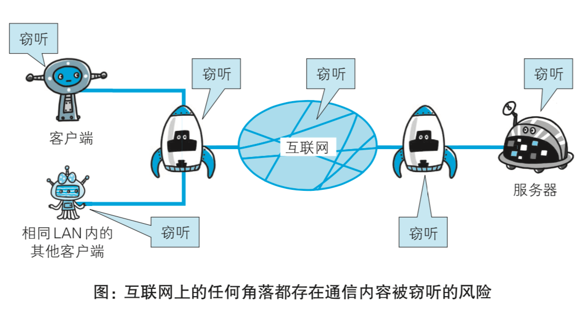

对于 `HTTP` 请求，我们可以非常容易地获得报文中地内容，比如下图就是我用 `wireshark` 捕获的我本地的 `HTTP` 请求报文，我们可以看出报文是直接可以从 `16` 进制翻译过来地，我们的首部字段以及请求链接等信息都能看的一清二楚。

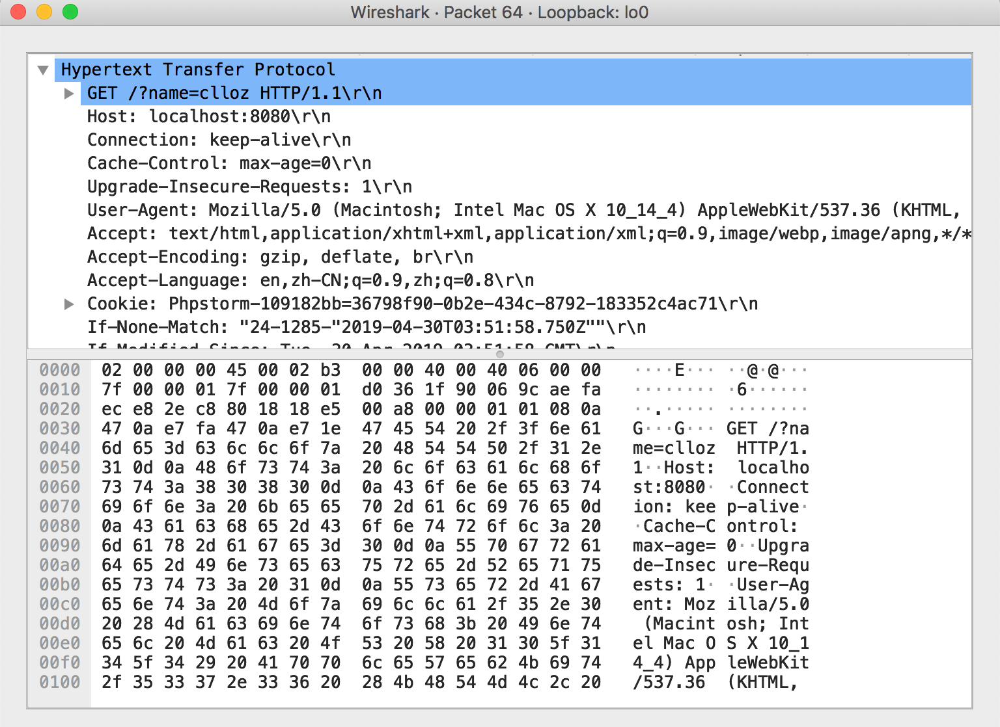

## 身份地伪装

`HTTP` 协议中地请求和响应不会对通信方地身份进行确认，比如任何人都可以伪装成用户想服务器发起请求，如果服务器不进行身份地验证，那么用户地资料很有可能泄漏。同样我们客户端发起地请求也有可能发送给一台伪装成目标服务器的设备，那么我们的信息安全也会受到威胁。甚至有人恶意地对服务器不断发送无效请求也会被受理最终导致服务器瘫痪。不能确定通信方的身份带来的风险可以归纳为以下几点： 1. 无法确定请求发送至目标的 `Web` 服务器是否是按真实意图返回 响应的那台服务器。有可能是已伪装的 `Web` 服务器。 2. 无法确定响应返回到的客户端是否是按真实意图接收响应的那个 客户端。有可能是已伪装的客户端。 3. 无法确定正在通信的对方是否具备访问权限。因为某些 `Web` 服 务器上保存着重要的信息，只想发给特定用户通信的权限。 4. 无法判定请求是来自何方、出自谁手。 5. 即使是无意义的请求也会照单全收。无法阻止海量请求下的 `DoS` 攻击( `Denial of Service`，拒绝服务攻击)。

## 无法验证报文的完整性

既然我们的报文在传输过程中可能被监听，那么同样，在请求从客户端发出到服务器接收到请求的这一过程中，我们的报文也有可能被篡改，而我们的服务器是无法判断报文是否被修改过。

比如，从某个 `Web` 网站上下载内容，是无法确定客户端下载的文 件和服务器上存放的文件是否前后一致的。文件内容在传输途中可能已 经被篡改为其他的内容。即使内容真的已改变，作为接收方的客户端也 是觉察不到的。

像这样，请求或响应在传输途中，遭攻击者拦截并篡改内容的攻击 称为中间人攻击( `Man-in-the-Middle attack`，`MITM` )。

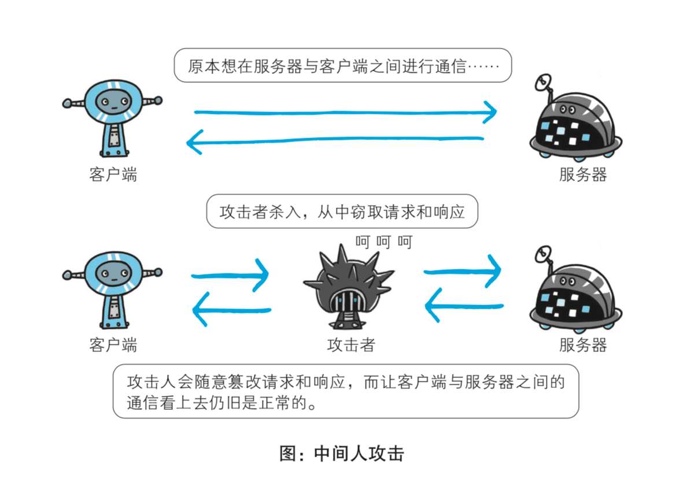

## HTTPS

我们上面介绍了 `HTTP` 的三个安全性问题，如何解决这三个问题呢？ 1. 对明文进行加密 2. 对通信方身份进行认证 3. 保护报文完整性

`HTTP` 协议加上这三个技术就是我们所说的 `HTTPS`，`HTTPS` 并不是一个全新的协议，它只是在 `HTTP` 协议上增加了加密，认证和完整性保护机制的 `HTTP` 协议（将 `HTTP` 通信接口部分用 `SSL` ( `Secure Socket Layer` )和 `TLS` ( `Transport Layer Security` )协议代替），全称叫做 `HTTP Secure`。

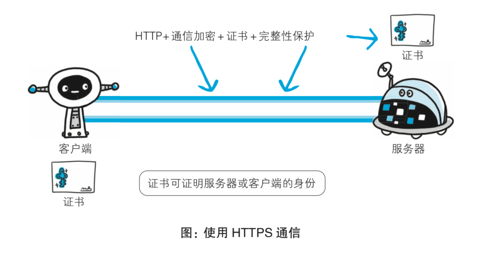

经常会在 `Web` 的登录页面和购物结算界面等使用 `HTTPS` 通信。使用 `HTTPS` 通信时，不再用 `http://`，而是改用 `https://`。另外，当浏览器 访问 `HTTPS` 通信有效的 `Web` 网站时，浏览器的地址栏内会出现一个带 锁的标记。对 `HTTPS` 的显示方式会因浏览器的不同而有所改变。

通常，`HTTP` 直接和 `TCP` 通信。当使用 `SSL` 时，则演变成先和 `SSL` 通信，再由 `SSL` 和 `TCP` 通信了。简言之，所谓 `HTTPS`，其实就是 身披 `SSL` 协议这层外壳的 `HTTP`。在采用 `SSL` 后，`HTTP` 就拥有了 `HTTPS` 的加密、证书和完整性保 护这些功能。

`SSL` `Secure Sockets Layer` 是独立于 `HTTP` 的协议，和 `HTTP` 协议一样都是应用层协议，所以不光是 `HTTP` 协议，其他运行在 应用层的 `SMTP` 和 `Telnet` 等协议均可配合 `SSL` 协议使用。可以说 `SSL` 是当今世界上应用最为广泛的网络安全技术。

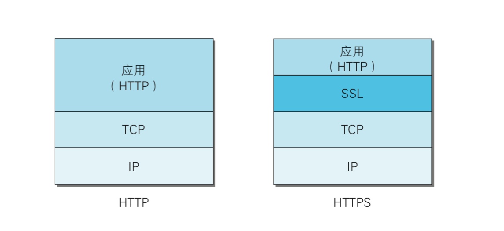

## 加密

加密的方式有两种，一种是对称加密，加密和解密用同一个密钥；另一种是非对称加密，加密和解密用不同的密钥。对称加密需要把密钥通过网络进行发送，既然报文能被监听，那么密钥同样也会被监听，密钥被攻击者获取，我们的加密报文和没加密没区别，换句话说，如果密钥能够安全传递，那么我们的报文也能安全传递，对称加密是行不通的。

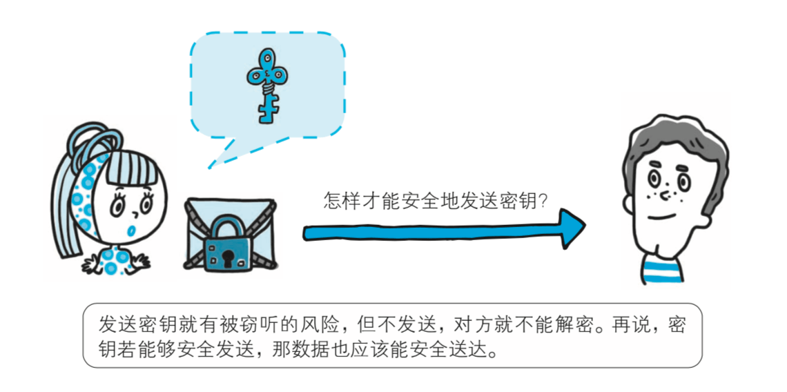

非对称加密是运用数学原理生成的一对公钥和私钥，公钥可以交给任何人，只能用来加密，而私钥保存在服务器，只能用来解密。公钥加密后的内容用公钥是无法解开的，这一点是非常重要的，至于为什么，你可以这么理解，有一个函数$ f(x) = a + b $，当你知道a和b的时候要你计算$ f(x) $很容易，但是如果给你$ f(x) $要你求a和b的值就有非常多的可能行，特别是当这个值足够大的时候，拿几乎就是不可能的，公钥的作用就是这样，给你公钥你进行加密非常容易，但是如果给你加密后的结果你是无法解密的。公钥和私钥是存在数学联系的，比如常用的RSA加密算法，就是利用大整数因式分解难以破解的性质来设计的，如果你对非对称加密的设计细节很感兴趣可以看这两篇文章： 1. [RSA算法原理（一）](https://www.ruanyifeng.com/blog/2013/06/rsa_algorithm_part_one.html "RSA算法原理（一）") 2. [RSA算法原理（二）](https://www.ruanyifeng.com/blog/2013/07/rsa_algorithm_part_two.html "RSA算法原理（二）")

李永乐老师的这个视频也能让你对 `RSA加密算法` 有一个简单的了解 [银行的密码系统安全吗](https://www.bilibili.com/video/av26639065 "银行的密码系统安全吗")

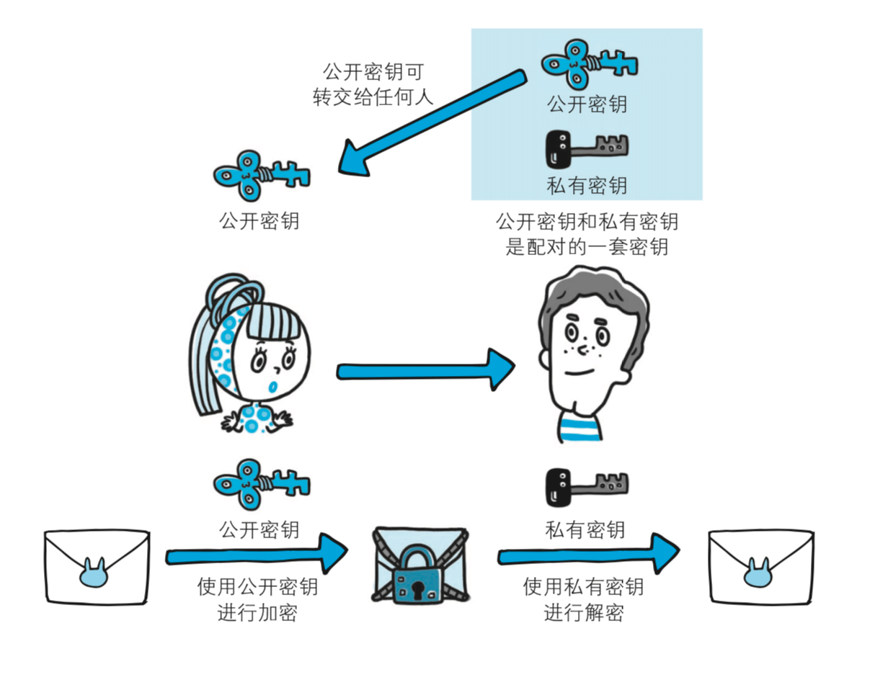

HTTP协议没有加密功能但可以通 过和 `SSL` (`Secure Socket Layer` ，安全套接层)或 `TLS` ( `Transport Layer Security`，安全传输层协议)的组合使用，加密 `HTTP` 的通信内容。用 `SSL` 建立安全通信线路之后，就可以在这条线路上进行 `HTTP` 通信了。与 `SSL` 组合使用的 `HTTP` 被称为 `HTTPS` ( `HTTP Secure`，超文 本传输安全协议)或 `HTTP over SSL`。

`HTTPS` 在通信过程中并不是一直采用非对称加密，而是采取一种混合加密的方式，也就是说我们将对称加密的密钥用非对称加密的方式进行传递，当确保对称加密的密钥安全地送达之后，我们就可以安全地使用对称加密来通信了，这样做的目的是因为非对称加密虽然安全，但是因为处理的过程要比对称加密更加复杂，所以效率比较低。混合加密的大致过程如下：客户端拿到服务端的公钥后，产生一个随机的 `key` 作为对称加密的共享密钥，然后用服务端的公钥加密传递给服务端，服务端拿到加密后的 `key`，利用服务端原有的私钥解密，得到 `key` 的原文。然后后面跟客户端通讯就使用key作为对称加密的私钥，进行通讯了。其实 `https` 真正的数据传递过程，走的是对称加密。

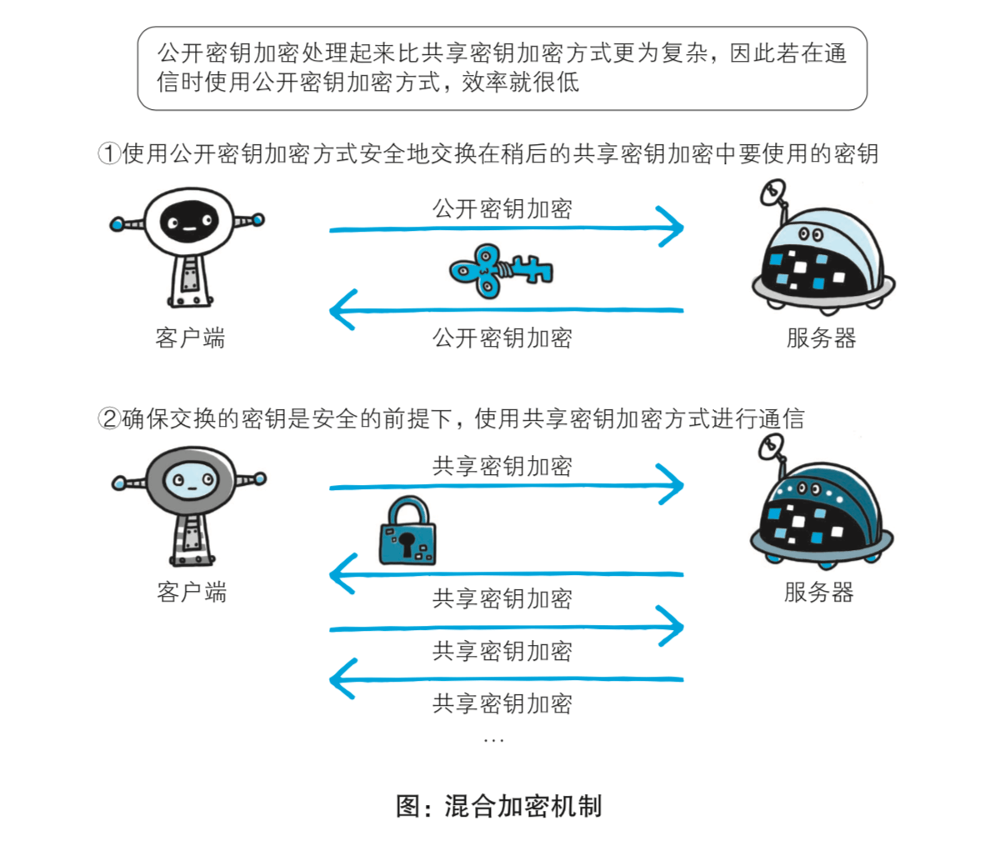

## 身份认证

加密虽然实现了，但是获得正确公钥的前提是我们当前通信的对象确实是目标服务器，而不是一个伪装的攻击者。如果我们收到的是攻击者替换过后的公钥，那么当我们以为通信已经安全，将数据用这个假的公钥加密后传给目标服务器，在这个过程中攻击者截获我们的报文，用它的私钥就可以解密得到我们的数据。所以非对称加密要想实现，前提就是能确定公钥发送者的身份。

为了解决这个问题，我们必须借助第三方数字证书认证机构( `CA`，`Certificate Authority` )和其相关机关颁发的公开密钥证书。这个数字认证机构必须是客户端和服务器都信任的第三方机构。有了这个第三方机构的证书我们才能够确定服务器端的身份。需要了解的一点是，我们在加密通信的时候是用公钥加密，私钥解密，这其中用的是加密算法。其实我们还可以用私钥加密，用对应的公钥解密，这种情况往往是用来发布一个公告或者广播信息，也正是我们数字签名当中用到的算法。 HTTPS中的证书验证的流程如下： 1. 服务器端将自己的公钥和信息发送给 `CA`，申请数字证书，`CA` 在验证过申请者身份之后，开始制作数字证书，制作过程如下：将我们发送给 `CA` 的公钥，以及证书签发单位，申请者等信息记录为内容 `M`，然后通过哈希运算获得 `M` 的摘要 `H`，用 `CA` 的私钥对 `H` 进行加密，加密得到的就是 `CA` 的数字签名 `S`。`CA` 会把数字签名 `S` 附在内容 `M` 之后，整个 `M+S` 就被称作数字证书，`CA` 会把这个数字证书返回给服务器。 2. 服务器获得数字证书之后将 `CA` 颁发的带着公钥数字证书发送给客户端 3. 客户端拿到数字证书之后会用 `CA` 的公钥（一般预装在浏览器中）对数字签名 `S` 进行解密，获得 `M` 经过哈希运算后的摘要 `H`，然后在对数字证书中的内容 `M` 进行哈希运算获得 `H'`，如果 `H` 和 `H'` 相同，说明服务器的数字证书是 `CA` 认证的，数字证书中的公钥也是可靠的，内容没有经过篡改。

之所以数字签名是可靠的，是因为私钥只有 `CA` 知道，而对摘要的加密只有私钥才能做到，所以只要验证出加密内容没问题，说明证书就是可靠的。而即使攻击者截获证书，将内容 `M` 改掉，由于数字签名 `S` 攻击者无法篡改，当客户端进行验证的时候就能够发现内容被篡改。

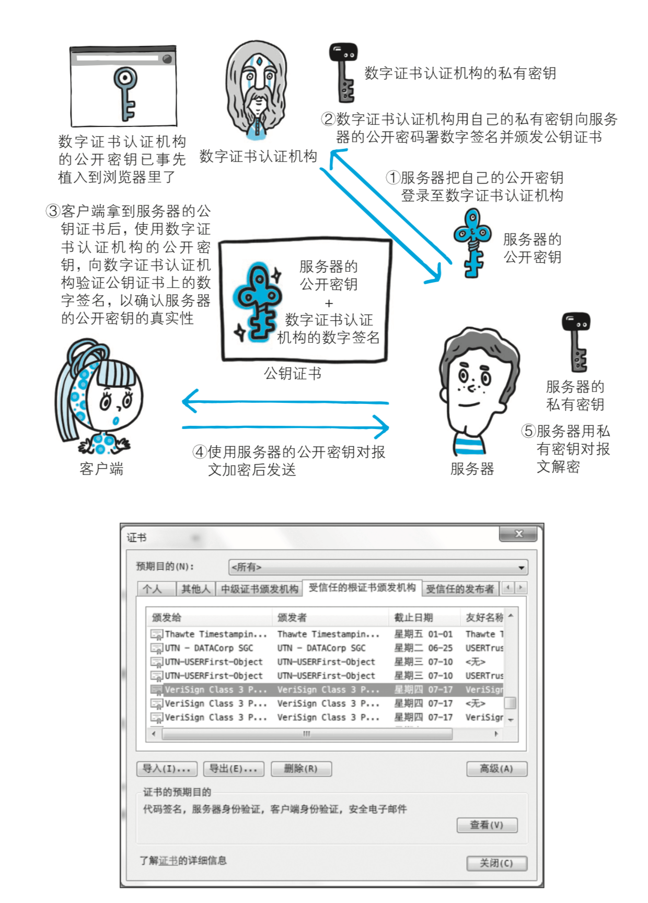

> 私钥可以用来解密和签名，公钥可以用来加密和验证。

一般来说，只有被请求方服务器需要证明自己的身份，但是如银行用户这样的特殊情况，客户端也需要证明自己的身份，这就是为什么在计算机上使用网上银行需要安装证书的原因。

## HTTPS安全通信机制

运用SSL的加密和证书验证，我们已经能够确保通信的安全了，回顾一下HTTPS安全通信的全过程：

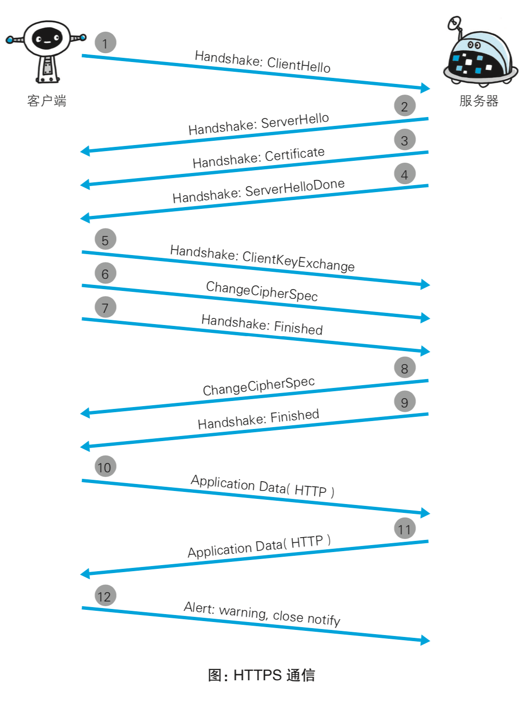

1. 客户端通过发送 `Client Hello` 报文开始 `SSL` 通信。报文中 包含客户端支持的 `SSL` 的指定版本、加密组件( `Cipher Suite` )列表(所使用的加密算法及密钥长度等)。
2. 服务器可进行 `SSL` 通信时，会以 `Server Hello` 报文作为应 答。和客户端一样，在报文中包含 `SSL` 版本以及加密组 件。服务器的加密组件内容是从接收到的客户端加密组件 内筛选出来的。
3. 之后服务器发送 `Certificate` 报文。报文中包含公开密钥 证书。
4. 最后服务器发送 `Server Hello Done` 报文通知客户端，最初 阶段的 `SSL` 握手协商部分结束。
5. `SSL` 第一次握手结束之后，客户端以 `Client Key Exchange` 报文作为回应。报文中包含通信加密中使用的一种被称为 `Pre-master secret` 的随机密码串。该报文已用步骤 `3` 中的公 开密钥进行加密。
6. 接着客户端继续发送 `Change Cipher Spec` 报文。该报文会 提示服务器，在此报文之后的通信会采用 `Pre-master secret` 密钥加密。
7. 客户端发送 `Finished` 报文。该报文包含连接至今全部报文的整体校验值。这次握手协商是否能够成功，要以服务器 是否能够正确解密该报文作为判定标准。
8. 服务器同样发送 `Change Cipher Spec` 报文。
9. 服务器同样发送 `Finished` 报文。
10. 服务器和客户端的 `Finished` 报文交换完毕之后，`SSL` 连接 就算建立完成。当然，通信会受到 `SSL` 的保护。从此处开 始进行应用层协议的通信，即发送 `HTTP` 请求。
11. 应用层协议通信，即发送 `HTTP` 响应。
12. 由客户端断开连接。断开连接时，发送 `close_notify` 报文。
13. 最后发送 `TCP FIN` 报文来关闭与 `TCP` 的通信。

在以上流程中，应用层发送数据时会附加一种叫做 `MAC` ( `Message Authentication Code` )的报文摘要。`MAC` 能够查知报文是否遭到篡改， 从而保护报文的完整性。

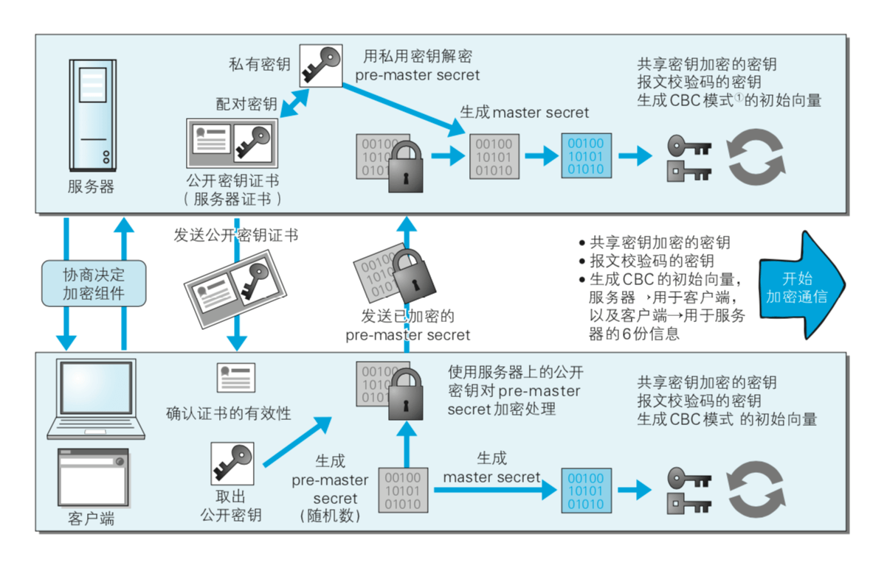

## 参考文章

1. [rsa加密算法](https://blog.csdn.net/u014401141/article/details/74219479 "rsa加密算法")