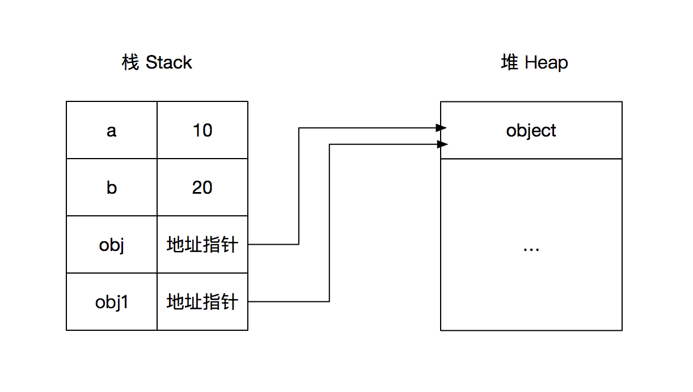

## 前言

`JavaScript` 中最重要的就是对象，除了 `Number, String, Null, Undefined, Boolean, Symbol, BigInt` 等基本数据类型，剩下的就 `Object` 对象。`JavaScript` 也给我们提供了一系列内置对象，比如 `Function，Array，Math，Date，RegExp` 等等，他们都是用 `function Object()` 构造的。我们使用 `JavaScript` 大多是时候都是在操作对象。本文就讲一讲复制对象涉及到的浅拷贝和深拷贝。

## 内存堆栈

在讲对象的复制之前我们先来了解一下 `JavaScript` 中的数据类型在内存中是如何存放的。

每一个数据都需要分配一块内存空间，内存空间分为两种：栈 `stack` 和 堆 `heap`：`stack` 为自动分配的内存空间，它由系统自动释放；而 `heap` 则是动态分配的内存，大小不定也不会自动释。基本类型值是存储在栈中的简单数据段，也就是说，他们的值直接存储在变量访问的位置。堆是存放数据的基于散列算法的数据结构，在 `javascript` 中，引用值是存放在堆中的。

```javascript
let a = 10
let b = 20
let obj = {
  name: 'clloz'
}
let obj2 = obj
```

比如这段代码在内存中的结构应该为：



所以访问基本类型的变量时，是直接访问到栈内存中其真正的值；而访问引用类型的变量时，是通过栈内存中保存的引用地址去访问。

栈的优势就是存取速度比堆要快，仅次于直接位于 `CPU` 中的寄存器，但缺点是，存在栈中的数据大小与生存期必须是确定的，缺乏灵活性。堆的优势是可以动态地分配内存大小，生存期也不必事先告诉编译器，垃圾收集器会自动地收走这些不再使用的数据，但是缺点是由于在运行时动态分配内存，所以存取速度较慢。所以对于基本数据类型，他们占用内存比较小，如果放在堆中，查找会浪费很多时间，而把堆中的数据放入栈中也会影响栈的效率。比如对象和数组是可以无限拓展的，正好放在可以动态分配大小的堆中。

从上面的例子中我们可以看到，我们将一个对象赋值给一个变量的时候，系统会在栈中为我们分配一块空间，里面存入对象在堆中的地址。`obj` 和 `obj1` 指向的是堆中的同一块内存，不管我们用哪个标识符来操作对象中的数据，都会影响到另一个，因为他们本质就是同一个对象的不同名字。而如果是基本数据类型的复制，则直接在栈中将值写入，新变量的改变不会影响到原来的变量。

这就是值传递和地址传递的主要区别，也就是深拷贝和浅拷贝的产生的原因。当我们想要真正地复制一个对象，希望开辟一块新的内存空间，新对象的操作不会影响到原来的对象，就需要用深拷贝的方式。

## 概念

有了上面对数据类型和内存对战的概念，我们可以来说一说浅拷贝 `shallow copy` 和深拷贝 `deep copy` 的概念了。

- 浅拷贝：只对原始数据类型进行复制，引用类似则是复制其地址引用。也就是说对对象属性中的对象，不会进行递归复制，只会拷贝对象第一层的值类型。
- 深拷贝：进行递归复制，不仅复制值类型，还对引用类型进行完整的递归复制。

## 遍历对象的方法

不管是浅拷贝和深拷贝都会涉及到对象的遍历，`JavaScript` 提供了很多遍历对象的方法，我们先来看看它们有什么不同，方便我们在对应的场景选择合适的遍历方法。

- `for ... in`：遍历对象自身可其原型链上的可枚举属性，不包括 `Symbol` 属性。
- `Object.keys()`：返回一个数组，包括对象自身的(不含圆形脸上的)所有可枚举属性 (不含 `Symbol` 属性)。
- `Object.getOwnPropertyNames()`：返回一个数组，包含对象自身的所有属性(不含 `Symbol` 属性，但是包括不可枚举属性)
- `Object.getOwnPropertySymbols()`：返回一个数组，包含对象自身的所有 `Symbol` 属性。
- `Reflect.ownKeys()`：返回一个数组，包含对象自身的所有属性，不管属性名是 `Symbol` 或字符串，也不管是否可枚举。
- `Object.values()`：返回一个给定对象自身的所有可枚举属性值的数组。(不含 `Symbol` 属性)
- `Object.entries()`：返回一个给定对象自身可枚举属性的键值对数组。(不含 `Symbol` 属性)

他们遍历属性的顺序都遵循以下几点：

- 首先遍历所有属性名为数值的属性，按照数字排序。
- 其次遍历所有属性名为字符串的属性，按照生成时间排序。
- 最后遍历所有属性名为 `Symbol` 值的属性，按照生成时间排序。

## 浅拷贝实现

## Object.assingn()

`Object.assign()` 方法也是常用的浅拷贝方法，该方法只会拷贝源对象自身的并且可枚举的属性到目标对象，`String` 类型和 `Symbol` 类型的属性都会被拷贝。看下面的代码：

```javascript
let a = {
  p1: 10,
  p2: 20,
  p3: {
    m: 100,
    n: 200
  }
}
let b = Object.assign({}, a)
console.log(b) //{ p1: 10, p2: 20, p3: { m: 100, n: 200 } }
b.p1 = 'teste'
console.log(a) //{ p1: 10, p2: 20, p3: { m: 100, n: 200 } } a中的p1没有改变
b.p3.m = 'test'
console.log(a) //{ p1: 10, p2: 20, p3: { m: 'test', n: 200 } } a.m是一个嵌套对象，浅拷贝
```

---

关于 `Object.assign()` 还有需要注意的点就是，该方法只能拷贝源对象的可枚举的自身属性，同时拷贝时无法拷贝属性的特性，而且访问器属性会被转换成数据属性（值为访问器属性的 `getter` 的返回值，如果访问器属性没有设置 `getter`，那么值为 `undefined`）。看下面的例子：

```javascript
//'use strict'
let a_p = {
  fun: () => console.log('a.[[prototype]]')
}
let a = Object.create(a_p)
let out_var = 'out variable'

Object.defineProperty(a, Symbol('symbol'), {
  value: 'symbol',
  enumerable: true
})

Object.defineProperty(a, 'val', {
  //不可枚举属性
  value: 100,
  configurable: false,
  enumerable: false,
  writable: true
})

Object.defineProperty(a, 'enum', {
  //可枚举属性
  value: 'enumerable',
  configurable: false,
  enumerable: true,
  writable: false
})

Object.defineProperty(a, 'm', {
  //不可枚举的访问器属性
  enumerable: false,
  set(val) {
    this.val = val
  },
  get() {
    return this.val
  }
})

Object.defineProperty(a, 'n', {
  //可枚举的访问器属性
  enumerable: true,
  set(val) {
    a.val = val
  },
  get() {
    return a.val
  }
})

let b = Object.assign({}, a)
console.log(b) //{ enum: 'enumerable', n: 100, [Symbol(symbol)]: 'symbol' } 只有可枚举的数据属性和访问器属性是会被复制的。访问器属性被转换成数据属性，值是调用访问器属性getter的返回值
console.log(Object.getOwnPropertyDescriptor(b, 'enum')) //属性描述符全部变为 true
//{
//  value: 'enumerable',
//  writable: true,
//  enumerable: true,
//  configurable: true
//}
console.log(Object.getPrototypeOf(b) === Object.prototype) //true 没有复制原型
```

如果想要实现复制属性的特性，访问器属性以及链接原型，可用如下的方法：

```javascript
let c = Object.create(Object.getPrototypeOf(a), Object.getOwnPropertyDescriptors(a))
```

原始数据类型作为 `source` 的时候，字符串会以数组形式，拷贝入目标对象，数字和布尔值则没有效果，这是因为只有字 符串的包装对象，会产生可枚举属性。

```javascript
var v1 = 'abc'
var v2 = true
var v3 = 10
var obj = Object.assign({}, v1, v2, v3)
console.log(obj) // { "0": "a", "1": "b", "2": "c" }
```

## Object.create()

用 `Object.create()` 也可以实现对象的浅拷贝。主要是结合对象的属性类型和赋值特性，主要是配合 `Object.getOwnPropertyDescriptors()` 方法获取要拷贝的对象的属性。

```javascript
const clone = Object.create(Object.getPrototypeOf(obj), Object.getOwnPropertyDescriptors(obj))
// 或者
const shallowClone = (obj) =>
  Object.create(Object.getPrototypeOf(obj), Object.getOwnPropertyDescriptors(obj))
```

当然其实直接用 `Object.create(source)` 也可以实现 `拷贝`，我们可以通过访问原型访问到对应的属性，并且如果我们如果给属性赋值，不会影响到原型，具体可以参考另一篇文章：[JavaScript对象属性类型和赋值细节](https://www.clloz.com/programming/front-end/js/2020/09/09/javascript-object-prop-assign/#i-8 'JavaScript对象属性类型和赋值细节')。当然这不算传统意义上的 **拷贝**，并且对访问器属性无效。

## 遍历

还有一个最普遍的浅拷贝方法就是遍历：

```javascript
function shallowClone(source) {
  var target = {}
  for (var i in source) {
    if (source.hasOwnProperty(i)) {
      target[i] = source[i]
    }
  }
  return target
}
```

当然也可以用我们上面提到的其他遍历方法。

## 深拷贝实现

## for...in 递归

这个方法是最好理解的，代码如下。注意 `for...in` 会遍历所有能访问到的属性，包括原型链上的。

```javascript
let testObj = {
    num: 0,
    str: 'clloz',
    boolean: true,
    unf: undefined,
    nul: null,
    obj: {
        name: 'clloz',
        id: 1
    },
    arr: [0, 1, 2],
    func: function() {
        console.log('clloz')
    },
    date: new Date(0),
    reg: new RegExp('/clloz/ig'),
    err: new Error('clloz')
}

function isObject(obj) {
    return (typeof obj === 'function' || typeof obj === 'object') && obj !== null;
}

function deepClone(obj) {
    if (!isObject(obj)) {
        throw new Error(obj + 'is not a Object!');
    }

    let newObj = Array.isArray(obj); ? [] : {};

    for (let prop in obj) {
        if (obj.hasOwnProperty(prop)) {
            newObj[prop] = isObject(obj[prop]) ? deepClone(obj[prop]) : obj[prop];
        }
    }
    return newObj;
}

let a = deepClone(testObj)
console.log(a)
//{
//  num: 0,
//  str: '',
//  boolean: true,
//  unf: undefined,
//  nul: null,
//  obj: { name: '我是一个对象', id: 1 },
//  arr: [ 0, 1, 2 ],
//  func: {},
//  date: {},
//  reg: {},
//  err: {}
//}

console.log(a.obj === testObj.obj) //false
console.log(a.arr === testObj.arr) //false
```

最终成功拷贝了 `obj` 和 `arr`。`func`，`date`，`reg` 和 `err` 没有拷贝成功，因为他们不是普通的 `Object` 结构。

采用 `for ... in` 递归我们有几个需要注意的细节：

1. 没有对传入参数进行校验，传入 `null` 时应该返回 `null` 而不是 `{}`
2. 要对传入的参数进行判断是否是对象
3. 要对传入参数是数组的情况进行兼容

第一点很好解决，第二点判断对象我们一般可以使用 `Object.prototype.toString.call(x) === '[object Object]'`，但是这压力需要兼容数组（在这题里面，数组也是一个合法参数），所以我们使用 `(typeof obj === 'function' || typeof obj === 'object') && obj !== null`。然后创建新对象的时候用 `let newObj = isArray ? [] : {}` 进行处理。

## 递归爆栈

如果我们要拷贝的对象层级非常深，有可能导致递归爆栈（一般来说不可能，这里只是讨论解决方案）

```javascript
//创建一个指定深度和宽度的对象
function createData(deep, breadth) {
  var data = {}
  var temp = data

  for (var i = 0; i < deep; i++) {
    temp = temp['data'] = {}
    for (var j = 0; j < breadth; j++) {
      temp[j] = j
    }
  }

  return data
}
function clone(source) {
  var target = {}
  for (var i in source) {
    if (source.hasOwnProperty(i)) {
      if (typeof source[i] === 'object') {
        target[i] = clone(source[i]) // 注意这里
      } else {
        target[i] = source[i]
      }
    }
  }

  return target
}
clone(createData(1000)) // ok
clone(createData(10000)) // Maximum call stack size exceeded
clone(createData(10, 100000)) // ok 广度不会溢出
```

解决的方案就是用循环代替递归，把横向的嵌套对象想象成一个纵向的树，然后用栈和循环来处理。开始将跟元素放入栈中，每次从栈中取一个节点进行拷贝，如果拷贝过程中遇到对象则放入栈中，循环从栈中取元素，知道栈空，则拷贝完毕。

```javascript
function clone(obj) {
  if (!isObject(obj)) return obj
  //创建一个新对象用来复制
  let root = {}

  //创建一个栈，栈中的第一个元素就是 root，不断从栈中取出元素，遍历元素的 data 中的属性复制到 parent 中
  let stack = [
    {
      parent: root, //这里栈中第一个元素设置 key 为 undefined，用来判断是否是跟节点
      key: undefined,
      data: obj
    }
  ]

  while (stack.length) {
    const node = stack.pop()
    const parent = node.parent
    const key = node.key
    const data = node.data

    let res = parent
    if (key !== undefined) res = parent[key] = {}

    for (let key in data) {
      if (Object.prototype.hasOwnProperty.call(data, key)) {
        if (isObject(data[key])) {
          stack.push({
            parent: res,
            key: key,
            data: data[key]
          })
        } else {
          res[key] = data[key]
        }
      }
    }
  }
}

function isObject(obj) {
  return (typeof obj === 'function' || typeof obj === 'object') && obj !== null
}
```

## 循环引用

我们在深拷贝的 `JSON` 序列化部分说到了循环引用会引起序列化报错的问题。但时期我们的 `for...in` 方法遇到循环引用一样会出问题。

比如上面的例子，我们为 `testObj` 添加一个属性 `loop: testObj`，在执行会发现栈溢出了 `RangeError: Maximum call stack size exceeded`。

如果你用了 `lodash` 的 `baseClone` 会发现它的执行不会报错，因为它用栈来保存克隆的对象，用来检测循环引用。

```javascript
// Check for circular references and return its corresponding clone.
stack || (stack = new Stack())
const stacked = stack.get(value)
if (stacked) {
  return stacked
}
```

我这里写了一个简单的实现，用一个 `WeakMap` 来保存嵌套的对象，每进入一层对象就在 `Set` 中保存起来，每次要递归之前，检测该对象是否已在 `Set` 中，如果不在才进行递归。每次递归完一个对象时，将该对象从 `set` 中删除。

```javascript
function cloneDeep3(source, hash = new WeakMap()) {
  if (!isObject(source)) return source
  if (hash.has(source)) return hash.get(source) //查询该对象是否在 WeakMap 中

  var target = Array.isArray(source) ? [] : {}
  hash.set(source, target) // 注意这里的键名是源对象中的对象，键值是新对象中的

  for (var key in source) {
    if (Object.prototype.hasOwnProperty.call(source, key)) {
      if (isObject(source[key])) {
        target[key] = cloneDeep3(source[key], hash) // 新增代码，传入哈希表
      } else {
        target[key] = source[key]
      }
    }
  }
  return target
}
```

如果要兼容 `ES6` 之前的代码，不能使用 `WeakMap`，及使用数组来保存，需要增加一个遍历数组的逻辑，因为不想 `WeakMap` 有 `has` 方法。

```javascript
function cloneDeep3(source, uniqueList) {
  if (!isObject(source)) return source
  if (!uniqueList) uniqueList = [] // 新增代码，初始化数组

  var target = Array.isArray(source) ? [] : {}

  // ============= 新增代码
  // 数据已经存在，返回保存的数据
  var uniqueData = find(uniqueList, source)
  if (uniqueData) {
    return uniqueData.target
  }

  // 数据不存在，保存源数据，以及对应的引用
  uniqueList.push({
    source: source,
    target: target
  })
  // =============

  for (var key in source) {
    if (Object.prototype.hasOwnProperty.call(source, key)) {
      if (isObject(source[key])) {
        target[key] = cloneDeep3(source[key], uniqueList) // 新增代码，传入数组
      } else {
        target[key] = source[key]
      }
    }
  }
  return target
}

// 新增方法，用于查找
function find(arr, item) {
  for (var i = 0; i < arr.length; i++) {
    if (arr[i].source === item) {
      return arr[i]
    }
  }
  return null
}

// 用上面测试用例已测试通过
```

## JSON 序列化和反序列化

用 `JSON.stringify()` 和 `JSON.parse()` 进行序列化反序列化。先将一个 `JavaScript` 对象转为一个 `JSON` 字符串，然后再将字符串转为对象。这种方法不能复制非枚举属性，也不能复制属性特性，也不能复制访问器属性。而且`JSON.parse()`和 `JSON.stringify()` 能正确处理的对象只有 `Number`、`String`、`Array` 和 `Boolean` 等能够被 `json` 表示的数据结构，因此函数，`RegExp`这种不能被 `json` 表示的类型将不能被正确处理。

还有一点存在循环引用的对象，例如 `let a = {m:a}` 这样的对象序列化会报错 `TypeError: Converting circular structure to JSON`。

这个方法根据自己的需求使用。

## 第三方库

`jQuery.extend`, [baseClone -lodash](https://github.com/lodash/lodash/blob/master/.internal/baseClone.js 'baseClone -lodash')，还有 `lodash`自定义深拷贝方法 [cloneDeepWith](https://lodash.com/docs/4.17.15#cloneDeepWith 'cloneDeepWith')。有兴趣可以去阅读以下源码。

## Symbol

如果属性的 `key` 是一个 `Symbol`，那么 `for...in` 无法遍历到该属性。这里我们可以用 `Reflect.ownKeys()` 方法。也可以使用 `Object.getOwnPropertySymbols()` 方法。

```javascript
function deepClone(obj) {
  if (!isObject(obj)) {
    throw new Error('obj 不是一个对象！')
  }

  let isArray = Array.isArray(obj)
  let newObj = isArray ? [...obj] : { ...obj }
  Reflect.ownKeys(newObj).forEach((key) => {
    newObj[key] = isObject(obj[key]) ? deepClone(obj[key]) : obj[key]
  })

  return newObj
}
```

## 不可枚举属性

关于不可枚举属性的深拷贝，我想到的是用 `Object.getOwnPropertyNames` 来遍历添加。如果遇到 `value` 是对象则递归。不过很多内置对象需要单独处理，比如 `Function`，`RegExp`，`Date` 等。这种需求几乎不存在，看一看就好。

```javascript
let testObj = {
  num: 0,
  str: 'clloz',
  boolean: true,
  unf: undefined,
  nul: null,
  obj: {
    name: 'clloz',
    id: 1
  },
  arr: [0, 1, 2],
  func: function () {
    console.log('clloz')
  },
  date: new Date(0),
  reg: new RegExp('/clloz/ig'),
  err: new Error('clloz')
}
Object.defineProperty(testObj, 'test', {
  value: {
    name: 'clloz',
    age: 28
  },
  writable: true,
  enumerable: false,
  configurable: true
})

function isObject(obj) {
  return (
    typeof obj === 'object' &&
    obj !== null &&
    obj instanceof RegExp !== true &&
    obj instanceof Date !== true
  )
}

function deepClone(obj) {
  if (!isObject(obj)) {
    throw new Error('obj is not a Object!')
  }

  let isArray = Array.isArray(obj)

  let newObj = isArray ? [] : {}

  let keys = Object.getOwnPropertyNames(obj)

  for (let key of keys) {
    if (isObject(Object.getOwnPropertyDescriptor(obj, key).value)) {
      Object.defineProperty(newObj, key, {
        value: deepClone(obj[key]),
        configurable: Object.getOwnPropertyDescriptor(obj, key).configurable,
        enumerable: Object.getOwnPropertyDescriptor(obj, key).enumerable,
        writable: Object.getOwnPropertyDescriptor(obj, key).writable
      })
    } else {
      Object.defineProperty(newObj, key, Object.getOwnPropertyDescriptor(obj, key))
    }
  }
  return newObj
}

let a = deepClone(testObj)
console.log(Object.getOwnPropertyDescriptors(a))
console.log(a.obj === testObj.obj) //false
console.log(a.arr === testObj.arr) //false
```

这个实现在加上 `Symbol`的处理，循环引用的处理基本就可以应对大多数情况了。如果你还想增加对原型的支持，那么可以在创建对象的时候用 `Object.create()`。

## 总结

如果要实现一个能应对各种对象各种情况的深拷贝函数还是非常不容易的，本文处理的情况包括：

- `Symbol`：用 `Reflect.ownKeys()` 或者 `Object.getOwnPropertySymbols()`
- `for-in`：遍历原型链上的属性，如果不需要原型上的方法，可以添加判断。
- 递归爆栈
- 循环引用的处理
- `Object.getOwnPropertyNames`: 实现非枚举属性的拷贝

在日常的编码中我们不太会遇到这么复杂的情况，大多数情况下我们要深拷贝的对象用 `for...in` 或者序列化就可以处理了。扩展这么多主要是为了加深对 `JavaScript` 对象的理解。

## 参考文章

1. [JS数据类型和内存堆栈](https://segmentfault.com/a/1190000015830451 'JS数据类型和内存堆栈')
2. [JS的栈与堆的讲解](https://blog.csdn.net/jingtian678/article/details/83902819 'JS的栈与堆的讲解')
3. [Object.getOwnPropertyDescriptors() - MDN](https://developer.mozilla.org/zh-CN/docs/Web/JavaScript/Reference/Global_Objects/Object/getOwnPropertyDescriptors 'Object.getOwnPropertyDescriptors() - MDN')
4. [Object.assign() - MDN](https://developer.mozilla.org/zh-CN/docs/Web/JavaScript/Reference/Global_Objects/Object/assign 'Object.assign() - MDN')
5. [深入深入在深入JS深拷贝对象](https://juejin.im/post/6844903592587952135#heading-6 '深入深入在深入JS深拷贝对象')
6. [面试题之如何实现一个深拷贝](https://github.com/yygmind/blog/issues/29 '面试题之如何实现一个深拷贝')
7. [深拷贝的终极探索（99%的人都不知道）](https://segmentfault.com/a/1190000016672263 '深拷贝的终极探索（99%的人都不知道）')
