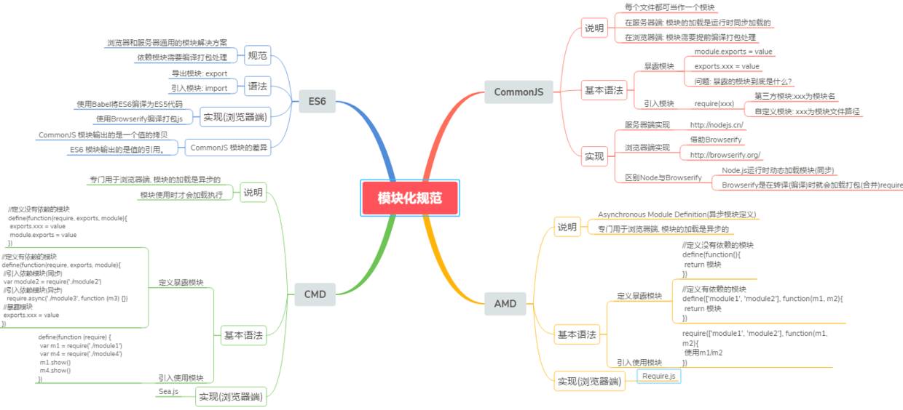

\[toc\]

## 前言

本文主要讲一讲和前端模块化相关的一些历史和知识

## 为什么要模块化

可以看一看这个 [JavaScript 模块化七日谈](https://huangxuan.me/2015/07/09/js-module-7day/)，了解一下模块化的发展历史。

一切工程相关的概念都是为了效率诞生的。如何在多人开发的较大的项目中保持开发的效率以及降低维护成本，就是问题的核心。在前端中 `js` 的依赖关系和代码复用就是其中的两个核心问题。如果你只是写一个几十行的小 `demo`，并且确定不会复用，你完全不需要任何的模块化和设计模式的概念，就结构化的代码就可以了。比如让你写一个斐波那契数列，你不会想什么模块化，面向对象，一个递归或者循环就可以了。所以一切都是需求决定的，我们也要根据需求选择开发方式，效率是第一位的。 有几个原因：

语言特性：`html/css/js` 都是比较高“容错”的，高自由度的，没有非常明确的规范。比如 `html` 的标签是否闭合，大小写都是可兼容的，相同的功能可以用各种形式的标签组合来实现。`css` 是全局的并且属性之间非正交，`css` 的行为想要搞清楚并不容易。`javascript` 作为一个弱类型动态语言，也是相当自由的，你可以定义一堆全局变量结构化地实现你的功能；也可以进行模块化编写易于维护和复用的代码。自由度和容错率高，并且没有一个明确的 `好` 的标准，导致前端的代码参差不齐。

浏览器渲染机制，`js` 引擎是单线程的，这主要是因为它主要是用在浏览器上和 `UI` 交互而不得不做的选择。这种单线程也意味着，`js` 的依赖是线性的，早期的模式其实就可以理解为只有一个很大的 `js` 文件，我们的所写的一段段代码在其中依次排开。当代码量上升的时候，几十个 `js` 文件之间的依赖关系很难搞清楚，并且大家共享一个作用域，很容易造成全局变量的污染。如何对 `js` 进行按需的加载，以及保持各模块独立的作用域就是模块化不断发展的方向。

模块化需求是随着前端不断发展而产生的，前端应用变得越来越庞大和复杂，自然就因为效率的问题而产生了模块化的需求。

## 模块化的历史

在我们刚学习 `JavaScript` 的时候，我们都是用一个个函数拼凑出我们的功能，代码大概都是下面这个样子（其实无论学什么语言都是一样，人的思维就是结构化的）：

```javascript
function foo(){
    //...
}
function bar(){
    //...
}
```

这样做的缺陷就是所有的函数都是定义在全局中的，如果是多人开发很可能发生冲突。当然这个问题有很多种解决办法，比如将函数都写成一个对象的方法，这样就大大减少了全局中的变量名，减小了冲突的可能性。但是我们定义的方法依然是能在全局访问的，并不足够安全。

```javascript
var MYAPP = {
    foo: function(){},
    bar: function(){}
}

MYAPP.foo();
```

后面就发展到了以前经常被问到的一个问题 `IIEF`，立即执行函数。在 `ES6` 之前，`JS` 没有块级作用域，函数很多时候就被当成了块级作用域的替代品。在函数外部只能访问我们返回的值，而我们在函数内部定义的变量方法是无法被访问到的。函数的作用相当于产生一个局部作用域。同时我们可以通过 `IIEF` 向函数内部传递参数，相当于一种引入依赖的方式，这样做除了保证模块的独立性，还使得模块之间的依赖关系变得明显。

```javascript
var Module = (function($){
    var _$body = $("body");     // we can use jQuery now!
    var foo = function(){
        console.log(_$body);    // 特权方法
    }

    // Revelation Pattern
    return {
        foo: foo
    }
})(jQuery)

Module.foo();
```

发展到这里的时候我们实际上已经实现了模块化的主要目的，就是将对应的功能封装到一个局部作用于中，我们可以向其中注入依赖，我们也只能使用它返回给我们的内容，而不关心它内部如何实现的。模块就相当于一个黑盒，我们只关心它的输入输出，而不关心它如何实现。

后面出现的问题就是当项目庞大以后，可能有几十个 `js` 文件需要加载，而 `DOM` 文档中加载顺序就是执行顺序，这么多文件之间的依赖关系会非常复杂。比如一个文件的执行可能都要依赖好几个文件，那么这些依赖的文件必须在这个文件执行之前加载完毕，这在文件比较少的时候还好处理，但是一旦文件增多依赖关系将错综复杂，很容易出错。如果要对其中的功能进行修改，处理依赖的关系都会花很长时间，而且每一个文件都是一个 `HTTP` 请求，文件过多也会造成请求过多。

为了解决依赖问题产生了很多工具，比如 `Yahoo` 的 `YUI`，关于 `YUI` 的原理可以参考 [YUI模块开发原理详解](https://www.jb51.net/article/43336.htm "YUI模块开发原理详解")

进行一个总结，其实模块化的目标就是把页面的功能进行分割，不同的功能之间解耦独立，互不干扰。并且模块能够按需加载，根据模块的依赖进行整合让请求数量变少。但是由于浏览器的特性，很多问题并不能得到根本性的解决，所以后面的模块化思路就跳出浏览器了。这也是现在还在流行的模块化方案。

## 模块化规范



## CommonJS

`CommonJS` 就是如今 `NodeJS` 在使用的模块化标准，它的大致使用方式如下：

```javascript
// math.js
exports.add = function(a, b){
    return a + b;
}

// main.js
var math = require('math')      // ./math in node
console.log(math.add(1, 2));    // 3
```

每个文件就是一个模块，有自己的作用域。在一个文件里面定义的变量、函数、类，都是私有的，对其他文件不可见。在服务器端，模块的加载是运行时同步加载的；在浏览器端，模块需要提前编译打包处理。所有代码都运行在模块作用域，不会污染全局作用域。模块可以多次加载，但是只会在第一次加载时运行一次，然后运行结果就被缓存了，以后再加载，就直接读取缓存结果。要想让模块再次运行，必须清除缓存。模块加载的顺序，按照其在代码中出现的顺序。

> `require` 有一个 `main` 属性，其实就是入口文件的意思，和我们在 `package.json` 中使用的 `main` 字段含义类似，如果该文件是我们直接用 `node` 命令运行的，那么 `request.main` 的值就是文件对应的 `module`。我们可以用 `require.main === module` 来判断当前文件是不是直接运行的

模块导入规则： 假设以下目录为 `src/app/index.js` 的文件调用 `require()`

以 `./moduleA` 相对路径开头，在没有指定后缀名的情况下先去寻找同级目录同级目录：`src/app/`

- `src/app/moduleA` 无后缀名文件，按照 `javascript` 解析
- `src/app/moduleA.js` js文件，按照 `javascript` 解析
- `src/app/moduleA.json` `json` 文件，按照 `json` 解析
- `src/app/moduleA.node` `node` 文件，按照加载的编译插件模块 `dlopen`

同级目录没有 `moduleA` 文件会去找同级的 `moduleA` 目录：`src/app/moduleA`

- `src/app/moduleA/package.json` 判断该目录是否有 `package.json` 文件， 如果有找到 `main` 字段定义的文件返回， 如果 `main` 字段指向文件不存在或 `main` 字段不存在或 `package.json` 文件不存在向下执行
- `src/app/moduleA/index.js`
- `src/app/moduleA/index.json`
- `src/app/moduleA/index.node`

这里讲一讲 `module.exports` 和 `exports`，在 `CommonJS` 中有 `module` 模块标识，`exports` 模块定义，`require` 模块引用。其中 `module` 有一个 `exports` 属性，该属性最初是一个空对象。而 `exports` 是 `module.exports` 的一个引用。`require` 能看到的只有 `module.exports`，它并不能看到 `exports`，所以尽量使用 `module.exports`，不要使用 `exports`。

`require` 命令的基本功能是，读入并执行一个 `JavaScript` 文件，然后返回该模块的 `exports` 对象（这里指的就是 `module` 的 `exports` 对象）。如果没有发现指定模块，会报错。

其实 `node` 中的模块原理还是和我们前面的立即执行函数一样的，我们的模块中的代码也是被放在一个函数中，而 `module` 对象就是传入这个函数的一个参数，然后再把我们的每个模块的输出统一进行保存。当我们 `require` 的时候他就到保存的输出中找对应模块的输出即可。

```javascript
// 准备module对象:
var module = {
    id: 'hello',
    exports: {}
};
var load = function (module) {
    // 读取的模块代码并执行

    module.exports = obj;
    // 模块代码结束 返回module.exports
    return module.exports;
};
var exported = load(module);
// 保存module:
save(module, exported);
```

所以在模块中我们打印 `module.exports` 是一个空对象，其 `[[prototype]]` 是 `Object.prototype`。我们也可以直接将 `module.exports` 赋值为一个基本类型，因为最终保存的知识这个返回值，是不是对象都可以。

## AMD Async Module Definition

`CommonJS` 规范加载模块是同步的，只有加载完成，才能执行后面的操作。`AMD` 规范则是非同步加载模块，允许指定回调函数。由于 `Node.js` 主要用于服务器编程，模块文件一般都已经存在于本地硬盘，所以加载起来比较快也很稳定，不用考虑非同步加载的方式，所以 `CommonJS` 规范比较适用。但是，如果是浏览器环境，我们需要引用的脚本一般都是直接写到 `HTML` 中，而想要实现模块化只能在 `JS` 中异步加载脚本。`AMD` 就是用来实现这个效果的一种规范。此外 `AMD` 规范比 `CommonJS` 规范在浏览器端实现更早。`AMD` 的实现方案主要是 `require.js`。

`AMD` 的诞生，就是为了解决这两个问题： 1. 实现 `js` 文件的异步加载，避免网页失去响应 2. 管理模块之间的依赖性，便于代码的编写和维护

`AMD` (异步模块定义)主要为前端 `JS` 的表现指定规范。它采用异步方式加载模块，模块的加载不影响它后面语句的运行。所有依赖这个模块的语句，都定义在一个回调函数中，等到加载完成之后，这个回调函数才会运行。那么这是如何实现的呢，其实就是创建 `script` 标签，然后用 `onload` 事件来处理回调函数（所以需要一个模块一个文件）。也就是说当我们执行到一个有依赖的函数时，`require.js` 会创建依赖的标签，然后浏览器会请求标签，当触发 `onload` 之后再利用回调函数执行之前的函数。那么多个依赖如何解决呢，多个依赖是无法确定哪个先加载完哪个后加载完的，虽然不知道 `require.js` 是怎么执行，但是想一想可以用一个属性做标记，每触发一个 `onload` 标记加一，在每个 `onload` 中判断是否全部请求回来了即可。

下面给出一个 `require.js` 的小例子：

```javascript
//index.html
<!DOCTYPE html>
<html>
    <head>
        <title>Modular Demo</title>
    </head>
    <body>
        <!-- 引入require.js并指定js主文件的入口 -->
        <script data-main="./index" src="require.js"></script>
    </body>
</html>

//index.js
(function () {
    require.config({
        baseUrl: './', //基本路径 出发点在根目录下
        paths: {
            //映射: 模块标识名: 路径
            alerter: './alerter', //此处不能写成alerter.js,会报错
            dataService: './dataService',
        },
    });
    require(['alerter'], function (alerter) {
        alerter.showMsg();
    });
})();

//dataService.js
define(function () {
    let msg = 'https://www.clloz.com';
    function getMsg() {
        return msg.toUpperCase();
    }
    return { getMsg }; // 暴露模块
});

//alerter.js
define(['dataService'], function (dataService) {
    let name = 'Tom';
    function showMsg() {
        alert(dataService.getMsg() + ', ' + name);
    }
    // 暴露模块
    return { showMsg };
});
```

浏览器打开 `index.html` 将能看到打印信息，文件全在同一级目录。我们可以看出 `require.js` 在 `script` 标签中用一个 `data-main` 属性设置了程序的入口，然后用 `define` 来创建模块，`define` 的第一个参数可以接受一个数组，传入依赖的模块。也有语法糖可以让它换成类似 `CommonJS` 的写法：

```javascript
define(function (require) {
    var dependency1 = require('dependency1'),
        dependency2 = require('dependency2');

    return function () {};
});

// parse out require...
define(
    ['require', 'dependency1', 'dependency2'],
function (require) {
    var dependency1 = require('dependency1'),
        dependency2 = require('dependency2');

    return function () {};
});
```

比较 `require.js` 和 `CommonJS`，两者一个是用于浏览器，一个是用于 `Node`，写法上 `CommonJS` 是依赖就近（需要时再写也可以），`require.js` 是依赖前置。并且前者是同步加载，而后者是异步加载，在 `CommonJS` 中，当执行到 `require` 语句的时候才会去加载执行模块，而在 `require.js` 中，在执行到 `require` 之前依赖的模块就已经加载并执行完毕了，这是浏览器特性所致。

尽管 `AMD` 的设计理念很好，但是与同步加载的模块标准相比其语法更冗长，另外加载的方式不如同步显得清晰，容易造成回调地狱。所以在目前的实际应用中已经越来越少，大多数的开发者还是会选择 `CommonJS` 或者 `ES6 Module`。

## CMD Common Module Definition

`CMD` 规范专门用于浏览器端，模块的加载是异步的，模块使用时才会加载执行。`CMD` 规范整合了 `CommonJS` 和 `AMD` 规范的特点，主要的实现就是 `Sea.js`。在 `Sea.js` 中，所有 `JavaScript` 模块都遵循 `CMD` 模块定义规范。看一个 `Sea.js` 的例子。

```javascript
//index.html
<body>
    <script type="text/javascript" src="sea.js"></script>
    <script type="text/javascript">
        seajs.use('./index');
    </script>
</body>

//index.js
define(function (require) {
    var m1 = require('./module1');
    var m4 = require('./module4');
    m1.show();
    m4.show();
});

//module1.js
define(function (require, exports, module) {
    //内部变量数据
    var data = 'clloz.com';
    //内部函数
    function show() {
        console.log('module1 show() ' + data);
    }
    //向外暴露
    exports.show = show;
});

//module2.js
define(function (require, exports, module) {
    module.exports = {
        msg: 'I Will Back',
    };
});

//module3.js
define(function (require, exports, module) {
    const API_KEY = 'clloz1992';
    exports.API_KEY = API_KEY;
});

//module4.js
define(function (require, exports, module) {
    //引入依赖模块(同步)
    var module2 = require('./module2');
    function show() {
        console.log('module4 show() ' + module2.msg);
    }
    exports.show = show;
    //引入依赖模块(异步)
    require.async('./module3', function (m3) {
        console.log('异步引入依赖模块3  ' + m3.API_KEY);
    });
});

//输出
//module1 show() clloz.com
//module4 show() I Will Back
//异步引入依赖模块3  clloz1992
```

我们可以看出 `sea.js` 的语法更接近 `CommonJS`，它的设计原则也是就近依赖，在用到某个模块的时候再去 `require`。对 `CMD` 来说代码在运行时，首先是不知道依赖的，需要遍历所有的 `require` 关键字，找出后面的依赖。具体做法是将 `function toString` 后，用正则匹配出 `require` 关键字后面的依赖。显然，这是一种牺牲性能来换取更多开发便利的方法。所以对比一下两者的实现方式，在模块的加载上并没有什么太大的区别，但是回调函数执行时机不一样的。打个比方有一个模块 `a.js` 依赖 `require1.js`, `require([require1], callback() {})`，代码必然是先执行 `a.js`，然后生成一个 `src` 为 `require1.js` 的 `script` 标签 `append` 到 `body` 上，同时把 `a.js` 的 `callback` 函数放到全局的一个 `module` 对象的对应属性上，这个 `module` 对象给每个模块一个 `id`，也就是说 `a.js` 的 `callback` 就在 `modules[id].callback`，当 `require1.js` 的 `onload` 触发之后，就会执行 `modules[id].callback()`。大概原理就是这样，`AMD` 和 `CMD` 的区别就在于，在 `AMD` 中，当 `onload` 一触发立即执行 `modules[id].callback()`，而在 `CMD` 中，执行到 `require` 才会执行 `modules[id].callback()`。这就是他们本质的区别，其他都只是一些语法上的差别，在模块的加载和运行上是没有本质区别的。

## 打包工具

在讲 `ES6` 的模块之前先说一说打包工具。打包工具是解决模块化的另一个方案，打包工具有很多种，目前最流行的就是 `webpack`。打包工具在服务端帮我们做好依赖分析， 然后根据依赖把所有的 `js` （`webpack` 可以利用 `loader` 打包其他类型文件）都打包到一个文件中，同时还能够扩展非常多的功能，包括代码的压缩混淆，代码分割，基础库分离，服务端渲染等等，对于开发有 `webpack-dev-server` 这样的热更新机制，压缩混淆后的文件也能够用 `source map` 进行调试。有了打包工具，配合 `babel`，`eslint` 还有各种 `loader`，`plugin` 就已经能够实现我们之前的模块化目标了。

## ES6

`ES6` 模块化早期叫做 `ES Harmony`，现在一般就叫做 `ES6` 模块。这很可能成为浏览器和服务端的最终模块化方案，目前的支持已经越来越好，不过还是要借助一些工具和特殊语法。兼容性可以查看 [Can I use](https://caniuse.com/mdn-javascript_statements_import "Can I use")。我们平时在 `Webpack` 中使用的 `export` 和 `import`，会经过 `Babel` 转换为 `CommonJS` 规范。在使用上的差别主要有：

`ES6` 的模块主要是用 `import` 和 `export` 两个命令来导入和导出模块。表面上看和 `CommonJS` 并没有什么不同，但是实际上它们的原理并不相同。它们的不同点主要有以下：

1. `CommonJS` 是运行时才能确定依赖，进行加载；ES6 模块是编译时输出接口。
2. `CommonJs` 是动态语法可以写在判断里（运行时加载），`ES6 Module` 静态语法只能写在顶层（编译时加载，有提升机制）。
3. `CommonJS` 模块输出的是一个值的拷贝（模块就是对象，输入时必须查找对象属性），`ES6` 模块不是对象，而是通过 `export` 命令显式指定输出的代码，再通过 `import` 命令输入。
4. `CommonJs` 是单个值导出，`ES6` 模块可以导出多个。
5. `CommonJs` 的 `this` 是当前模块，`ES6` 模块的 `this` 是 `undefined`。
6. `ES6` 的模块自动采用严格模式。
7. `require()` 是同步加载，后面的代码必须等待这个命令执行完，才会执行。`import` 命令则是异步加载，或者更准确地说，`ES6` 模块有一个独立的静态解析阶段，依赖关系的分析是在那个阶段完成的，最底层的模块第一个执行。
8. `import` 和 `export` 的变量或方法名要对应，`CommonJS` 的 `require` 和 `module.exports` 则不必。主要原因就是 `ES6` 是根据对应的标识符去模块中找，而 `require` 只是到保存模块返回值的对象中找对应的模块。

`ES6` 模块的设计思想，是尽量的静态化，使得编译时就能确定模块的依赖关系，以及输入和输出的变量。这样当然效率更高，但是相应的就是所有的依赖就要在模块顶部声明，且不能按需加载（将依赖写进判断中），`CommonJS` 的 `require` 则可以按需加载。为了解决这个问题，也提出了动态 `import()` 的概念，不过目前还没有很好的兼容性，兼容性查看 [Can I use](https://caniuse.com/es6-module-dynamic-import "Can I use")。

还有一点很重要的区分就是 `CommonJS` 中我们输出的其实就是 `module.exports` 这个对象，而 `ES6` 模块不是对象，而是通过 `export` 命令显式指定输出的代码，再通过 `import` 命令输入。

##### export

一个模块就是一个独立的文件。该文件内部的所有变量，外部无法获取。如果你希望外部能够读取模块内部的某个变量，就必须使用 `export` 关键字输出该变量。

```javascript
// profile.js
export var firstName = 'Michael';
export var lastName = 'Jackson';
export var year = 1958;

export {firstName, lastName, year};
```

上面的代码就是模块的输出接口，我们可以看到有两种写法，一种是单独 `export` 每一个变量，还有一种是一次 `export` 多个变量。尽量使用后一种，这样我们能在脚本中很清晰的了解到输出了哪些变量和方法。

我们还可以利用 `as` 关键字来给输出的变量或者方法重命名，同一个变量可以重命名为不同的分别输出。

```javascript
function v1() { ... } function v2() { ... }
export {
  v1 as streamV1,
  v2 as streamV2,
  v2 as streamLatestVersion
};
```

`export` 和 `CommonJS` `module.exports` 以及 `exports` 是完全不同的。它输出的不是一个对象，而只是模块的一个接口，这个接口必须和导出的变量名有一一对应的关系，所以一般我们只有两种写法，一种是在声明前加 `export`，另一种就是用大括号将要输出的接口包裹起来。下面的代码中报错的两种写法相当于直接输出常量，不是一个合法的接口。

```javascript
// 报错
export 1;
// 报错
var m = 1; export m;

// 写法一
export var m = 1;
// 写法二
var m = 1; export {m};
// 写法三
var n = 1; export {n as m};

// 报错
function f() {}
export f;
// 正确
export function f() {};
// 正确
function f() {}
export {f};
```

其实所谓的输出接口不是很好理解，下面一个例子可以帮助大家理解。在 `CommonJS` 中，我们引入一个模块的输出的非引用类型的值，这个值就和原来的模块没有关系了，`CommonJS` 模块输出的是值的缓存。但是在 `ES6 Module` 中我们取到的就是原模块中的值，所以想修改依赖模块中的 `const` 变量将会报错。可以看下面的例子：

```javascript
import { foo } from './export.js';

setTimeout(() => {
    console.log(foo);
}, 500);
//123
//baz


//export.js
console.log(123);
export let foo = 'bar';
setTimeout(() => (foo = 'baz'), 0);
```

我们在依赖的模块 `export.js` 中异步修改 `foo` 的值，最后我们在执行输出的时候，发现这个值也随着元模块的改变而改变了。使用 `CommonJS` 则依然会输出 `bar`。当然如果输出的本身是一个引用类型，但让指向的都是同一个对象。

最后， `export` 命令可以出现在模块的任何位置，只要处于模块顶层就可以。如果处于块级作用域内，就会报错，下一节的 `import` 命令也是如此。这是因为处于条件代码块之中，就没法做静态优化了，违背了 `ES6` 模块的设计初衷。

##### import

使用 `export` 命令定义了模块的对外接口以后，其他 `JS` 文件就可以通过 `import` 命令加载这个模块。`import` 命令接受一对大括号，里面指定要从其他模块导入的变量名。大括号里面的变量名，必须与被导入模块对外接口的名称相同。和 `export` 一样，`import` 也支持 `as` 关键字，如果你想要一个新的名字可以用 `as` 重新命名。

`import` 后面的 `from` 指定模块文件的位置，可以是相对路径，也可以是绝对路径， `.js` 后缀可以省略。如果只是模块名，不带有路径，那么必须有配置文件， 告诉 `JavaScript` 引擎该模块的位置。

`import` 命令具有提升效果，会提升到整个模块的头部，首先执行。比如下面的写法并不会报错，这种行为的本质是， `import` 命令是编译阶段执行的，在代码运行之前。

```javascript
foo();
import { foo } from 'my_module';
```

由于 `import` 存在静态分析，所以不能使用表达式和变量，这些只有在运行时才能得到结果的语法结构。下面三种写法都会报错，因为它们用到了表达式、变量和 `if` 结构。在静态分析阶段，这些语法都是没法得到值的。

```javascript
// 报错
import { 'f' + 'oo' } from 'my_module';
// 报错
let module = 'my_module'; 
import { foo } from module;
// 报错
if (x === 1) {
  import { foo } from 'module1';
} else {
  import { foo } from 'module2';
}
```

`import` 和 `require` 都会执行加载的模块。多次执行同一句 `import` 或者 `require` 都只会执行一次对应的模块。对于同一个模块中输出的不同变量，可以在一条 `import` 中引入，也可以分多条引入，他们是等价的。

```javascript
import { foo } from 'my_module'; 
import { bar } from 'my_module';
// 等同于
import { foo, bar } from 'my_module';
```

`import` 支持用 `*` 指定一个对象，所有输出值都加载在这个对象上面。使用 `*` 用 `as` 指定一个生成的对象名。使用 `*` 整体载入的对象，应该是可以静态分析 的，所以不允许运行时改变。下面的写法都是不允许的（一般会提示，`The members of xxx are read-only`。

```javascript
import * as circle from './circle';
// 下面两行都是不允许的
circle.foo = 'hello';
circle.area = function () {};
```

> 关于 `import` 的 `from` 后面引入的模块是不是要加 `.js` 后缀的问题，我在 `node` 中测试是不加会报错。这一点我也感觉很奇怪。

##### export default

前面的例子可以看出，和 `require` 不一样，我们使用 `import` 必须知道对应的模块输出的变量的名字，否则无法进行 `import`。不过 `ES6 Module` 也提供了一种让我们直接加载模块的方法，就是 `export default`，指定模块的默认输出。

`export default` 有几个特别的地方： 1. 我们在 `import` 的时候可以自己定义引入的变量名，类似 `require`，并且不需要使用大括号。 2. `export default` 的变量不会出现在 `*` 中。 3. 不能使用 `export default let a = 10` 这样的形式，必须先声明变量，再导出 `let a; export default a = 10`，函数和类的声明可以直接导出。

`export default` 命令用于指定模块的默认输出。显然，一个模块只能有一个默认输出，因此命令只能使用一次。所以， `import` 命令后面才不用加大括号，因为只可能对应一个方法。本质上，`export default` 就是输出一个叫做 `default` 的变量或方法，然后系统允许你为它取任意名字。所以，下面的写法是有效的。

```javascript
// modules.js
function add(x, y) {
    return x * y;
}
export {add as default};
// 等同于 export default add;

// app.js
import { default as xxx } from 'modules';
// 等同于  import xxx from 'modules';
```

正是因为 `export default` 命令其实只是输出一个叫做 `default` 的变量，所以它后面不能跟变量声明语句。

```javascript
// 正确
export var a = 1;
// 正确
var a = 1;
export default a;
// 错误
export default var a = 1;
```

同样地，因为 `export default` 本质是将该命令后面的值，赋给 `default` 变量以 后再默认，所以直接将一个值写在 `export default` 之后。

```javascript
// 正确
export default 42;
// 报错 
export 42;
```

如果想在一条 `import` 语句中同时引入默认方法可其它接口，可以写成这样：`import _, { each, each as forEach } from 'lodash';`

如果在一个模块之中，先输入后输出同一个模块， `import` 语句可以与 `export` 语句写在一起。

```javascript
export { foo, bar } from 'my_module';
// 等同于
import { foo, bar } from 'my_module'; 
export { foo, bar };

//模块的接口改名和整体输出，也可以采用这种写法。
// 接口改名
export { foo as myFoo } from 'my_module';
// 整体输出
export * from 'my_module';

//默认输出也可以使用这种写法
export { default } from 'foo';

//具名接口输入改为默认接口输出
export { es6 as default } from './someModule';
// 等同于
import { es6 } from './someModule'; 
export default es6;

//默认接口输入改为具名接口输出
export { default as es6 } from './someModule';
```

还有三种语句不具备复合写法：

```javascript
import * as someIdentifier from "someModule";
import someIdentifier from "someModule";
import someIdentifier, { namedIdentifier } from "someModule";
```

##### import()

动态 `import` 的语法是 `import()`，静态的 `import` 没法像 `require` 那样按需加载，写在条件语句中。`ES6 Module` 要取代 `CommonJS` 这也是必须解决的一个问题，所以提出了动态 `import`。比如下面的代码，`require` 可以进行动态加载，要加载哪个模块只有运行时才知道。

```javascript
const path = './' + fileName; 
const myModual = require(path);
```

`import()` 是一个函数，返回一个 `Promise` 对象。下面是一个例子。

```javascript
const main = document.querySelector('main');
import(`./section-modules/${someVariable}.js`) .then(module => {
        module.loadPageInto(main); 
    })
    .catch(err => {
        main.textContent = err.message;
    });
```

`import()` 函数可以用在任何地方，不仅仅是模块，非模块的脚本也可以使用。它是运行时执行，也就是说，什么时候运行到这一句，也会加载指定的模块。另外，`import()` 函数与所加载的模块没有静态连接关系，这点也是与 `import` 语句不相同。`import()` 类似于 `Node` 的 `require` 方法，区别主要是前者是异步加载，后者是同步加载。

`import()` 可以用于动态加载，条件加载和动态的模块路径。

`import()` 加载模块成功以后，这个模块会作为一个对象，当作 `then` 方法的参 数。因此，可以使用对象解构赋值的语法，获取输出接口。

```javascript
import('./myModule.js')
.then(({export1, export2}) => {
// ...·
});

//default
import('./myModule.js')
.then(myModule => {
console.log(myModule.default); });
```

目前在浏览器中使用 `ES6 Module` 必须要增加一个标签属性 `type="module"`，并且要启动 `web` 服务器进行访问，否则会有跨域报错。`ES6 Module` 的加载机制和加了 `defer` 的标签一样，不会堵塞 `DOM` 的解析和渲染，在 `DOM` 构建完成，触发 `DOMContentLoaded` 事件以后按照标签的顺序执行对应的模块。

```javascript
<script type="module" src="foo.js"></script>
<!-- 等同于 -->
<script type="module" src="foo.js" defer></script>
```html

`<script>` 标签的 `async` 属性也可以打开，这时只要加载完成，渲染引擎就会中 断渲染立即执行。执行完成后，再恢复渲染。关于 `defer`，`async` 和资源加载的阻塞机制可以参考我的另一篇文章：[浏览器渲染过程及Event Loop浅析](https://www.clloz.com/programming/front-end/js/2019/04/25/how-browser-work-2/ "浏览器渲染过程及Event Loop浅析")

`ES6` 模块也允许内嵌在网页中，语法行为与加载外部脚本完全一致。

```javascript
<script type="module">
    import utils from "./utils.js";
    // other code
</script>
```

对于外部加载的模块脚本，有几点需要注意：

- 代码是在模块作用域之中运行，而不是在全局作用域运行。模块内部的顶层变 量，外部不可见。
- 模块脚本自动采用严格模式，不管有没有声明
- 模块之中，可以使用 `import` 命令加载其他模块( `.js` 后缀不能省略，需要提供绝对 `URL` 或相对 `URL`)，也可以使用 `export` 命令输出对外接口。
- 模块之中，顶层的 `this` 关键字返回 ，而不是指向 `window` 。也就是说，在模块顶层使用 `this` 关键字，是无意义的。
- 同一个模块如果加载多次，将只执行一次。

严格模式限制：

- 变量必须声明后再使用
- 函数的参数不能有同名属性，否则报错
- 不能使用 `with` 语句
- 不能对只读属性赋值，否则报错
- 不能使用前缀 `0` 表示八进制数，否则报错
- 不能删除不可删除的属性，否则报错
- 不能删除变量，只能删除对象属性
- `eval` 不会在它的外层作用域引入变量
- `eval` 和 `arguments` 不能被重新赋值
- `arguments` 不会自动反映函数参数的变化
- 不能使用 `a'r'guments.callee` 和 `arguments.caller`
- 禁止 `this` 指向全局对象
- 不能使用 `fn.caller` 和 `fn.callee` 获取函数的调用堆栈。
- 增加了保留字（比如 `protected`，`static` 和 `interface`）

## umd 模块（通用模块）

```javascript
(function (global, factory) {
    typeof exports === 'object' && typeof module !== 'undefined' ? module.exports = factory() :
    typeof define === 'function' && define.amd ? define(factory) :
    (global.libName = factory());
}(this, (function () { 'use strict';})));
```

如果你在 `js` 文件头部看到这样的代码，那么这个文件使用的就是 `UMD Universal Module Definition` 规范。实际上就是 `amd + commonjs + 全局变量` 这三种风格的结合。

这段代码就是对当前运行环境的判断，如果是 `Node` 环境 就是使用 `CommonJs` 规范， 如果不是就判断是否为 `AMD` 环境， 最后导出全局变量。

有了 `UMD` 后我们的代码和同时运行在 `Node` 和 浏览器上，所以现在前端大多数的库最后打包都使用的是 `UMD` 规范。

需要注意的问题是，`UMD` 模块一般都先判断 `AMD` 环境，也就是全局下是否有 `defined` 函数，通过 `AMD` 定义的模块是无法使用 `CommondJS` 或 `ES6 Module` 的形式正确引入的。在 `webpack` 中由于它同时支持 `AMD` 和 `CommonJS`，如果你的工程中的所有模块都是 `CommonJS`，但是通过了 `AMD` 检测（全局有 `define` 函数），那么就会使用 `AMD` 的方式导出，遇到这样的情况我们可以更改 `UMD` 的判断顺序即可。

## ES6 Module 和 CommonJS 差异

上面已经说过一些不同，这里进行一下总结。最主要的两点不同：

- `CommonJS` 模块输出的是一个值的拷贝，`ES6` 模块输出的是值的引用。
- `CommonJS` 模块是运行时加载，`ES6` 模块是编译时输出接口。

先说一说第一个差异，这里主要说的是原始数据类型，对于输出的原始数据类型，`require` 进一个新的模块后相当于复制了一个副本，对这个副本的操作不会影响到原来模块中的值，而 `import` 则不同。对于引用类型，`require` 过来的就是一个对象的引用，所以对对象的修改自然会对被引入模块有影响。`import` 对引用类型的引入虽然表现和 `require` 类型，但是他们底层的机制是完全不同的。

```javascript
//a.js
const { bar } = require('./b.js');

console.log(bar.count);
bar.count++;

//b.js
exports.bar = {
    count: 0,
};

setTimeout(() => {
    console.log(exports.bar.count);
}, 1000);

//运行 a.js 得到的结果是 1 2，可见 a.js 中的 bar.count++ 还是传递到了 b.js 中
```

第二个差异是因为 `CommonJS` 加载的是一个对象(即 `module.exports`)， 该对象只有在脚本运行完才会生成。而 ES6 模块不是对象，它的对外接口只是一种静态定义，在代码静态解析阶段就会生成。

第一个差异是 `ES6` 模块的运行机制与 `CommonJS` 不一样。**`JS` 引擎对脚本静态分析的时候，遇到模块加载命令 `import` ，就会生成一个只读引用。等到脚本真正执行时，再根据这个只读引用，到被加载的那个模块里面去取值。**换句话说，`ES6` 的 `import` 有点 像 `Unix` 系统的“符号连接”，原始值变了， `import` 加载的值也会跟着变。因此， `ES6` 模块是动态引用，并且不会缓存值，模块里面的变量绑定其所在的模块。

```javascript
// lib.js
export let counter = 3;
export function incCounter() {
    counter++;
}
// main.js
import { counter, incCounter } from './lib';
console.log(counter); // 3
incCounter();
console.log(counter); // 4
```

`ES6` 模块不会缓存运行结果，而是动态地去被加载的模块取值，并且变量总是绑定其所在的模块。由于 `ES6` 输入的模块变量，只是一个“符号连接”，所以这个变量是只读的，对它进行重新赋值会报错。

```javascript
// lib.js
export let obj = {};

// main.js
import { obj } from './lib';
obj.prop = 123; // OK
obj = {}; // TypeError: Assignment to constant variable.
```

上面代码中， `main.js` 从 `li'b.js` 输入变量 `obj` ，可以对 `obj` 添加属性，但是重新赋值就会报错。因为变量 `obj` 指向的地址是只读的，不能重新赋值，这就好比 `main.js` 创造了一个名为 `obj` 的 `const` 变量。

最后， `export` 通过接口，输出的是同一个值。不同的脚本加载这个接口，得到的都是同样的实例。

## 在 `node` 中使用 `ES6` 模块

目前在 `NodeJS` 中直接使用 `ES6` 有两种方式，一种是在 `package.json` 中添加字段 `type="module"`，另一种是设置文件后缀为 `mjs`。模块寻找顺序：

```javascript
import './foo'; 
// 依次寻找
// ./foo.js
// ./foo/package.json
// ./foo/index.js

import 'baz';
// 依次寻找
// ./node_modules/baz.js
// ./node_modules/baz/package.json
// ./node_modules/baz/index.js
// 寻找上一级目录
// ../node_modules/baz.js
// ../node_modules/baz/package.json
// ../node_modules/baz/index.js
// 再上一级目录
```

用 `import` 加载 `CommonJS` 模块的时候 `module.exports` 会被当做 `export default` 处理，如果使用 `*` 则会在新的变量名上添加一个 `default` 属性指向 `module.exports`。比如 `import * as clloz from 'xxx'`，则 `clloz.default` 即指向 `module.exports`。`CommonJS` 模块的输出缓存机制，在 `ES6` 加载方式下依然有效。使用 `import` 引入 `CommonJS` 的模块的时候只能使用 `default` 或者 `*` 的形式，不能使用 `import {readfile} from 'fs';` 这种形式。

采用 `require` 命令加载 `ES6` 模块时，`ES6` 模块的所有输出接口，会成为输入对象的属性。

```javascript
// es.js
let foo = {bar:'my-default'};
export default foo;
foo = null;


// cjs.js
const es_namespace = require('./es');
console.log(es_namespace.default);
// {bar:'my-default'}
```

上面代码中， 接口变成了 `es_namespace.default` 属性。另外，由于存在缓存机制，`e's.js` 对 `foo` 的重新赋值没有在模块外部反映出来。

## 循环加载

循环加载(`circular dependency`)指的是， `a` 脚本的执行依赖 `b` 脚本，而 `b` 脚本的执行又依赖 `a` 脚本。`CommonJS` 和 `ES6`，处理循环加载的方法是不一样的，返回的结果也不一样。

`CommonJS` 上面也已经讲过其原理，一个模块就是一个脚本文件。 `require` 命令第一次加载该脚本， 就会执行整个脚本，然后在内存生成一个对象。

```json
{
    id: '...',
    exports: { ... },
    loaded: true,
...
}
```

该对象的 `id` 属性是模块名， `exports` 属性是模块输出的各个接口， `loaded` 属性是一个布尔值，表示该模块的脚本是否执行完毕。其他还有很多属性，这里都省略了。以后需要用到这个模块的时候，就会到 `exports` 属性上面取值。即使再次执 行 `require` 命令，也不会再次执行该模块，而是到缓存之中取值。也就是说， `CommonJS` 模块无论加载多少次，都只会在第一次加载时运行一次，以后再加载， 就返回第一次运行的结果，除非手动清除系统缓存。

`CommonJS` 模块的重要特性是加载时执行，即脚本代码在 `require` 的时候，就会全部执行。一旦出现某个模块被"循环加载"，就只输出已经执行的部分，还未执行的部分不会输出。

```javascript
//a.js
exports.done = false;
var b = require('./b.js');
console.log('在 a.js 之中，b.done = %s', b.done); exports.done = true;
console.log('a.js 执行完毕');

//b.js
exports.done = false;
var a = require('./a.js');
console.log('在 b.js 之中，a.done = %s', a.done); exports.done = true;
console.log('b.js 执行完毕');
```

上面的例子是 `NodeJS` 官方给出的例子，当执行 `a` 时执行到 `require b` 会立即执行 `b`，在 `b` 中执行到 `require a` 的时候只会直接返回当前 `a` 已经执行的部分，系统也只能取到第一个 `exports.done = false` 交给 `b`，然后 `b` 继续执行，执行完之后再把执行权交给 `a`。如果我们这里连 `exports.done` 都没有，那么 `b` 拿到的就是一个空对象，因为实际上取得就是 `module.exports` 对象。

执行下面的 `main.js` 最后的输出如下 ：

```javascript
//main.js
var a = require('./a.js');
var b = require('./b.js');
console.log('在 main.js 之中, a.done=%s, b.done=%s', a.done, b.done);

//在 b.js 之中，a.done = false
//b.js 执行完毕
//在 a.js 之中，b.done = true
//a.js 执行完毕
//在 main.js 之中, a.done=true, b.done=true
```

上面的代码证明了两件事。一是，在 `b.js` 之中， `a.js` 没有执行完毕，只执行了第一行。二是， `main.js` 执行到第二行时，不会再次执行 `b.js` ，而是输出缓存的 `b.js` 的执行结果（每个模块只会执行一次），即它的第四行。

* * *

`ES6` 处理“循环加载”与 `CommonJS` 有本质的不同。`ES6` 模块是动态引用，如果使用 `import` 从一个模块加载变量(即 `import foo from 'foo'` )，那些变量不会被缓存，而是成为一个指向被加载模块的引用，需要开发者自己保证，真正取值的时候能够取到值。

```javascript
// a.js如下
import {bar} from './b.js';
console.log('a.js');
console.log(bar);
export let foo = 'foo';
// b.js
import {foo} from './a.js';
console.log('b.js');
console.log(foo);
export let bar = 'bar';

//执行a.js 后输出如下
//b.js
//undefined
//a.js
//bar
```

执行 `a.js`，第一行就是 `import` 加载 `b.js`，所以进入会执行 `b.js`。`b.js` 的第一行是加载 `a.js`，这时由于 `a.js` 已经执行，所以不会把执行权交给 `a`，而是继续执行 `b`，此时 `b` 中的 `import` 相当于记录了 `a` 中的一个接口 `foo`，等到代码调用到这个接口的时候，会到 `a` 的执行环境中去找这个接口对应的值。当执行到 `console.log(foo)` 的时候，引擎会去找 `a` 中有没有 `export` 的 `foo`（注意，此时引擎肯定已经完成了对 `a` 的静态分析和执行环境的生成，也就是变量提升都完成了），如果我们在 `a` 中的 `foo` 是用 `let` 声明的，那么这里会报错 `ReferenceError: Cannot access 'foo' before initialization`，因为 `let` 的暂时性死区。如果是用 `var` 声明的，那么我们会获得 `undefined`。执行完 `b` 之后回到 `a` 执行，一切恢复正常。

这里我总结一下，当一个模块开始执行，那么它的静态分析和执行上下文（即环境记录 `environment records` 已经生成，新标准中称为环境记录，你也可以用以前的变量对象活动对象理解，即变量声明提升已经完成）肯定都构建完成了，而当我们执行到 `import` 的时候主要就是做两件事，一件就是去执行引入的模块（如果模块正在执行栈中就略过这一步），另一件事就是将引入的接口保存，比如 `a` 中的 `bar`，这一步不会去访问这个 `bar` 是什么，只是记住有这个 `bar`，下面调用这个 `bar` 的时候才会去 `b` 的环境记录中去取。如果你对变量提升的细节不清楚，可以看我的另一篇文章 [var，let，const和变量提升（hoist）](https://www.clloz.com/programming/front-end/js/2020/07/01/variable-hoist/ "var，let，const和变量提升（hoist）")，主要要注意的就是每一个模块都是一个单独的环境，在浏览器中我们只有一个全局环境，和块级作用域，函数作用域，在 `node` 中每个模块都会是一个单的的作用域，`var` 声明的全局变量也只在这个模块下生效（注意 `es6 module` 自动运行在严格模式下，模块环境下 `this` 指向 `undefined`）。

> 这里我之前对模块执行完之后垃圾回收有点疑问，不过我后来的理解就是模块也是一个单独的环境，就是比原来浏览器环境的 `js` 多了一个模块级作用域，垃圾回收机制还是一样，只要存在引用就不会回收。

* * *

再来一个复杂一点的例子，求执行 `a.js` 的输出

```javascript
// a.js
import { bar } from './b.js';
export function foo() {
    console.log('foo');
    bar();
    console.log('执行完毕');
}
foo();
// b.js
import { foo } from './a.js';
export function bar() {
    console.log('bar');
    if (Math.random() > 0.5) {
        foo();
    }
}
```

如果这段代码使用的 `require` 那么肯定会报错，因为 `b` 中的 `foo` 是 `undefined`，执行 `foo` 肯定会报错（当然，如果没有进入 `bar` 中执行 `foo` 的逻辑就不会报错，`50%` 的概率。

```javascript
//a.js
const { bar } = require('./b.js');
function foo() {
    console.log('foo');
    bar();
    console.log('执行完毕');
}
foo();
module.exports.foo = foo;

//b.js
const { foo } = require('./a.js');
function bar() {
    console.log('bar');
    if (Math.random() > 0.5) {
        console.log(foo);
        foo();
    }
}
module.exports.bar = bar;
```

但是在 `ES6` 的模块机制中这段代码使能执行的。为什么呢，其实我们就把 `ES6` 中的 `import` 看得简单一点，`import` 语句的功能就是执行对应模块，然后留下一个接口。**最关键的地方就是当这个接口被使用时，才会去对应的模块 `export` 的变量方法中找这个接口对应的变量或方法，记住这个接口只是对模块的一个引用。**这是我个人的理解。

把这个理解带入到代码中就能得到，`a` 中先执行 `import b`，会立即执行 `b` 同时添加一个 `b` 中的引用 `bar`（注意此时无所谓这个引用是什么，只有下面的语句执行用到 `bar` 的时候才会去到 `b` 里面找有没有 `export` 的 `bar`）。执行 `b` 的过程也一样，第一句是 `import a`，和上一个例子一样，此时 `a` 已经在执行了，所以这一句只是添加一个叫 `foo` 的指向 `a` 的引用。`b` 执行完之后回到执行权交回 `a`，在 `a` 中执行到 `foo()` 会执行 `foo` 方法，`foo` 方法内部再调用 `bar`，此时就会去 `b` 中找有没有 `export` 的 `bar`，找到后执行 `bar`。执行 `bar` 的过程一样，，不过这里加了个随机数，如果执行到 `foo` 就会去 `a` 中找有没有 `export` 的 `foo`，所以这段代码的执行次数是不确定的，最少两次，多的话多少次都有可能。

其实我们还可以再深入一点，如果在 `b` 中直接加一句 `foo()` 会怎么样呢？我们将代码变成如下情况：

```javascript
//a.js
import { bar } from './b.js';
export function foo() {
    console.log('foo');
    console.log('执行完毕');
}

// b.js
import { foo } from './a.js';
export function bar() {
    console.log('bar');
}
foo();

//执行结果
//foo
//bar
//执行完毕
```

我们可以发现，在 `b` 中直接执行 `foo()` 依然能够正常执行，虽然此时 `a` 中只执行到第一句 `import`。我们再深入一点，我们在 `a` 中 `export` 出各种不同的数据类型看看会有什么现象：

```javascript
//a.js
import { bar } from './b.js';

bar();

export function m() {
    return {
        name: 'clloz',
    };
}
var name = m();
export let str = 'clloz';
export let obj = {};
export { name };

// b.js
import { m, name, str, obj } from './a.js';
export function bar() {
    console.log('bar');
}
console.log(m); //[Function: m]
console.log(str); //ReferenceError: Cannot access 'str' before initialization
console.log(obj); //ReferenceError: Cannot access 'obj' before initialization
console.log(name); //undefined
```

这里面 `m` 是一个函数声明，`str` 是一个 `let` 声明的字符串，`obj` 是一个 `let` 声明的对象，`name` 是一个 `var` 声明的变量，它的值是执行 `m` 后返回的对象。最后在 `b` 中的执行结果看上面的代码，`m` 成功输出 `a` 中的 `m` 函数；`str` 和 `obj` 都是 `ReferenceError`，`name` 是 `undefined`。看出来了没有，他们都是根据变量提升的规则获得了对应的值。

当执行 `b` 的时候，模块 `a` 中的代码其实只执行了一句，就是 `import` 语句，但此时模块内的变量提升肯定已经完成了（变量提升在执行之前），关于变量提升的规则这里不细讲了，不清楚的同学看另一片文章 [var，let，const和变量提升（hoist）](https://www.clloz.com/programming/front-end/js/2020/07/01/variable-hoist/ "var，let，const和变量提升（hoist）")。

* * *

这里我补充一个我发现的循环依赖的问题，是关于 `export default` 的。看下面这个例子：

```javascript
//a.mjs
import bar from './b.mjs';

function foo(invoker) {
    console.log(invoker + ' invokes foo.js');
    bar('foo.js');
}

foo('index.js');
export default foo;

//b.mjs
import foo from './a.mjs';
let invoked = false;
// console.log(foo);
function bar(invoker) {
    if (!invoked) {
        invoked = true;
        console.log(invoker + ' invokes bar.js');
        foo('bar.js');
    }
}
export default bar;
```

执行 `a.mjs`，在执行到 `bar` 函数中调用 `foo` 的地方报错：`ReferenceError: Cannot access 'foo' before initialization`。把 `a.mjs` 中的 `foo()` 调用移动到 `export default` 之后能正常运行，或者把 `export default` 改成普通的 `export {}` 形式也可以。

这里我猜想是不是 `export default` 也只是把后面的值传给 `default`（假想成一个变量之类的），然后这个 `default` 类似于 `let` 有暂时性死区，只有执行到 `export default` 这一句时才给 `default` 赋值，所以会造成上面的现象。我们在 `b` 中加一句 `console.log(foo);` 的话，即使把 `foo()` 移动到 `export default` 下面，也会报错，因为执行 `b.mjs` 的时候，`export default` 还没有执行，这也印证了我的想法。

* * *

通过这几个例子，`ES6` 的模块规则其实已经非常清晰了。当我们执行 `import` 的时候，会做两件事：执行 `import` 的模块，在当前模块添加一个指向依赖模块的引用，比如上面的例子中，`import {bar} from 'b.js'`，就是在 `a` 中添加了一个 `b` 的引用 `bar`，当后面用到这个 `bar` 的时候会去 `b` 中找。注意一点，这个引用在没有使用之前，不必关心它是什么，`a` 也不知道 `bar` 是什么。当 `a` 的语句执行用到 `bar` 的时候，引擎就会去 `b` 的**当前环境**中去找有没有 `export` 的 `bar`，找到则返回，找不到则抛错。注意这个当前环境，这是循环加载的中点，上面的例子 `a` 的 `import` 后面的语句并没与执行，但是此时由于变量提升机制，我们已经能取到这些值了，所以成功返回。只是由于 `str` 和 `obj` 是用 `let` 声明的，所以不能在声明语句前使用。其实我们完全可以把那几句 `console.log` 语句放到 `a` 中的 `import` 语句下方执行，得到的结果是相同的。

总之记住一点，`ES6` 的模块机制，引入的别的模块的变量都是要到对应的模块中去找，并且是去对应模块的变量对象中去找，记住这个原则，一般的问题应该都能够理清楚，还有就是记住 `export default` 的情况。

> 关于模块的 `gc` 我认为就是添加一个模块级作用域即可（和函数作用域类比），它是一个单独的环境，只有内部的变量或者方法被外部引用，就不会释放其环境记录，

## 非模块化文件的使用

非模块化文件指的是并不遵循任何一种模块化标准的文件。如果你维护的是一个几年前的项目，那么极有可能里面会与非模块化文件，最常见的就是在 `script` 标签中引入的 `jQuery` 及其各种插件。

对于这类文件，我们如果想用打包工具进行处理，直接引入即可：

```javascript
import './jquery.min.js';
require('./jquery.min.js');
```

其实不止这些非模块化文件，我们如果有什么不需要明确导出值，而只是要其执行的 `js`，甚至是一些静态文件（比如图片），都可以这样引入。一般来说，`jQuery` 这类库都会将其接口绑定在全局（我们可以通过 `window.jQuery` 获取 `jQuery`），因此无论从 `script` 标签引入，还是使用 `webpack` 打包引入，效果都是一样的，即只要在使用前执行即可。

但是有一点需要注意，`webpack` 会将模块都包裹在一层函数中，如果你的非模块化文件中的接口暴露是用的 `var` 这种隐式全局变量声明的方式，则无法在全局访问到。

## 总结

这篇文章从模块化的冬季和历史为切入点，讲了模块化发展历史上几个比较重要的模块化规范的使用方式和原理。其实我们现在主要掌握 `CommonJS` 和 `ES6 Module` 即可，它们两个是现在最主流的模块化方案，我们需要深入了解它们的设计思路和原理。童颜 `CMD` 和 `AMD` 的设计思路和思想还是值得看一看的。希望这篇文章对你有帮助，如果有错误，欢迎指正。

## 参考文章

1. [AMD，CMD 规范详解](https://neveryu.github.io/2017/03/20/amd-cmd/ "AMD，CMD 规范详解")
2. [从 RequireJs 源码剖析脚本加载原理](https://www.cnblogs.com/dong-xu/p/7160919.html "从 RequireJs 源码剖析脚本加载原理")
3. [模块化之AMD与CMD原理(附源码)](https://juejin.im/post/6844903759009595405 "模块化之AMD与CMD原理(附源码)")
4. [使用 AMD、CommonJS 及 ES Harmony 编写模块化的 JavaScript](https://justineo.github.io/singles/writing-modular-js/ "使用 AMD、CommonJS 及 ES Harmony 编写模块化的 JavaScript")
5. 《ES6 标准入门》 —— 阮一峰
6. [深入 CommonJs 与 ES6 Module](https://segmentfault.com/a/1190000017878394 "深入 CommonJs 与 ES6 Module")