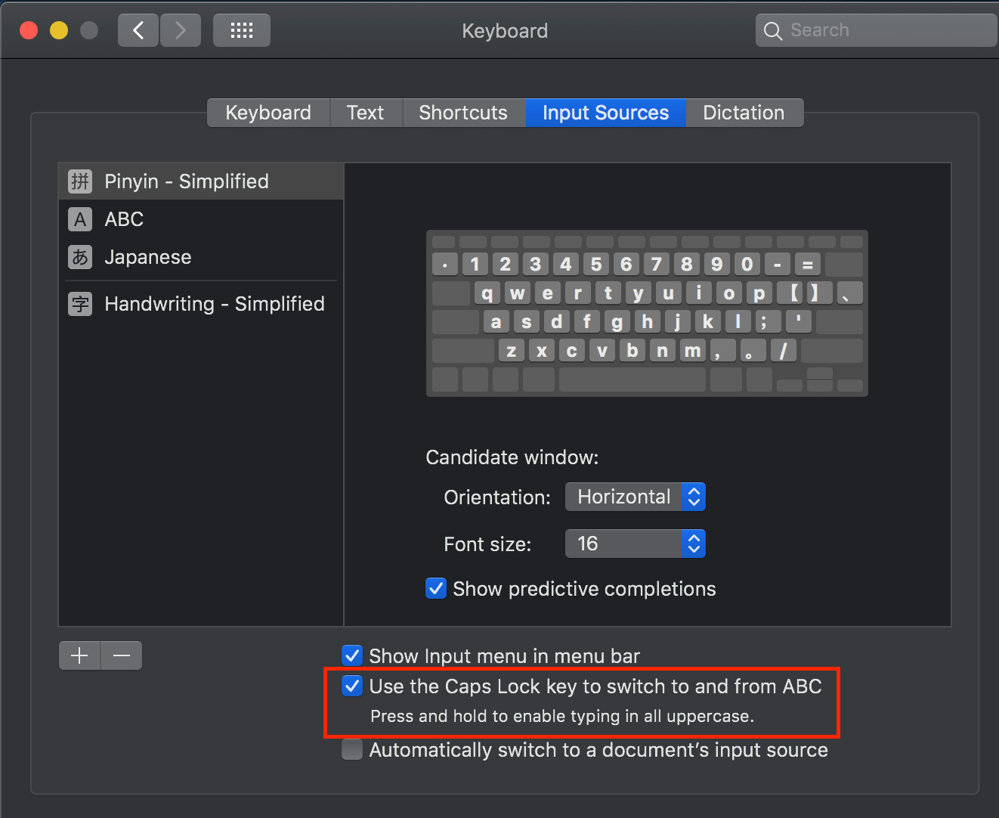
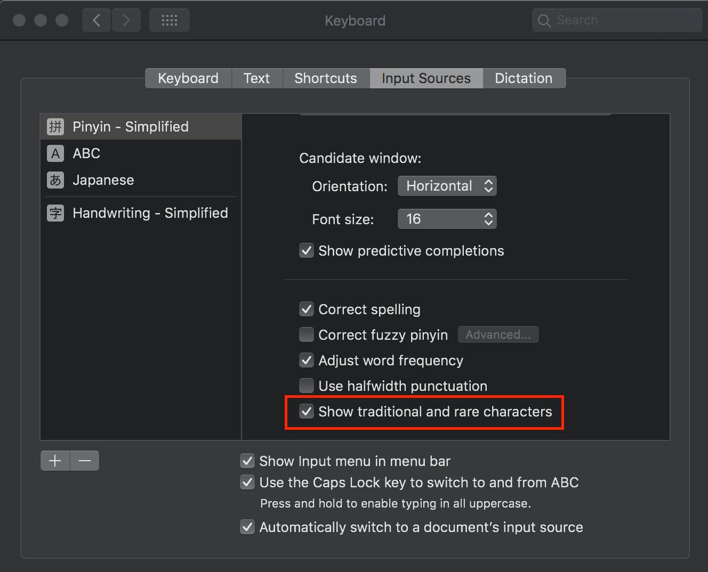
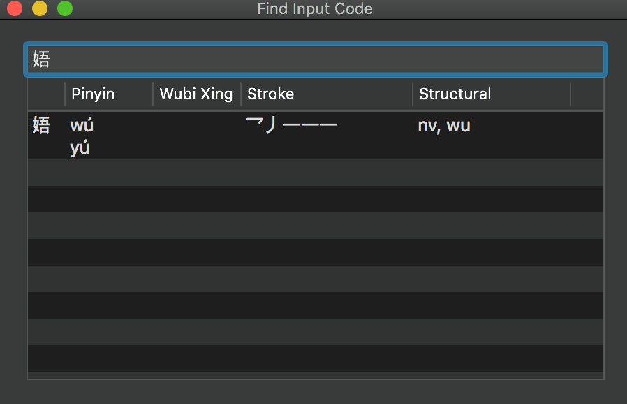

\[toc\]

## 前言

自从大学毕业以后我几乎就没有用过 `360`，`baidu` 以及 `sougo` 等国内的软件了，一方面是安全考虑，另一方面是越来越喜欢简单，直接，没有花里胡哨的功能和广告的应用，这也是我为什么后来转向 `Mac`，不管是硬件还是软件系统，都很简单，直接，虽然 `Mac` 也又很多这样那样的问题，不过总的来说设计理念跟我的想法还是比较契合的。说会主题输入法，我在 `Windows` 和 `Mac` 上都用的是自带的输入法，其实现在无论是 `Windows` 和 `Mac` 默认的一些软件，包括输入法和杀毒软件都已经做的非常好了，完全没必要另外安装第三方的，特别是我这种追求极致的简单的，功能一目了然的。但是其实 `Mac` 上的默认拼音输入法还是又很多小技巧，可能是大家不知道的，这篇文章整理一下 `Mac` 上的输入法使用技巧。

> 也曾经试过 `Rime` 输入法，在 `Mac` 上的版本是叫做鼠须管，严格来说它是一个输入引擎，几乎所有东西都可以自己定制的，但是使用起来过于麻烦了，想要真的制定到自己非常满意成本太高了，不过源码可以学习一下。另外也想过学五笔，五笔其实本身我到觉得很不错，不过我发现五笔输入的词库是一个很大的问题，比如我想输入 `长泽雅美`，`新垣结衣`，基本都是没有的，如果完全单字输入跟我的思维习惯是不符合的，所以也放弃了。

## 使用技巧

## 拼音转大写

`Mac` 上的拼音输入法是用大写锁定 `CapsLock` 键来切换中英文的，这和我们通常在 `Windows` 中使用 `Shift` 键不同，不过很多人不知道如何在拼音状态下切换到大写锁定的状态。

在 `System Preferences -> Keyboard -> Input Sources` 中 勾选下面的第二项，如下图。现在在拼音输入状态下，长按 `CapsLock` 键就是切换到大写英文，短按就是切换到小写英文。在这里另外给大家推荐一个软件 `CapsLocker`，这个软件在大写锁定切换的时候会发出声音，对我这种使用蓝牙键盘且看不到大写锁定状态的还是很有用的。

## 不同应用不同输入法

在上图中的第三个复选框就是不同的应用不同的输入法的功能，钩上即开启。这个功能刚开始用可能有点反直觉，至少我觉得输入法不全局有时候会造成混乱，但是如果习惯了还是挺有用的。比如我们写程序或者在终端一般都是英文状态，但是当我们切换到聊天软件或者浏览器的时候可能需要输入中文，这样在频繁切换的时候就会很麻烦，这时候钩上不同的应用自动切换输入法就会比较方便，不过这个需要适应一段时间。

## 选择文字注音

我们可以在输拼音的时候按 `tab` 会在四声之间切换，比如 `tān，tán，tǎn，tàn`，有时候这个功能还是有用的，能够帮我们快速找到目标字。

## 显示生僻字和繁体字

在使用 `Mac` 默认的拼音输入法的时候，有时候会发现有些字找不到，或者发现一个读音的字非常少，可能是你没有钩上下图中的 `show traditional and rare characters`。

## 中英文数字混输

在输入拼音的状态下，按住 `Shift` 就能输大写字母，按住 `Option` 则能输数字。

## 拆字输入

当遇到我们不知道一个字的读音的时候，可以通过拆字来输入这几个字的部分来输入这个字。这个功能在 `Windows` 和 `搜狗` 输入法中是按 `u` 然后输入，在 `Mac` 中是先输入单独部分然后使用快捷键 `Shift+空格键`，比如输入 `jiji` 然后按 `Shift+空格键`，就能输入 `喆`。

## 查找输入码

通过快捷键 `Option+Shift+L` 可以打开查找输入码的界面，然后复制字到里面就可以查看各种输入法中的输入码，在遇到不认识的字，或者想要查看五笔的输入码的时候都可以使用。

## 使用手写和虚拟键盘

快捷键 `Control+Shift+空格键` 可以打开手写界面，点击上方任务栏中的输入法图标点击 `show keyboard viewer` 可以打开虚拟键盘。

## emoji 以及特殊符号

`Command+Control+空格键` 可以打开 `emoji` 界面，点击右上角的图标可以选择更多图标。`Option+Shift+B` 也可以选择一些特殊符号以及颜文字。

## 自定义文本

在 `System Preferences -> Keyboard -> Text` 中我们可以自定义一些我们常用的短语或一些很生僻的字，甚至可以是一些我们常用的颜文字，自定义对应的输入码，这样我们就能够快速地输入这些内容。

## 任务栏图标

最后说一个和输入法不相关的 `Mac` 使用技巧，就是按住 `⌘` 拖动顶部任务栏的图标能够排列任务栏图标的顺序，并且下次打开应用还是按这个顺序排列的。

## 参考文章

1. [Mac 自带输入法这么好用，不看不知道](https://www.ifanr.com/app/800591 "Mac 自带输入法这么好用，不看不知道")