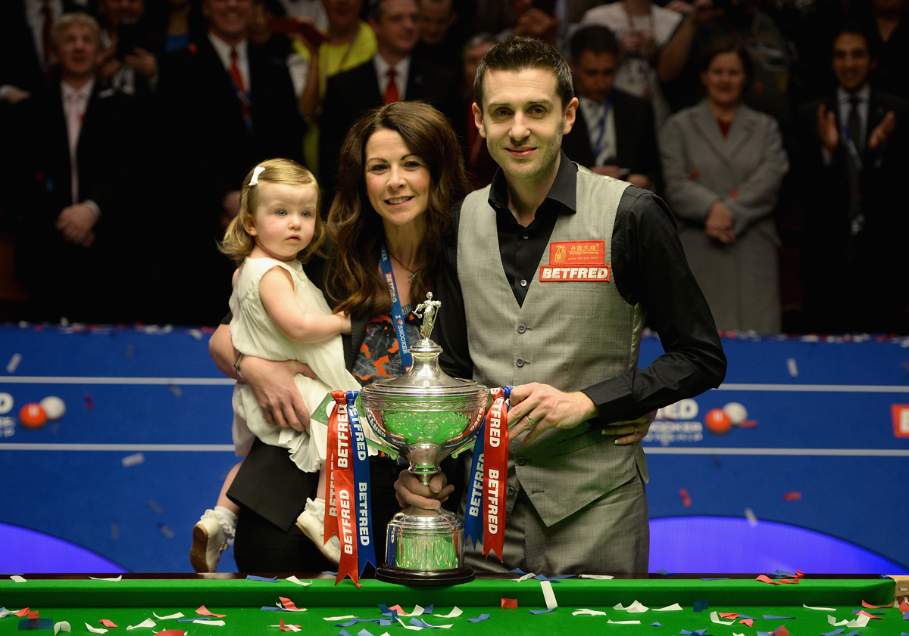

我是个非常业余的斯诺克爱好者，准确的说我没怎么打过斯诺克，基本和朋友玩都是玩中式八球，打的也很一般，纯属娱乐的那种，在我还小的时候我看着电视上的桌球比赛就和看乒乓球比赛一样，完全不知道这些人在干嘛，真不知道大人怎么看得下去的。

后来上了高中，由于篮球打的多，我突然对这种对力量角度控制极其严格的运动产生了极大兴趣，一有时间就和同学跑到学校对面的一家眼镜店的楼上打台球，那个台球桌质量非常差，空间也很小，经常遇到一些特殊角度的球球杆摆不开的情况，不过几个穷学生，去不起那种高级的桌球室，这种6块钱一个小时我们也的几个人凑一凑。

也是从这个时候开始，一有斯诺克比赛就会看，虽然高中的学习生活还是很紧张的，但是父母可能也觉得这并不是什么不良嗜好，一般有比赛也会让我看的。从大大小小的比赛中，我开始认识了一些斯诺克选手，奥沙利文，亨德利，丁俊晖，等等，这其中我最喜欢的就是马克塞尔比，我从他还没啥成绩的时候就很喜欢他，今天就来说说我最喜欢的这名斯诺克选手。

最初喜欢塞尔比他的外貌应该也是有一定影响的，我刚看球那会儿塞尔比刚刚二十三四岁，他梳着一个莫西干的头，总是面带搞怪的微笑，在80后的球员当中，塞尔比和尼尔罗伯逊的颜值应该算是最高的，塞尔比由于他的性格比较搞怪，心态总是比较好也愿意跟观众互动，让更多的人喜欢这个英国大男孩，我听庞卫国指导说过，塞尔比在中国是有相当多女粉丝的。

不过真正让我喜欢上塞尔比的是他在比赛中强大的心理素质和韧性，我自己很喜欢运动，也打过比赛，所以我很欣赏这种类型的运动员，塞尔比在比赛中表现出来的坚韧我认为同样是前无古人的。在很多人会放弃该局的局面，他不会，有时候甚至对面超分要做四五杆斯诺克他依然去尝试，在自己状态不好的时候他会放慢比赛节奏，更多的去防守以调整自己的手感。对于任何一个选手，面对塞尔比都是很头疼的，因为他太难缠了。他的这种比赛风格也为他招来了很多非议，在他没出成绩的时候还好，出了成绩以后很多球迷就会觉得他这种风格的比赛胜之不武，毕竟大家都喜欢看酣畅淋漓的进攻，如火箭，小特，小丁这种，甚至有些人拿著名大“磨”王彼得艾伯顿类比塞尔比，认为他继承了艾伯顿的衣钵，是下一代磨王。当我一直认为职业运动员就应该是功利的，就像乒乓球运动员在看到你有一个明显的弱点会一直盯着你这个弱点攻击，只要你没找到解决办法，你就无法取胜，况且塞尔比只是控制比赛节奏，和艾伯顿那种故意拖延时间是不一样的，他的攻击火力并不差，塞尔比的比赛我也不觉得像足球场上摆大巴那样无聊，还是相当具有观赏性的，况且斯诺克本身就是一个防守相当重要的项目，因为进攻火力再强的选手也总有手感不好的时候，在你手感不好的时候怎么调整，有些选手是默默等待，塞尔比是主动求变，控制节奏，他之所以有时候会去打一些好像已经没机会的局面，一方面是努力争取，另一方面是多到台上去打一打，不要一直坐着，自己找找手感，当对手手感火热的时候，经常是另一名选手在座位上看别人表演。他的韧性和爱动脑筋是最让我欣赏的两个方面，他的韧性和心态也让他打出了很多绝地翻盘的比赛，比如10年两次对奥沙利文的逆转（世锦赛1/4决赛5：9 - 13：11;大师赛6：9 - 10：9），那时候很多人称他为逆转王，也是从那个时候开始，塞尔比渐渐开始崭露头角，一点一点向着自己的巅峰前进。

塞尔比如此坚韧的精神和乐观的心态是与他人生经历分不开的，八岁的时候母亲和父亲关系恶化，抛下他和父亲离家出走从此再没出现过。后来他父亲带领他接触斯诺克，在莱斯特城的一家斯诺克俱乐部打球，他父亲就是该俱乐部的一名成员，他在这个俱乐部练习了两年，技术得到了很大的提高，一些成年人已经打不过他了，后来俱乐部不让他来打球了，原因是有些人认为输给一个孩子很丢人：），后来在沟通下他们同意他只能在每周六来练习两到三个小时，这时候塞尔比已经开始陆续击败一些俱乐部成员。还好后来莱斯特出生的斯诺克选手威利 ·索恩的兄弟马尔科姆·索恩发现塞尔比的斯诺克能力，为他提供了练习的场所塞尔比每天放学后就去他那里练习，一直持续了五六年，塞尔比说这是他最快乐的时光。在他还是个初中生的时候，他的父亲就带着他去全国各地参加比赛，他父亲尽自己所能赚更多的钱，把钱全部投入到他的身上，塞尔比一直很感激他的父亲为他所作的一切。不过短暂快乐的时光过后，塞尔比的人生遇到了极大的变故，1999年在他成为职业选手的两个月后，他的父亲以为癌症去世了，从检查到癌症到去世只过了一个月。他此时还未成年，只能寄居在堂哥家中，在人生遇到如此大挫折的时候，他没有想罗尼一样去用药物麻痹自己，他把自己埋在了训练室，疯狂的练习。同时可能因为缺乏母爱并且失去家庭的原因，他在19岁和一个大自己许多的女性结婚并且生了一个女儿，然后有草草离婚了。除了斯诺克他还会打一些其他类型的比赛比如花式桌球，因为有奖金。我想正是生活对他的这种磨砺让他如此坚韧，同时非常在意胜负，打球就是为了赢，这是他的信条，我认为对的。像奥沙利文那种享受比赛，完美主义同时还能赢球固然很吸引人，可是斯诺克这么多年，也就一个奥沙利文，其他选手要赢球只能找准自己的特点，找准自己的长处，让自己在比赛中尽量发挥自己的长处而规避自己的短处。他这种胜负心很重的心态在后来参加保罗亨特的葬礼后得到了改变，他觉得自己对于失败的态度更加成熟了。他父亲告诉他的无论输球或是赢球都不要把喜怒表现在脸上，我认为他做的非常好。上帝让他遭受了很多常人没有经历过的苦难，只留给他斯诺克，他紧紧的抓住了这跟稻草，并且通过自己的精神与智慧，成为了一名伟大的选手。早些年黑塞尔比成为了一种时尚，很多人说他没有风度，胜之不武，特别是很多罗尼的粉丝，但是伴随着他四年三夺世锦赛冠军，连续四年排名世界第一（仅次于亨德利6年和戴维斯5年），批评塞尔比的人要少很多了。说到底很多人没明白一个道理，职业运动员最终是靠成绩说话的。塞尔比自己也是一个不在乎舆论，非常自信固执的人，他会对你保持尊重，但同时他也会贯彻自己的想法执行到底。

在奥沙利文点名的八个有斯诺克智商的球员，吉米-怀特、阿历克斯-希金斯，希金斯、亨特、亨得利、史蒂夫-戴维斯、丁俊晖，也许还包括马克-塞尔比。我认为就打球的天赋而言塞尔比是这九个人当中最差的，亨特英年早逝，吉米怀特，亚历克斯希金斯我基本只能在录像中看他们的比赛，亨德利和戴维斯虽然我也看到他们职业生涯末端，但是他们已经不在巅峰。在80后球员里面，小丁的天赋绝对是最高的，我觉得小丁是跟希金斯一个档次的，奥沙利文和亨德利要高一点（小丁之前一直没能保持很好的比赛心态，导致他有点失去信心了，但是这两年小丁还是比以前成熟的，我相信他一定能拿到世界赛冠军）。但就智商和比赛心理我觉得塞尔比是前无古人的，斯诺克大赛往往是很长的赛制，在你手感不那么好的时候，如何控制自己的心态，如何控制局势，是赢得最后胜利的重要条件，换句话说，这是一种天赋。心态容易爆炸的马奎尔，包括丁俊晖，都不是能很好控制自己状态。这也是史蒂夫戴维斯说他是最好的比赛型选手，他是唯一能在自己状态不好的时候还能赢球的选手。

希望塞尔比保持状态，为我们奉献更多的精彩比赛，这位在自己球杆上印着小丑团的莱斯特城小丑，相信他还能在舞台上表演出更多精彩的篇章。 