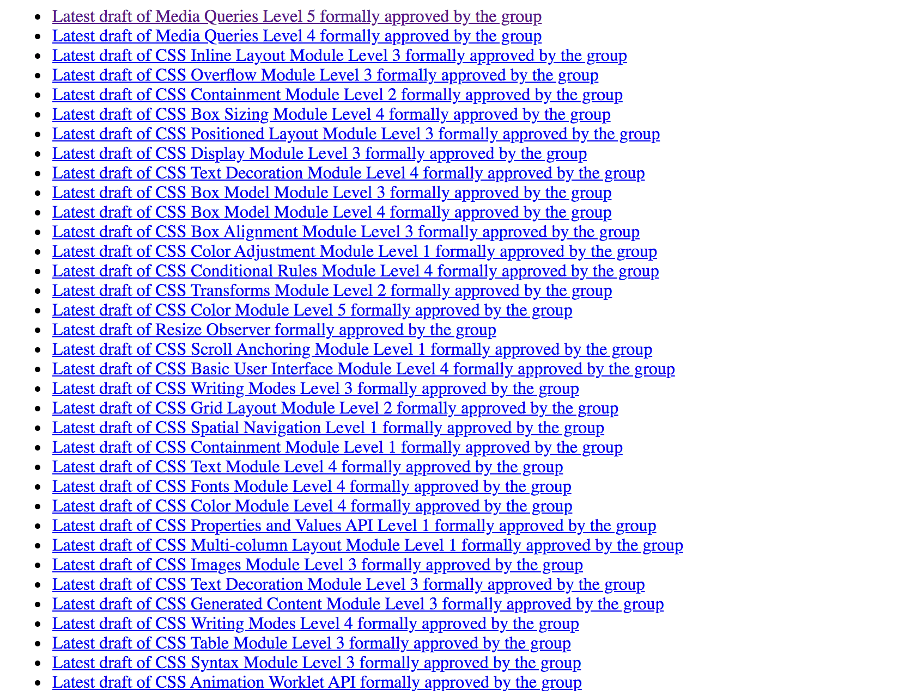

\[toc\]

## 前言

我们一般在[https://www.w3.org/TR/](https://www.w3.org/TR/ "https://www.w3.org/TR/")中查找前端相关的标准文档，但是各种各样的文档非常多，想要找到我们想要的文档有时候比较麻烦。今天就写一个简单的 `NodeJS` 的小爬虫来把所有的 `CSS` 相关文档爬取然后以列表的形式输出到一个页面上。

## 准备工作

新建一个项目，然后 `npm init` 初始化。然后安装依赖：

1. `superagent`：一个轻量的渐进式的 `ajax API`，我们用来请求目标页面。
2. `cheerio`：相当于 `jQuery`，我们用来处理 `DOM` 元素。
3. `express`：用来搭建一个简单的 `HTTP` 服务器，也可以直接用 `node` 自带的 `http` 模块。
4. `open`：在浏览器中打开目标页面，完成数据处理后展示用。

## 主要代码

整个处理逻辑非常简单，用 `superagent` 请求目标页面，分析页面的 `DOM` 解构，取出需要的部分，然后对数据进行包装，返回给页面。

## 请求页面

这里就是直接调用 `superagent` 来获取页面的 `DOM` 文档，返回的 `res` 是一个对象，我们需要使用的是其中的 `text` 属性的值，也就是 `DOM` 文档对应的字符串。

```javascript
superagent.get('https://www.w3.org/TR/').end((err, res) => {
    if (err) {
        console.log(`抓取失败：${err}`);
    } else {
        CSS_std = getCSSStd(res);
        console.log('complete!');
        open('http://localhost:3000/');
    }
});
```

## 解析文档

当我们已经获取了 `DOM` 文档以后我们要做的就是分析 `DOM` 解构，然后取出我们需要的内容。`w3.org` 的页面解构也很简单，我们在浏览器的开发者工具的帮助下很快能定位到我们需要的 `DOM` 解构。

```html
<li data-title="media queries level 5" data-tag="css" data-status="wd" data-version="upcoming ed" style="display: inline-block; opacity: 1;">
  <div class="profile">WD</div>
  <h2 class="WorkingDraft">
    <a href="https://www.w3.org/TR/2020/WD-mediaqueries-5-20200731/" title="Latest draft of Media Queries Level 5 formally approved by the group">Media Queries Level 5</a></h2>
  <p class="deliverer">Cascading Style Sheets (CSS) Working Group</p>
  <p class="pubdetails">2020-07-31 -
    <a title="Media Queries Level 5 publication history" href="/standards/history/mediaqueries-5">History</a>-
    <a href="https://drafts.csswg.org/mediaqueries-5/" title="Latest editor's draft of Media Queries Level 5">Editor's Draft</a></p>
  <ul class="editorlist">
    <li>Dean Jackson</li>
    <li>Florian Rivoal</li>
    <li>Tab Atkins Jr.</li></ul>
  <ul class="taglist">
    <li class="css">CSS</li></ul>
</li>
```

所有的标准还有草稿都是以列表的形式展示，在每一个列表元素中，我们需要的内容一个是标准或者草稿的名字，一个是 `url`，将他们解析出来放到一个对象中。

```javascript
function getCSSStd(res) {
    let stdArr = [];
    let $ = cheerio.load(res.text);

    $('#container [data-tag="css"]').each((idx, el) => {
        let std = {
            name: $(el).children('h2').children('a').attr('title'),
            url: $(el).children('h2').children('a').attr('href'),
        };
        stdArr.push(std);
    });
    return stdArr;
}
```

我们用 `cheerio.load` 方法将 `DOM` 字符串转化成一个类似 `jQuery` 对象的形式，然后就利用对象的方法将我们需要的属性取出依次存入一个数组中，几乎和 `jQuery` 没有什么区别，非常简单。

## 返回页面

现在我们已经获得了所有 `CSS` 相关的标准或草稿的名称和 `url`，剩下的就是将这些内容拼成一个 `HTML` 文档，通过 `express` 搭建的 `http` 服务器返回到浏览器上。

```javascript
function buildTemplate(arr) {
    let str = '';
    for (let i = 0; i < arr.length; i++) {
        str += `<li><a href="${arr[i].url}" target="_blank" rel="noopener noreferrer">${arr[i].name}</a></li>`;
    }
    return `<html name=clloz>
    <head>
    </head>
    <body>
        <ul>
           ${str}
        </ul>
    </body>
    </html>`;
}
```

循环遍历数组，将名称和 `url` 拼接成要返回的 `HTML` 文档字符串。

```javascript
let server = app.listen(3000, function () {
    let host = server.address().address;
    let port = server.address().port;
    console.log('Your App is running at http://%s:%s', host, port);
});

app.get('/', (req, res) => {
    res.setHeader('Content-Type', 'text/html');
    res.end(buildTemplate(CSS_std));
});
```

用 `express` 搭建 `HTTP` 服务器，监听 `3000` 端口，返回我们拼接完成的 `HTML` 文档。当解析完成之后，`open('http://localhost:3000/');` 会帮我们打开默认浏览器，我们就能看到所有 `CSS` 相关的标准链接。



> 完整代码查看[Github](https://github.com/Clloz/W3C_crawler "Github")

## 参考文章

1. [分分钟教你用nodejs写个爬虫](https://juejin.im/post/6844903640268800008 "分分钟教你用nodejs写个爬虫")
2. [十分钟教你撸一个nodejs爬虫系统](https://github.com/jiayisheji/blog/issues/7 "十分钟教你撸一个nodejs爬虫系统")