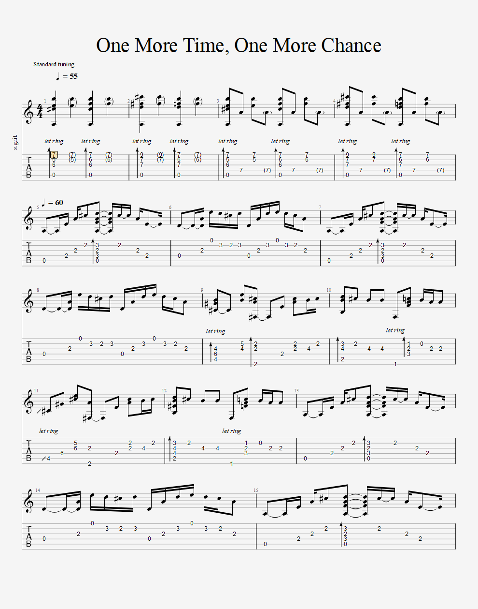
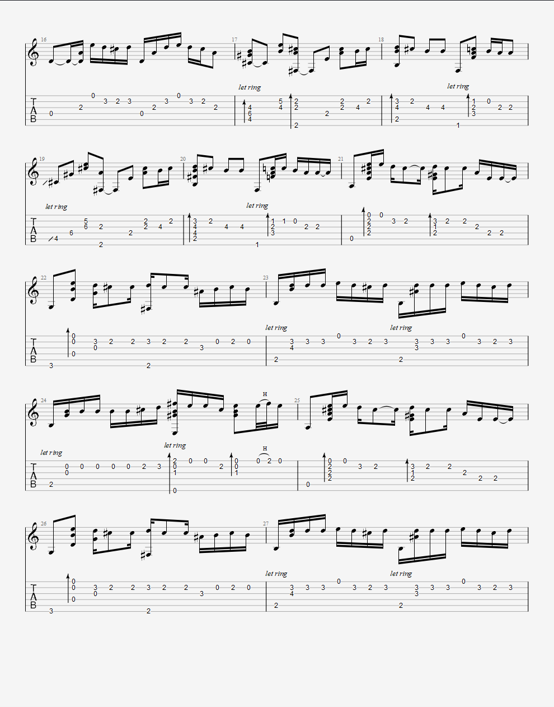
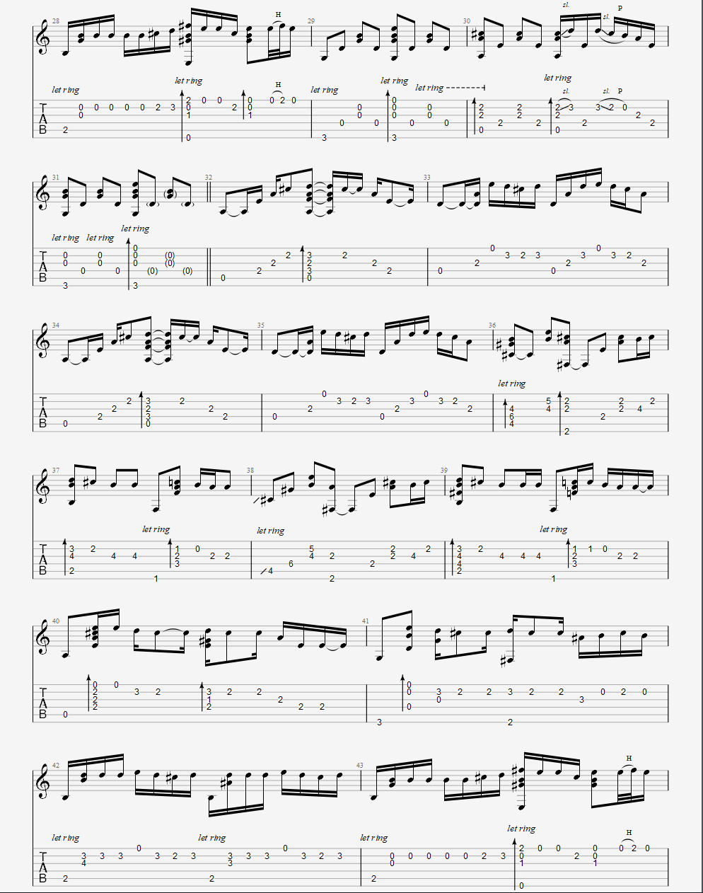
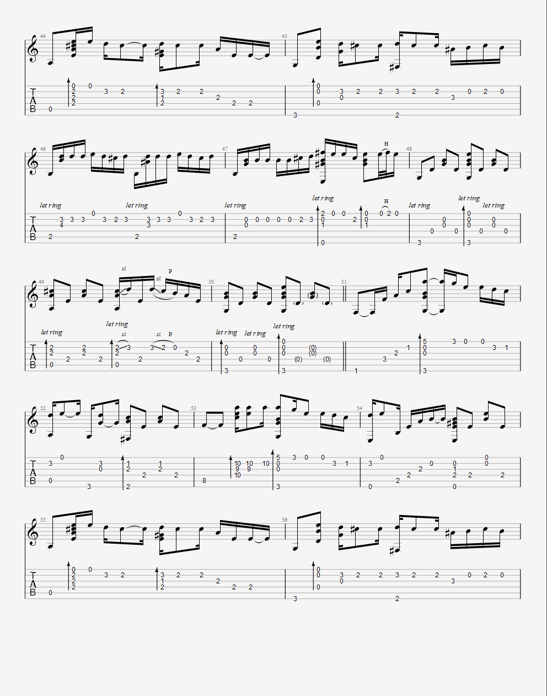
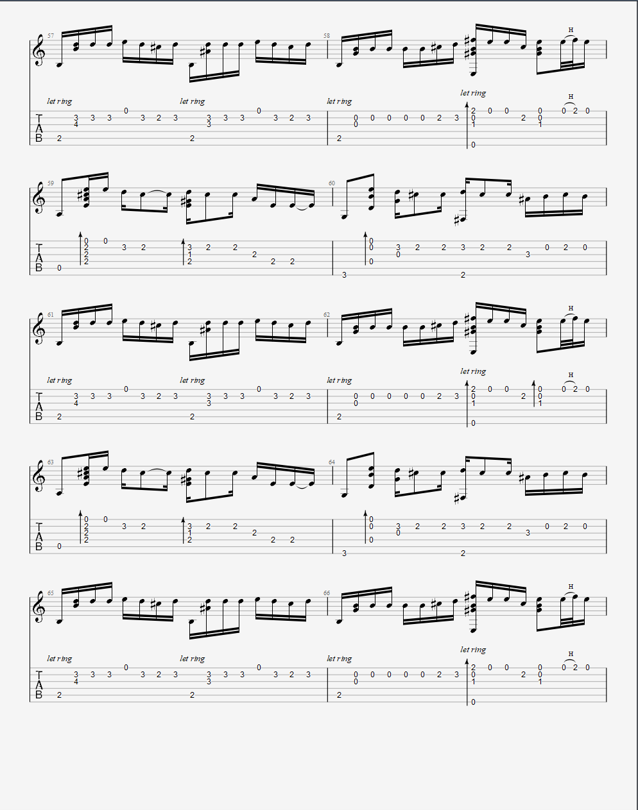
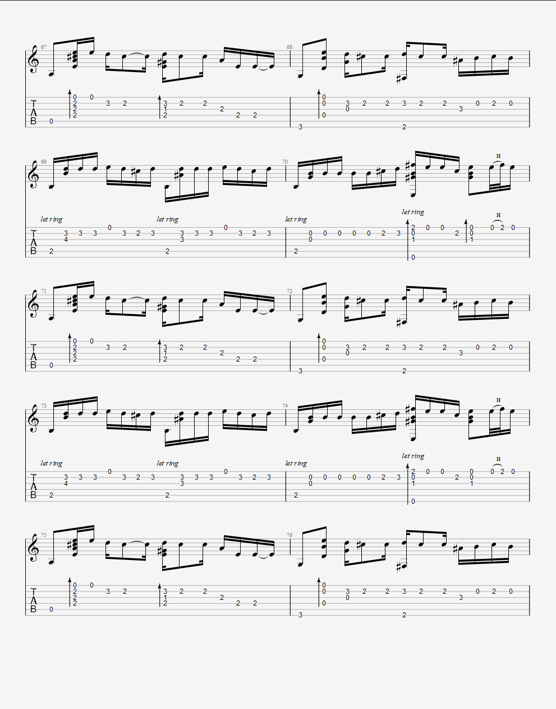
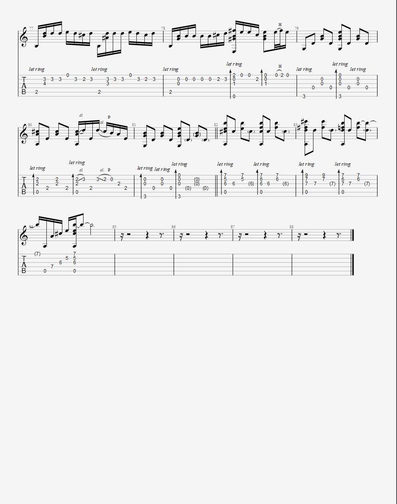

\[toc\]

## 前言

One more time One more chance是我非常喜欢的一首歌，这里分享一下这首歌的吉他谱。有guitar pro的同学也可以下载gtp的谱子，文末会放链接。

## 吉他谱

      

## 演奏

自己的演奏比较渣渣，下面是一位日本吉他手的演奏，是我看过的演奏的最好的一个版本。

<iframe src="//player.bilibili.com/player.html?aid=282548&amp;bvid=BV1Fx411F77N&amp;cid=588486&amp;page=1" style="width: 100%;height:350px" scrolling="no" border="0" frameborder="no" framespacing="0" allowfullscreen="true"></iframe>

## Gtp谱下载地址

链接：[百度网盘](https://pan.baidu.com/s/1TCwxLMpYDOy-QOPf5t1rBw "百度网盘") 提取码：338k