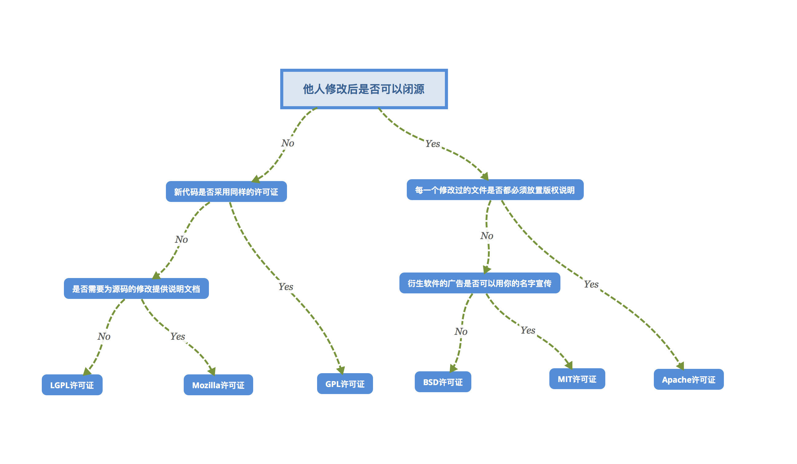

\[toc\]

## 前言

开源许可证授予任何人以任何目的使用，修改和共享许可软件的权限，但要遵守保护该软件的来源和开放性的条件。对于常用的开源许可证我们要理解他们的区别才能正确使用。常用的许可证区别可以看下图。

> `github` 有一个[页面](https://choosealicense.com/ "页面")帮助你选择开源许可证，另外还有一个网站[choosealicense](https://choosealicense.com/licenses/ "choosealicense")也有主要的许可证介绍。

## 许可证介绍

开源许可证可以分为两类：

- 宽松式（`permissive`）许可证：最基本的类型，对用户几乎没有限制。用户可以修改代码后闭源。用户可以使用代码，做任何想做的事情，不保证代码质量，用户自担风险，用户必须披露原始作者。常见的宽松式许可证有：`BSD`，`MIT`，`Apache 2.0`。
- `Copyleft` 许可证：比宽松式许可证严格。如果分发二进制格式，必须提供源码修改后的源码，必须与修改前保持许可证一致，不得在原始许可证以外，附加其他限制。核心就是修改后的代码不可以闭源。

> `Copyleft` 是理查德·斯托曼发明的一个词，作为 `Copyright` （版权）的反义词。`Copyright` 直译是"复制权"，这是版权制度的核心，意为不经许可，用户无权复制。作为反义词，`Copyleft` 的含义是不经许可，用户可以随意复制。

## BSD

`BSD` 有两个版本，两个版本的共同要求是分发软件时，必须保留原始的许可证声明。另外一个附加条款是不得使用原始作者的名字为软件促销。

## MIT License

`MIT License` 是一个非常宽松的许可证，你只要保留版权声明和许可声明就可以。你可以用代码做任何事情，包括闭源你的项目。使用这个许可证的项目有 `Babel`, `.NET Core`, `Rails` 和 `jQuery` 等。

## Apache License 2.0

`Apache License` 和 `MIT License` 类似，都很宽松，但是他包含了贡献者向用户提供专利授权相关的条款，分发软件时，必须保留原始的许可证声明。凡是修改过的文件，必须向用户说明该文件修改过；没有修改过的文件，必须保持许可证不变。使用该许可证的项目有 `Apache`、`SVN` 和 `NuGet`。

## GNU GPLv3

许可证。这是一种 `Copyleft` 许可证，要求修改项目代码的用户再次分发源码或二进制代码时，必须公布他的相关修改。

## GNU LGPLv3

和 `GPL` 的区别是：如果项目采用接口调用该许可证的库，项目可以不用开源。

## Mozilla Public License 2.0

只要该许可证的代码在单独的文件中，新增的其他文件可以不用开源。

## 不添加许可证

如果你不添加任何许可证，那么你的代码默认具有专有版权，别人不可以复制、分发和修改。当代码超过一个贡献者时，连你自己也不可以进行复制，分发和修改。`Github` 有用户协议，可以让其他用户查看和复制你的代码，但不代表可以用这个代码去做其他的事情。

## Github 添加许可证

想要知道一个 `Github` 仓库的许可证，看项目的页面右边的 `About` 区域即可（老版的 `Github` 在文件列表上方的 `tab` 末尾）

如何为我们的项目添加一个 `license` 呢，我们只要点击页面上的 `creat new file` 然后文件名填写 `LICENSE` （全大写），右边会出现一个 `choose a license template` 按钮，点进去选择自己想要的 `license` 然后完成文件的创建即可。具体流程参考[添加许可到仓库](https://docs.github.com/cn/github/building-a-strong-community/adding-a-license-to-a-repository "添加许可到仓库")

## 参考文章

1. [开源许可证教程](https://www.ruanyifeng.com/blog/2017/10/open-source-license-tutorial.html "开源许可证教程")