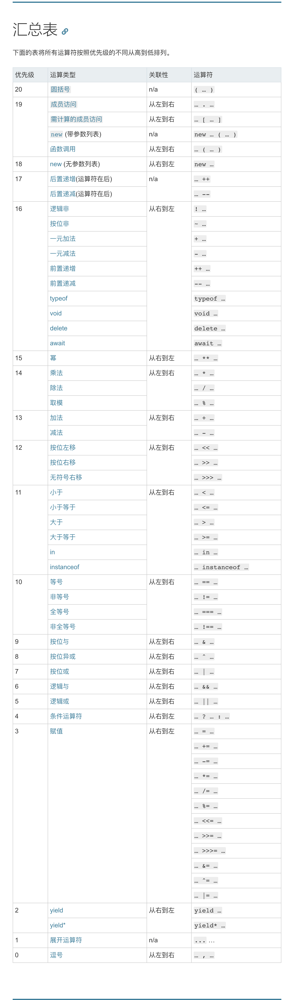

\[toc\]

## 前言

运算符优先级决定了表达式中运算执行的先后顺序，优先级越高的运算符会先执行。

## 运算符优先级

很多时候由于对运算符优先级的不确定，会用括号来确保表达式的执行顺序。如果搞清楚运算符的优先级，即使不用括号也能确保表达式按照正确的顺序执行。

其实单纯靠运算符的优先级来确定表达式的执行过程并不是一个绝对稳妥的做法，比如 `new a()['b']` 这样的表达式就没法套用运算符优先级。当然一般情况下，绝大多数表达式我们都可以利用运算符优先级来判断，如果确实遇到比较复杂的难以直观判断出来的情况还是要查询 `ECMAScript262` 标准中的产生式。对于 `new`，函数调用，成员访问三者结合的情况，比如 `new obj1.obj2.obj3.fun().prop` 这样的情况，我个人总结就是函数调用直接到前面的 `new` 先计算，得到的结果在进行成员访问。

## 表达式

## 左手表达式

左手表达式即 `Left-Hand-Side Expression`，即能出现在赋值运算左边的表达式。几乎所有的左手表达式都可以作为右手表达式，这在大部分编程语言中都是通用的。`JS` 中的左手表达式的详细规则请看[ECMAScript262-left-hand-side expression](https://www.ecma-international.org/ecma-262/11.0/index.html#sec-left-hand-side-expressions "ECMAScript262-left-hand-side expression")。标准中没有定义右手表达式，因为合法的表达式只要不是左手表达式就是右手表达式，所以不需要在单独定义。有一点需要注意的是 `++` 和 `--` 的操作数也要是一个左手表达式。

## 一些细节

1. 关联性和优先级一样重要，关联性决定了拥有相同优先级的运算符的执行顺序。
2. 优先级为 `19` 的除了图中 `member运算`、`带参数new` ，还有带标签的模版字符串（可以理解为和函数调用类似），`new.target`,`super作为对象使用（和成员访问相同）`
3. 函数调用的优先级在图中也是 `19`，但实际似乎优先级是要低于 `member运算` 和单参数 `new` 运算符的。当函数调用后接 `member` 运算符整个式子还是函数调用等级的。
4. 一元加、一元减和算术运算符的加减是不同的，一元加和一元减都会讲操作数转为 `Number`，这也是它可以将函数声明转为函数表达式的原因。