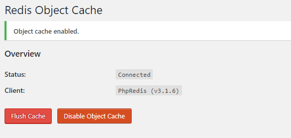

\[toc\]

## 前言

我的服务器上的 `php` 最早是安装的 `yum` 源中的 `5.4` ，今天尝试了一下把 `php` 升级到 `7.1`，同时开启 `wordpress` 的 `redis` 支持，把过程记录一下。

## 升级 PHP

升级过程非常简单，我采用的是卸载 `5.4` 版本然后安装 `7.1`，具体方法如下

1. 卸载旧版本 `PHP`

```bash
yum -y remove php* php-common
```

2. 安装第三方 `PHP7` 的 `yum` 源

```bash
rpm -Uvh https://mirror.webtatic.com/yum/el7/epel-release.rpm
rpm -Uvh https://mirror.webtatic.com/yum/el7/webtatic-release.rpm
```

3. 安装 `PHP7.1` 及相关模块

```bash
yum install -y php71w

yum install -y php71w-fpm php71w-opcache php71w-cli php71w-gd php71w-imap php71w-mysqlnd php71w-mbstring php71w-mcrypt php71w-pdo php71w-pecl-apcu php71w-pecl-mongodb php71w-pecl-redis php71w-pgsql php71w-xml php71w-xmlrpc php71w-devel mod_php71w
```

4. 安装完成检查一下 `PHP` 版本： `php -v`

## CentOS7 安装 redis 并设置开机启动

> 安装可以采取 `yum` 安装或者编译源码安装，我选择的是后者。

1. 下载源码并解压

```bash
wget http://download.redis.io/releases/redis-4.0.10.tar.gz

tar -xzf redis-4.0.10.tar.gz

cd redis-4.0.10
```

2. 编译

```bash
yum -y install gcc gcc-c++ kernel-devel
make
```

3. 安装

```bash
make PREFIX=/usr/local/redis install  #选择安装路径

mkdir /usr/local/redis/etc/  #创建redis文件夹

cp redis.conf /usr/local/redis/etc/  #复制配置文件到安装路径

cd /usr/local/redis/bin/

cp redis-benchmark redis-cli redis-server /usr/bin/
```

4. 更改配置文件

```bash
vim /usr/local/redis/etc/redis.conf
# 修改一下配置
# redis以守护进程的方式运行
# no表示不以守护进程的方式运行(会占用一个终端)
daemonize yes

# 客户端闲置多长时间后断开连接，默认为0关闭此功能
timeout 300

# 设置redis日志级别，默认级别：notice
loglevel verbose

# 设置日志文件的输出方式,如果以守护进程的方式运行redis 默认:""
# 并且日志输出设置为stdout,那么日志信息就输出到/dev/null里面去了
logfile stdout

# 设置密码授权
requirepass <设置密码>

# 监听ip
bind 127.0.0.1
```

5. 配置环境变量

```bash
vim /etc/profile
export PATH="$PATH:/usr/local/redis/bin"
# 保存退出

# 让环境变量立即生效
source /etc/profile
```

6. 配置启动脚本

```bash
#!/bin/bash
#chkconfig: 2345 80 90
# Simple Redis init.d script conceived to work on Linux systems
# as it does use of the /proc filesystem.

PATH=/usr/local/bin:/sbin:/usr/bin:/bin
REDISPORT=6379
EXEC=/usr/local/redis/bin/redis-server
REDIS_CLI=/usr/local/redis/bin/redis-cli

PIDFILE=/var/run/redis.pid
CONF="/usr/local/redis/etc/redis.conf"

case "$1" in
    start)
        if [ -f $PIDFILE ]
        then
                echo "$PIDFILE exists, process is already running or crashed"
        else
                echo "Starting Redis server..."
                $EXEC $CONF
        fi
        if [ "$?"="0" ]
        then
              echo "Redis is running..."
        fi
        ;;
    stop)
        if [ ! -f $PIDFILE ]
        then
                echo "$PIDFILE does not exist, process is not running"
        else
                PID=$(cat $PIDFILE)
                echo "Stopping ..."
                $REDIS_CLI -p $REDISPORT SHUTDOWN
                while [ -x ${PIDFILE} ]
               do
                    echo "Waiting for Redis to shutdown ..."
                    sleep 1
                done
                echo "Redis stopped"
        fi
        ;;
   restart|force-reload)
        ${0} stop
        ${0} start
        ;;
  *)
    echo "Usage: /etc/init.d/redis {start|stop|restart|force-reload}" >&2
        exit 1
esac
```

7. 开机启动设置

```bash
# 复制脚本文件到init.d目录下
cp redis /etc/init.d/

# 给脚本增加运行权限
chmod +x /etc/init.d/redis

# 查看服务列表
chkconfig --list

# 添加服务
chkconfig --add redis

# 配置启动级别
chkconfig --level 2345 redis on
```

8. 启动测试

```bash
systemctl start redis   #或者 /etc/init.d/redis start
systemctl stop redis   #或者 /etc/init.d/redis stop
systemctl enable redis
```

## Redis Object Cache 加速 WordPress

1. 下载phpredis源码并解压

```bash
wget https://github.com/phpredis/phpredis/archive/3.1.6.tar.gz
tar -xzvf 3.1.6.tar.gz
```

2. 进入目录执行命令

```bash
cd phpredis-3.1.6
/usr/bin/phpize
```

3. 配置并编译安装

```bash
./configure --with-php-config=/usr/bin/php-config
make
make install
```

4. 配置 `php` 的 `redis.ini`

```bash
cd /etc/php.d/
vi redis.ini #新建一个redis.ini：

#写入如下内容：
;Enable redis extension module
extension=redis.so
```

5. 重启`php`： `systemctl restart php-fpm`
    
6. 在 `wordpress` 后台安装 `Redis Object Cache` 安装好后点击 `Enable Object Cache`  若成功显示如下 
    
7. 查询 `redis` 数据
    

```bash
redis-cli
keys *
```

如果配置没有问题，将会查询到 `wordpress` 的数据。

## 总结

没有测试开启了 `redis` 以后网站的速度有没有变快，不过相信应该是有一定效果的。

**参考文章**： [使用Redis Object Cache加速WordPress](https://lala.im/2840.html "使用Redis Object Cache加速WordPress") [CentOS7源码编译安装Redis](https://www.cnblogs.com/stulzq/p/9288401.html "CentOS7源码编译安装Redis")