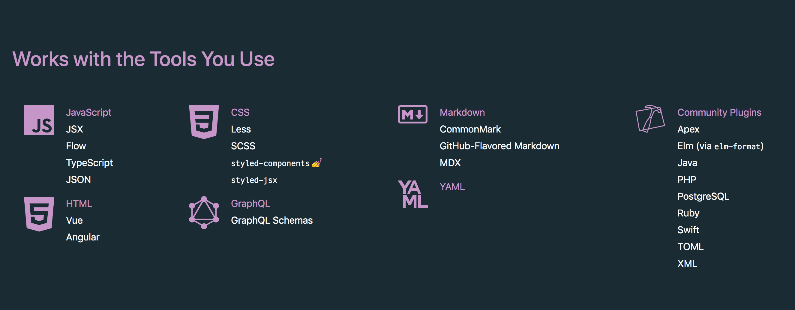
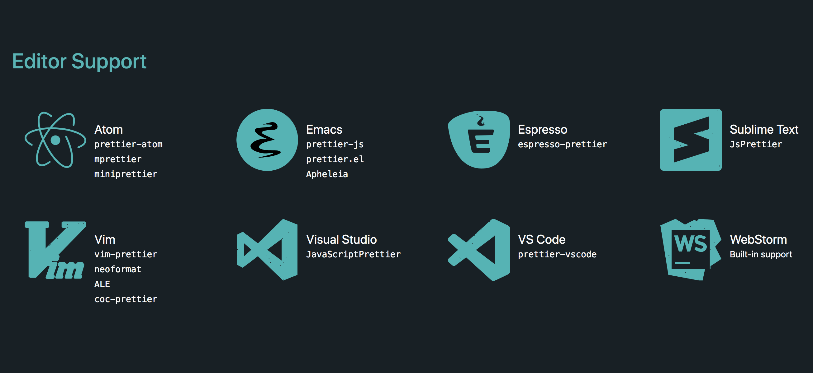
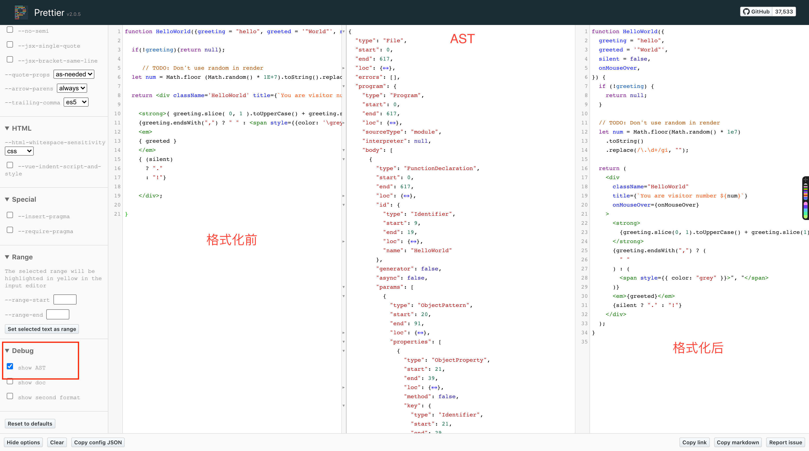
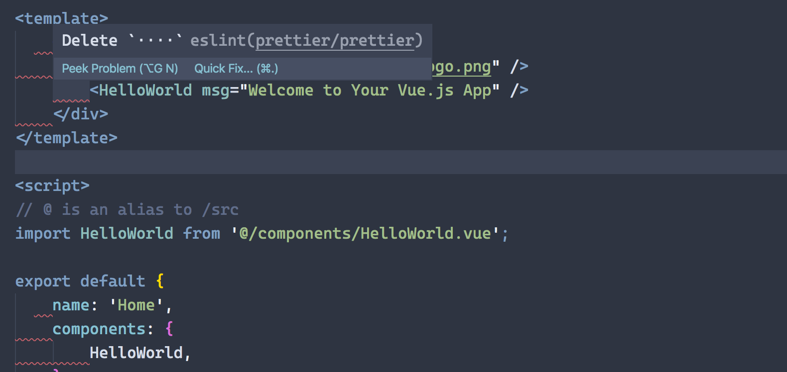

\[toc\]

## 前言

`prettier` 和 `eslint` 是我们写代码时非常有用的两个工具。`prettier` 帮我们格式化我们的代码，`eslint` 则帮我们进行代码检查。本文介绍一下两个工具的基础使用。

## prettier

- `prettier` 的官网：[prettier.io](https://prettier.io/ "prettier.io")。
- `Github` 地址：[prettier - Github](https://github.com/prettier/prettier "prettier - Github")。

官网对 `prettier` 介绍是一个支持多种语言的 `opinionated` 代码格式化工具，可以集成到多种编辑器，支持少量的配置。所谓 `opinionated`，英文翻译为武断的，固执己见的，也就是说 `prettier` 的配置都是设计好的，不支持自由配置（类似于 `Mac`，东西都在主板上给你焊死了，不支持自己升级配置）。

`prettier` 支持非常丰富的语言和编辑器集成，参考下图。





`prettier` 的原理很简单，就是把你的代码转化成一个抽象语法树 `AST` （因为 `AST` 是跟原本的代码风格无关的），然后根据 `AST` 将代码按照 `prettier` 的风格输出即可。想要看看 `prettier` 的转化过程，可以看 `prettier` 官方提供的[检测网站](https://prettier.io/playground/ "检测网站")（如果你有 `issue` 要提交也是先到这个页面复现你的 `bug` 然后提交链接到 `github`）。



## 安装使用

最基础的使用方式就是使用 `yarn` 或者 `npm` 安装，然后在命令行使用。

```bash
npm install --save-dev --save-exact prettier

yarn add --dev --exact prettier
```

然后在文件夹中创建配置文件和 `ignore` 文件。关于配置文件支持多种形式：

- 在 `package.json` 中添加一个 `prettier` 对象，在内部写入配置。
- 一个 `JSON` 或 `YAML` 格式的 `.prettierrc` 文件。
- 一个 `.prettierrc.json`, `.prettierrc.yml`, `.prettierrc.yaml`, 或 `.prettierrc.json5` 文件。
- 一个 `.prettierrc.js`, `.prettierrc.cjs`, `prettier.config.js` 或 `prettier.config.cjs` 文件，文件要用 `module.exports` `exprts` 一个对象。
- 一个 `prettierrc.toml` 文件。

关于 `.prettierignore` 文件，参考我关于 `ignore` 文件的语法的文章：[ignore语法](https://www.clloz.com/programming/assorted/2020/07/27/ignore-file-syntax/ "ignore语法")。

上面的工作全部完成就可以使用命令格式化我们的代码了。

```bash
npx prettier --write . #格式化所有文件
```

## vscode 集成

在命令行中使用时非常麻烦的，一般来说我们都是在编辑器中使用 `prettier`。这里讲一讲我平时在 `vscode` 中的配置。

首先是安装 `extension`：[prettier - vscode](https://marketplace.visualstudio.com/items?itemName=esbenp.prettier-vscode "prettier - vscode")。然后用快捷键 ⇧ + ⌘ + P 来启动 `Command palette`，找到 `format XXX with` 然后选择 `Configure default formatter`，选择 `prettier` 即可设置为默认的格式化工具。

想要在保存时自动格式化，我们可以用 ⌘ + `,` 打开设置页面，找到 `format on save` 打上勾即可。

这些配置都是可以在 `setting.json` 中进行配置的，这里我放上我的关于 `prettier` 的 `vscode` 配置。

```json
{
    "editor.formatOnSave": true,
    //prettier
    "[html]": {
        "editor.defaultFormatter": "esbenp.prettier-vscode"
    },
    "[javascript]": {
        "editor.defaultFormatter": "esbenp.prettier-vscode"
    },
    "[typescript]": {
        "editor.defaultFormatter": "esbenp.prettier-vscode"
    },
    "[css]": {
        "editor.defaultFormatter": "esbenp.prettier-vscode"
    },
    "[less]": {
        "editor.defaultFormatter": "esbenp.prettier-vscode"
    },
    /*  prettier的配置 */
    "prettier.printWidth": 100, // 超过最大值换行
    "prettier.tabWidth": 4, // 缩进字节数
    "prettier.useTabs": false, // 缩进不使用tab，使用空格
    "prettier.semi": true, // 句尾添加分号
    "prettier.singleQuote": true, // 使用单引号代替双引号
    "prettier.proseWrap": "preserve", // 默认值。因为使用了一些折行敏感型的渲染器（如GitHub comment）而按照markdown文本样式进行折行
    "prettier.arrowParens": "avoid", //  (x) => {} 箭头函数参数只有一个时是否要有小括号。avoid：省略括号
    "prettier.bracketSpacing": true, // 在对象，数组括号与文字之间加空格 "{ foo: bar }"
    "prettier.disableLanguages": ["vue"], // 不格式化vue文件，vue文件的格式化单独设置
    "prettier.endOfLine": "auto", // 结尾是 \n \r \n\r auto
    //"prettier.eslintIntegration": false, //不让prettier使用eslint的代码格式进行校验
    "prettier.htmlWhitespaceSensitivity": "ignore",
    "prettier.ignorePath": ".prettierignore", // 不使用prettier格式化的文件填写在项目的.prettierignore文件中
    "prettier.jsxBracketSameLine": false, // 在jsx中把'>' 是否单独放一行
    "prettier.jsxSingleQuote": false, // 在jsx中使用单引号代替双引号
    "prettier.requireConfig": false, // Require a 'prettierconfig' to format prettier
    "prettier.trailingComma": "es5", // 在对象或数组最后一个元素后面是否加逗号（在ES5中加尾逗号）
}
```

`setting.json` 中的配置是对所有项目生效的，你也可以在项目中创建 `prettier` 的配置文件进行覆盖。

## ESLint

在说 `ESLint` 之前我们先说一下 `lint`，在计算机科学中，`lint` 是一种工具的名称，它用来标记代码中，某些可疑的、不具结构性（可能造成 `bug`）的语句。它是一种静态程序分析工具，最早适用于 `C` 语言，在 `UNIX` 平台上开发出来。后来它成为通用术语，可用于描述在任何一种编程语言中，用来标记代码中有疑义语句的工具。简单的说就是用来检查代码错误的工具。

`ESLint` 是由 `Nicholas C. Zakas`（《`JavaScript` 高级程序设计》的作者）在 `2013` 年创建的一个开源项目，最初的目的提供一个插件化的 `javascript` 代码检测工具。代码检查是一种静态的分析，常用于寻找有问题的模式或者代码，并且不依赖于具体的编码风格。对大多数编程语言来说都会有代码检查，一般来说编译程序会内置检查工具。

`JavaScript` 是一个动态的弱类型语言，在开发中比较容易出错。因为没有编译程序，为了寻找 `JavaScript` 代码错误通常需要在执行过程中不断调试。像 `ESLint` 这样的可以让程序员在编码的过程中发现问题而不是在执行的过程中。

`ESLint` 的初衷是为了让程序员可以创建自己的检测规则。`ESLint` 的所有规则都被设计成可插入的。`ESLint` 的默认规则与其他的插件并没有什么区别，规则本身和测试可以依赖于同样的模式。为了便于人们使用，`ESLint` 内置了一些规则，当然，你可以在使用过程中自定义规则。`ESLint` 使用 `Node.js` 编写，这样既可以有一个快速的运行环境的同时也便于安装。

`ESLint` 同样支持 `.eslintignore` 文件。

## 安装使用

在安装使用 `ESLint` 之前我需要先 `npm init` 生成 `package.json`。

```bash
npm install eslint --save-dev

npx eslint --init
```

使用 `eslint --init` 命令后，程序会让你选择一系列的配置选项，比如是浏览器环境还是 `node` 环境，是否是 `TypeScript`，配置文件类型（`JSON`，`JavaScript` 和 `YAML`）等。全部选择完成后会生成一个配置文件。然后你就可以使用 `npx eslint yourfile.js` 命令来检查你的文件了。

`eslint --init` 相当于初始化配置文件，熟练后可以根据自己的需求手动创建。

> 不推荐全局安装。

## 配置

`ESLint` 提供了三种配置方式：

- `Configuration Comments`: 使用 `JavaScript` 注释把配置信息直接嵌入到一个代码源文件中。
- `Configuration Files` - 使用 `JavaScript`、`JSON` 或者 `YAML` 文件为整个目录（处理你的主目录）和它的子目录指定配置信息。
- 可以配置一个独立的 `.eslintrc.*` 文件，或者直接在 `package.json` 文件里的 `eslintConfig` 字段指定配置，`ESLint` 会查找和自动读取它们，再者，你可以在命令行运行时指定一个任意的配置文件。

不同类型的配置文件的优先级如下：

1. `.eslintrc.js`
2. `.eslintrc.yaml`
3. `.eslintrc.yml`
4. `.eslintrc.json`
5. `.eslintrc`
6. `package.json`

在项目根目录有配置文件的情况下我们也可以为子目录创建独立的配置文件 。对子目录进行代码检测侧时候，两者会结合，但是子目录的配置文件优先级更高。如果你不想在子目录中的代码检测使用根目录的配置文件，那么在子目录的配置文件中加上 `"root": true`，就会把子目录当成根目录，不会再向上查找。

> 如果你在你的主目录（通常 `~/`）有一个配置文件，`ESLint` 只有在无法找到其他配置文件时才使用它。

* * *

主要的配置参数包括：

- `Environments` - 指定脚本的运行环境。每种环境都有一组特定的预定义全局变量。
- `Globals` - 脚本在执行期间访问的额外的全局变量。
- `extends`：引用基础文件中的规则。可以指定配置的字符串(配置文件的路径、可共享配置的名称、eslint:recommended 或 eslint:all)；也可以是字符串数组：每个配置继承它前面的配置。
- `plugin`：插件。
- `parseOption`：解析器选项（语言选项）。
- `rules`： 启用的规则及其各自的错误级别。该属性可以做下面的任何事情以扩展（或覆盖）规则：
    
    - 启用额外的规则
    - 改变继承的规则级别而不改变它的选项：
    - 基础配置：`"eqeqeq": ["error", "allow-null"]`
    - 派生的配置：`"eqeqeq": "warn"`
    - 最后生成的配置：`"eqeqeq": ["warn", "allow-null"]`
    - 覆盖基础配置中的规则的选项
    - 基础配置：`"quotes": ["error", "single", "avoid-escape"]`
    - 派生的配置：`"quotes": ["error", "single"]`
    - 最后生成的配置：`"quotes": ["error", "single"]`

更多的配置选项参考[官方配置文档](https://cn.eslint.org/docs/user-guide/configuring "官方配置文档")

##### Parse Options

`ESLint` 允许你指定你想要支持的 `JavaScript` 语言选项（用字段 `parseOptions`）。默认情况下，`ESLint` 支持 `ECMAScript 5` 语法。你可以覆盖该设置，以启用对 `ECMAScript` 其它版本和 `JSX` 的支持。

> 请注意，支持 `JSX` 语法并不等同于支持 `React`。要支持 `React` 请使用 `eslint-plugin-react` 插件。

解析器选项可以在 .eslintrc.\* 文件使用 parserOptions 属性设置。可用的选项有：

- `ecmaVersion` - 默认设置为 `3`，`5`（默认）， 你可以使用 `6、7、8、9 or 10` 来指定你想要使用的 `ECMAScript` 版本（目前一般设为 `11`）。你也可以用使用年份命名的版本号指定为 `2015`（同 `6`），2016（同 `7`），或 `2017`（同 `8`）或 `2018`（同 `9`）或 `2019` (同 `10`)
- `sourceType` - 设置为 "`script`" (默认) 或 "`module`"（如果你的代码是 `ECMAScript` 模块)。
- `ecmaFeatures` - 这是个对象，表示你想使用的额外的语言特性:
    
    - `globalReturn` - 允许在全局作用域下使用 `return` 语句
    - `impliedStrict` - 启用全局 strict mode (如果 `ecmaVersion` 是 `5` 或更高)
    - `jsx` - 启用 `JSX`
    - `experimentalObjectRestSpread` - 启用实验性的 `object rest/spread properties` 支持。(重要：这是一个实验性的功能,在未来可能会有明显改变。 建议你写的规则**不要**依赖该功能，除非当它发生改变时你愿意承担维护成本。)

##### Parser

`ESLint` 默认使用 `Espree` 作为其解析器，你可以在配置文件中指定一个不同的解析器（字段 `parser`），只要该解析器符合下列要求：

- 它必须是一个 `Node` 模块，可以从它出现的配置文件中加载。通常，这意味着应该使用 `npm` 单独安装解析器包。
- 它必须符合 `parser interface`。

以下解析器与 `ESLint` 兼容：

- `Esprima`
- `Babel-ESLint` - 一个对 `Babel` 解析器的包装，使其能够与 `ESLint` 兼容。比如在 `class` 中使用箭头函数创建方法就需要 `babel-eslint` 的支持，需要安装 `babel-eslint`。
- `@typescript-eslint/parser` - 将 `TypeScript` 转换成与 `estree` 兼容的形式，以便在 `ESLint` 中使用。

注意，在使用自定义解析器时，为了让 `ESLint` 在处理非 `ECMAScript 5` 特性时正常工作，配置属性 `parserOptions` 仍然是必须的。解析器会被传入 `parserOptions`，但是不一定会使用它们来决定功能特性的开关。

> 即使满足这些兼容性要求，也不能保证一个外部解析器可以与 `ESLint` 正常配合工作，`ESLint` 也不会修复与其它解析器不兼容的相关 `bug`。

##### Processor

插件可以提供处理器。处理器可以从另一种文件中提取 `JavaScript` 代码，然后让 `ESLint` 检测 `JavaScript` 代码。或者处理器可以在预处理中转换 `JavaScript` 代码。

处理器用字段 `processor` 设置，一般都是和插件配合使用。可以为特定类型的文件指定处理器，使用 `overrides` 字段和 `processor` 字段的组合。

```json
{
    "plugins": ["a-plugin"],
    "processor": "a-plugin/a-processor"
}

{
    "plugins": ["a-plugin"],
    "overrides": [
        {
            "files": ["*.md"],
            "processor": "a-plugin/markdown"
        },
        {
            "files": ["**/*.md/*.js"],
            "rules": {
                "strict": "off"
            }
        }
    ]
}
```

##### Environments

一个环境定义了一组预定义的全局变量。可用的环境包括：

- `browser` - 浏览器环境中的全局变量。
- `node` - `Node.js` 全局变量和 `Node.js` 作用域。
- `commonjs` - `CommonJS` 全局变量和 `CommonJS` 作用域 (用于 `Browserify/WebPack` 打包的只在浏览器中运行的代码)。
- `shared-node-browser` - `Node.js` 和 `Browser` 通用全局变量。
- `es6` - 启用除了 `modules` 以外的所有 `ECMAScript 6` 特性（该选项会自动设置 `ecmaVersion` 解析器选项为 `6`）。
- `worker` - Web Workers 全局变量。
- `amd` - 将 `require()` 和 `define()` 定义为像 `amd` 一样的全局变量。
- `mocha` - 添加所有的 `Mocha` 测试全局变量。
- `jasmine` - 添加所有的 `Jasmine` 版本 `1.3` 和 `2.0` 的测试全局变量。
- `jest` - `Jest` 全局变量。
- `phantomjs` - `PhantomJS` 全局变量。
- `protractor` - `Protractor` 全局变量。
- `qunit` - `QUnit` 全局变量。
- `jquery` - `jQuery` 全局变量。
- `prototypejs` - `Prototype.js` 全局变量。
- `shelljs` - `ShellJS` 全局变量。
- `meteor` - `Meteor` 全局变量。
- `mongo` - `MongoDB` 全局变量。
- `applescript` - `AppleScript` 全局变量。
- `nashorn` - `Java 8 Nashorn` 全局变量。
- `serviceworker` - `Service Worker` 全局变量。
- `atomtest` - `Atom` 测试全局变量。
- `embertest` - `Ember` 测试全局变量。
- `webextensions` - `WebExtensions` 全局变量。
- `greasemonkey` - `GreaseMonkey` 全局变量。

这些环境并不是互斥的，所以你可以同时定义多个。除了在 `.eslintrc.js` 配置文件中设置，还可以可以在源文件里使用注释来指定环境，也可以在配置文件中或使用命令行的 `--env` 选项来指定环境。

```javascript
//在JavaScript文件中使用注释
/* eslint-env node, mocha */

//在配置文件中
{
    "env": {
        "browser": true,
        "node": true
    }
}

//在特定插件中使用某个环境，确保插件已安装
{
    "plugins": ["example"],
    "env": {
        "example/custom": true
    }
}
```

##### Globals

自定义可以使用的全局变量。每个变量有三个选项，`writable`，`readonly` 和 `off`，分别表示可重写，不可重写和禁用。

```javascript
"globals": {
        "var1": "writable",
        "var2": "readonly",
        "Promise": "off"
}

//要启用no-global-assign规则来禁止对只读的全局变量进行修改。
{
    "rules": {
        "no-global-assign": ["error", {"exceptions": ["Object"]}]
    }
}
```

##### 规则 Rules

规则就是具体的代码检查选项了，所有的规则默认都是禁用的。在配置文件中，使用 `"extends": "eslint:recommended"` 来启用推荐的规则，报告一些常见的问题，在下文中这些推荐的规则都带有一个标记。命令行的 -`-fix` 选项用来自动修复规则所报告的问题（目前，大部分是对空白的修复），在下文中会有一个的图标。

规则的数量非常多，大家阅读[官方文档](https://cn.eslint.org/docs/rules/ "官方文档")根据需要选择。

直接在 `rules` 对象中设置规则是对 `eslint` 自身的规则修改，如果你使用了 `plugin` 和 `config` 那么也可以在 `rules` 对象中添加对象来针对这些 `plugin` 和 `config` 进行修改。比如我们安装的 `eslint-plugin-prettier` 插件和 `eslint-config-prettier` 默认会有一个配置（`plugin` 和 `config` 的内容见下方）。我们要对插件的规则进行配置（插件规则默认都是不开启的）可以使用 `plugin-name/rule-name` 的形式；如果想对 `config` 进行配置（`config` 相当于官方给出的某个插件的默认配置，不需要我们手动写 `rules` 了），那么我们可以使用 `plugin-name/config-name: {}` 的形式，在大括号中写上我们要对 `config` 进行覆盖的配置，比如我们要对 `eslint-config-prettier` 中的某些规则重写，可以以下面的形式：

```javascript
rules: {
    'prettier/prettier': [
        'warn',
        {
            semi: true,
            singleQuote: true,
            tabWidth: 4,
            trailingComma: 'all',
            arrowParens: 'avoid',
        },
    ],
}
```

##### plugins 和 extends

这里说一下 `plugins` 和 `extends`。插件就是某些规则不包含在 `eslint` 的规则中，需要额外添加，比如 `eslint-plugin-react` 和 `eslint-plugin-vue` 等。添加的 `plugins` 中的规则默认也是不开启的，我们需要在 `rules` 中选择我们要使用的规则。也就是说 `plugins` 是要和 `rules` 结合使用的。

```javascript
//  .eslintrc.js
module.exports = {
  plugins: [
    'eslint-plugin-react'
  ],
  rules: {
    'eslint-plugin-react/jsx-boolean-value': 2
  }
}
```

`extends` 则可以理解为一份配置好的 `plugin` 和 `rules`。比如在 `eslint-plugin-react` 中我们可以看到根目录的 `index.js` 的 `module.exports` 输出为：

```javascript
module.exports = {
  deprecatedRules,
  rules: allRules,
  configs: {
    recommended: {
      plugins: [
        'react'
      ],
      parserOptions: {
        ecmaFeatures: {
          jsx: true
        }
      },
      rules: {
        'react/display-name': 2,
        'react/jsx-key': 2,
        'react/jsx-no-comment-textnodes': 2,
        'react/jsx-no-duplicate-props': 2,
        'react/jsx-no-target-blank': 2,
        'react/jsx-no-undef': 2,
        'react/jsx-uses-react': 2,
        'react/jsx-uses-vars': 2,
        'react/no-children-prop': 2,
        'react/no-danger-with-children': 2,
        'react/no-deprecated': 2,
        'react/no-direct-mutation-state': 2,
        'react/no-find-dom-node': 2,
        'react/no-is-mounted': 2,
        'react/no-render-return-value': 2,
        'react/no-string-refs': 2,
        'react/no-unescaped-entities': 2,
        'react/no-unknown-property': 2,
        'react/no-unsafe': 0,
        'react/prop-types': 2,
        'react/react-in-jsx-scope': 2,
        'react/require-render-return': 2
      }
    },
    all: {
      plugins: [
        'react'
      ],
      parserOptions: {
        ecmaFeatures: {
          jsx: true
        }
      },
      rules: activeRulesConfig
    }
  }
};
```

它里面就提供了 `recommended` 和 `all` 两种已经设计好的配置供我们使用。这样我们就不用一条一条选择自己要使用的规则了。`extends` 除了使用 `plugin` 中 `config name` 的加载方式，往往也会使用 `eslint-config-xxxx` 这样命名的包。主要是因为有些最佳实践往往不需要像插件一样引入新的规则，只需要去导出一份 `eslint` 配置即可。

```javascript
module.export = {
    extends: [
        'eslint-plugin-react/recommended'
    ]
}
```

## VS Code 的使用

安装 `extension` 即可，分享我自己的配置。

```json
"editor.codeActionsOnSave": {
    "source.fixAll": true,
    "source.fixAll.eslint": true
},
//eslint
"eslint.enable": true, //是否开启vscode的eslint
"eslint.alwaysShowStatus": true,
"eslint.quiet": true,
"eslint.validate": ["javascript", "javascriptreact", "vue", "html"],
"eslint.options": {
    //指定vscode的eslint所处理的文件的后缀
    "extensions": [".js", ".vue", ".ts", ".tsx"]
},
```

* * *

`extends` 中很多时候会用简写和命名空间。命名空间就是 `@` 开头的包，就是一些官方的包，比如 `vue` 的官方包都在 `@vue` 下面，`@vue/cli-service` 、`@vue/eslint-config-prettier` 等。而且 `eslint` 规定了 `plugins` 和 `extends` 属性值都可以省略前缀 `eslint-plugin` 和 `eslint-config`，所以我们在 `extends` 中会看各种省略后的属性。比如下面几种情况：

- `plugin:vue/strongly-recommended`：表示 `eslint-plugin-vue` 包中的 `strongly-recommended` 配置
- `eslint:recommended`：表示 `eslint-config-eslint` 包中的 `recommended` 配置
- `@vue/prettier`: 表示 `@vue/eslint-config-prettier` 包中的默认配置，一般就是 `index.js`

顺便说一下，`vue cli` 的默认 `prettier` 配置，也就是 `@vue/prettier` 中使用的默认配置的 `rules` 中并没有写任何配置。

```javascript
module.exports = {
  plugins: ['prettier'],
  extends: [
    require.resolve('eslint-config-prettier'),
    require.resolve('eslint-config-prettier/vue')
  ],
  rules: {
    'prettier/prettier': 'warn'
  }
}
```

我们需要手动添加配置，如果你在初始化的时候选择的单独配置文件就新建一个 `.prettierrc.js` 文件然后用 `module.exports` 来写配置，如果你是选择的在 `package.json` 中设置配置就在 `package.json` 中的 `eslintConfig` 字段中的 `rules` 写上自己的配置。注意每条 `rules` 都要设置一个 `rules id`，它的取值和含义如下：

- `"off"` 或 `0` - 关闭规则
- `"warn"` 或 `1` - 开启规则，使用警告级别的错误：`warn` (不会导致程序退出)
- "`error"` 或 `2` - 开启规则，使用错误级别的错误：`error` (当被触发的时候，程序会退出)

如果没有设置规则的话，很可能和你的 `vscode` 的 `setting.json` 中的默认 `prettier` 规则发生冲突，比如你 `vscode` 设置的的默认规则是单引号，那么你在保存文件的时候，文件会一直在单引号双引号之间无限切换而无法保存文件。

```javascript
{
    "eslintConfig": {
        "root": true,
        "env": {
            "node": true
        },
        "extends": [
            "plugin:vue/essential",
            "eslint:recommended",
            "@vue/prettier"
        ],
        "parserOptions": {
            "parser": "babel-eslint"
        },
        "rules": {
            "prettier/prettier": [
                "warn",
                {
                    "#": "prettier config in here :)",
                    "singleQuote": true,
                    "semi": false,
                    "trailingComma": "none"
                }
            ]
        }
    },
}
```

这里的 `prettier/prettier` 是 `eslint-plugin-prettier` 中的配置。 `eslint-config-prettier` 是关闭 `eslint` 中可能和 `prettier` 发生冲突的配置（也就是 `rule id` 设为 `off` 或者 `0`），而 `eslint-plugin-prettier` 则是将 `prettier` 的规则集成到 `eslint` 中去，`eslint-plugin-prettier.js` 中就会读取我们的配置。

这里特别提醒一下，在 `eslintrc.js` 中配置的 `prettier/prettier` 规则 `rules` 是 `eslint` 的校验规则，不是 `prettier` 的格式化规则。如果你是在 `IDE` 比如 `vscode` 中使用，需要将 `prettier` 的格式化规则和 `eslintrc.js` 里面配置的规则保持一致，否则会报错（取决于你的 `rule id`，如果是 `off` 则不会报错，如果是 `warn` 则会发出警告，`error` 则会报错）。

```bash
# rule id 为 warn 则警告如下
/Users/clloz/Github/learning-vue/src/views/Home.vue
  11:3  warning  Delete `··`                     prettier/prettier
  12:1  warning  Delete `····`                   prettier/prettier
  13:5  warning  Delete `····`                   prettier/prettier
  14:1  warning  Replace `····` with `··`        prettier/prettier
  22:3  warning  Delete `··`                     prettier/prettier
  23:1  warning  Replace `····` with `··`        prettier/prettier
  24:1  warning  Replace `········` with `····`  prettier/prettier
  25:1  warning  Delete `··`                     prettier/prettier

  ✖ 8 problems (0 errors, 8 warnings)
  0 errors and 8 warnings potentially fixable with the `--fix` option.
```

如果 `rule id` 为 `error` 的话，不需要启动代码，我们能直接看到 `eslint` 给出的报错。比如下图中，我在 `eslintrc.js` 中配置的规则为 `tabWidth: 2`，而 `prettier` 的配置则设置为 `tabWidth: 4` 的情况下，`eslint` 就会提示我多喝很多空格，和上面的 `rule id` 为 `warn` 的情况一样，但是 `warn` 只有在项目运行时才会提示你，而 `error` 直接会在编辑时就提示错误。



## disable

使用 `.ignore` 文件我们可以禁用某些文件的 `prettier` 和 `eslint`，但是有时候我们需要在某些地方禁用某些 `prettier` 或者 `eslint` 的规则，它们都提供了相应的支持，比如 `eslint` 我们可以使用两个 `/* eslint-disable */` 将要禁用的代码块包裹起来，我们可以在 `eslint-disable` 后面加上要禁用的规则 `/* eslint-disable no-alert, no-console */`，多条规则用逗号隔开。如果我们只是用了一个 `/* eslint-disable */`，那么接下来的所有内容都将禁用 `eslint`。我们还可以使用 `// eslint-disable-line` 和 `// eslint-disable-next-line` 来禁用单行，同样也可以加上要禁用的规则。

`prettier` 则不能像 `eslint` 用两个注释进行包裹，在 `JavaScript` 中是用 `// prettier-ignore` 来禁用，它自己会根据抽象语法树来确定该条规则的作用范围。对于不同类型的文件，`prettier` 的语法和对应文件的注释规则相同。

## prettier 和 ESLint 的集成。

我个人认为把 `ESLint` 当做逻辑错误的检查工具，而把代码风格相关的检查都交给 `prettier` 这样比较好。所以我推荐大家参考 `Alloy Team` 的[eslint-config-alloy](http://https://github.com/AlloyTeam/eslint-config-alloy "eslint-config-alloy")。

`prettier` 官方文档也给出了两者合作的方法，安装两个包 [eslint-config-prettier](https://github.com/prettier/eslint-config-prettier "eslint-config-prettier") 和 [eslint-plugin-prettier](https://github.com/prettier/eslint-plugin-prettier "eslint-plugin-prettier")并在 `ESLint` 进行配置。前者关闭了可能与 `Prettier` 冲突的所有 `ESLint` 规则，后者将 `Prettier` 规则集成到 `ESLint` 规则中。

> 如果是个人项目，用 `vscode` 中的全局 `prettier` 也可以，如果是团队的项目，则还是创建单独的 `prettierrc.js` 比较好。

## husky 和 lint-staged 集成

参考 [eslint+husky+prettier+lint-staged提升前端应用质量](https://juejin.im/post/6844903778227847181 "eslint+husky+prettier+lint-staged提升前端应用质量")

## 参考文章

1. [Prettier看这一篇就行了](https://zhuanlan.zhihu.com/p/81764012 "Prettier看这一篇就行了")
2. [prettier官方文档](http://https://prettier.io/docs/en/index.html "prettier官方文档")
3. [eslint官方文档](https://cn.eslint.org/docs/about/ "eslint官方文档")
4. [Eslint中plugins和extends的区别](https://juejin.im/post/6859291468138774535 "Eslint中plugins和extends的区别")
5. [深入理解ESLint](https://juejin.im/post/6844903901292920846#heading-17 "深入理解ESLint")