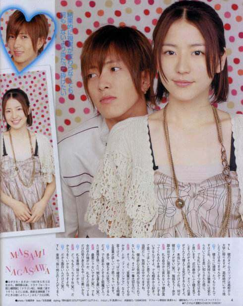
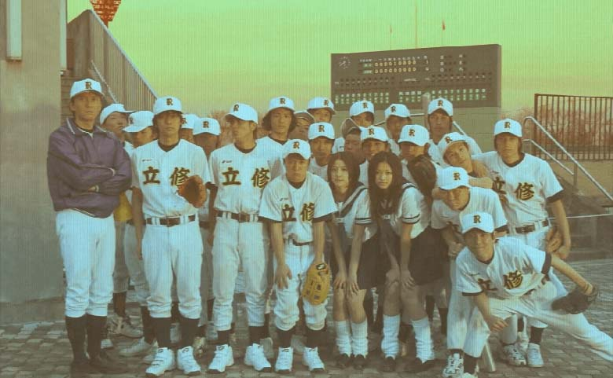
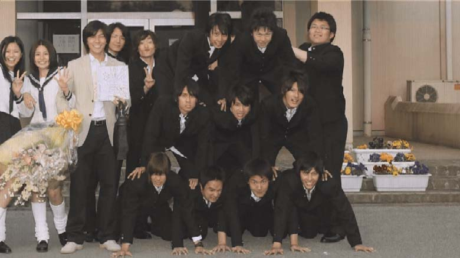
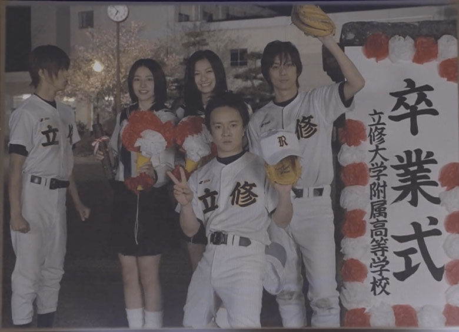
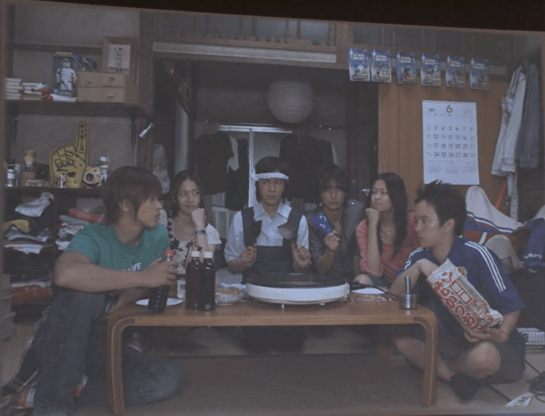
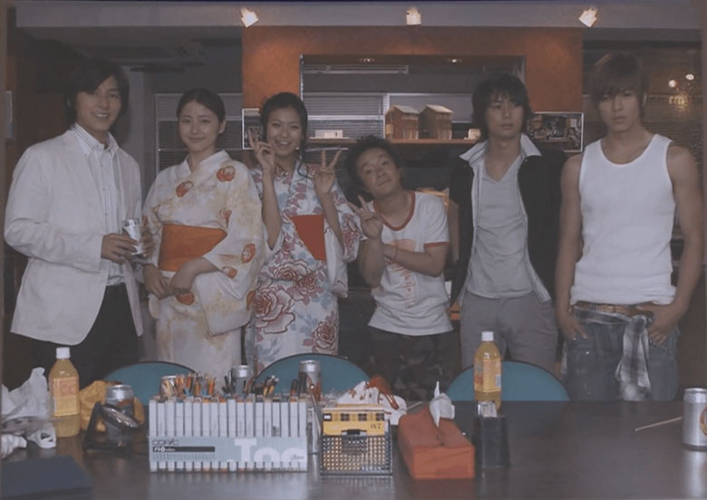
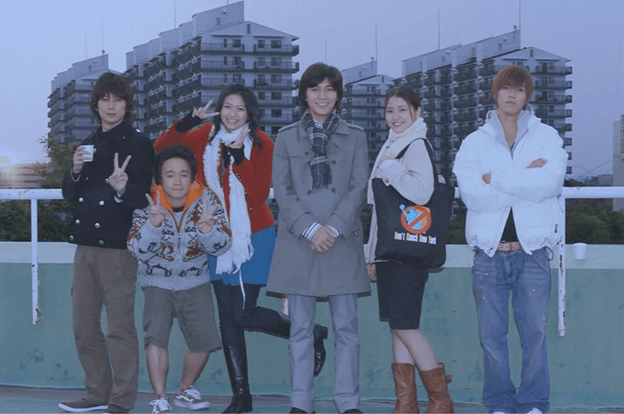
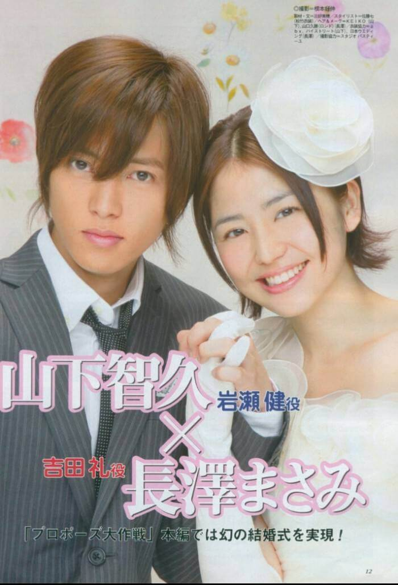
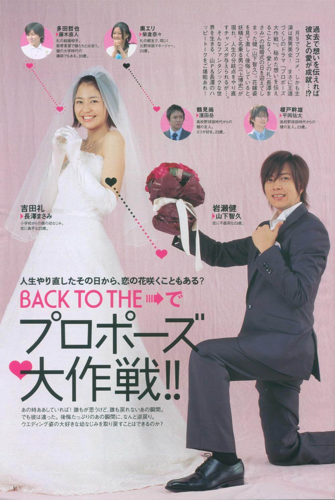

**今度やろうは馬鹿野郎、明日やろうも馬鹿野郎だ。**

—— 「吉田太志」

求婚大作战是我最喜欢的日剧之一，几乎每年都会找时间回顾一遍，这部07年的日剧相信是很多人最初的日剧回忆。龙樱和求婚大作战是我最早接触到的两部日剧，是刚进大学，同寝室的同学给我看的，那时候我对日语还一窍不通，日剧也从没看过，只是从父母口中听过小鹿纯子的名字，不过这两部都是不可多得的好日剧，也是最适合刚刚高中毕业走进大学校园的懵懵懂懂的年轻人看的，会对让你对人生有不一样的解读，我想用两篇文章写一写这两部经典日剧。

求婚大作战的主题很简单，男主角岩濑健喜欢自己的青梅竹马吉田礼，但是一直没法把自己的感情说出口，总是在等待合适的时机告白，就这么拖着拖着，等到礼要结婚的时候，健才意识到，自己永远地失去了她，懊悔不已。健的感情打动了妖精，帮助他回到过去，让他在有限的时间里去改变过去，在一次次回到过去却并不能改变礼结婚的状况，健意识到总是沉溺在过去是没用的，只有真正的面对当下的问题，勇敢地表达出自己的感情才是正确的道路。

求婚大作战虽然从主角们高中一直讲到他们走进社会，但整部片子还是描绘的青涩的校园爱情，通过回到不同的时间点来向观众讲述主角们的经历以及感情的走向，登场人物不多，基本都是在这些人身上讲述日常。每一集的标题基本都直接表明了这一集的主要内容，健总是在尝试着一点点改变过去，希望两边能引起质变，最终礼能够回到他的身边。

> 第一话 甲子園行けたら結婚できる!? （进军到甲子园就能结婚吗？） 第二话 コーヒー牛乳で結婚できる!? （有咖啡牛奶就能结婚吗？） 第三话 席がえしたら結婚できますか （坐到一起就能结婚吗？） 第四话 第2ボタンで結婚できますか （第二颗扣子就能结婚吗？） 第五话 明日やろうは馬鹿野郎ですか （说明天再做的是笨蛋小子吗？） 第六话 10代最終日何を卒業しますか （19岁的最后一天与什么告别？） 第七话 恋と花火はいつ散りますか　（恋爱和焰火什么时候会消散？） 第八话 年越しに流す涙は本物ですか （除夕夜流出的眼泪是真的吗？） 第九话 最後の一瞬に何を賭けますか （最后关头要下什么赌注呢？） 第十话 ラストハレルヤチャンス （最后的哈利路亚机会） 最终话 涙の告白は奇跡を呼びますか （含泪的告白能唤回奇迹吗？）

前期高中时期的生活大多是轻松愉快的，五个主人公都是无忧无虑地挥霍着时间，享受着青春。就像健第二次回去的时候说的，高中的时候总觉得时间是可以任意挥霍的，总觉得这样的时光会永远持续下去。小鹤矢志不渝地追逐着绘里，绘里憧憬着美好的爱情，干雄就负责冷静接梗和高大帅气和总是吵吵闹闹的小鹤形成鲜明的对比。礼和健都抱着想要把感情说出口的心情找寻着机会，这种青涩的暗恋的感觉，我相信还没走上社会的学生们是能够感同身受的。求婚大作战之所以能够成功，我想正是它真实的描绘出了学生时代青涩的感情以及即使失败再多次也抱持着对美好爱情的憧憬，那种纯粹是每个人都怀念的，即使走上社会，为了生计奔波忙碌，每天都想着柴米油盐酱醋茶，但是这一份纯粹是每个人的心里都珍藏了一份的，这也是为什么同窗之情那么重要，以为它是纯粹的，不管大家以后过着什么样的生活，同学们再聚到一起，那份纯粹的情感依然在。

在高中生活中，小鹤是个特别的存在，或者说在整部剧包括后面的sp当中，小鹤都是最特别的那一个，他个子矮小，胆子也不大， 也没什么出色的才能，但是在感情上他是最勇敢的一个。日剧总爱描述这种内在和外在差别很大的角色，也许就是现在大家所说的反差萌把。这样的角色在生活中很少见，他代表的是那种无所畏惧，似乎很弱小但又很坚韧的精神。他的付出是不求回报的，即使是看着自己拼命追求的女孩子走向别人，他也能笑着祝她幸福。小鹤的强大精神力是很感染人的，特别是和他并不出众的外貌和才能形成对比。当他在毕业的当天，用石灰粉在操场上写上大大的 `エリが好き` 的时候，从未来回来的健由衷的敬佩自己的这位小个子的朋友，干雄也说正是因为他能做到普通人做不到的事，他才能打出普通人也打不出的本垒打，即使100次只能打出一次。虽然现实生活没有电视剧那么美好，但是我认为像小鹤一样把事情简单化处理是具有智慧也需要勇气的，有才能的人想要的东西太多，有道是不搏二兔，追求太多有时候就失去了方向，像小鹤一样，认准一个目标就勇敢去追，一直百折不挠的努力下去，不失为一个好的方法，聪明人肯下笨功夫，即使最后失败了，也不虚此行。跟失败比起来，连试都没试的后悔要痛苦更多。

高中时期的生活磕磕绊绊，打打闹闹，在欢声笑语和毕业的泪水中结束了，健虽然稍稍改变了一点过去，但依然没能扭转礼结婚的现实。就这样，他们五个人走进了大学的校园。绘里不断的尝试着新的恋情又不断失败，小鹤依然紧跟着绘里的步伐，做着绘里的小跟班。冷静帅气的干雄立志要当导演，想要拍出自己的电影。健和礼的感情依然在原地踏步。从高中到大学，唯一不变的是小鹤，但大家都慢慢褪去了青涩的痕迹，有点大人模样了。

第五话中礼的爷爷来东京也是让人印象深刻的一集，爷爷的口头禅是 `今度やろうは馬鹿野郎、明日やろうは馬鹿野郎`，他认为想要做的事就要立即去做，总是想着还有明天，还有机会，最后将因为失去机会而后悔。爷爷是个率真的人，看得出来他很喜欢健，但是对健总是踌躇不前的样子很是不满，有点恨铁不成钢，喜欢为什么不去追求呢？即使失败了，自己也不会后悔，与其被前面的石头绊倒摔个跟头，也比担心前面是不是有石头而不敢前行要好得多。爷爷走之前对健说的 `後悔するなよ、いつも明日が来ると思ったら、痛い目に遭うぞ`。也正是爷爷的点播，让健领着礼见到了爷爷的最后一面，也把找好的大头贴和设计好的图纸送给了爷爷。在这一集，健是真正的产生了一点变化，第一次真正按自己的想法去做了事情，而不是左顾右盼。

从第五话开始，健真正的开始追逐自己的感情，在第五到第八集这段大学生活，健一直在找机会向礼正式地告白，可是总是差了一口气，最后礼开始和多田老师交往。两个人的距离反而因为长大变成熟越走越远，努力想要走的更近，却不知道为什么背道而驰。这也就是成长的烦恼把，初高中的时候需要考虑的事情很少，喜欢就是一种纯粹的感情，可以轻易地在一起也可以轻易的分开。可是一旦长大了，考虑的事情就变多了，什么都不像原来那么简单，你想和别人在一起需要考虑的是整个人生而不是仅仅一段感情，有着这样那样的顾虑就总想让自己准备好，可真的等到自己准备好的时候，目标可能已经不在了。

大学这段时间小鹤和绘里的两段戏都是不错，滨田岳的演技非常不错。第一次是陪绘里去找男友复合，在绘里备受打击的时候小鹤还能开着玩笑，同时坚定的表达自己的感情，我想真有这么一个男孩子，任何女孩都会感动的把，不过在现实生活中还是要看准对象啊，不是每个女孩都是绘里，也不是每个男孩都是小鹤。第二段戏是看烟火大会的晚上，绘里被前男友约，大家都知道前男友只是找绘里派遣寂寞而已，在健的鼓励下，小鹤阻止了绘里，这段告白非常感人，`お前は俺の憧れなんだよ、どんなに手を伸ばしても一生手の届かない高嶺の花なんだよ、それは自分でもよーくわかってる。だから頼むから、俺の憧れなんだから、都合のいい女になるんじゃねーよ。泣いてばっかの恋愛なんてするんじゃねーよ、もう見てらんねーんだよ`。正式小鹤一次又一次地陪伴这绘里，水滴石穿，绘里慢慢的也认可他了。

大学毕业以后，礼继续读研究生，干雄开始追逐自己的导演梦，在剧场做助手。健开始做销售，小鹤因为喜欢喝牛奶开始做牛奶配送员，绘里开始在高中时期的汉堡店兼职。第九集健回到的时刻是多田老师向礼求婚的日子，他想要在多田老师之前求婚，只是他从一开始就犯错了，礼并不是需要他的求婚，婚姻只是结果，而不是原因，就像爷爷说的 `言わないでも伝わると思ったら大間違いだぞ`，以为自己不说别人也能了解自己的感情是打错特错，健从开始到求婚，从来没有向礼表达过感情。在五个人玩水球比赛的时候，健说我打中了你就跟我交往，健打中后礼告诉他还是等你真正告白的时候再说把。其实礼一直想要的就是健勇敢的表达出自己的感情，就像第一集，勇敢地去尝试本垒打，即使是失败了，也无悔。健用一个月的工资买了一个求婚的戒指（日本有求婚戒指要用三个月的工资买的说法），结果被礼拒绝了，健确实还没有真正明白正确的道路。最后心灰意冷的健把戒指和自己的感情都留在了 `Don't Knock New York` 的看板上。

第十集五人重聚的时候，礼对健说的 `負けたくなくて必死にやってたけど、結局あきらめちゃったこといっぱいあるんだよねー` 其实是对健和自己的放弃感到可惜把。最后两集，健利用干雄帮助的最后一次回到过去，带着礼回到了两人一起就读的小学，两个人第一次坦诚的交流，也让健决定不再迷恋过去，他要做的只是认真的说出那句喜欢你，不在乎结果，只是传达自己的感情，把握住当下是最重要的。

整部片子在最后升华主题，再怎么对过去留恋，后悔都是没有意义的，你无法改变过去，真正需要改变的是当下的自己。把握住当下，把自己的爱好好地传达，把自己的目标好好地实现，比起失败，连试都没试的后悔要痛苦数倍。其实相对于健和礼的爱情，主角五人之间的天长地久的友情是真正让我羡慕的。

最后的 `SP` 基本就是给了观众一个 `happy ending`，这次的主角换成了小鹤，主要是欢笑和感动，大家都获得了好的归宿。虽然作为电视剧会有一些经不起推敲的逻辑，不过同样作为一步描述爱情的电视剧，也足够称得上经典。老日剧的一大特色是，他描述普通人的生活很真实，而且没有谁会在困难的时候帮助你，你要解决困难都得靠自己，想要依靠别人或者天上掉馅饼最终会自食苦果。这也是一些经典日剧能够传递正能量的原因，龙樱和求婚大作战都是这样。当然这部作品的成功和演员剧本都是脱不开的，几位主演都是正当好年华，也比较适合这几个角色，山下智久和长泽雅美也成为了很多观众心中的最佳荧幕情侣之一。

## プロポーズ大作戦名言

## 岩瀬健

岩瀬健　名言

やり直してえなあー！_好想重来啊！_  
あのころに戻って、もう一度やり直したい。_好想回到那个时候，重新来过。_  
(岩瀬健・第1話)

岩瀬健　名言

思わず泣きそうになった　_情不自禁地想要流泪，_  
礼のウエディングドレス姿が　  
あまりにもきれいだったから。_因为礼穿着婚纱的样子太美了。_  
(岩瀬健・第1話)

岩瀬健　名言

高校のころ、時間だけは常にあり余っていて、 _高中的时候，只有时间是挥霍不完的_  
それが無限に続く気がしていた。_还以为这时光会永远持续下去。_  
(岩瀬健・第2話)

岩瀬健　名言

大事な人がすぐ隣の席にいた 。_最重要的人就坐在我身旁_  
(岩瀬健・第2話)

岩瀬健　名言

これまでの不機嫌な顔を、全部笑顔に変えられたらなぁと思う。 _把至今为止不开心的表情全部变成笑脸该多好啊。_  
(岩瀬健・第2話)

岩瀬健　名言

過去の自分に無性に腹が立った。 _忍不住对过去的自己生气_  
たまらなく会いたくなった。 _迫不及待地想见到她_  
礼に、たまらなく会いたくなった。_迫不及待地想见到礼_  
(岩瀬健・第2話)

岩瀬健　名言

そういえば、こうゆうやつらヤツラだったんだ。 _这样说来，他们就是这样的家伙没错。_  
(岩瀬健・第2話)

岩瀬健　名言

何でこんな簡単なことができないんだろう。 _为什么连这么简单的事情都做不到呢_  
過去に戻っても素直になれない自分に、  
無性に腹が立った。 _忍不住对回到过去依然无法坦率的自己生气。_  
(岩瀬健・第3話)

岩瀬健　名言

どんなにケンカしても、不機嫌になっても、 _不管怎样争吵，闹得多不开心_  
五人がそろえば最後には決まって笑顔になれた。 _只要五个人在一起，最后一定会变成笑脸。_  
(岩瀬健・第4話)

岩瀬健　名言

バカだなぁと笑いながらも、 _脸上嘲笑着小鹤真的是个笨蛋_  
鶴の純粋さが妙に眩しくて。 _但是心里却奇妙地觉得小鹤的纯粹是那么耀眼。_  
(岩瀬健・第4話)

岩瀬健　名言

本当に情けないのは、 _真正不可原谅的_  
礼にボタンを渡せなかった過去の自分ではなく、_不是没有把纽扣给礼的我_  
違うと分かっていながら悪あがきをしていた今の自分だった。_而是知道错了却什么都改变不了的我。_  
(岩瀬健・第4話)

岩瀬健　名言

もし俺が殻を敗れなかったら 、_要是我没能破壳而出的话，_  
多田さんより先に自分の気持ちを伝えることができなかったら、_没能在多田老师之前说出自己的心意的话，_  
この笑顔は又　手の届かないものになってしまうのだろうか。_这个笑容又会变得遥不可及了把。_  
(岩瀬健・第7話)

岩瀬健　名言

女なんかに、鶴の格好よさ分かんなくたっていいんだよ！_就算她不能体会你的帅气也没关系，_  
いつもどおりやれよ。_像平常那样去做吧。_  
(岩瀬健・第7話)

岩瀬健　名言

手伸ばしてもねえくせに何言ってんだよ。_你连试都没试怎么知道_  
何黙って見逃してんだよ。_为什么眼睁睁地看着机会溜走，_  
今さら空振りするのびびってんじゃねえよ。_不要事到如今才害怕被三振出局_  
ホームラン狙って思いっきり空振りしてこいよ。_至少要抱着打出本垒打的心情被三振啊。_  
(岩瀬健・第7話)

岩瀬健　名言

鶴に言った言葉は、チャンスを見送ってばかりいた 、  
自分に対するいらだちだった。_对小鹤说的话其实是对着着急着总是看着机会从眼前溜走的自己，_  
結果や体裁ばかり気にして、_总是在乎着结果和外表_  
一度も全力でバットを振らないまま、_从来没有全力挥棒_  
試合を終えてしまった自分へのいらだちだった。_让比赛拜拜结束的自己听的。_  
(岩瀬健・第7話)

岩瀬健　名言

運命とは、どうしてこんなにも切なくできているのだろう。_命运，为什么总是这么悲伤呢？_  
人が幸せになりたいと願うとき、どうして誰かが悲しまなければならないんだろう。_人们在想要变得幸福的时候，为什么非要让别人变得不幸呢？_  
(岩瀬健・第7話)

岩瀬健　名言

こうして礼と離れていれば、いつか忘れられるんだろうか？_就这样和礼分开的话，什么时候才能忘记呢？_  
礼を思い出すことのない未来なんて、ホントにあるんだろうか？_我真的能忘记礼吗？_  
(岩瀬健・第8話)

岩瀬健　名言

重ねてきた年月の重さに涙溢れた、_交织着岁月的沉重，眼泪不禁洒落，_  
この思いは消せない、忘れることなんて出来ない。_这份思念不会消失，根本不可能会忘记，_  
やっぱり礼が好きだ。_我果然还是喜欢礼_  
礼のことがたまらなく大好きだ。_喜欢的要命。_  
(岩瀬健・第9話)

岩瀬健　名言

俺はダメ元をやりにきたんだ、_我是抱着失败的觉悟来的，_  
礼と多田さんの答えを知るために来たわけじゃない、_我不是特地来听礼和多田老师的答案的，_  
自分なりの答えを出しに来たんだ。_而是为了找出自己的答案。_  
(岩瀬健・第9話)

岩瀬健　名言

何が正しい道が分からないけど、_虽然不知道什么才是正确的道路，_  
ただただ走り続けることしか出来なかった、_能做的就只有不停拼命奔跑_  
礼、君の心に何か届いているんだろか。_礼，有没有什么传达到你心里了呢？_  
離れていこうとしている君との距離を、_和我渐行渐远的你，我们之间的距离_  
少しでも変えることは出来たんだろうか。_有没有靠近一点呢_  
でも一つだけ確かなことがある、_但是有一点是确定的_  
今でも礼のことが好きだ。_我到现在依然喜欢着你_  
どんなに離れてしまったとしてもこの気持ちだけは変わらない。_不管相隔多远，只有这份感情不会改变。_  
(岩瀬健・第9話)

岩瀬健　名言

人生で初めて買った指輪給料三ヶ月分とはいかなかったけど、_生平第一次买的戒指，虽然没有三个月工资那么贵（日本有用三个工资买求婚戒指的习俗）_  
どうしても買えなくなって、_但是因为无论如何都想买_  
初任給全額で勝負をかけた婚約指輪。_用第一个月的薪水买下了堵上胜负的求婚戒指_  
サイズを聞かれて、礼の指にはまらないと嫌だったから、_被问到戒指的尺寸时，因为担心礼的手指带不上_  
「いちばん大きいサイズで」と頼んだ、_所以要了最大号的_  
俺の指でもブカブカだ。_结果连套到我的手指上都松松垮垮的_  
(岩瀬健・第9話)

岩瀬健　名言

過去の自分はその重みに耐えかねて、_过去的自己，因为无法承受这份沉重_  
酒に逃げる以外の方法が見つからなかった。_除了狼狈地逃离没有任何办法_  
礼への思いは結婚という現実に、_对礼的感情，被结婚这个现实_  
いとも簡単に押しつぶされた。_轻而易举地击溃了。_  
(岩瀬健・第10話)

岩瀬健　名言

礼の中で俺は何番目にいるんだろう、_现在我在礼心中排第几位呢？_  
結婚したら何番目になってしまうんだろう。_结婚以后我又会变成第几位呢？_  
(岩瀬健・第10話)

岩瀬健　名言

結婚は、二人だけのものではない。_结婚不只是两个人的事情_  
両親や兄弟を含めた、_还有父母，兄弟姐妹_  
家族みんなの幸せの上に成り立っている。_是建立在整个家庭的幸福之上的。_  
(岩瀬健・第10話)

岩瀬健　名言

失敗することよりも、_跟失败比起来_  
やらなかった後悔のほうが何倍もつらいことを後から知った。_根本没做的后悔要痛苦好几倍，那之后我终于明白了。_  
今進もうとしている先に、奇跡の扉があるか分からないけれど、_现在的目的地是否有奇迹的大门我虽然不知道_  
自分自身を信じてみようと思った。_但我觉得我应该相信自己_  
(岩瀬健・第11話)

## 妖精

妖精　名言

オスカー・ワイルドはこう言っている。_奥斯卡王尔德说过_  
「男は女の最初の恋人になりたがるが、女は男の最後の恋人になりたがる」_男人想成为女人最初的恋人，而女人想成为男人最后的恋人_  
(妖精・第1話)

妖精　名言

人間が、歴史の中でもっともうまくなってることの一つが、言い訳だ。_人类在历史上最擅长的一件事就是找借口_  
(妖精・第1話)

妖精　名言

安易に「頑張る頑張る」って口にするヤツほど、頑張らないってのが俺の統計で出てる。_根据我的统计，总是把努力挂在嘴边的人，通常是不努力的_  
(妖精・第1話)

妖精　名言

人間は自分の不都合なことがあると、「まさか」や「偶然」という言葉に頼ろうとする悪い癖がある。_人只要遇到不顺心的事情，就有把运气不好当借口的坏毛病_  
(妖精・第3話)

妖精　名言

一見遠回りに見えても、それがいちばんの近道だったってことがあるだろう？_一条看上去很远的路说不定就是最近的路_  
(妖精・第3話)

妖精　名言

言葉にできない感謝など、感謝してないのも同然だ。_无法用语言表达的感谢和没感谢一样_  
(妖精・第3話)

妖精　名言

勝手にダメだと決めつけて、チャレンジもせずにあきらめる。_随随便便就认为不行，连尝试都没尝试_  
まっ、お前に限らず人類全般に言えることだな。_不仅是你，全人类都一样。_  
(妖精・第6話)

妖精　名言

そんな小さなことにこだわってるから、大きな幸せがつかめないんだよ！_就是因为你总是拘泥于那些微不足道的事情，才会抓不住重要的幸福_  
(妖精・第7話)

妖精　名言

殻を破るということは、多少の痛みを伴うものだ。_想要获得蜕变，不经历痛苦是不行的。_  
(妖精・第7話)

