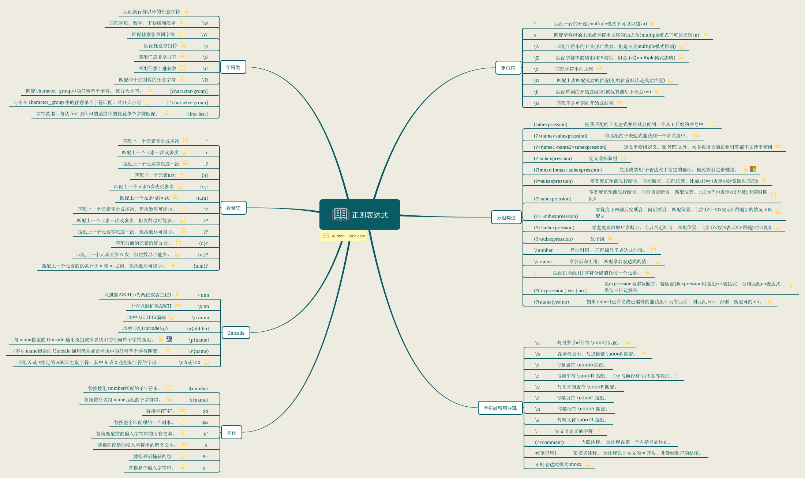

\[toc\]

## 前言

字符串的操作是我们在写程序中经常遇到的问题，有时我们会遍历字符串以及用已有的 `String` 的 `API` 来达到我们的目的。但处理字符串最强大的还是正则表达式。正则表达式使用单个字符串来描述、匹配一系列符合某个句法规则的字符串，我们可以用正则表达式找出字符串中的目标子串，来进行操作。几乎所有的和字符串相关的操作都离不开正则表达式，比如大部分编辑器现在都能够用正则表达式来检索文本，大部分编程语言都有内置了强大的正则引擎，我们所用的很多字符串的内置 `API`，其背后也是正则表达式。本文主要讲一讲正则表达式的入门和使用。正则表达式全称是 `regular expression`，一般简称 `regex` 或者 `regexp`。

> 正则引擎的工作原理需要理解 `DFA` 和 `NFA` 需要一定的离散数学和编译原理基础，如果你想要实现一个正则表达式引擎，可以深入了解，本文不做介绍。对于集合、关系以及 `DFA` 和 `NFA` 可以看《计算理论基础》。

## 语法

最简单的正则表达式就是直接匹配对应的字符，比如 `abc` 就可以直接匹配。为了实现更为复杂的模式，正则表达式提供了很多元字符来表达丰富的意义。查看元字符可以看[MSDN-正则表达式语言 - 快速参考](https://docs.microsoft.com/zh-cn/dotnet/standard/base-types/regular-expression-language-quick-reference?redirectedfrom=MSDN "MSDN-正则表达式语言 - 快速参考")

> 需要注意的是不同语言的正则表达式实现并不完全相同，特别是一些高级特性的支持，比如平衡组等，使用之前查阅一下相关文档。

我用 `xmind` 制作了一个比较全的正则表达式常用的语法结构图，下面是导出的 `PNG`，你也可以下载[regular-expression.xmind](https://img.clloz.com/blog/writing/regular-expression.xmind "regular-expression.xmind")



正则表达式的常用语法基本都在其中了，如果你下载了 `xmind`，大部分规则都有一个 `note` 写了一个示例。关于语法方面有一个表里面没有提到的问题就是转义问题，需要转义的符号一般情况下是 `* . ? + $ ^ [ ] ( ) { } | \ /` (如果启用了 `x` 模式， 忽略正则表达式模式中的非转义空白，那么 `#` 也需要转义)。而在字符组 `[]` 中情况又不太一样，在字符组中需要转义的有 `[ ] \`，还有处于字符组第一位表示取反的 `^` 以及类似 `[0-9a-z]` 中间的 `-` 是需要转义的，其他不需要。字符组中的 `.` 就表示 `.` 不表示除换行符以外的任意字符，`\b` 也不表示单词边界，而表示退格符。(这里为个人测试，不同的实现也可能不同，如有错误欢迎指正)

图中的字符转义部分和 `\cX` 模式(`X` 取值从 `A` 到 `Z` 用来表示 `ASCII` 的 `1-26` 个控制符或 `Ctrl+X`。在 `Java` 中必须大写，其他语言中大小写都可以)可以查看[Non-Printable Characters](https://www.regular-expressions.info/nonprint.html "Non-Printable Characters")，他们都是对 `ASCII` 码控制符(`0-31`位位控制符，可以查看[ASCII](https://www.w3schools.com/charsets/ref_html_ascii.asp "ASCII"))的一些匹配。

还有一点需要说的是 `Unicode的匹配`，主要就是几种用法。

1. `\0 nn` 首位为 `0` 的八进制表示，可以表示扩展 `ASCII` 码
2. `\x nn` 两位十六进制数表示扩展 `ASCII` 码。
3. `\u nnnn` 四位十六进制数表示 `Unicode` 基础平面 `BMP` 的码点。
4. `\p{name}` 用[Unicode字符属性](https://www.php.net/manual/zh/regexp.reference.unicode.php "Unicode字符属性")来匹配。

各个语言、平台或者库都有不同的实现，比如 `JavaScript` 中的 `\u{}` 来表示 `Unicode` 码点。

* * *

正则表达式的运算符优先级

| 运算符 | 描述 |
| --- | --- |
| `\` | 转义符 |
| `(), (?:), (?=), []` | 圆括号和方括号 |
| `*, +, ?, {n}, {n,}, {n,m}` | 限定符 |
| `^, $, \`任何元字符、任何字符 | 定位点和序列（即：位置和顺序） |
| `\|` | 替换，`或` 操作字符具有高于替换运算符的优先级，使得 `m\|food` 匹配 `m` 或 `food` 。若要匹配 `mood` 或 `food` ，请使用括号创建子表达式，从而产生 `(m\|f)ood` 。 |

* * *

我自己觉得正则表达式的规则并不难理解，但是如何搭配使用这些规则则是需要大量的练习的，如果能够自己实现一个正则表达式引擎那就掌握得更透彻了。

这里给大家推荐一些学习资料。一个是我用来检验正则表达式的工具[expression-setapp](https://www.apptorium.com/expressions "expression-setapp")，然后是 `《精通正则表达式》` 这本书，最后是一个正则表达式可视化的在线工具[regexper](https://regexper.com/ "regexper")。关于网络上的正则表达式教程，比如比较出名的[正则表达式30分钟入门教程](https://deerchao.cn/tutorials/regex/regex.htm#metacode "正则表达式30分钟入门教程")或者[正则表达式-菜鸟教程](https://www.runoob.com/regexp/regexp-tutorial.html "正则表达式-菜鸟教程")用来入门都是可以的。`Github` 上有一个[learn-regex](https://github.com/ziishaned/learn-regex/blob/master/translations/README-cn.md "learn-regex")的教程也是不错的。

## JavaScript 中的正则表达式

`JavaScript` 中正则表达式语法和上面的表中没有太大不同，语法部分就不介绍了，可以查看[正则表达式 - MDN](https://developer.mozilla.org/zh-CN/docs/Web/JavaScript/Guide/Regular_Expressions "正则表达式 - MDN")。

这里主要说一下 `JavaScript` 中和正则表达式相关的两个对象 `RegExp` 和 `String`。这两个对象的属性和方法可以参考另一篇文章：[JavaScript常用内置对象API](https://www.clloz.com/programming/front-end/js/2020/07/10/built-in-objects-api/ "JavaScript常用内置对象API")

## RegExp

创建正则表达式的方法有三种，字面量或者构造函数：

```javascript
/ab+c/i;
new RegExp('ab+c', 'i');
new RegExp(/ab+c/, 'i');
```

* * *

`RegExp` 对象有很多属性方法，比如获取 `flag` 相关的就有多个（`JavaScript` 的正则引擎一共支持 `gimsuy` 共六个 `flag`)，还有一些在 `ES5` 之前没有暴露给用户的属性方法（用 `symbol` 来指向这些内部方法），`ES6` 中我们可以通过内部定义的 `symbol` 来访问到这些方法，比如 `Symbol.hasInstance` 以及大多数和正则表达式相关的方法等，具体细节可以参考[JavaScript常用内置对象API](https://www.clloz.com/programming/front-end/js/2020/07/10/built-in-objects-api/ "JavaScript常用内置对象API")。属性中我们需要特别记得的一个就是静态属性 `RegExp.lastIndex`，每一个 `RegExp` 对象都有该属性，他表示下次匹配的起始索引，默认值为 `0`，这个属性是可读写的，只有正则表达式使用了表示全局检索的 `g` 标志时，该属性才会起作用（该属性的具体规则参考[RegExp.lastIndex - MDN](https://developer.mozilla.org/zh-CN/docs/Web/JavaScript/Reference/Global_Objects/RegExp/lastIndex "RegExp.lastIndex - MDN")。

而关于 `RegExp` 对象我们主要要讨论的方法有两个。

1. `exec`： 一个在字符串中执行查找匹配的 `RegExp` 方法，它返回一个数组（未匹配到则返回 `null`）。
2. `test`： 一个在字符串中测试是否匹配的 `RegExp` 方法，它返回 `true` 或 `false`。

##### RegExp.prototype.exec()

`RegExp.prototype.exec()` 接受一个 `str` 作为参数，即用正则表达式在这个 `str` 中进行匹配。

在设置了 `global` 或 `sticky` 标志位的情况下（如 `/foo/g or /foo/y`），`JavaScript RegExp` 对象是有状态的。他们会将上次成功匹配后的位置记录在 `lastIndex` 属性中。使用此特性，`exec()` 可用来对单个字符串中的多次匹配结果进行逐条的遍历（包括捕获到的匹配），而相比之下， `String.prototype.match()` 只会返回匹配到的结果。如果只是为了判断是否匹配，可以使用 `RegExp.test()` 方法，或者 `String.search()` 方法。

我们重点来看一下 `RegExp.prototype.exec()` 的返回值

```javascript
var re = /quick\s(?<group1>brown).+?(?<group2>jumps)/ig;
console.log(re.lastIndex) //0
var result = re.exec('The Quick Brown Fox Jumps Over The Lazy Dog');
console.log(result);

//[
//  'Quick Brown Fox Jumps',
//  'Brown',
//  'Jumps',
//  index: 4,
//  input: 'The Quick Brown Fox Jumps Over The Lazy Dog',
//  groups: { group1: 'Brown', group2: 'Jumps' }
//]

console.log(re.lastIndex);//25
```

从上面的代码我么可以看书，返回值是一个数组，但是包含了三个额外属性 `index input groups`。具体含义参看表格。

| 属性/索引 | 描述 | 例子 |
| --- | --- | --- |
| `[0]` | 匹配的全部字符串 | `Quick Brown Fox Jumps` |
| `[1], ...[n ]` | 括号中的分组捕获 | `[1] = Brown`、`[2] = Jumps` |
| `index` | 匹配到的字符位于原始字符串的基于 `0` 的索引值 | `4` |
| `input` | 原始字符串 | `The Quick Brown Fox Jumps Over The`|`Lazy Dog` |
| `groups` | 有命名的分组捕获对象 | `{ group1: 'Brown', group2: 'Jumps' }` 若分组都未命名则为 `undefined` |

* * *

当我们使用 `g` 标志时，`RegExp.prototype.exec()` 执行后会更新正则表达式 `lastIndex` 属性。如果我们在匹配成功后再次执行 `RegExp.prototype.exec()`，下次匹配将会从 `lastIndex` 开始匹配，注意，即使再次查找的字符串不是原查找字符串时，`lastIndex` 也不会被重置，它依旧会从记录的 `lastIndex` 开始，`test()` 也会更新 `lastIndex` 属性。我们可以利用这一特性可以查找一个字符串中多个复合正则表达式的子串。

```javascript
var myRe = /ab*/g;
var str = 'abbcdefabh';
var myArray;
while ((myArray = myRe.exec(str)) !== null) {
    var msg = 'Found ' + myArray[0] + '. ';
    msg += 'Next match starts at ' + myRe.lastIndex;
    console.log(msg);
}
//Found abb. Next match starts at 3
//Found ab. Next match starts at 9
```

> 不要把正则表达式字面量（或者 `RegExp` 构造器）放在 `while` 条件表达式里。由于每次迭代时 `lastIndex` 的属性都被重置，如果匹配，将会造成一个死循环。并且要确保使用了 `g` 标记来进行全局的匹配，否则同样会造成死循环。

##### RegExp.prototype.test()

`RegExp.prototype.test()` 方法要比 `RegExp.prototype.exec()` 方法简单很多，它只是执行一个检索，用来查看正则表达式与指定的字符串是否匹配。返回 `true` 或 `false`。唯一需要注意的是，当使用 `g` 标志时，`test()` 和 `exec()` 一样会改变 `lastIndex` 的值，并且多次执行也会越过已经匹配成功的部分，即从字符串的 `lastIndex` 索引开始下一次的匹配。

##### RegExp 的 flag

介绍以下 `JavaScript` 中的正则表达式支持的 `flag`。可以用 `RegExp.prototype.flags` 查看正则表达式对象使用的 `flag`。

| 标志 | 对应属性 | 描述 |
| --- | --- | --- |
| `g` | `RegExp.prototype.global` | 全局搜索。 |
| `i` | `RegExp.prototype.ignoreCase` | 不区分大小写搜索。 |
| `m` | `RegExp.prototype.multiline` | 多行搜索。 |
| `s` | `RegExp.prototype.dotAll` | 允许 . 匹配换行符。 |
| `u` | `RegExp.prototype.unicode` | 使用 `unicode` 码的模式进行匹配。 |
| `y` | `RegExp.prototype.sticky` | 执行“粘性(`sticky`)”搜索,匹配从目标字符串的当前位置开始。 |

需要特别说明的是 `u` 和 `y`。`u` 表示的是 `unicode`，使用这个标志，意味着支持 `\u{}` 形式的 `unicode` 表示，即非基本平面的 `unicode` 也能够被支持。

```javascript
let regex = new RegExp('\u{1D306}', 'u');
let result = regex.test('𝌆')
console.log(regex.unicode); // true
console.log(result) // true
```

而 `y` 表示的是 `stciky`，使用这个标志意味着，要匹配成功，子串必须是从 `lastIndex` 开始的。

```javascript
let str = '#foo#foo';
let regex = /foo/y;

regex.lastIndex = 1;
console.log(regex.test(str)); // true
regex.lastIndex = 2;
console.log(regex.test(str)); // false
console.log(regex.lastIndex); // 匹配失败，lastIndex归零
regex.lastIndex = 5;
console.log(regex.test(str)); // false
```

上面的代码设置了三个 `lastIndex` 分别进行了匹配，`1` 和 `5` 分别位于两个 `f` 的索引，自然能匹配成功。但是 `2` 然后后面还有能够成功匹配的 `foo` ，但是在 `y` 模式下返回 `false`（去掉 `y` 将返回 `true`）。若匹配失败则 `lastIndex` 归零。

##### 替代匹配属性

在正则表达式语法结构图的左下角有一块是替代，在 `JavaScript` 中也支持，但是是非标准的，不过大部分浏览器都进行了实现。兼容性请查看[Can I use](https://caniuse.com/#search=regexp. "Can I use")。

支持的几个属性分别是：

```javascript
RegExp.$1-$9 // 捕获括号分组，上线九个，只读属性，且只在成功匹配时有效。
RegExp.input ($_) // 返回整个输入字符串，括号中为别名。
RegExp.lastMatch ($&) // 静态只读属性，只在匹配成功时改变。返回最后匹配成功的子字符串，$&为别名，必须用方括号访问 RegExp['$&']。
RegExp.lastParen ($+) // 静态只读属性，只在匹配成功时改变。返回最后匹配到的括号分组，别名也要用方括号访问。
RegExp.leftContext ($`) // 静态只读属性，只在匹配成功时改变。返回最新匹配的左侧子串，别名也要用方括号访问
```

## String

`String` 的方法中和正则表达式相关的有如下几个。

1. `String.prototype.match()`: 一个在字符串中执行查找匹配的 `String` 方法，它返回一个数组，在未匹配到时会返回 `null`。
2. `String.prototype.matchAll()`: 一个在字符串中执行查找所有匹配的 `String` 方法，它返回一个迭代器（`iterator`）。
3. `String.prototype.search()`： 一个在字符串中测试匹配的 `String` 方法，它返回匹配到的位置索引，或者在失败时返回 `-1`。
4. `String.prototype.replace()`: 一个在字符串中执行查找匹配的 `String` 方法，并且使用替换字符串替换掉匹配到的子字符串。
5. `String.prototype.split()`: 一个使用正则表达式或者一个固定字符串分隔一个字符串，并将分隔后的子字符串存储到数组中的 `String` 方法。

##### String.prototype.match()

`String.prototype.match()` 内部调用的是 `RegExp.prototype[@@match]()`，接受一个正则表达式对象作为参数，如果传入一个非正则表达式对象，则会隐式地使用 `new RegExp(obj)` 将其转换为一个 `RegExp` 。如果你没有给出任何参数并直接使用 `match()` 方法 ，你将会得到一 个包含空字符串的 `Array ：[""]`。

详细说一下返回值：

1. 如果使用 `g` 标志，那么返回所有匹配正则表达式的子串的数组。不返回捕获组。
2. 如果没有使用 `g` 标志，则返回包含第一个完整匹配及其相关的捕获组的数组。数组有三个额外属性 `index input groups`（和 `RegExp.prototype.exec()` 相同）。
3. 如果匹配失败则返回 `null`。

我们可以看出如果没有 `g` 标志，`String.prototype.match()` 和 `RegExp.prototype.exec()` 是相同的。

```javascript
//without g flag
var str = 'For more information, see Chapter 3.4.5.1';
var re = /see (?<group1>chapter \d+(?<group2>\.\d)*)/i;
var found = str.match(re);

console.log(found);
//[
//  'see Chapter 3.4.5.1',
//  'Chapter 3.4.5.1',
//  '.1',
//  index: 22,
//  input: 'For more information, see Chapter 3.4.5.1',
//  groups:{ group1: 'Chapter 3.4.5.1', group2: '.1' }
//]

//with g flag
var str = 'ABCDEFGHIJKLMNOPQRSTUVWXYZabcdefghijklmnopqrstuvwxyz';
var regexp = /[A-E]/gi;
var matches_array = str.match(regexp);

console.log(matches_array); // ['A', 'B', 'C', 'D', 'E', 'a', 'b', 'c', 'd', 'e']

// no arguments
var str = "Nothing will come of nothing.";

str.match();   // returns [""]
```

##### String.prototype.matchAll()

`String.prototype.matchAll()` 内部调用的是 `RegExp.prototype[@@matchAll]()`。接受一个正则表达式对象为参数，如果所传参数不是一个正则表达式对象，则会隐式地使用 `new RegExp(obj)` 将其转换为一个 `RegExp` 。`RegExp` 必须是设置了全局模式 `g` 的形式，否则会抛出异常 `TypeError`。

返回值为一个迭代器，可以配合 `for...of...`、扩展运算符 `...` 或者 `Array.from()` 使用来替代 `while` 循环的 `RegExp.prototype.exec()` 方法。迭代器中的每一项和 `RegExp.prototype.exec()` 是相同的，包括额外属性。

```javascript
const regexp = RegExp('foo[a-z]*','g');
const str = 'table football, foosball';
const matches = str.matchAll(regexp);

for (const match of matches) {
    console.log(`Found ${match[0]} start=${match.index} end=${match.index + match[0].length}.`);
}
//Found football start=6 end=14.
//Found foosball start=16 end=24.

console.log(Array.from(str.matchAll(regexp), m => m[0]));
//[ "football", "foosball" ]
```

> `String.prototype.matchAll()` 内部做了一个正则表达式对象的复制，所以不像 `RegExp.prototype.exec()`, `lastIndex` 在字符串扫描时不会改变。

* * *

`String.prototype.matchAll()` 还有一个优势就是它可以一次性获取捕获组，无论是带 `g` 的 `String.prototype.match()` 还是循环匹配的 `RegExp.prototype.exec()` 都不能一次取得所有匹配的捕获组。如果有对应的需求，可以使用 `String.prototype.matchAll()`。

```javascript
var regexp = /t(e)(st(\d?))/g;
var str = 'test1test2';

console.log(str.match(regexp)); //[ 'test1', 'test2' ]

let array = [...str.matchAll(regexp)];
console.log(array);
//[
//  [
//      'test1',
//      'e',
//      'st1',
//      '1',
//      index: 0,
//      input: 'test1test2',
//      groups: undefined
//  ],
//  [
//      'test2',
//      'e',
//      'st2',
//      '2',
//      index: 5,
//      input: 'test1test2',
//      groups: undefined
//  ]
//]
```

##### String.prototype.search()

`String.prototype.search()` 内部使用的是 `RegExp.prototype[@@search]()`。接受一个正则表达式对象为参数，如果所传参数不是一个正则表达式对象，则会隐式地使用 `new RegExp(obj)` 将其转换为一个 `RegExp` 。如果匹配成功，则返回正则表达式在字符串中首次匹配项的索引，否则返回 `-1`。

类似于 `RegExp.prototype.test()` 方法，只是返回值不同。该方法比 `String.prototype.match()` 更快，如果不需要知道匹配的详细信息，则建议使用该方法。

##### String.prototype.replace()

`String.prototype.replace()` 内部使用的是 `RegExp.prototype[@@replace]()`。该方法返回一个由替换值(`replacement`)替换部分或所有的模式(`pattern`)匹配项后的新字符串。模式可以是一个字符串或者一个正则表达式，替换值可以是一个字符串或者一个每次匹配都要调用的回调函数。如果 `pattern` 是字符串，则仅替换第一个匹配项。**该方法不会改变原字符串**。

正则表达式语法结构图左下角的替换部分的内容在该方法中也是可用的，可以作为第二个参数使用。

- `$$`: 插入一个 `$`。
- `$&`: 插入匹配的子串。
- ``$` ``: 插入当前匹配的子串左边的内容。
- `$'`: 插入当前匹配的子串右边的内容。
- `$n`: 假如第一个参数是 `RegExp` 对象，并且 `n` 是个小于 `100` 的非负整数，那么插入第 `n` 个括号匹配的字符串.索引是从 `1` 开始。$

* * *

第二个参数可以是函数，在这种情况下，当匹配执行后，该函数就会执行。 函数的返回值作为替换字符串。 如果第一个参数是正则表达式，并且其为全局匹配模式，那么这个方法将被多次调用，每次匹配都会被调用。该函数有以下参数。

- `match`：匹配的子串。(对应于上述的`$&`。）
- `p1,p2, ...`: 假如 `replace()` 方法的第一个参数是一个 `RegExp` 对象，则代表第 `n` 个括号匹配的字符串。（对应于上述的`$1`，`$2`等。）例如，如果是用 `/(\a+)(\b+)/` 这个来匹配，`p1` 就是匹配的 `\a+`，`p2` 就是匹配的 `\b+`。
- `offset`: 匹配到的子字符串在原字符串中的偏移量。（比如，如果原字符串是 `abcd`，匹配到的子字符串是 `bc`，那么这个参数将会是 `1`）
- `string`: 被匹配的原字符串。
- `NamedCaptureGroup`: 命名捕获组匹配的对象。

```javascript
function replacer(match, p1, p2, p3, offset, string) {
  return [p1, p2, p3].join(' - ');
}
var newString = 'abc12345#$*%'.replace(/([^\d]*)(\d*)([^\w]*)/, replacer);
console.log(newString);  // abc - 12345 - #$*%
```

> 精确的参数个数依赖于 `replace()` 的第一个参数是否是一个正则表达式（`RegExp`）对象，以及这个正则表达式中指定了多少个括号子串，如果这个正则表达式里使用了命名捕获， 还会添加一个命名捕获的对象。

## 使用总结

- 如果你需要知道一个字符串是否与一个正则表达式匹配，可使用 `RegExp.test()` 。
- 如果你只是需要第一个匹配结果，你可以使用 `RegExp.prototype.exec()` 或者 `String.prototype.match()`，不使用 `g` 标志。
- 如果你想要获得捕获组，并且设置了全局标志，你需要用 `RegExp.exec()` 或者 `String.prototype.matchAll()`

## 参考文章

1. [pcre](http://www.pcre.org/pcre.txt "pcre")
2. [正则表达式 - Wikipedia](https://zh.wikipedia.org/wiki/%E6%AD%A3%E5%88%99%E8%A1%A8%E8%BE%BE%E5%BC%8F#PCRE%E8%A1%A8%E8%BE%BE%E5%BC%8F%E5%85%A8%E9%9B%86 "正则表达式 - Wikipedia")