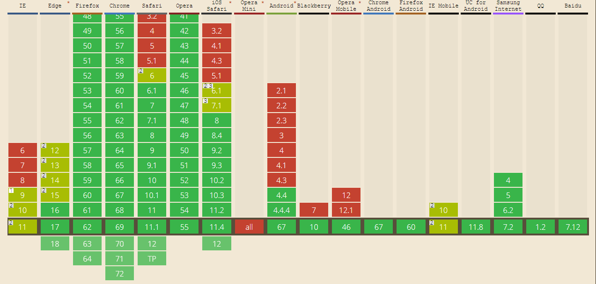

\[toc\]

## 前言

前几天写了一个[ErrorPages]("https://www.clloz.com/programming/front-end/css/2018/09/06/error-pages/" ""ErrorPages"")，本来在 `windows` 上试了下 `PC` 和 `iphone` 浏览器显示都没问题，不过今天在 `mac` 上看的时候发现由于 `mac` 显示器的高度要比我的台式机小很多，背景图片的显示出现了异常，于是考虑怎么做能让图片跟随浏览器大小的变化缩放，同时要保持纵横比，不然图片的显示会出现异常。其实关于响应式的图片一直都是我比较头疼的一个点，一直没有找到特别满意的解决办法，这次来好好研究一下这个知识点。

## 用Viewport units：vh，vw，vmax，vmin

`CSS3` 的新单位 `vh`，`vw`，`vmax`，`vmin` 是根据视窗的宽度或者高度确定大小的相对单位，这四个新单位的兼容性参考[caniuse.com](https://caniuse.com/ "caniuse.com")

如果你对兼容性没有特别高的要求，用这几个新单位的做法是最简单的。 根据你的需要设置 `vw` 的具体数目，只要保证块的纵横比和图片的纵横比一致即可。 具体样式参看实例中的第一张图样式。

## margin，padding的百分比特性

要让一个图片随着浏览器窗口的大小缩放，并且同时保持纵横比，我们就必须让宽度和高度使用具有相同基准的相对单位，比如上面提到的 `Viewport units` 以及类似 `em`，`rem`，百分比是不行的，因为视窗的宽高是任意的。这里我们利用 `margin` 和 `padding` 纵向的百分比是基于包含块的宽度这一特性来解决这个问题。`margin-top` 和 `margin-bottom` 的 `CSS` 规范解释见下图：

至于为什么 `margin` 和 `padding` 的纵向百分比是基于宽度的，我们看看贺老师的[解答](https://www.zhihu.com/question/20983035 "解答")：如果横向与纵向的百分比的相对方式不同，那用百分比就无法得到垂直和水平一致的留白。正因为 `margin`，`padding` 的这一特性我们可以实现一个宽高比固定的盒子。 具体操作是设置 `padding-top` / `padding-bottom` = `（图片的高度/图片的宽度）* 100%`。 具体实现参照实例中的第二张图的样式。

## img 实现

前面两种方法都是用 `background-image` 属性来实现的，如果我们的需求场景需要用`img` 标签实现的话就得用新的方法了。

## max-width

如图3的例子，为 `img` 添加 `max-width` 属性，在现代浏览器中 `max-width` 可以自动调整图像的比例，可以根据容器的大小缩放或者放大图像，并且图像的宽高比保持不变。 另外一点，在一些浏览器中仅指定图片的宽度，可能会导致浏览器重新处理布局，调整页面的时间周期会增加两到三倍，虽然周期不到一毫秒，但是累积起来，尤其是页面上有很多个这样的元素的时候，还是或多或少会影响页面的性能。为了解决这个问题，可以显式的指定图片的 `height` 值为 `auto`。

## padding

同样我们也可以利用 `padding-top` 或者 `padding-bottom` 来实现，如图 `4`，我们给 `img` 一个父级包含块，利用 `padding` 的百分比特性让这个包含快成为一个自适应的包含块，再用`position: absolute;`来定位 `img` 的位置。

本文的实例点击[实现图片固定宽高比](https://www.clloz.com/study/flexible-image.html)。

> `padding` 的百分比计算并不是根据当前元素的宽度计算，而是根据当前元素的父元素的宽度计算。

## 总结

实现图片的宽高比固定的自适应的主要方式其实就是固定宽度让浏览器自己计算高度，或者是利用 `padding` 的特性自己计算出对应的高度。

参考文章 [Flexible Images](http://www.w3cplus.com/css/flexible-images.html "Flexible Images")