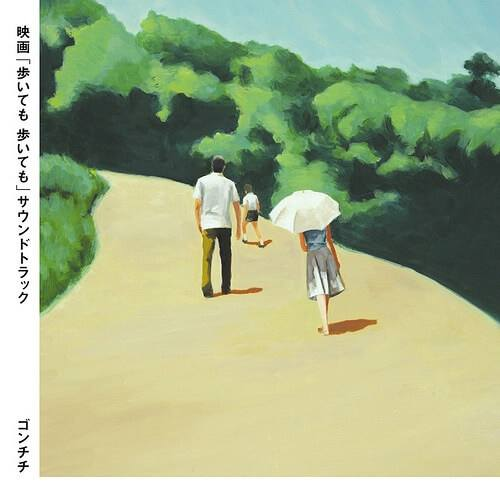

**一些随口说出的约定还来不及实现，一些胸口小小的悸动被淡淡忽略。人生路上，步履不停，总有那么一点来不及。**

—— 「步履不停」

步履不停是是枝裕和导演2008年的作品，最近是枝裕和的小偷家族在戛纳获得了金棕榈奖，我没有挤出时间去看，只能等电影在网络上上线再看了 说起是枝裕和导演，应该算是在国内也比较有名气的导演了，对日本文化比较感兴趣的人应该都听说过，他的《海街日记》、《无人知晓》、《步履不停》都算是比较有名的作品了，看是枝裕和的作品，都是让你在极其日常的场景中，感受到影片所要表达的强烈情感，这种讲故事的能力真的是非常有才能。

我知道这部作品其实是通过影片中的插曲，当时自己刚开始学吉他，在QQ音乐上听到了一首ゴンチチ的吉他取《朝》，听到这首曲子我仿佛回到了童年，那时候放假到农村外婆家去，五点就从床上爬起来，外婆划着小船，在乡间的小河上缓缓前行，五点多太阳刚刚出来，河边的翠鸟从眼前飞过，小船上会跳上来绿色的青蛙，空气是那么的让人神清气爽。听着这首曲子，我仿佛都呼吸到了那时的空气，生活慢慢的，慢慢的，却又很快乐充实，现在回想起来，都无法理解时代的惊人的变化速度。查了一下知道这首曲子是步履不停的插曲，我想用我这么喜欢的曲子做插曲的电影我应该也会很喜欢吧，去看了以后，那种舒缓的节奏，家人之间的羁绊，作品对家人之间关系的刻画，虽然是不同的国度，却让我感到了共鸣。就是从这部作品开始，我去看了是枝裕和导演的其他作品，让我喜欢上了这位导演的作品。值得一提的是，步履不停的原著小说就是是枝裕和导演自己写的。影片以一个家庭的聚会为舞台讲述了儿子，女儿和父母三个家庭的家庭成员之间的故事，情感，回忆，变化。我按照影片的顺序来写一下我觉得比较有意义的场景和剧情。

故事开头是以横山家的厨房为背景，母亲敏子和女儿千奈美在厨房做午饭，有一搭没一搭的闲聊着，父亲从走廊走过，无视女儿让去便利店买牛奶的请求，独自散步去了，一股舒缓的日常栖息扑面而来。场景转到儿子良多所在的巴士上，他和妻子由香里继子小敦正坐车回老家，一心想找个借口能当晚回来，不用在老家过夜，言语中透着对父亲的不满，妻子却不是很赞同他的想法，决定还是要在公公婆婆家过夜。看上去似乎跟我们现在过年会老家看爷爷奶奶没什么区别。厨房中，做料理的母亲向女儿抱怨，为什么儿子要找一个结过婚还有小孩的，她觉得如果是离婚的女人也就罢了，至少是互相不喜欢才离婚的，由香里的老公是事故去世，良多或许会被拿来和死去的老公比较，而且老公才去世三四年就再婚了，真是冷血（冷たい）。儿子一家此时正在此时正在车站边的店里喝东西，由香里希望良多要回去和姐姐商量一下搬家的事情（姐姐想搬回去跟父母住），而良多似乎并没有要干涉的意思，他并不想回老家去住，而由香里觉得良多是长男，这些事情应该是要过问的，良多在这里特意强调了自己是次子。在由香里去付钱的时候，良多和继子小敦聊天，问他为什么在学校兔子死的时候要笑，小敦说他觉得老师让给死去的兔子写信这件事很搞笑，因为这个信写给谁看呢，兔子已经死了，良多听了也是无言。影片的开头十分钟交代了影片中的主要人物，以及他们的性格，每个人心中对此次聚会都有自己的心思，从老人到小孩似乎都有自己的心结，大家表面和和气气，其实还是存在着许多的矛盾，儿子和父亲的矛盾，母亲对媳妇的矛盾，姐姐和母亲的矛盾，这些矛盾推动着剧情的发展。良多和小敦聊天的内容其实可以看出良多很关心小敦，跟他也没什么架子，很想和小敦相处好，而小敦明显因为经历幼年丧父，对于死亡也有着自己的一份理解，所以他才会觉得，兔子明明已经死了，为什么大家还要写信给兔子呢，这很好笑。

在良多一家往老家走的路上，由香里希望小敦能够在今天不要对良多直呼其名，但是小敦觉得良多就是良多，不希望改变称呼，由香里很无奈。同时良多也知会由香里，不要在父母面前提起他失业的事情，他非常不希望被父亲知道自己工作不顺。这里可以看到良多从年轻时离家出走一直与父亲关系非常差，同时他很想在父亲面前维持自己的自尊，可见父亲一直是对良多有点瞧不起的，由香里和小敦应该也是第一次拜访爷爷奶奶家，众人心情都很忐忑。到家后，众人一顿寒暄，千奈美的老公信夫以及两个孩子也都在，大家一起说说笑笑，良多也问了问侄子侄女的近况，到处洋溢着快乐的空气，一副其乐融融的样子。突然父亲从走廊出现，除了母亲所有人都收起了嘻嘻哈哈的样子，向父亲打招呼，这里可以看出父亲在家中的地位，以及他不苟言笑的作风，他向由香里打了声招呼就一个人跑到诊室去了。敏子揶揄道，当初纯平第一次带媳妇回来的时候，父亲也是这样躲到诊室去了，父亲走后，大家又回归到了轻松的氛围。这段还有个细节，千奈美家的两个孩子在吃冰淇淋的时候说了句我最喜欢外婆家了，被父亲听到了，父亲回头看了一眼，用力的关上了诊室的门，可以说父亲有一点傲娇，也可以说是他希望保持着他作为大家长的尊严，希望大家都尊重他的地位，有点严肃，有点固执，又有点可爱，明明是我建立起的这个家，为什么要说成外婆家呢。影片放到这里，父亲似乎是隔绝在所有人之外的角色，他的永远只出现在门口和狭窄的走廊尽头，我想导演也是用这样的场景来表达父亲在这个家庭中的处境吧，他是家庭的一员，是这个家庭的主轴，却又独立在所有人之外，还有点不近人情，这样一个特别的角色在影片中肯定是有着特别的意义。

在良多拿着西瓜到浴室去的时候，奶奶说起了良多修学旅行时磨牙被同学赶到别的房间去的笑话，良多探出头来笑着说了一句，“那不是我吧，明明是大哥”，回过头良多就看到了浴室角落的碎瓷砖和浴室新装的把手，这里应该是说房子父母都老了，父母现在洗澡蹲下来后想站起来有点困难，需要装个扶手来借力了，我想此时良多的心里也是百感交集的。后面母亲开始做玉米天妇罗，父亲在二楼的诊室听到了炸天妇罗的声音，悄悄地走了下来，千奈美偷偷对由香里说“他耳朵不怎么灵，鼻子可是很好的”，敏子也讲起了年轻时的笑话，那时候住的地方旁边是邻居家的玉米地，父亲去偷了点玉米，正炸的时候好心的邻居来送他们玉米了，父亲笑着说“那时候可真是尴尬呀（気まずい）”，母亲接着就说起了长子纯平的童言，此时镜头切到良多，他吃着天妇罗，脸上的笑容逐渐消失，取而代之的是一脸不悦，似乎是回忆起了自己永远被拿来和大哥比较，在父母心里永远也比不上大哥，郁闷的心情笼罩在心头。

小敦和千奈美的两个孩子在一起，千奈美的儿子和女儿在讨论着搬过来以后他们怎么分房间，小敦就在旁边默默的看着他们，一言不发，在影片中小敦和另外两个孩子形成鲜明的对比，千奈美的孩子吵吵闹闹，就如你我的同年一样，有的吃有得玩就非常开心，玩的很疯，而小敦总是默默的观察着身边的一切，不想过多的何人交流，敏感而内敛，对事物有着自己的看法却深藏内心。突然千奈美的女儿坐到他旁边，问他父亲去世他是什么感觉，哭了吗？小敦找了个借口说记不得了，避开了这个话题，然后女孩又追问他，你叫良多舅舅什么呀？小敦拿起来一块天妇罗坐到对面，开了女孩一眼说“就普通的，叫他爸爸”。从前面由香里让他今天不要对良多知乎其名他表示拒绝，到这里他撒谎说他叫良多爸爸，让我对小敦有更多的共鸣，他敏感有细心，表面上对什么事什么人都不关心，其实静静地观察这一切，同时用自己的善意对待一切，父亲的去世让他比同龄人多了一分成熟和冷静，但是并没有磨灭他的童真和善良。

母亲订的寿司送过来了，寿司店的老板也是熟人，大家许久不见也聊了聊近况，老板的父亲七十二岁患上了老年痴呆，千奈美想了想和自己的父亲一般年纪了，这里交代了父亲因为患上了青光眼，视力越来越不行，同时附近也新开了大型的综合医院，所以决定把诊所关了，其实父亲并不想这么早退休，但是人还是没法对抗年龄，从这点也可以看出父亲为什么总是闷闷不乐，总是在诊室和走廊徘徊，其实也是对于自己不能再做医生的无奈与挣扎吧。寿司屋的老板临走前把自己老婆交代的祭仪交给了敏子，他的太太初中时曾是长子纯平的学妹，给纯平送过巧克力，看到这里我想大部分人都猜到了，长子纯平已经去世，今天正是纯平的祭日，一家人约定每年的今天来祭奠纯平。

在饭桌上，母亲说自己一直有一个愿望就是坐着儿子的车去购物，可是子女总是没法朝着父母期望的路走，言语中透着无奈。母亲关心地询问了良多的工作牙齿，聊着聊着说到了纯平生前的妻子，母亲说如果他们两有孩子的话还能多走动走动，现在这样过来就不是很方便了，父亲此时突然插话说“现在想想其实没有孩子是好事，不然带着一个孩子想要再婚会变得很难”。这典型的KY行为让气氛变得非常尴尬，由香里只好打圆场说我能遇到一个好人真的是幸运呢。千奈美和敏子也都叉开话题提议看良多以前的照片来缓解一下气氛。众人走后餐桌上只剩良多和父亲两人，两人聊了聊工作，父亲问良多工作能养活家人么，良多没好气的回了一句“托你的福，能养活带着儿子的寡妇”，也算是对父亲刚刚的KY行为进行了回击，两人的初次对话就这样不欢而散。母亲到楼上去找良多以前的照片，在翻照片的时候，母亲的背影传来一声叹息，镜头没有给到正面，母亲应该是翻到了纯平以前的照片，忆起去世的儿子，心中惋惜。到楼下四人翻看良多以前的照片，找到了一封良多小时候的作文，写着自己想做内科医生，哥哥做外科医生，被进来的良多抢走了，母亲这是说了一句，至少有一个儿子继承衣钵的话现在情况或许就不一样了。从千奈美的描述中我们可以知道，大哥纯平是一个为人和善，很圆滑不像父亲和弟弟这么固执的性格，而纯平从一开始就是立志做医生的，而良多的愿望是做画家，所以在父亲的心中纯平一直是寄予厚望继承自己衣钵的，这大概也就是为什么良多那么讨厌父母拿自己当哥哥的替代皮，在哥哥去世后希望他来继承诊所，因为他明白他不是也成为不了哥哥的替代品，所以他才离家出走，跟父亲关系这么僵，独自一人闯荡去了，他有他的自尊。

千奈美想叫父亲一起和大家聊聊天被父亲回绝了，千奈美吐槽父亲对良多的态度和对纯平的态度差远了，父亲觉得纯平是准备继承他的诊所的，而良多只是负气离家出走罢了，当然不一样。回到客厅，电视上突然播放了有人在海边遇难的新闻，母亲开始回忆起纯平去世当天的事情，纯平当天难得回来过夜，突然说要去海边，母亲记得他在玄关擦鞋子，那双鞋子的印象太深了，母亲抱怨纯平为什么要救一个不相关的人呢，又不是自己的孩子，也后悔自己为什么不叫住纯平，也许那样纯平还活着。良多抽着烟，看着母亲苍老落寞的背影，我想心里也很舍不得母亲吧，白发人送黑发人的感受我想没经历过的人是无法体会的。

小敦一个人在屋子里闲逛，玩了玩钢琴又走到了爷爷的诊室里面，这时候爷爷突然回到诊室，看到小敦，有点开心的的把小敦拉到旁边给了他一个红包，小敦说奶奶给过了，但爷爷表示这一份是爷爷给的，同时询问小敦长大了以后想做什么，小敦撒谎说自己因为喜欢音乐老师而想做钢琴调音师，恭平爷爷说男人一生的职业不能被女人所左右，并跟他讲了自己成为医生的契机，希望小敦也能考虑医生这个很好的职业，这时候良多走进来打断了父亲，他觉得父亲不应该去鼓动小敦，并表示小敦不会成为医生的。父亲这时候说了一句“反正我也等不了20年了”。这一段可以看出，父亲虽然对良多没有好印象，也不赞同他的婚姻，但是对孩子还是很喜欢很关心的，也许这个世间所有人都一样，因为孩子象征这希望，同时，父亲确实很喜欢医生这个职业同时希望有人能继承他的衣钵，他已经做不了医生，而且也活不了多少年了，他多希望在自己有生之年能有人继承这样一个有意义的职业，奈何大儿子英年早逝，二儿子离家出走对继承诊所毫无兴趣，父亲心中的苦闷也无处宣泄。此时在厨房，母亲委婉地拒绝了千奈美想搬到老家，拆了诊所改建的请求，和良多一家去为纯平扫墓。来到纯平的墓前，已经有人来过，并送上了向日葵，母亲插上花点上香，用水浇墓碑，嘴里说着“今天一天都很热，浇上水很舒服吧”，小敦看着奶奶，可能他心里并不理解，为什么叔叔已经死了，奶奶还要做这样的事情。敏子为纯平把墓边的杂草清理一下，说着“没有比为儿子扫墓更悲惨的事情了，他明明什么坏事都没做”，我也曾问过我母亲，如果自己的儿子因为救人而丧生会不会觉得不值，结果是显然的，我想很少有人能高尚到理解这件事，不管如何，人都是自私的，敏子心里也觉得没必要豁出性命去救一个不相干的人，纯平太傻了，这是人之常情，是你我都会有的想法。回去的路上，良多和母亲，小敦和由香里，两对母子一前一后，我想也象征着一种传承吧，人会老，会死去，但是亲人之间的羁绊不会随着时间小事，而是越来越深，即使人去世了，情感也会影响活着的人。母亲和良多谈论了千奈美搬家的事情，母亲觉得他们搬过来一方面太吵了，另一方面良多以后想回来就回不来了，也问了良多他们是不是该要个孩子，有了孩子，感情能够更牢固。这段场景实在爬坡，母亲年老体衰，一直牵着良多蹒跚前行，看到这里想到了自己的母亲自己的外婆，想到他们也有一天会如剧中的敏子一样，一股悲伤的情愫萦绕心头。母亲给良多讲了一个传言，在冬天没有死去的白色蝴蝶会在来年变成黄色的蝴蝶，或许在母亲心中，看到的黄色蝴蝶寄托着亡者的灵魂吧，她希望纯平也能是在蝴蝶中寄托着灵魂，能够来看看她。

回到家后，当年被纯平从海里救上来的小孩良雄已经长大，来祭拜纯平，这孩子并没有像很多美好的童话里面一样，成长为一个了不起的人，而是一个普通甚至有点没用的人，大学中途退学，工作也没有着落，只能找到兼职，长得异常肥胖，由于拘谨紧张，浑身都湿透了。氛围很不好，他紧张客套地表达了对纯平救他的感谢，母亲双目无神的看着他，父亲一个人在天井背身坐着，良雄略显尴尬地在纯平的排位前祭拜了一下，就准备告辞。良雄的人生很不如意，良多鼓励他说，你才二十五岁，努力的话能成为任何你想成为的人（まだ二十五じゃない、頑張るはなちゃってなれるから），这句话也是很多人认为在电影中说的最好的一句话。母亲特意叮嘱良雄来年还要再来，一定会等他的，良雄略显意外和尴尬的答应了敏子，可以看出来横山家对良雄是一件很有负担的事，可能是因为自己混的这么惨有点没脸见救命恩人的家人，但是敏子的邀请让他不得不来，影片后面有交代敏子为什么要这样做。送走良雄后，父亲也没好气的抱怨，这么没用的家伙，为什么我儿子要搭上性命去救他，这都是我们马后炮的想法，纯平救人的时候并没有想过是好人坏人，这也许就是真正高尚的人和普通人的区别吧。父亲发着牢骚，指责良雄的工作也只是个兼职，可能是戳到了良多的痛处，良多对父亲进行了反驳，有点上头，甚至打翻了杯子，他觉得人不应该被这样比较，被骂没用，表面上他是在为良雄争辩，其实他也只是在位自己的现状找一个自己能接受的解释，他看似对父亲发火，其实是在责备着自己，恨自己的无能。就像我曾经看到过的一段话：我们经常看到有很多人对自己的生活不满，对这个社会不满，对自己周围的人不满，其实如果这些人往深处去解剖自己的不满，最终他会发现其实他只是对当前的自己不满，就像你憧憬什么样的人，你想要和什么样的人做朋友，那么你就努力成为那样的人，等你成为了那样的人，你会发现你周围已经都是你憧憬的那些人了。人在长大之后总是没法想小时候一样专心致志地做一件事，静不下心来，因为功利心太重了，我少吃了一顿饭，就希望自己体重减下来了，我看了一页书就希望自己的知识增加了，我们似乎忘了很多事情都是要长久持之以恒的做下去，变化自然而然地产生，急功近利最终什么也没有。

晚饭前千奈美一家都会去了，晚饭良多一家和父母一起吃鳗鱼饭，由香里无意中提到了家里的黑胶唱片，敏子满怀深意的问由香里要不要听，选取了一首蓝色街灯下的横滨（ブルーライト・ヨコハマ ），恭平听了这首歌飞快地吃完饭，而敏子则面带神秘微笑哼唱着这首歌，良多和由香里也心照不宣。恭夫泡澡的时候问敏子唱片什么时候买的，敏子说他们还住在板桥的时候，一晚她背着良多听到一间房里传来恭平的歌声，唱着这首蓝色街灯下的横滨，她不想打扰他们两个人，就默默地回去了，恭平非常羞愧，原来年轻的时候出轨的事情妻子一直知道，只是没有戳破。就从这一点可以看出敏子其实是一个很大气的女人，也很有度量的女人，相比较而言，恭平就小气一点，他们纵然吵架，敏子也从没有翻这些事情来争取上风，有些事情如果你决定不说了，那么你就让它烂到肚子里去。当然了，这里有日本的文化在里面，在我们国家这样的事情是很少见的，我也不赞同这样，每个男人在选择结婚的那一刻就应该把自己的心收回来交给自己的妻子，如果你觉得你还没玩够那你不应该选择结婚，这是对妻子对孩子的不负责任，既然选择结婚，就要承担结婚应有的责任。

良多和母亲在客厅聊天，良多给了母亲一点零花钱，母亲很开心，心想着用这个钱买点什么好呢。我想所有的父母都一样，不管缺不缺钱，如果孩子回来能给他们带点礼物，给他们点钱尽点孝心，如果在用点心，别提有多开心了，在人生的末尾，你已经没有任何追求了，想要有一个幸福的晚年完全就看子女的孝顺程度，就如同一个人的童年是否开心也完全取决于父母一样，这也是一种轮回，但是父母对孩子是无私的，孩子对父母却不是这么回事。那时候物质条件对他们来说已经没有什么意义了，我外公就说过过了80岁是过一天少一天，随时都等着了，希望所有的年轻人有机会多看看父母，给他们一点晚年幸福。 良多劝母亲不要在逼良雄来了，他来这里很尴尬，也很不情愿，这是一种对他精神上的绑架，良多认为良雄并没有做错什么，不应该让他受这种罪，太可怜了，敏子却觉得，在父母的眼里，就是因为良雄纯平才死了，如果只不过十年就让他忘了这件事太便宜他了，对于父母来说，孩子死了却没有人憎恨才是最痛苦的（憎む相手がいないだけ、余計こちがつらいんだから），每年让他痛苦一会应该也不算过分吧，所以我会一直邀请他。这里很多年轻一点的同学可能觉得老太太有点不近人情，但真当你长大了，其实这才是人之常情，我想没有做父母的人是无法理解的吧。

后面一段老太太的戏是我觉得全片最出彩的，家里突然飞进了一直黄色的蝴蝶，老太太觉得是纯平的化身回家来了，老太太在屋里想疯癫了一般追逐着蝴蝶，蝴蝶最后停在了纯平的照片上，良多抓住蝴蝶把它给放生了，老太太一直都没有缓过来。这段戏敏子的扮演者树木希林真的是演的出神入化，感觉老母亲像是突然痴呆陷入癫狂一般，然后在蝴蝶飞走后任然没有缓过来，在儿子让她去洗澡后才慢慢回复正常，我从这段戏中切实地体会到了她的丧子之痛以及她渴望见儿子的心情，明知不可能却还是要追逐，这样的心情是无奈是苦痛。随后邻居家的老人生病打电话到诊所，但是父亲已经无法为人看病了，只得让邻居打救护车，在救护车边，看到父亲被医护人员当作不相干的人的急切与无奈，我想良多应该开始慢慢理解父亲了，知道了医生在他心中的分量以及他是真的希望有人继承他的职业。在卧室里，小敦问母亲为什么奶奶刚刚那么奇怪，母亲回答说奶奶一定是看到了纯平，小敦看似问妈妈，其实也在问自己，人去世了就跟这个世界再无联系了吗？妈妈告诉他父亲即使去世了，仍然活在他的心中，而良多也会缓慢而坚定地成为他的一部分，妈妈的这番话也算是为年幼的小敦上了重要的一课，让他真正的理解了死亡的意义，我们不得不面对，但我们不必背板，家族之间的羁绊并不会随着人的死亡而消失，活着的人依然延续着多死去之人的情感，死去的人也影响着活着的人。小敦一个人走到院子了，说出了自己想成为钢琴调音师的理由，因为爸爸是，同时他也说如果他做不了钢琴调音师的话他会选择做一个医生，爷爷也对小敦产生了影响。

第二天，恭平，良多和小敦决定去看海，在纯平去世后，恭平就再也没去过海边，他这次愿意去海边说明他也已经解开了心结，他和良多约定下次要带小敦一起去看球赛，回家后良多一家就坐车回去了，母亲叮嘱良多要去看牙，让小敦下次再来玩。良多一家坐车回去后，恭平说他们下次回来就是春节了，而良多在车上说今天回来过了，春节就不用回来了吧，一年一次够了。人都是这样，活着的时候不晓得珍惜，失去了再悔恨也没用了。我们现在也几乎是一年回去一次，我想起了日本演员小池彻平在一次综艺节目中说他现在一年回去一次，有一次弟弟来东京对他说，母亲上次在家里算，小池彻平一年回去一次，这样的话，我这一生差不多还能看儿子15次，说实话当我听到这里的时候眼泪落下来了，这真是一个现实有残酷的数字，我想到了我的母亲今年也51了，外公外婆更是七八十岁，而我们也不过一年回去一次，父母培养子女真的像放风筝一样，看着孩子远去，既开心又难过。

影片的最后是几年后良多由香里带着儿子女儿去为父母哥哥扫墓，良多也给女儿讲了黄色蝴蝶的传说，这也许就是一种传承吧。

步履不停就是这么一个平淡而真实的故事，每个人都有着自己的心结和秘密，每个人性格不同但家族中的人始终都是互相关心的，最终大家也都解开了心结，隔阂也都消除了，虽然总是慢了一拍，良多没来得及跟母亲说相扑选手的名字，也没来得及开车带母亲去购物，跟父亲说好的球赛也没有去看。整部影片朴实无华波澜不惊，却将三个家庭中每个人的性格情感细腻的描绘了出来，借用豆瓣上的一句话：是枝裕和的电影好像什么都没说，看完我却听到了许多。人生的路上步履不停，该说的未说该做的未做，充满遗憾的事情是无法避免的，但我们在爱的人还在身边的时候，向他们敞开心扉，多去了解关心他们，让自己的人生少一点遗憾，让我们不停的步伐能够更轻快些。

第一次写这种内容，不知不觉写了这么多，因为不知道以什么形式来写，如果脱离剧情讲有点不知从何讲起，连同剧情一起讲感觉就变成了这么多，权当练习了，希望下次精炼一点，废话少一点。

> 这部电影在爱奇艺上和B站上都有，不过字幕有很多错误，如果你找不到资源的话可以在下面留言，我会发给你。