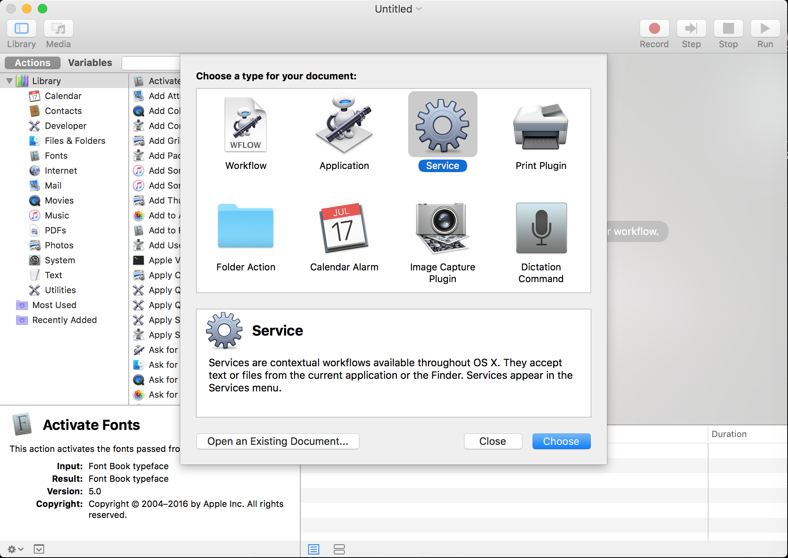

\[toc\]

## 前言

`mac` 没有为 `terminal` 的打开提供快捷键，有时候觉得不是很方便，今天和大家分享一下在 `mac` 上绑定 `terminal` 的快捷键的方法。

> 可以绑定任何操作

## Automater

打开 `application` 中的 `automator`，`automator` 其实就是用来自定义工作流以及服务的软件，用好这个软件可以自己定制自己的工作流或者自定义服务，提高自己使用 `mac` 的效率。 我们要为“打开 `terminal` ”动作新建一个服务流程如下， 1. 新建一个服务，选择任务栏上的 `File->New->Service`,如下图：

2. 添加服务内容，在左边的菜单栏依次选择 `Utilities->Run AppleScript`,然后添加如下代码

添加完之后点击黑色箭头运行，如果能够打开 `terminal` 说明服务没有问题，`command+S` 保存该工作流，你可以将其命名为“`Open Terminal`” 3. 绑定快捷键，在 `System Preferences->Keyboard->Shortcuts->Services->General` 中找到刚刚添加的 `Open terminal` 绑定自己想要的快捷键就可以了。

## 总结

`Automator` 有很多有用的功能，为应用绑定快捷键只是其中之一，工作流也可以极大的提高我们使用 `mac` 的效率。