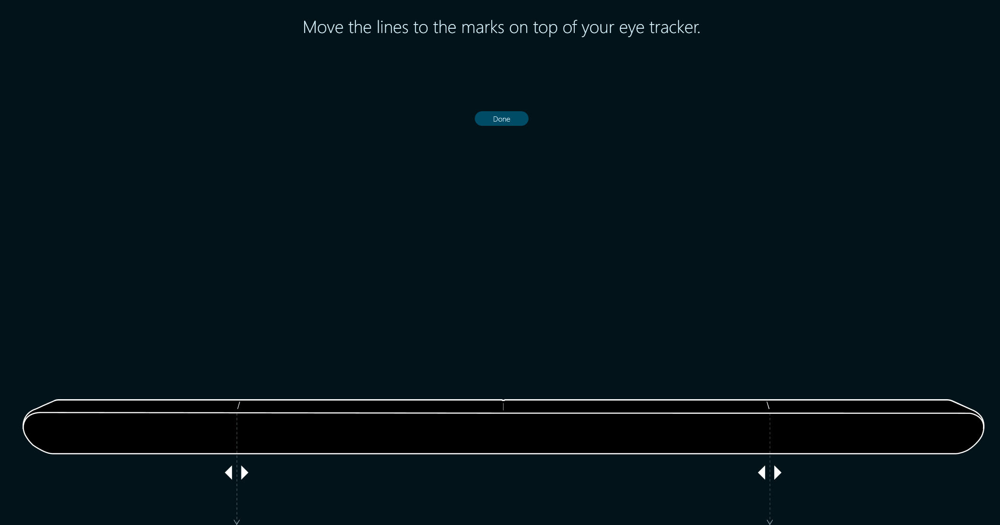
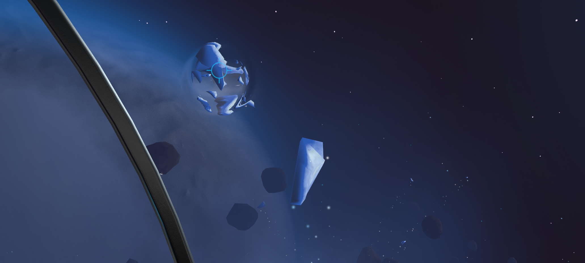
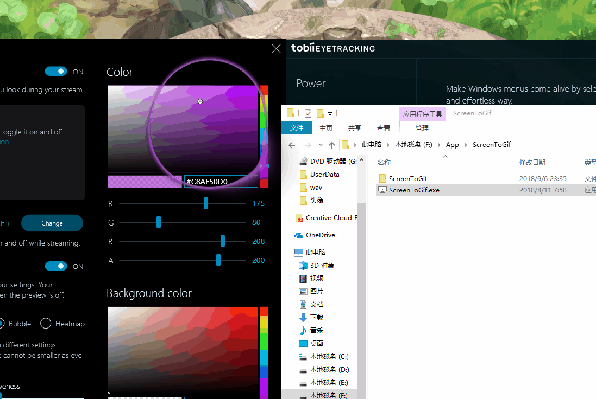
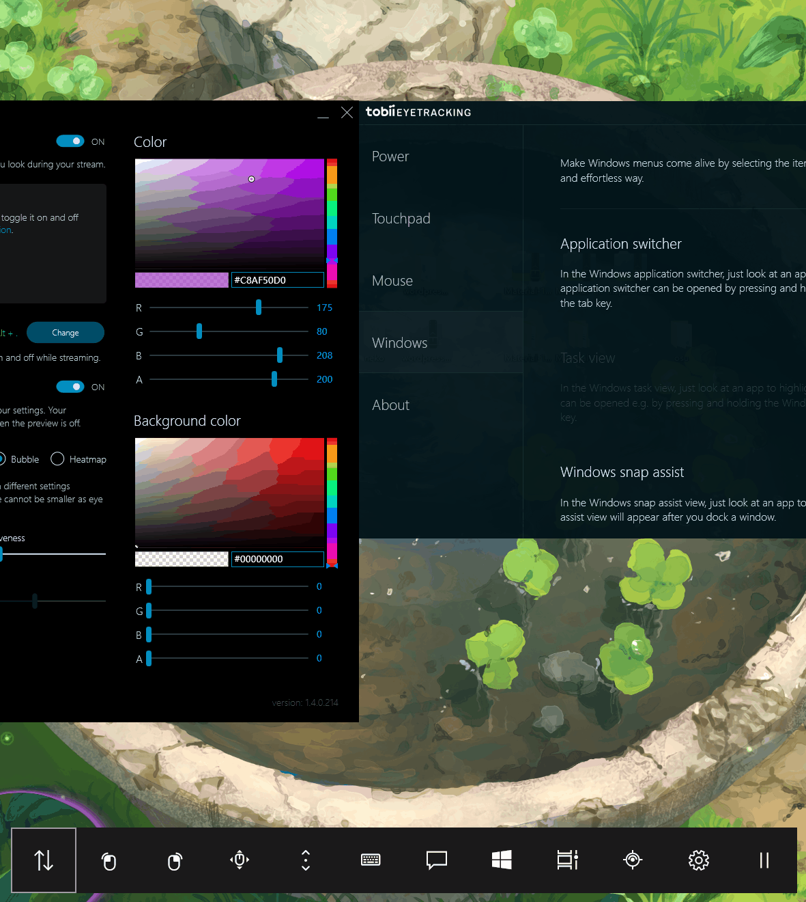

\[toc\]

## 前言

前些天在B站上看到别人在玩OSU的时候在屏幕上有一个眼球追踪的模型，能够追踪自己的目光，让直播的观众能够看到你的焦点在什么地方，觉得很有趣，就去了解了一下，原来是Tobii出品的眼动仪的效果，我觉得很有趣就到京东上购买了一个，在这里给大家说一下使用的感受。

## 安装硬件和软件

京东的物流很快，隔天就送过来了，包装很简单，就一个眼动仪，一条加长线，其实我觉得这样的设备做成蓝牙的会比较好，因为他是装在屏幕上的，线材也比较硬，有线首先一个是不美观，第二个就是如果显示器上没有usb接口的话就需要拖一条长线到主机上，笔记本也非常影响美观，不过还好我的显示器上是有usb接口的。在眼动仪背后的中间部分是有磁铁的，包装中给了两条铁片让你贴在屏幕下部，这个应该是主要用在笔记本上的，台式机的显示器最下部应该就是能够吸住的。安装好后大概是这样：

安装好设备之后就是安装软件了，到tobii的[官网](https://tobiigaming.com/getstarted/ "官网")去下载即可，官方一共提供了三个软件，分别有不同的功能。

1. Tobii Eye Tracking Core Software （提供主要功能）
2. Tobii Game Hub （游戏相关，可选）
3. Tobii Ghost （视线追踪相关 可选）

只要装上第一个core software就可以使用眼动仪了，安装过程中会让你设置一些内容，比如显示器的设置：

因为每个显示器大小不同，将途中的两个虚线箭头对准眼动仪上面的白线。

然后会进行基础的测试，屏幕的角落后出现几个小点，你用自己的视线去看几个点，这几个点会爆开，成功了，测试就基本完成了，测试完成后会生成一个你个人的配置文件，如果有第二个人需要使用这台电脑需要添加自己的新的测试文件，因为每个人的眼睛不同，看东西的习惯也不同。我的显示器是27寸的，点很小，不过测试没任何问题，说明眼动仪的精度还是可以的。再往下就是一个小游戏，你驾驶飞船在太空中航行，遭小行星带，你可以用目光锁定那些石头然后发射炮弹击碎，基本反应速度和精确度都还是可以的。当你的视角注意到放光的恒星的时候，整个画面会变成一篇白光，像被闪光弹炸到一样。

以上就是硬件和软件的全部安装过程。

> tobii的这个眼动仪是不支持27寸以上的显示器的

## 软件功能的探索

虽然软件引导我们进行了简单的设置，不过其实软件还有很多有趣的功能，我们可以仔细探索一下。

## 电源管理

windows的电源管理，windows的电源管理可以让我们选择显示器何时关闭，电脑何时进入睡眠，眼动仪的软件同样提供了这方面的功能，主要是三个方面： 1. 当人离开电脑的时候屏幕逐渐关闭（需要显示器支持，我的显示器不支持） 2. 当人在电脑前的时候不关闭屏幕 3. 如果屏幕关闭，当你走到屏幕前的时候会自动打开

## 鼠标控制

软件同样提供了鼠标的功能 1. 轻微地移动鼠标，指针会直接跳到当前眼睛注视的方向（有一个可选项是只有鼠标朝着注视方向移动才会跳过去） 2. 将上面的功能绑定组合键，不需要移动鼠标，按下组合键鼠标就会移动过去（有一个可选项是当鼠标移动过去的时候执行一次左击） 能模拟鼠标应该是以后眼动仪开发的一个重要功能，不过目前来看并不是很好用，因为仪器我发判断我们是需要移动鼠标还是只是在移动我们的视线，所以软件还是采取了人工干预的办法。不过既然是人工干预，第一项中的功能就反而不是很好用，因为可能你不小心碰了一下鼠标，指针就跳走了，很多时候会产生误操作。我是采用的第二项中的方法，绑定了一个快捷键，而且当前眼动仪的精确度并不能达到像素级，按照官方的说法，误差在一个手指的宽度内，不过我们的鼠标操作大部分还是要求比较精确的，所以这个功能只能算是辅助的功能。

## Windows Hello以及在win10上的应用

去年的iphoneX首次取消了指纹采用了faceID，其实微软很早就有了面部识别技术，不过win10上的windows hello功能需要相应的设备才能开启，比如面壁别的摄像头或者指纹识别器，tobii的这款眼动仪刚好可以启用windows hello，在设置——账户——登录选项卡中，开启windows hello然后录制自己的面部就可以使用了，当我们开机或者是锁屏情况下，不需要输入密码，只要坐到电脑前，就直接开启了，还是非常实用和方便的，至于精确度我还没有试过别人能不能打开，不过我自己的识别还是非常快的。 开启了windows hello以后还有几项有用的功能可以使用，就是当我们使用应用，任务和窗口管理的时候也可以脱了鼠标了（也就是alt+tab，windows键+tab和windows键+方向键三个功能），当我们打开相应的界面比如win键+tab打开task view，直接用眼睛就能锁定自己想要打开的应用，然后按空格或者回车就可以直接打开了，这个功能我个人觉得还是非常有用的。 不过郁闷的是我试了很久这个功能一直用不了，原来是10月份的windows10更新导致目前该功能不可用，任务视图这些会覆盖到最上层，覆盖在了软件作用域的上面，软件无法定位到任务视图，目前官方正在寻找解决方案，我也就是前两天才更新的，就用不了，很气 :cold\_sweat: 。

## tobii/ghost

这个功能原来好像是叫做streaming gaze overlay，现在是一个独立的软件，在官网下载，其实就是把我们视线落点给具象化，让我们能直观的看到我们的视线落点范围，这个功能也是非常有用的，也就是我上面说的那位OSU玩家使用的功能，大概是如下效果：

这个软件提供几个有用的功能： 1. 可以改变上面那个具象化的气泡的外观（比如边框颜色，填充色以及大小） 2. 提供了几种可选的类型（1.填充 2.气泡 3.热力图） 我使用的是第二种气泡，一是这种不会影响我们正常使用屏幕，第二是这种也比较好看。热力图类型可以看出你的视线落点在那些范围比较多，我个人觉得没啥用。使用`ctrl+alt+.`可以开启和关闭预览，也就是我上面动图的情形，你可以实时看到自己的视线落点。

## tobii game hub

这个眼动仪其实很重要的功能是给游戏服务的，当然不是所有游戏都支持，在界面左侧可以看到哪些游戏支持，我电脑上的游戏有`ori and blind forest`和`life is strang`支持，同时买这款眼动仪赠送了育碧的`刺客信条：奥德赛`也是可以使用这款眼动仪的，不过又一点让人郁闷的是给的激活码国内不能激活，我挂了美国，香港，日本，俄罗斯的vpn依然不能激活，一直提示当前地区不可用，目前给tobii发了邮件，等他们回复。不知道在游戏里面表现如何，还待测试。

## 目视控制（Beta版本）

windows10当中提供了目视控制的功能，效果大概如下：

面板上提供了鼠标左击，右击，滚动，键盘，通知面板，开始菜单，任务视图等功能，不过由于定位精度的问题，并不是每次都能成功，这些功能windows也都有相应的快捷键，所以我觉得并没有太多的用处，所以我关闭了。

## 总结

总的来说，这款产品还是挺不错的，虽然精度达不到很高的要求，不过还算及格，而且安装使用也很方便，不过不知道这样的精度在游戏中能不能发挥很好的作用，毕竟如果是射击之类的对精度要求还是比较高的，而且当你真的想用你的眼睛去微调角度，你会发现眼睛好像不是长在自己身上的 :smile: 。ghost软件也提供了twitch和obs直播的功能，主播在直播中使用这款软件感觉也是能够增加与观众的互动的，还算一个比较有趣的功能。而且我打开了ghost软件的预览再使用电脑发现原来我的眼睛每天工作是如此“辛苦”！这是一款挺有趣的产品，如果你也对眼动仪感兴趣可以买一个试试。