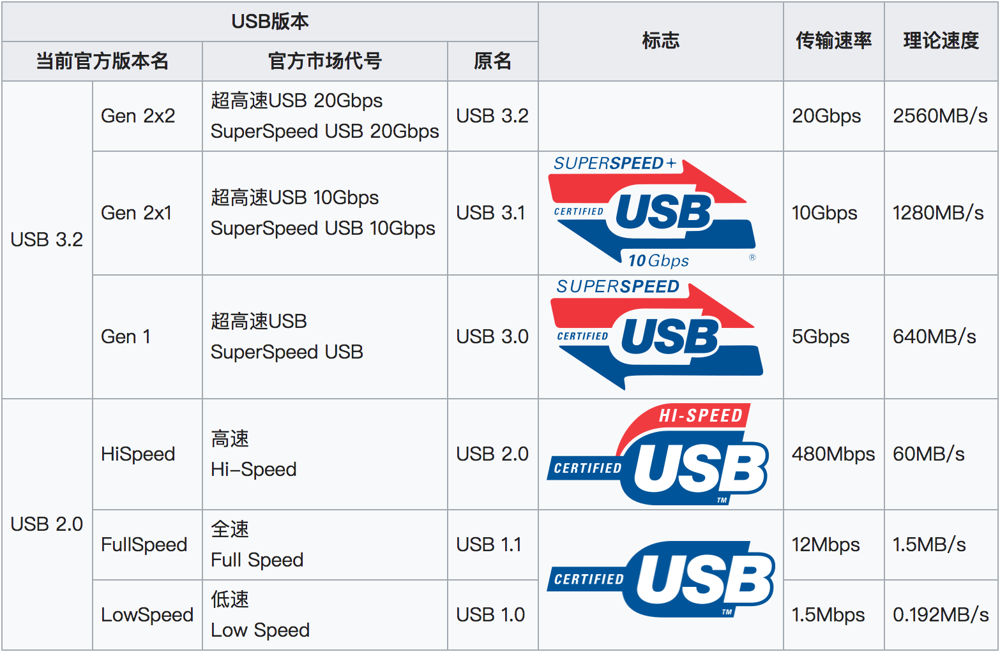
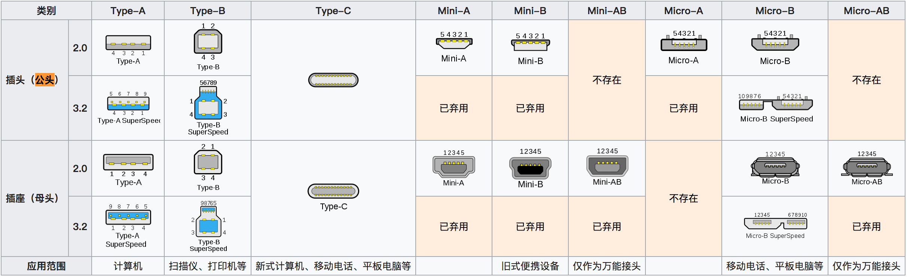
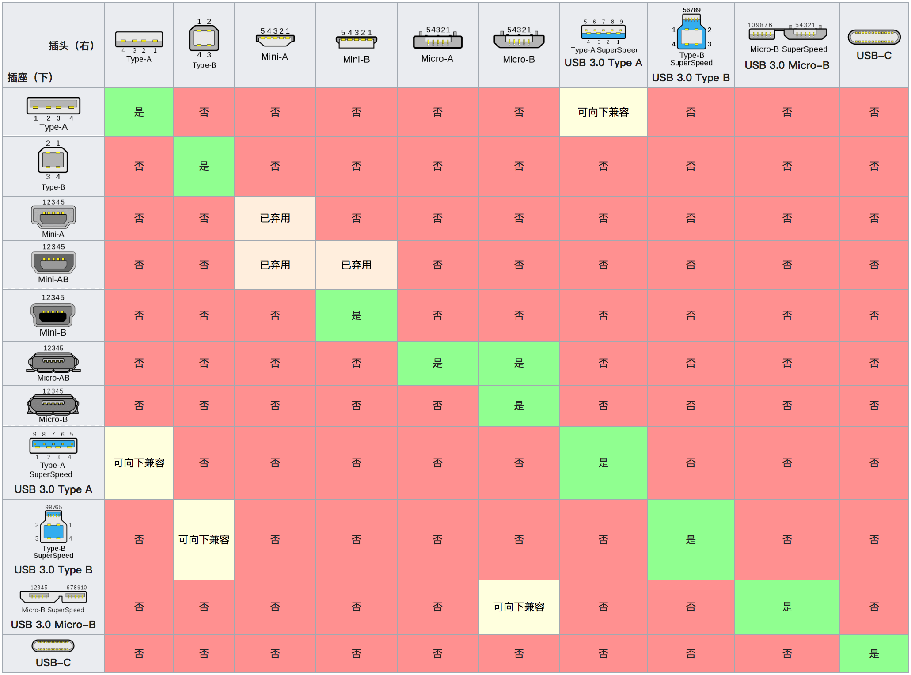
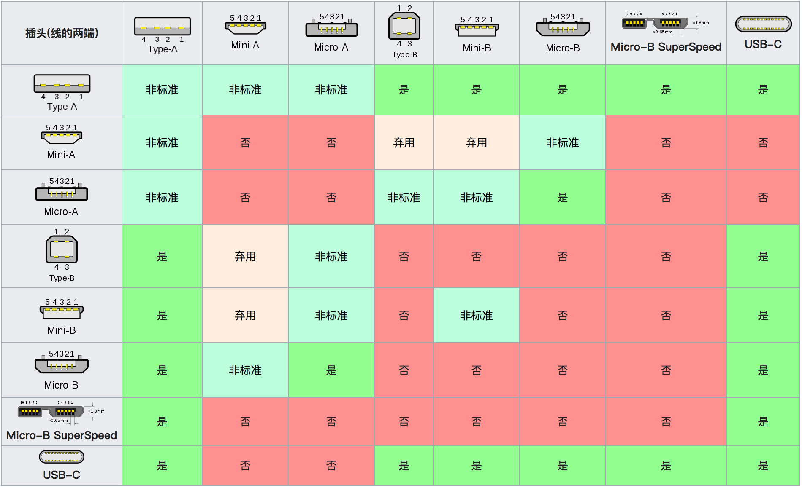

\[toc\]

## 前言

对于 `usb` （`Universal Serial Bus`）大家都非常熟悉，通用串行总线，是连接计算机系统与外部设备的一种串口总线标准，也是一种输入输出接口的技术规范，被广泛地应用于个人电脑和移动设备等信息通讯产品，并扩展至摄影器材、数字电视（机顶盒）、游戏机等其它相关领域。

`10` 年我进入大学的时候，大部分电脑还是标配 `usb2.0` 的接口，后来才慢慢出了 `usb3.0`，`usb3.1` 等，现在接口越来越多，包括我知道的早起安卓使用的 `micro usb`，现在的 `type c` 接口。而苹果的接口虽然不在 `usb` 标准里面，但是苹果的设备市场占有率也很大，他的 `lighting接口`，`thunderbolt接口` 使用率也很高，很多时候这么多的接口类型让人困惑，本文就来讲一讲 `usb` 标准的版本和接口类型。

## 串口和并口

不管什么接口，作用都是为了连接外部设备，然后传递数据，而接口发展的目标当然是能够连接更多不同的设备以及获得更高的传输速率。但凡事都要考虑实现的难度和实现的成本，很多时候由于技术或成本的限制我们只能在具体的应用场景采取最合适的方案。串口和并口就是在早起传输速率不是很快的情况下，针对不同的应用场景采取的不同方案。

串口和并口的定义：在一个独立的信道上，每次同时传输1bit为串口，每次同时传输多个bit为并口。从定义上看，并口的传输速率似乎要比串口快，但是为什么在大部分应用场景下并口已经慢慢被淘汰了呢。我们知道就是在我们使用的 `usb` 以及以前的主办上的并行接口，串行接口内部都是有很多条线路的（比如 `usb` 或者 `lighting接口` 上的触电），他们有的用于供电，有的用于接地，有的用于传输信号，还可能有一些其他操作比如控制等。我们想要提高接口的传输速率无非两种方法，一种是提高单根线路的传输速率，另一种是增加线的数量。但是在并行接口的实践中已经发现，多条线路的信号会相互干扰，并且传输距离要有限制，不能太远，比如主板上的并行接口一次传 `8bits`，如果其中一个信号出错，`8` 个全部要重发。而串行的结构要简单很多，干扰的问题要小很多，同时成本也更低，我们只要提高单根线路的传输速率就好了，这要比解决干扰的问题成本小很多，而且并口的多条线路之间还要解决数据同步的问题。

简单的说就是串口形容一下就是一条车道，而并口就是有 `8` 个车道同一时刻能传送8位（一个字节）数据。但是并不是说并口快，由于 `8` 位通道之间的互相干扰（串扰），传输时速度就受到了限制，传输容易出错。串口没有互相干扰。并口同时发送的数据量大，但要比串口慢。如果并口的干扰问题解决，同时单线速率能够跟串口相同，它的传输速率必然更快，这也是在 `21` 世纪之前，在单根线路传输速度很慢的情况下，在需要较大传输速度的地方，例如打印机，并口得到广泛使用的原因。但是当前，并口只能在一些需求特殊的场景下发挥作用。

> 串行接口、并行接口是按照数据传输方式来划分的，串行接口是一大类接口。`USB`、`RS232`、`SATA`、`PS/2`、`RS485` 等等，这些都属于串行接口；但一般情况下，如果没有特殊说明而只是说“串口”的话，通常特指 `RS232` 接口。

## usb 标准和接口类型

多媒体电脑刚问世时，外接式设备的传输接口各不相同，如打印机只能接 `LPT`、调制解调器只能接 `RS232`、鼠标键盘只能接 `PS/2` 等。繁杂的接口系统，加上必须安装驱动程序并重启才能使用的限制，都会造成用户的困扰。因此，创造出一个统一且支持易插拔的外接式传输接口，便成为无可避免的趋势，`USB` 应运而生。

`USB` 最初是由英特尔与微软倡导发起，最大的特点是尽可能得实现热插拔和即插即用。当设备插入时，主机枚举到此设备并加载所需的驱动程序，因此其在使用上远比 `PCI` 和 `ISA` 等总线方便。

`USB` 可以连接的外设有鼠标、键盘、游戏手柄、游戏杆、扫描仪、数字相机、打印机、硬盘和网络等部件。对数字相机这样的多媒体外设 `USB` 已经是缺省接口；由于大大简化与计算机的连接，`USB` 也逐步取代并行接口成为打印机的主流连接方式之一。`2004` 年已经有超过 `1亿` 台 `USB` 设备；到 `2007` 年时，高清晰度数字视频外设是仅有的 `USB` 未能染指的外设类别，因为他需要更高的传输速率，不过 `USB3.1` 和 `2019` 年 `USB4` 的问世，高清晰度数字视频外设和外接式显卡也能在 `USB` 播放。

现 `USB` 标准中，按照速度等级和连接方式分为以下七种版本。注意 `USB-IF` （`USB`开发者论坛，`USB`标准的制定组织）当前正式的主版本号只有 `USB 2.0` 和 `USB 3.2` 两个。

[USB开发者论坛](https://zh.wikipedia.org/wiki/USB-IF "USB开发者论坛")负责 `USB` 标准制订，其成员包括：`Apple`、`HP`、`NEC`、`Microsoft` 和 `Intel`。`2001` 年底，`USB-IF` 公布 `USB 2.0` 规范，与之前的 `USB 0.9`、`USB 1.0` 和 `USB 1.1` 一样，该规范完全向下兼容。随后，`USB-IF` 公布 `USB On-The-Go`（`USB OTG`，当前版本：`1.0a`）作为 `USB 2.0` 规范的补充标准，使其能够用于在便携设备之间直接交换数据。

`USB` 的连接器分为 `A`、`B` 两种，分别用于主机和设备；其各自的小型化的连接器是 `Mini-A`, `Mini-B` 和 `Micro-A`, `Micro-B`，另外还有 `Mini-AB`（可同时支持 `Mini-A` 及 `Mini-B`）的插口。`USB 3.1` 版本中引入了支持正反面不区分插入的 `C` 型。每一种连接器有对应的公口和母口，并且我们用来连接两种不同设备的 `USB` 线两端会用不同的连接器，这些内容在 `USB-IF` 都有规定。

> 紫色的 `Type-C` 充电速度最高支持 `5A` 充电、充电功率最高达 `100W`；

具体的版本和对应的接口看下图：

从上面的内容中可以看出，所谓的 `2.0`，`3.0`，`3.1`，`3.2` 对应的就是 `USB-IF` 制定的新的 `USB` 标准的命名，而所谓的 `type C`，`type A` 则是在某个标准实现下具体使用的物理接口（连接器），同一个标准会为不同的设备设计不同的接头。不过几家参与制定标准的大厂都是向着统一接口的目标努力的。

## USB Connectors 接头

单独说一下接头，其实真正让使用者搞不清的其实并不是 `USB` 标准的版本，其实大部分用户也不会去真的把版本区分那么清楚，只要大致知道哪个快哪个慢就行了。真正让大家搞不清的是花样百出的各种接头，`Android` 上的早起 `Micro-B` 和现在的 `Type-C`，`Type-A` 里面的 `2.0`，`3.0`，`3.1`，`3.2`，再加上苹果自己的 `lighting` 和 `thunderbolt`，种类繁多，眼花缭乱。

首先我们要知道接头是由 `USB-IF` 所指定，接头的设计一方面为了支持众多 `USB` 的基本需求，另一方面也避免以往许多类似串行接头所出现的问题。

- 接头设计的相当耐用。许多以往使用的接头较脆弱，即使受力不大，有时针脚或零件也会折弯甚至断裂。而 `USB` 接头的金属导电部分周围有塑料作为保护，而且整个连接部分被金属的保护套围住，因此 `USB` 接头不论插拔，都不容易受损。由于金属保护套和外围塑料护套的保护，需要较大的力量才能造成 `USB` 接头明显的损坏。
- 具有防呆设计，方向相反的插头不可能插到插座里，方向正反很容易感觉出来。所以不可能把 `USB` 接口插错。
- 接头能相对便宜地大量生产。
- 在 `USB` 网络中，接头被强制使用定向拓扑。`USB` 不支持环形网络，因此不兼容的 `USB` 设备之间接口也不兼容。不像其他通讯系统（如 `RJ-45` 电缆）不能使用转换插头，防止环形 `USB` 网络产生。
- 适度的插拔力。`USB` 电缆和小型 `USB` 设备能被插口卡住（不需要夹子、螺丝或者其他接口那样的锁扣）。只需要适当力量插拔即可连接周边设备。
- 由于接头的构造，在将 `USB` 插头插入 `USB` 座时，插头外面的金属保护套会先接触到 `USB` 座内对应的金属部分，之后插头内部的四个触点才会接触到 `USB` 座。金属保护套会连接到系统的地线，提供路径使静电可以放电，避免因静电通过电子零件而造成损坏。
- `USB` 电缆最长允许 `5` 米，更长的距离需要 `HUB`。

`USB` 的连接器的插头和插座配对，以及连接不同设备的 `USB` 线的两端连接器标准都是有规定的，见下两张图。

大部分的连接器都是只能和合身对应的插头插座连接，`USB 3.0` 的插座大部分都向下兼容。而在 `USB` 线的部分我们可以看到应用的最广泛的 `Type-A` 和 `Type-C` 是适用场景最多的。

这里提一下 `USB 4`，`USB 4` 于 `2019年9月3日` 发布。采用 `Thunderbolt 3` 协议规格，使 `Thunderbolt 3`设备将能兼容于 `USB 4`，现有 `3.2` 及 `2.0` 也向下兼容。速度方面加倍来到两条通道总共 `40Gb/s` 的传输速度。

## 苹果的接口

最后单独说一下苹果的接口，苹果作为一家特立独行，什么东西都自己来的公司，它的接口也都是自己的一套标准。目前在 `iphone`，`ipad`，`ipod` 还有一系列周边设备上使用的都是苹果自己的闪电接口 `lighting`。

闪电是由苹果公司所制作的专属连接器规格，首次出现在 `2012` 年所发表的 `iPhone 5`、 `iPod Touch` 及 `iPod nano` 等新款手持式消费性电子产品。此连接器针脚为 `8 pin`，正反面皆可插，尺寸与 `Micro USB` 相近。闪电取代了使用多年的 `30pin` 连接器。闪电连接器也是移动市场首个成为主流的正反可插接口，由于插头采用了对称式设计，所以插头的上下两面均分布有相同的针脚。无论用户以何种方向将插头插入接口，其中一组针脚都会同基座中的针脚相连接。当前还有 `USB Type-C` 也跟着采用这种设计。不同的是，闪电接头的引脚在外面，`USB-C` 接头的引脚则在里面，且闪电的插座引脚只有一边，`USB-C` 则两边都有。

相对于移动设备上的 `Lighting`，在 `Mac` 上苹果自家的接口就是 `Intel` 发表的 `Thunderbolt` 高速串行接口标准，是用来连接电脑和其他设备通用总线。`13` 年的 `Macbook Pro` 开始搭载 `thunderbolt2`，`16` 年的 `Macbook Pro` 开始搭载 `Thunderbolt3`，而 `Thunderbolt3` 的 连接器也选择了 `Type-C` 标准，而最新的 `USB 4` 标准也采用了 `Thunderbolt 3` 的协议。

由于支持 `Thunderbolt 1, 2` 的厂商不多，而且采用 `Thunderbolt` 的设备大多是高端产品，价格昂贵，加上接口使用的是苹果 `Mini Displayport`，配件无法用在其他电子设备，普及程度远低于对手 `USB`。所以 `Thunderbolt 3` 才与 `USB Type-C` 的接头兼容，使 `Thunderbolt` 接口变得更普及。

## 总结

本文整理了一些关于硬件接口的知识，看完后相信对于各种流行的高速串行接口的标准以及各种连接器的标准都能够有一定的了解。如有错漏，欢迎指正。

## 参考文章

1. [并行端口](https://zh.wikipedia.org/wiki/%E5%B9%B6%E8%A1%8C%E7%AB%AF%E5%8F%A3 "并行端口")
2. [为什么串口比并口快？ - 又见山人的回答 - 知乎](https://www.zhihu.com/question/27815296/answer/38699109 "为什么串口比并口快？ - 又见山人的回答 - 知乎 ")
3. [USB-维基百科](https://zh.wikipedia.org/wiki/USB "USB-维基百科")
4. [闪电接头-维基百科](https://zh.wikipedia.org/wiki/Lightning%E6%8E%A5%E5%A4%B4 "闪电接头-维基百科")
5. [Thunderbolt-维基百科](https://zh.wikipedia.org/wiki/Thunderbolt "Thunderbolt-维基百科")