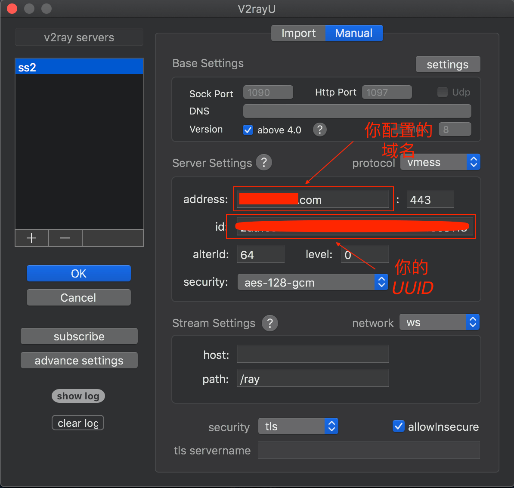
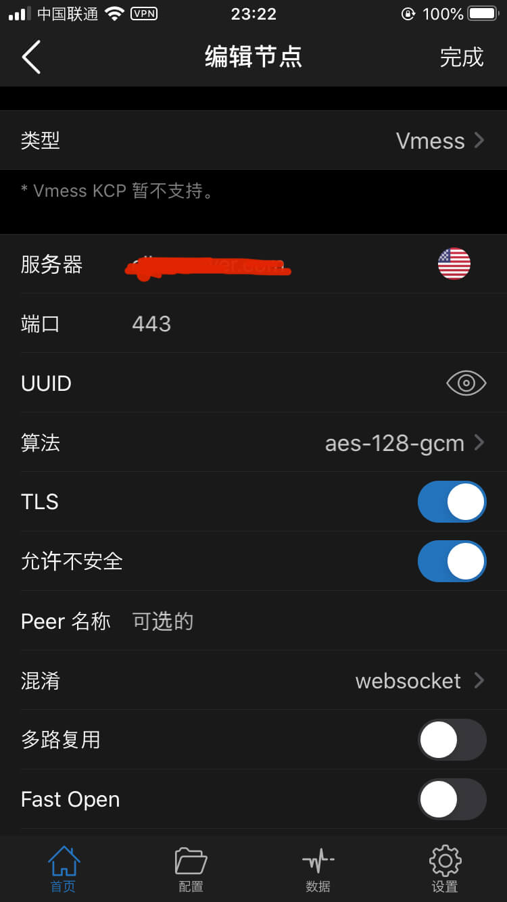

\[toc\]

## 前言

十月由于国庆，墙又被高高筑起，我的两个搬瓦工的服务器的 `IP` 全部被封了，那段时间全部是用的 `VPN`， 不过还是没有 `ss` 用起来方便，终于到了 `20` 号左右，`IP` 给解封了。才用了没几天，可能是因为香港的区议会选举，墙有开始搞事。这次不是封 `IP`，开始是封端口，我改了两次端口，这两天变成了监控流量，只有一走流量 `ss` 就断一下， 真的是难受，今天甚至连 `GitHub` 都连不上了，真的是非常无语。而且这两天因为墙的封锁更严苛，`VPN` 也是经常连不上，本来是想等等的，但是 `GitHub` 上不去实在不能忍，只能去搞了搞 `V2Ray`，跟着网上的教程配置了一下，现在终于可以正常访问了，本文记录一下配置过程。

**2021.03.21 由于文章时间比较久了，可能有一些错误的地方，可以参考这篇比较新的配置文章 [V2ray WS TLS自动续签证书+订阅](http://elmagnifico.tech/2020/06/07/V2ray-WS-TLS/ "V2ray WS TLS自动续签证书+订阅")**

## V2Ray WebSocket+TLS+Nginx 的安装配置过程

我的服务器是 `CentOS7`，所以下面的安装和配置步骤都是针对 `CentOS` 的，其他的系统可以自行 `Google`。

## 购买域名并配置解析

首先要做的是购买一个域名添加一条 `A` 记录解析到你的服务器 `IP`。为了避免被墙识别，需要对请求进行伪装，这是必要的一步。域名购买可以从阿里云或者国外的提供商 `GoDaddy`，国内的域名提供商都需要实名制，我因为嫌麻烦直接就在阿里云买了一个（结果忙中出错，选域名的时候打错字，把 `server` 打成了 `sever`，郁闷）。买好域名后，一般在网站后台添加解析记录就行了，添加一条 `A` 记录解析到你的服务器 `IP` 即可。

## 安装 V2Ray

```bash
# 更新全部包
yum -y update

# 安装V2Ray 该安装脚本来自 https://github.com/v2fly/fhs-install-v2ray 配置文件路径 /usr/local/etc/v2ray/config.json
bash <(curl -L https://raw.githubusercontent.com/v2fly/fhs-install-v2ray/master/install-release.sh)

# 设置V2Ray开机启动
systemctl enable v2ray
```

## 安装 SSL 证书

这里要单独说一下我在安装 `certbot` 的时候一直提示我找不到这个 `package`，最后在 `stackoverflow` 上找到的一个方法解决了这个问题。我们在为自己的网站配置 `HTTPS` 的时候也可以用 `certbot` 作为免费的 `SSL` 证书来源，当然阿里云也提供了免费的 `SSL` 证书，阿里云的证书有效期是一年，`certbot` 安装的 `Let's Encrypt` 证书的有效期是三个月，都需要更新的。

```bash
sudo yum install epel-release
sudo yum install certbot
```

> `Yum`（全称为 `Yellow dog Updater`, `Modified`）是一个在 `Fedora` 和 `RedHat` 以及 `CentOS` 中的Shell前端软件包管理器。`EPEL` (`Extra Packages for Enterprise Linux`，企业版 `Linux` 的额外软件包) 是 `Fedora` 小组维护的一个软件仓库项目，为 `RHEL/CentOS` 提供他们默认不提供的软件包。

`certbot` 安装完成后就可以继续下面的配置证书的步骤了。

```bash
# 添加免费SSL证书，example.com改为你上面购买的域名
certbot certonly --standalone -d example.com

# 安装成功后的证书路径
/etc/letsencrypt/live/example.com/fullchain.pem
/etc/letsencrypt/live/example.com/privkey.pem
```

更新证书需要安装 `crontabs` 并启动服务：

```bash
yum -y install vixie-cron
yum -y install crontabs
service crond start
```

然后用 `crontab -e` 来创建自动更新，由于我们的网站目录并不实际存在，所以我们只能用 `standalone` 来进行证书的申请和更新，`standalone` 会运行一个独立的网页服务器用于身份认证，所以如果我们的 `nginx` 如果是启动状态，运行 `certbot renew` 会报 `80` 端口被占用的错误，我们需要将 `nginx` 先关闭才能更新。不过 `certbot` 为我们提供了两个参数 `--pre-hook` 和 `--post-hook` 来配置执行更新前后的命令钩子。自动更新的命令如下：

```bash
1 0 1 * * /usr/bin/certbot renew --pre-hook "systemctl stop nginx" --post-hook "systemctl start nginx"
```

> 前面的数字和星号一共五位，分别表示 `分，时，日，月，年`。

## 安装配置 nginx

```bash
yum -y install nginx

# 设置nginx的开机启动
systemctl enable nginx

# 新建一个nginx的站点配置文件
vi /etc/nginx/conf.d/v2ray.conf

# 在上面打开的配置文件中写入如下内容
server {
  listen 443 ssl;
  listen [::]:443 ssl;

  ssl_certificate       /etc/letsencrypt/live/example.com/fullchain.pem;
  ssl_certificate_key   /etc/letsencrypt/live/example.com/privkey.pem;
  ssl_session_timeout 1d;
  ssl_session_cache shared:MozSSL:10m;
  ssl_session_tickets off;

  ssl_protocols         TLSv1.1 TLSv1.2 TLSv1.3;
  ssl_ciphers           ECDHE-ECDSA-AES128-GCM-SHA256:ECDHE-RSA-AES128-GCM-SHA256:ECDHE-ECDSA-AES256-GCM-SHA384:ECDHE-RSA-AES256-GCM-SHA384:ECDHE-ECDSA-CHACHA20-POLY1305:ECDHE-RSA-CHACHA20-POLY1305:DHE-RSA-AES128-GCM-SHA256:DHE-RSA-AES256-GCM-SHA384;
  ssl_prefer_server_ciphers off;

  server_name           your.domain;
    location /ray { # 与 V2Ray 配置中的 path 保持一致
      if ($http_upgrade != "websocket") { # WebSocket协商失败时返回404
          return 404;
      }
      proxy_redirect off;
      proxy_pass http://127.0.0.1:14400; # 假设WebSocket监听在环回地址的14400端口上
      proxy_http_version 1.1;
      proxy_set_header Upgrade $http_upgrade;
      proxy_set_header Connection "upgrade";
      proxy_set_header Host $host;
      # Show real IP in v2ray access.log
      proxy_set_header X-Real-IP $remote_addr;
      proxy_set_header X-Forwarded-For $proxy_add_x_forwarded_for;
    }
}
```

保存后可以用 `nginx -t` 来监测配置是否有错误。`V2Ray` 自 `4.18.1` 后支持 `TLS1.3`，如果开启并强制 `TLS1.3` 请注意 `v2ray` 客户端版本.

其中 `443` 是网站端口同时也是 `V2Ray` 传输端口，`127.0.0.1:10000` 其中的 `10000` 是监听端口，可以自行更改，然后防火墙放行所需端口，或者直接关闭防火墙。我的 `VPS` 默认防火墙是关闭的，关于 `CentOS` 的防火墙配置可以参考这两篇文章：[Centos 7和 Centos 6开放查看端口 防火墙关闭打开](https://www.cnblogs.com/eaglezb/p/6073739.html "Centos 7和 Centos 6开放查看端口 防火墙关闭打开")，[Centos防火墙设置与端口开放的方法](https://blog.csdn.net/u011846257/article/details/54707864 "Centos防火墙设置与端口开放的方法")

## 配置 V2Ray 服务端

> 使用官方版本安装的 `V2Ray` 会生成一个默认配置文件，路径为 `/etc/v2ray/config.json`，如果使用其他的一键安装脚本可能没有生成配置文件或者配置文件路径不同，可以在使用 `systemctl status v2ray` 中看到配置文件的路径。比如使用 `v2fly` 的配置文件路径就是在 `/usr/local/etc/v2ray/`，你也可以使用 `v2ray --config=/etc/v2ray/config.jso` 指定配置文件路径运行。

```bash
# 备份默认配置文件
cp /etc/v2ray/config.json /etc/v2ray/config.jsonbak

# 清空配置文件并写入新的配置
echo "" > /etc/v2ray/config.json
vi /etc/v2ray/config.json

{
  "inbounds": [
    {
      "port": 10000, # 注意这里的端口要和上面的 nginx 配置文件中的端口保持一致
      "listen":"127.0.0.1",
      "protocol": "vmess",
      "settings": {
        "clients": [
          {
            "id": "你的UUID",
            "alterId": 64
          }
        ]
      },
      "streamSettings": {
        "network": "ws",
        "wsSettings": {
        "path": "/ray"
        }
      }
    }
  ],
  "outbounds": [
    {
      "protocol": "freedom",
      "settings": {}
    }
  ]
}

# 关闭防火墙
systemctl stop firewalld

# 启动V2Ray和Nginx
systemctl start v2ray
systemctl start nginx

# 查看服务状态，显示绿色的active则说明服务启动成功，enable则说明开机启动
systemctl status v2ray
systemctl status nginx
```

`UUID` 可以到这个网站生成 [https://www.uuidgenerator.net](https://www.uuidgenerator.net "https://www.uuidgenerator.net")

## 客户端配置

客户端的配置我就讲一讲我日常用的 `Mac` 和 `IOS` 了，`Mac` 上用的是[V2RayU](https://github.com/yanue/V2rayU/releases "V2RayU")。`IOS` 上和 `ss` 一样用的是 `Shadowrocket`，这个软件也支持 `V2Ray`，不过需要到美区的 `App Store` 下载（`12¥`），付款方法可以参考我的这篇文章[如何给美服Apple ID充值](https://www.clloz.com/programming/assorted/2019/09/09/appleid-us-gift-card/ "如何给美服Apple ID充值")。具体的配置看下面两张图：





按照图中的配置进行设置即可，手机上如果发现开启后还是不能访问 `Google`，就开启一下飞行模式然后在打开即可。而 `Mac` 上的 `V2RayU` 需要特别注意一点的是在上图中的 `basic setting` 中的默认端口和 `ShadowsocksX-NG` 客户端的端口是冲突的，需要改一改，否则也是不能正常使用的，模式记得选择 `PAC` 模式。

其他平台的客户端可以参考这篇文章：[V2Ray客户端](https://www.tlanyan.me/v2ray-clients-download/#comment-1207 "V2Ray客户端")

## 一键安装脚本

不想要这么麻烦的可以使用一键安装脚本 [V2Ray\_ws-tls\_bash\_onekey](https://github.com/wulabing/V2Ray_ws-tls_bash_onekey "V2Ray_ws-tls_bash_onekey")，需要注意的是同样需要先购买域名并配置解析。

```bash
yum update -y && yum install curl -y

bash <(curl -L -s https://raw.githubusercontent.com/wulabing/V2Ray_ws-tls_bash_onekey/master/install.sh) | tee v2ray_ins.log

systemctl start v2ray
systemctl start nginx
```

再附上评论区的同学推荐的 [multi-v2ray](https://github.com/Jrohy/multi-v2ray "multi-v2ray")，可以自行选择。

## 两个注意点

1. `V2Ray` 的客户端 `Core` 和服务端 `Core` 版本必须一致，请自行更新，`bash <(curl -L -s https://install.direct/go.sh)`。
2. `V2Ray` 对本地时间和服务端时间的要求较高，一般执行脚本后会自动校时，如出现连接失误，请检查服务器的时间，`date -R`。

## user-rules 规则

写 `user-rulese` 参考[Adblock Plus filters explained](https://adblockplus.org/en/filter-cheatsheet "Adblock Plus filters explained")，这里说一下几个常用符号的意思。

1. `||`: 域名锚，后接域名。比如 `||abc.com`，匹配任何协议下的子域名，比如 `https://abc.com`，`http://test.abc.com` 等。
2. `|`: 开始和结束锚，他们之间就是确定的地址，不会进行模糊匹配。比如 `|https://abc.com|`，只会匹配确定的地址 `htpps://abc.com`。
3. `*`: 通配符，匹配任意字符。比如 `/banner/*/img` 会匹配 `http://example.com/banner/foo/img` `http://example.com/banner/foo/bar/img`。(结尾的通配符可以省略)
4. `^`: 地址在此处结束或者匹配 `?` 或者 `/`。
5. `@@`: 在写好的匹配模式前加上 `@@`，表示该匹配不使用代理。

如果保存了以后仍未生效，则重启一下客户端。

## 总结

虽然我能明白墙有墙的必要，但是有时候被折腾的真的郁闷，特别是今天连 `GitHub` 都被墙了。有时候想想国外程序员几秒钟能搞定的事情，我们要多花那么多时间，还要看墙的脸色，突然开个什么会搞个什么活动就又要折腾，所以能理解有些人想肉身翻墙。希望以后能越来越好吧，虽然我一点也不乐观，政治的问题不想多说，不过就目前的形势估计还是论持久战，国内的程序员只能先憋屈着了。虽然憋屈，但我相信最终胜利的是 `CHINA`，相信一切都是值得的 :fist: 。

## 参考文章

1. [V2Ray 进阶配置 WebSocket+TLS+Nginx](https://www.ecsoe.com/archives/38.html#%E5%AE%89%E8%A3%85V2Ray "V2Ray 进阶配置 WebSocket+TLS+Nginx")
2. [V2Fly](https://www.v2fly.org/ "V2Fly")
3. [V2Ray进阶指南：WSS组合配置(WebSocket + TLS + Nginx + CDN)](https://cyfeng.science/2020/03/22/advanced-v2ray-with-wss/ "V2Ray进阶指南：WSS组合配置(WebSocket + TLS + Nginx + CDN)")