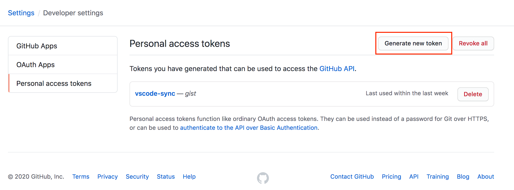
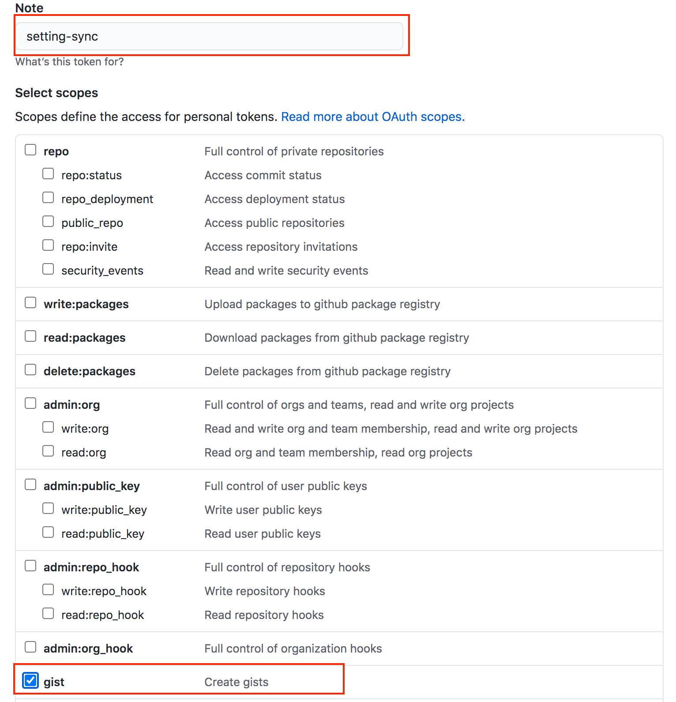
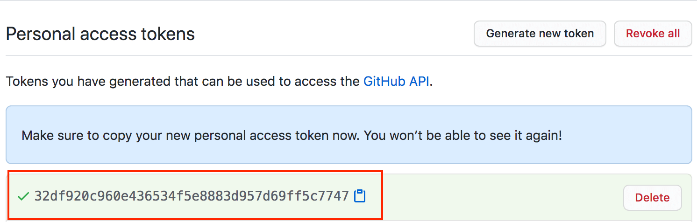
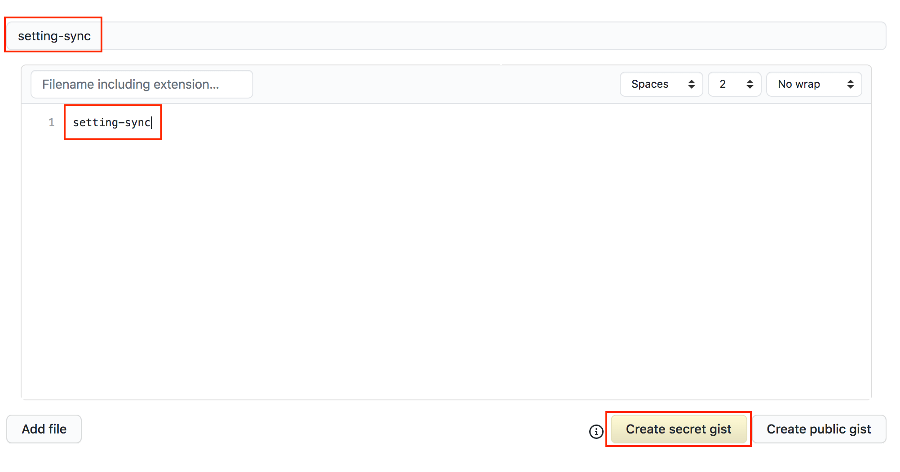
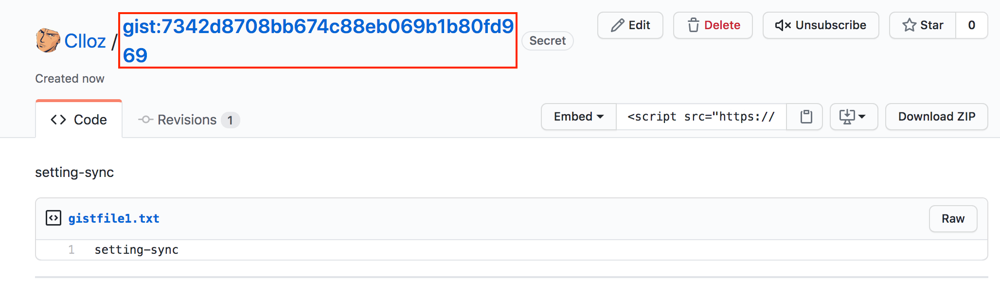

\[toc\]

## 前言

`VSCode` 的 `Setting Sync` 插件是我用来同步设置的工具，相信很多同学都是一样的。这篇文章说一下这个配置这个插件的两个重要参数 `token` 和 `Gist Id`。

## 准备

先介绍一下 `Gitbub Gist`：[Gist](https://gist.github.com/ "Gist") 是 `Github` 的一个子服务. 最简单的功能就是分享代码片段，例如把一些小型脚本放到 `gist` 方便分享和管理. 不同于大型项目使用 `repository` 进行管理, `gist` 就是小型代码片段的分享。我们的 `VSCode` 的配置几乎都是一些 `json` 文件，比如 `extensions.json`, `setting.json` 和 `keybindingsMac.json` 等，所以 `Setting Sync` 的原理大致就是把我们这些配置的文件利用 `Github Gist` 来托管。

所以我们配置 `Sync Setting` 的两个重要参数都很明显了，`gist id` 的作用就是告诉插件我们的配置文件托管路径，而 `token`就是发给插件一个令牌，让它能够访问我们的 `gist` 仓库。

下载安装就不说了。如果你是第一次配置那么直接进入插件的介绍页面点击 `Edit Configuration`，然后配置两个参数 `Token` 和 `Gist Id` 就可以使用了。需要注意的一点是 `Gist Id` 我们是可以通过仓库地址再查看的，但是 `token` 我们关闭网页后就不能在查看了（只能重新生成新的），所以 `token` 要找个地方记录下来。

## token

`token` 的创建方法：`Github首页 -> 右上角头像 -> Setting -> Developer Setting -> Personal Access Token`，进入后点击右上角的 `Generate new token` 就可以创建新的 `token`。

进入创建页面后只需要做两件事，一件是给 `token` 一个 `note`（不填也可以，不过如果你有多个 `token` 还是要用 `note` 做个区分），另一件就是勾选下面的复选框中的 `gist` 选项，最后就是点击下方绿色的 `Generate token` 按钮就可以完成创建。

创建完成后页面上会给出你一串字符，这就是你的 `token`，将它填入插件的配置中（图中的 `token` 仅做演示用，已删除）。

最后再说一点，这个 `token` 在你需要同步的其他机器上也是要配置的（有这个令牌才能访问 `Gist`，你也可以创建新的，不过同一个插件还是用同一个 `token` 管理比较合理）。如果你不小心删了 `token` 或者要更换 `token` 可以找到 `Setting Sync` 的 `global setting` 文件，这个文件在 `Mac` 上的路径是 `~/Library/Application Support/Code/User/syncLocalSettings.json`，这个文件中保存着你的 `token`，你可以编辑这个文件更换你的 `token`。

## gist id

访问个人 `gist` 的方法：`Github首页 -> 右上角头像 -> Your gist`，注意此时访问的是你已经创建的 `gist` 仓库，地址是 `https://gist.github.com/yourid`，如果你要创建新的 `gits` 点击左上角的 `Github Gist` 图表或者直接访问 `https://gist.github.com/`，会进入一个创建新的 `gist` 的页面。填上如下图的 `description` 就可以点击下方的 `Create secret gist` 完成创建了。

创建完成后，进入这个新的 `gist` 的仓库界面，你可以看到上方有你要的 `gist id`，同时你也可以看到浏览器的地址栏里面的 `url` 也有你的 `gist id`。所以不用担心 `gist id` 遗忘或丢失，我们只要进入对应的 `gist` 仓库，就能在 `url` 中看到我们的 `gist id`（图中的 `gist` 仅用于演示，已删除）。

最后说一下，`gist id` 可以在 `vscode` 的 `setting.json` 中配置（进入方法：`⌘+⇧+p/F1` 输入 `setting` 选择 `Preference: Open Setting (JSON)`)，也可以在图形化的 `setting` 中配置（`⌘+,` 进入 `setting` 输入 `sync` 就可以看到 `gist id` 的选项）。