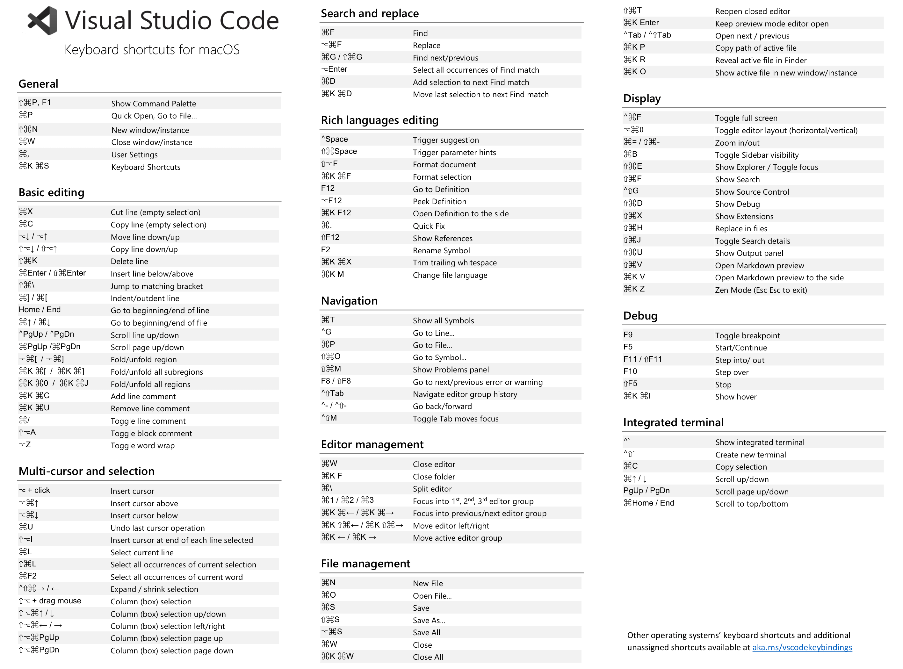

\[toc\]

## 前言

我现在做前端开发主要用三个工具，写`HTML` 和 `CSS` 用 `Espreso`（结构和样式很清晰）；写一些小的 `JavaScript`文件用 `CodeRunner`（比较轻量，非常方便，也支持各种语言）；如果是写项目则用 `vscode`。本文整理一些我认为在 `vscode` 使用中比较有用有时也容易忘记的技巧。文章内容可能比较零散，都是一些使用过程感觉比较有用的小知识。

## 命令调色板

使用快捷键 `⌘+⇧+P/F1` 可以打开一个命令调色板 `Command Palette`，我们在界面顶部的小文本框中快速查找命令。一方面可以快速调用某个命令，也可以在我们忘记快捷键的时候查看某个命令的快捷键。我们不需要记住完整的命令，只要有关键词就能模糊查找。

> 命令 `startup performance` 可以查看 `vscode` 的启动性能。

## 配置文件

`vscode` 中的所有配置几乎都是 `json` 文件，但有时我们可能不知道该如何去找默认配置。`vscode` 提供了两个软件本身的配置方式，一种是 `setting.json` 另一种是图形界面。调用图形界面的快捷键 `⌘+,`，我们可以在是上方的文本框中输入关键词查看或者修改修相关的配置；如果我们想直接修改 `setting.json`，可以打开命令调色板，输入 `setting` 然后选择 `Preference: Open Settings(JSON)`，就能打开我们的配置文件。如果有时候我们想查看一些插件的默认配置，比如 `prettier`，我们可以打开命令调色板，输入 `setting`，然后选择 `Preference: Open Default Settings(JSON)` 进入文件，然后查找对应的项。查看默认的快捷键也可以在命令调色盘中搜索 `Preference: Open Default Keyboard Shortcuts(JSON)`。

## 快捷键

快捷键是最常用我也认为最麻烦的，特别是插件多了，还有个人习惯，以及和其他软件造成的快捷键冲突，记忆也是很大的问题，有些快捷键一段时间不用就忘了，不过官方提供了一份默认快捷键的 `PDF`（不同的系统有不同的版本），[下载链接](https://code.visualstudio.com/docs/getstarted/tips-and-tricks#_default-keyboard-shortcuts "下载链接")。我这里贴上 `Mac` 对应的默认快捷键图。



快捷键这个没有什么技巧只能多用多记，熟练了就好。不过前面还是尽量逼着自己用，多看看表，其实很多你不知道的操作都是有快捷键的，可以给我们的编码带来很多方便。我列出几个表里面没有介绍的快捷键（有可能是我自己修改过的，不过知道有这个功能就可以自己修改了。

> 我个人比较喜欢 `Emacs` 的操作方式，所以我在 `vscode` 中用了一个叫 `Emacs Friendly Keybindings` 的插件。其实大部分操作在 `vscode` 中都有对应的。如果你也习惯于 `emacs` 的操作可以尝试一下。

| `shortcut` | `description` |
| --- | --- |
| ⌘B | 关闭/打开左侧的文件导航等 |
| ⌃\` | 打开/关闭下方 `terminal`（这个可能是我自己设置的） |
| ⇧⌘Y | 打开/关闭 `debug` 面板 |
| ⇧⌘U | 打开/关闭 `output` 面板 |
| ⇧⌘M | 打开/关闭 `problem` 面板 |
| ⇧⌘Y | 打开/关闭 `debug console` 面板 |
| ⇧⌘E | 打开/关闭 `explorer` 面板 |
| ⇧⌘F | 打开/关闭 `search` 面板 |
| ⇧⌘A | 打开/关闭 `source control` 面板 |
| ⇧⌘D | 打开/关闭 `debug` 面板 |
| ⇧⌘X | 打开/关闭 `extensions` 面板 |
| ⇧⌘T | 打开刚刚关闭的 `editor` |
| ⌥⌘⇤/⇥ | 在 `editor` 间移动 |
| ⌃number | 选择 `editor` |
| ⌘K ⇧⌘⇤/⇥ | 将当前 `editor` 向左右移动 |
| ⌘\\ | 生成新的 `editor` 组（分屏，分隔工作区） |
| ⌘number | 选择 `editor` 组 |
| ⌘K ⌘⇤/⇥ | 在 `editor` 组间切换 |
| ⌘K ⇤/⇥ | 移动当前 `focus` 的 `editor` 组 |
| ⌘W | 关闭窗口、工作区或`editor` |
| ⌘K ⌘W | 关闭所有 |
| ⌘K F | 关闭文件夹 |
| ⌘K ⌘⇤/⇥ | 在标签组间移动(`emacs` 的 `⌃X O`) |
| ⌃⌥⇥ | 将当前标签加入右侧 `editor` 组 |
| ⌃⌥⇤ | 将当前标签加入新的标签组 |
| ⌘T | 搜索文件或者方法（方法前加`#`） |
| ⌃X ⌃L | 将选中文本变为小写 |
| ⌃X ⌃U | 将选中文本变为大写 |
| F2 | 重命名当前标识符 |
| ⌘F2 | 选中和光标所在位置相同的文本 |
| ⌃⇧⌘⇤/⇥ | 扩大或缩小选中文本 |
| ⌥⇤/⌥⇥ | 以单词为单位移动光标 |
| ⌘⇤/⌘⇥ | 移动到行首行尾 |
| ⌘⤒/⌘⤓ | 移动到文档开头或末尾 |
| ⌘⇧\\ | 在当前所在位置匹配的括号上来回移动 |
| ⌘del | 删除光标到行尾的文本 |
| ⌘backspace | 删除光标到行首所有的文本 |
| ⌥D/⌥del | 删除光标到当前单词的结尾 |
| ⌥backspace | 删除光标到当前单词的开头 |
| ⌃D | 删除光标右边的一个字符 |
| ⇧⌘K | 删除当前行 |
| ⇧⌥⤒/⤓ | 向上/下复制当前行 |
| ⌥⤒/⤓ | 向上/下移动当前行 |
| ⌘Enter/⇧⌘Enter | 向上/下插入空行 |
| ⌘\[ / ⌘\] | 缩进或减少缩进 |
| ⌥⌘\[ / ⌥⌘\] | 折叠/展开代码块 |
| ⌘K ⌘\[ / ⌘K ⌘\] | 折叠/展开子代码块 |
| ⌘K ⌘0/⌘K ⌘J | 折叠/展开所有代码块 |
| ⌘K ⌘C/⌘K ⌘U | 添加/去除行注释 |
| ⌘/ | 注释/取消注释选中行 |
| ⇧⌥A | 注释选中代码 |
| ⌘P | 最近代开的文件(输入 `文件名:行数`会打开文件到指定行) |
| ⌃Tab/⌃⇧Tab | 打开下一个/上一个 `editor` |
| F12 | 跳转到函数定义 |
| ⌘F12 | 跳转到函数实现 |
| ⌥F12 | `peek`函数定义 |
| ⇧F12 | 显示函数引用 |
| ⌘K F12 | 在新的分屏打开函数定义 |
| ⌥Click | 插入光标 |
| ⌥⌘⤒/⤓ | 向上/下插入光标 |
| ⌘U | 撤销上一个光标操作(比如多添加了一个光标) |
| ⇧⌥I | 在选中行的末尾插入光标 |
| ⌘L | 选择当前行 |
| ⇧⌘L | 选中所有当前选中内容 |
| ⇧⌥拖动鼠标 | 用多一列光标选择文本 |
| ⇧⌥⌘方向键 | 用多光标选择文本 |
| ⌥⌘F | 替换文本 |
| ⌘G/⇧⌘G | 查找下一个/上一个 |
| ⌥Enter | 选中所有匹配查找的内容 |
| ⌃' | 触发提示 |
| ⇧⌘Space | 触发参数提示 |
| ⇧⌥F | 格式化当前文件 |
| ⌘K ⌘F | 格式化选中文本 |
| ⌘. | `Quick Fix` |
| ⌘K ⌘X | 修剪尾随空格 |
| ⌘K M | 选择文件语言 |
| ⇧⌘O | 查找并跳转到标识符 |
| F8/⇧F8 | 跳转到下一个/上一个错误 |
| ⌃-/⇧⌃- | 返回前进（之前访问过的位置） |
| ⌃⇧M | 切换选项卡移动焦点 |
| ⌘N | 新建文件 |
| ⌘O | 打开文件 |
| ⌘S | 保存 |
| ⇧⌘S | 另存为 |
| ⌥⌘S | 保存全部 |
| ⌘K P | 复制当前文件的路径 |
| ⌘K R | 在 `finder` 中打开当前文件路径 |
| ⌘K O | 在新窗口中打开当前文件 |
| ⌃⌘F | 切换全屏 |
| ⌥⌘0 | 切换 `editor` 组水平和竖直显示 |
| ⌘=/⌘- | 放大缩小 |
| ⇧⌘V | 预览 `markdown` |
| ⌘K V | 侧边预览 `markdown` |
| ⇧⌘H | 替换文件 |
| ⇧⌘J | 切换搜索细节 |
| F9 | 切换断点 |
| F5 | 开始/继续 |
| F11/⇧F11 | `step into/out` |
| F10 | `step over` |
| ⇧F5 | `stop` |
| ⇧⌘F5 | `restart` |
| ⌘K ⌘I | 显示悬停 |

* * *

- 在 `vscode` 中，单击鼠标左键：把光标移动到响应的位置；双击鼠标左键：将当前光标下的单词选中；三击鼠标左键：选中当前行代码；四次点击鼠标左键：选中整个文档
- 鼠标左键单击行号：直接选中所在行；选中后，再按着⇧，鼠标左键再次选择行：可以选中多行代码
- 悬停提示窗口：当鼠标移动到某些文件上之后，一会就会显示跟鼠标下文本相关的信息；如果鼠标放在某个函数上，按下⌘时，则能在悬停提示的窗口上看到该函数的实现。
- 代码的跳转和链接：如果我们把鼠标放在函数上时，函数下方会出现一个下划线，然后当我们按下鼠标左键时，就能跳转到该函数的定义处。⌘ + 鼠标左键，跳转到函数、变量定义的地方。`Markdown` 中可以通过⌘ + 鼠标左键能打开超级链接

> 所有光标移动的快捷只要加上 ⇧ 就能够在移动的同时选择经过的文本。选择代码块默认没有提供快捷键，也没法绑定，但是命令调色板里面有个命令 `select to bracket` 可以选择当前所在代码块。

## 字体和终端

如果你使用了 `zsh` 和 `oh-my-zsh` 来美化终端并且想在 `vscode` 中的终端中也一起使用的话，可以参考我的这篇[文章](https://www.clloz.com/programming/assorted/2019/09/08/iterm2-zsh-terminal/#vscode "文章")的 `vscode` 部分，非常简单，就几行配置即可。

然后是微软推出的字体 `Cascadia Code` 提供了 `font ligature` 连体字的功能，我个人觉得不错。如果你也想试试，[下载](https://github.com/microsoft/cascadia-code/releases "下载")安装。然后在 `setting.json` 中添加配置 `"editor.fontLigatures": true, "editor.fontFamily": "'Cascadia Code',`，你就设置好这个字体并开启 `font ligature` 了。

## Debug

`vscode` 的 `debug` 是很重要的调试工具，灵活运用能够帮我们快速定位问题。这里我主要讲一些自己了解的前端调试相关的内容。

## launch.json

**一切以[官方文档](https://code.visualstudio.com/docs/editor/debugging "官方文档")为准。`node` 调试[官方文档](https://code.visualstudio.com/docs/nodejs/nodejs-debugging "官方文档")** 我们 `debug` 之前需要在 `.vscode` 文件夹中创建 `launch.json` 文件，相当于我们 `debug` 的配置文件。我们可以手动创建，也可以在 `debug` 页面点击开始调试的按钮自动生成。我们可以在一个 `launch.json` 中有多个配置，`configuration` 是一个数组。`name` 属性就是我们每个配置的名字，在 `debug` 页面通过名字来选择我们 `debug` 用到的配置。比如最基础的调试 `node` 的配置。

```json
{
    {
        "type": "node",
        "request": "launch",
        "name": "Launch Program",
        "skipFiles": ["<node_internals>/**"],
        "program": "${workspaceFolder}/client.js"
    }
}

```

几个重要的参数：

- `type`，必填项，调试类型，当前为 `node`，如果是 `PHP` 调试，则在安装 `PHP` 调试插件后写 `php`；
- `request`，必填项，有两种类型，分别是 `launch` 和 `attach`，前者的意思就是 `VSCode` 会打开这个程序然后进入调试，后者的意思是你已经打开了程序，然后接通 `Node.js` 的内部调试协议进行调试。
- program，程序的启动入口；

也可以使用如下配置，用 `runtimeExecutable` 和 `args` 代替 `program`。

- `runtimeExecutable`，使用什么命令启动
- `args`，启动时的参数

```json
{
    {
        "name": "调试 Node.js 程序 - args",
        "type": "node",
        "request": "launch",
        "runtimeExecutable": "node",
        "args": [
            "${workspaceFolder}/src/index.js"
        ]
    }
}
```

##### launch 和 attach 共有属性

- sourceMaps - enable source maps by setting this to true. See section Source maps.
- outFiles - array of glob patterns for locating generated JavaScript files. See section Source maps.
- restart - restart session on termination. See section Restarting debug session automatically.
- timeout - when restarting a session, give up after this number of milliseconds. See section Attaching to Node.js.
- stopOnEntry - break immediately when the program launches.
- localRoot - VS Code's root directory. See section Remote debugging below.
- remoteRoot - Node's root directory. See section Remote debugging below.
- smartStep- try to automatically step over code that doesn't map to source files. See section Smart stepping.
- skipFiles - automatically skip files covered by these glob patterns. See section Skipping uninteresting code.
- trace - enable diagnostic output.

##### launch 独有属性

- program - an absolute path to the Node.js program to debug.
- args - arguments passed to the program to debug. This attribute is of type array and expects individual arguments as array elements.
- cwd - launch the program to debug in this directory.
- runtimeExecutable - absolute path to the runtime executable to be used. Default is node. See section Launch configuration support for 'npm' and other tools.
- runtimeArgs - optional arguments passed to the runtime executable.
- runtimeVersion - if "nvm" (or "nvm-windows") or "nvs" is used for managing Node.js versions, this attribute can be used to select a specific version of Node.js. See section Multi version support below.
- env - optional environment variables. This attribute expects environment variables as a list of string typed key/value pairs.
- envFile - optional path to a file containing environment variable definitions. See section Load environment variables from external file below.
- console - kind of console to launch the program (internalConsole, integratedTerminal, externalTerminal). See section Node Console below.
- outputCapture - if set to std, output from the process stdout/stderr will be shown in the Debug Console, instead of listening to output over the debug port. This is useful for programs or log libraries that write directly to the stdout/stderr streams instead of using console.\* APIs.
- autoAttachChildProcesses - track all subprocesses of debuggee and automatically attach to those that are launched in debug mode. See section Automatically attach debugger to Node.js subprocesses below.

##### attach 独有属性

- protocol - debug protocol to use. See section Supported Node-like runtimes above.
- port - debug port to use. See sections Attaching to Node.js and Remote debugging.
- address - TCP/IP address of the debug port. See sections Attaching to Node.js and Remote debugging.
- processId - the debugger tries to attach to this process after having sent a USR1 signal. With this setting, the debugger can attach to an already running process that was not started in debug mode. When using the processId attribute the debug port is determined automatically based on the Node.js version (and the used protocol) and cannot be configured explicitly. So don't specify a port attribute

> 可以借助 `Debugger for Chrome` 插件在 `chrome` 中调试代码，具体细节参考插件介绍。

## 界面介绍

左侧的工作区有四个部分：`VARIABLE`，`WATCH`，`CALL STACK` 和 `BREAKPOINTS`。

- `VARIABLE` 显示当前函数所能访问的变量，包括函数内部变量，闭包中的变量和全局变量。
- `WATCH` 我们可以添加我们要监测的对象或者变量，他们会实时显示我们监测的变量在调试过程中的变化。
- `CALL STACK` 显示调用栈
- `BREAKPOINTS` 显示断点，断点有三种，普通断点，条件断点和 `log` 断点

当我们进入调试后，会有几个按钮可供我们操作。

`continue`：执行到下一个断点。 `step over`：单步执行，但子函数会被当做一个单步全部执行完，不会进入子函数。 `step into`：单步执行，进入子函数继续单步执行。 `step out`： 当单步执行到子函数内时，用 `step out` 就可以执行完子函数余下部分，并返回到上一层函数。 `restart`：重新开始调试， `stop`： 结束调试。

> 当前的 `node` 的 `inspector` 似乎是有 `bug`，具体内容看[Github issue](https://github.com/nodejs/node/issues/27261 "Github issue")。

在下方的工作区的 `debug console` 标签中我们是可以在 `dug` 的过程中进行表达式的运算的。`debug console` 中的对象展开必须在 `debug` 过程中，当然在 `debug` 过程中我们也可以将鼠标放在对象名上查看对象。

## 插件

这个小节写一些我觉得不错的插件

## koroFileHeader

[koroFileHeader](https://github.com/OBKoro1/koro1FileHeader/wiki/%E9%85%8D%E7%BD%AE "koroFileHeader")是在 `vscode` 中用于生成文件头部注释和函数注释的插件。他的功能主要就是添加文件头部注释和添加函数注释。快捷键：`Windows`：⌃ + ⌥ + i；`Mac`：⌃ + ⌘ + i；`Linux`: ⌃ + meta + i。创建和保存文件时会自动创建注释以及更新时间。

详细的配置选项参考 [koroFileHeader - Wiki - Github](https://github.com/OBKoro1/koro1FileHeader/wiki/%E9%85%8D%E7%BD%AE "koroFileHeader - Wiki - Github")

## 总结

本文总结了一些我觉得比较有用的 `vscode` 的使用技巧，以后学习到新的内容也会继续更新本文。

## 参考文章

1. [VSCode 调试中 launch.json 配置不完全指南](https://www.barretlee.com/blog/2019/03/18/debugging-in-vscode-tutorial/ "VSCode 调试中 launch.json 配置不完全指南")
2. [解密 VS Code 断点调试的原理](https://www.barretlee.com/blog/2019/11/15/vscode-study-03-debug-protocol/ "解密 VS Code 断点调试的原理")
3. [NodeJS的代码调试和性能调优](https://www.barretlee.com/blog/2015/10/07/debug-nodejs-in-command-line/ "NodeJS的代码调试和性能调优")