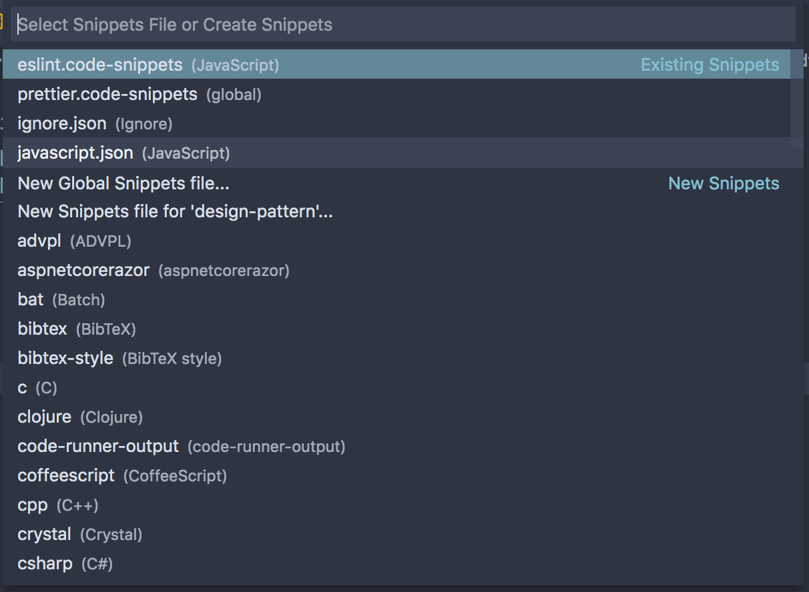

\[toc\]

## 前言

在新建项目的时候，一些配置文件需要重写或者复制都很麻烦。大部分编辑器都提供了 `snippet` 代码片段功能，`VS Code` 也提供了很好用的 `Snippet` 功能，我们不仅可以自定义一些固定的配置，也可以为特定的语言添加我们经常要使用的代码片段。本文讲一下具体如何使用这个功能。

## 基本结构

其实我们使用的很多插件以及 `VS Code` 本身就给我们提供了一些 `snippet`，比如在 `HTML` 文件中输入 `!` 然后 `tab` 就能出现一个基础的 `HTML` 文档结构。你可以到 `VS Code` 的 [Marketplace](https://marketplace.visualstudio.com/search?target=vscode&category=Snippets&sortBy=Installs "Marketplace") 中去找一些别人写好的 `snippet` 拿来使用。

不过每个人的编码习惯不同，我们会希望根据自己的需求自定义 `snippet` 来使用，`VS Code` 也提供了支持。在 `Code -> Preferences -> User Snippets` 中或者用 ⇧ + ⌘ + P 打开 `Command Palette` 找到 `Preferences: Configure User Snippets` 命令即可进行配置。



从图中可以看到最上面是我们已经定义的 `snippet`，我们可以选择它们进行修改。后面的选项我们可以选择对应的语言来编写 `snippet`，这样 `snippet` 只会在对应的文件格式中生效。我下面主要将自定义的全局 `snippet` 如何配置，对应语言的 `snippet` 也是一样的。

我们选择图中的 `New Global Snippet File` 来定义新的 `snippet`。每个 `snippet` 的配置都是使用 `json` 格式。基本的结构如下：

```json
    "snippet name": {
        "scope": "language",
        "prefix": "shortcut",
        "body": [],
        "description": "output on console"
    },
```

各个字段的意义如下：

- `scope`：在哪些语言中生效，如果没有设置或者值为空则会在所有语言中生效。
- `prefix`：前缀，输入前缀即可触发 `snippet`。我们可以在代码补全的提示框中看到我们设置的 `snippet`，回车或者 `tab` 即可输入到文件中。
- `body`：代码片段放到这个字段中。注意因为是 `json`，所以每一行都要用双引号包裹，并且要有逗号。
- `description`：`snippet` 的描述，会在我们输入 `prefix` 的时候出现在提示框中。

## 参数

在 `snippet` 中还支持一些变量和参数。

- `TabStops` ：`$1,$2,$3 ... $0`指定代码模块生成后，编辑光标出现位置; 使用 `Tab` 键进行切换(编辑光标按 `$1,$2,$3...$0` 的顺序跳转)，`$0` 是光标最后可切换位置。
- `默认值`：可以为光标出现位置添加默认值，`${1: placeholder}`；也可以有多个默认值 `${1|placeholder, placeholder2|}`。
- 变量
    
    - `TM_SELECTED_TEXT`: 当前选中内容或空字符串
    - `TM_CURRENT_LINE`: 当前行内容
    - `TM_CURRENT_WORD`: 光标处字符或空字符串
    - `TM_LINE_INDEX`: 从0开始的行号
    - `TM_LINE_NUMBER`: 从1开始的行号
    - `TM_FILENAME`: 当前被编辑文档名
    - `TM_FILENAME_BASE`: 当前被编辑文档名，没有后缀
    - `TM_DIRECTORY`: 当前被编辑文档目录
    - `TM_FILEPATH`: 当前被编辑文档全路径
    - `CLIPBOARD`: 当前剪切板内容
    - `CURRENT_YEAR`: 当前年
    - `CURRENT_YEAR_SHORT`: 当前年后两位
    - `CURRENT_MONTH`: 月份，两位数字表示，例如02
    - `CURRENT_MONTH_NAME`: 月份全称，例如 'July'
    - `CURRENT_MONTH_NAME_SHORT`: 月份简写 ，例如'Jul
    - `CURRENT_DATE`: 某天
    - `CURRENT_DAY_NAME`: 星期几， 例如'Monday'
    - `CURRENT_DAY_NAME_SHORT`: 星期几的简写， 'Mon'
    - `CURRENT_HOUR`: 小时，24小时制
    - `CURRENT_MINUTE`: 分钟
    - `CURRENT_SECOND`: 秒数

我们可以根据自己的需要来选择使用。

## 删除

`VS Code` 没有提供快捷删除的方式，我们只能到文件夹中删除。比较好的操作方式是在 `VS Code` 内置的 `teminal` 中打开配置文件所在路径进行删除。打开路径的方法可以在 `snippet` 文件中右键点击 `Open in Intergrated Terminal` 或者在 `Command Palette` 中输入指令 `File: Copy Path of Active File`，然后到命令行中操作。你也可以在左侧的 `explorer` 中右键文件点击 `Reveal in Finder` 然后手动删除。

## 转义

对于一些有特殊含义的符号我们需要进行转义。一般情况下都是使用反斜杠 `\` 进行转义，比如 `json` 文件中的双引号，以及正则表达式中的反斜杠。比较特殊的就是 `js` 模版运算符中的 `${}`，因为这个在 `snippet` 中也有相同的用法，所以转义是使用如下方式 `\\${\\}`，美元符号的转义使用 `$$`。

## 参考文章

1. [Visual Studio Code (VS Code)自定义代码模板](https://juejin.im/post/6844903912068104199 "Visual Studio Code (VS Code)自定义代码模板")