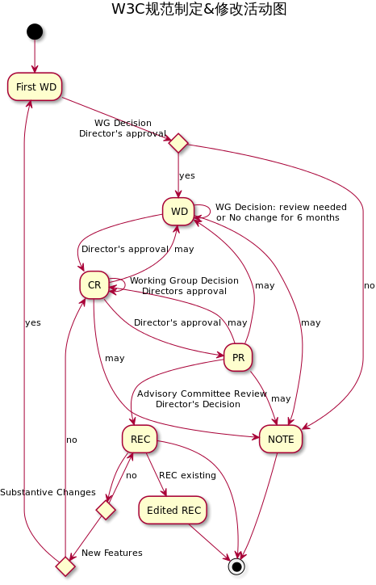

\[toc\]

## 前言

对于一些正在学习的技术，我们经常在谷歌百度上看别人的文章来学习，但有时候为了能够更好的对技术进行理解，免不了要查看 `w3c` 的文档，对问查看文档说一下自己的看法。

## 什么时候需要查阅规范

网上很多大牛都说过，规范其实并不是写给个人看和学习的，更多的是告诉浏览器厂商一个实现的标准，告诉浏览器厂商需要实现哪些功能以及具体的实现细节，我们不应该把它当作自己的教程，而应该当作一个字典。文档里面有你要的所有东西，但是也有很多是你没有必要了解的细节，如果把文档当作教程，那么只能事倍功半，学的稀里糊涂，并且白白浪费很多时间。同时文档里面有很多“故弄玄虚”的属于，似乎把我们平常一些简单的概念搞复杂了，比如我刚开始看 `CSS2` 的规范的时候一直不明白 `UA`（`user agent`）用户代理是什么意思，其实对于前端来说这个UA完全可以用浏览器来代替，不过这不是文档的问题，是我们自己的问题，因为 `CSS` 并不是只为 `HTML` 设计的标准，同样可以用于很多其他地方，所以这里用 `UA` 是一种最恰当的用法。从这一点就可以看出，我们应当把文档当作一本工具书，并且阅读的时候不要钻牛角尖，准确地找到自己需要的章节和内容，拿到自己想要的知识点就可以了。 我认为两种情况你需要去查阅规范文档 1. 第一种是你想要了解一些技术的实现细节和机制，比如你想知道元素的层叠关系浏览器是如何渲染的或者 `margin` 合并的机制等等，如果在 `google` 或者百度上没有找到一个比较满意的答案，这时候查看文档对你来说是个不错的选择。 2. 对于一项刚刚出来的新技术，还没有相关的资料，那么你也只能选择查阅规范了。 如果你只是想知道一些 `API` 的用法，或者只是了解某个技术，[MDN](https://developer.mozilla.org/en-US/ "MDN")和 `Google` 会是一个更好的选择，没必要花很多时间去啃文档。

## 如何找到想要的文档

一个方法是在 `Google` 上直接搜索你要的内容加上 `specification` 一般就能找到对应的文档了，或者你直接去 `W3.org` 的[ALL STANDARDS AND DRAFTS](https://www.w3.org/TR/ "ALL STANDARDS AND DRAFTS")来搜索自己需要的规范。 规范都是从一个草案慢慢发展的，`w3c` 作为所有 `web` 技术规范的管理者，自然有一套规范的制定流程，如下图

我们在规范名旁边看到的`WD`，`CR`，`PR`，`REC` 其实就是告诉你该规范当前处于流程的哪一步，主要流程如下： `WD -> CR -> PR -> REC` 从第一份 `WD`（工作草案）开始，经过 `CR`（候选建议书）、`PR`（提议建议书），最后成为 `REC`（建议书）。`REC` 之前的 `3` 个阶段都有反悔的机会： `WD`、`CR` 都可以反复确认 `CR` 可以回退到 `WD` `PR` 本身没有反复确认，但可以回退到 `CR` 和 `WD` 成为 `REC` 之后，有两种可能的状态变化： 1. 作为编辑建议书（`Edited Recommendation`）重新发布 2. 被撤销，成为撤销的建议书（`Rescinded Recommendation`）

另外，`W3C` 可以随时终止整个流程。

标准化的具体流程为： 1. 发布第一份公开工作草案（`First Public Working Draft`） 2. \[可选\]发布几份修订公开工作草案（`revised Public Working Drafts`） 3. 发布候选建议书（`Candidate Recommendation`） 4. 发布提议建议书（`Proposed Recommendation`） 5. 发布 `W3C` 建议书（`W3C Recommendation`） 6. \[可选\]发布编辑建议书（`Edited Recommendation`）

从 `WD` 到 `REC`，成熟度越来越高，负责人（`Director`）可以拒绝向更高成熟度阶段发展，也可以选择回退到低成熟度阶段。

## Working Draft (WD)

工作草案是由 `W3C` 发布的，供社区 `review` 的文档，包括 `W3C` 成员、公开的和其它技术机构。

一般来说，工作草案是打算推进到建议书的，工作组的期望见工作草案的文档状态章节。任何不打算或者不再推进到建议书的工作草案都应该发布工作组说明（`Working Group Note`）。工作草案不一定代表工作组的一致意见，也并不意味着 `W3C` 或其成员除了在一般技术领域工作以外的任何认可。

## Candidate Recommendation (CR)

候选建议书是满足工作组技术要求，并且经过广泛 `review` 的文档。

`W3C` 发布候选建议书有 `4` 个作用：

1. 向社区表明该做最终 `review` 了
2. 收集实现经验
3. 顾问委员会（`Advisory Committee`）开始正式 `review`，他们可能会建议把该文档作为 `W3C` 建议书发布，回退给工作组进一步修正，或废弃掉
4. 提供根据 `W3C` 专利条款（`W3C Patent Policy`）拒绝的机会。注意：次过程中的候选建议书对应于专利条款中的最终工作草案（`Last Call Working Draft`）

> 注意：候选建议书预期被接受为建议书，如果不行，应该注明为什么在这样一个较晚的阶段变更预期。

## Proposed Recommendation

提议建议书是已经被 `W3C` 负责人接受质量达标（质量足以作为 `W3C` 建议书）的文档。此阶段给顾问委员会确定了从候选建议书开始 `review` 的最后期限。禁止对建议的建议书进行实质性修改，除非发布新的工作草案或候选建建议书。

## W3C Recommendation (REC)

`W3C` 建议书是一项规范或要求，经过广泛达成共识，已获得 `W3C` 成员和负责人的认可。`W3C` 建议将其建议书广泛用作 `Web` 标准，根据 `W3C` 专利条款授予的 `W3C` 免版税知识产权许可适用于 `W3C` 建议书。

## Obsolete Recommendation

过时的建议书是 `W3C` 认为不具有足够的市场相关性以支持继续建议社区去实现的规范，而不是说存在需要撤销建议书的基本问题。过时的建议书可能会获得足够的市场份额，这时候 `W3C` 会将其恢复为建议书状态。过时的建议书与 `W3C` 根据专利政策授予的免版税知识产权许可建议书具有相同的地位。

## Rescinded Recommendation

撤销的建议书是 `W3C` 不再认可的完整建议书，认为不可能再恢复到建议书状态。

## Working Group Note, Interest Group Note (NOTE)

工作组说明或兴趣组说明是由特许工作组或兴趣组发布的，用来给有用的，但不打算作为正式标准的文档提供稳定参考，或者用来记录没有形成推荐书的被废弃的工作。

工作组和兴趣组可能会提供编辑草稿（`Editor’s draft`），编辑草稿没有官方地位，不代表工作组或兴趣组的一致意见，也不能通过 `W3C` 的任何方式批准其内容。

## 总结

对于规范的学习有的时候还是非常必要的，但我们必须学会在规范中准确找到自己需要的信息，最后用`J. David Eisenberg`的[How to Read W3C Specs](https://alistapart.com/article/readspec "How to Read W3C Specs")的总结来结束。 1. Realize that W3C specifications are written for implementers, not end users. 2. Many specifications contain a section that tells how they are organized and how you should read them. 3. Know the vocabulary that specifications use. 4. Remember that you don’t have to read every word. Skim for the parts that make sense. 5. Avoid discussions of namespaces. 6. Learn to read BNF — it’s used in lots of places. 7. Learn to read a DTD for answers to syntax questions. 8. If a technology is scriptable, the information is in the bindings.

参考文档： [w3c规范制定流程](http://www.ayqy.net/blog/w3c%E8%A7%84%E8%8C%83%E5%88%B6%E5%AE%9A%E6%B5%81%E7%A8%8B/ "w3c规范制定流程") [How to read W3C spces](https://alistapart.com/article/readspec "How  to read W3C spces")