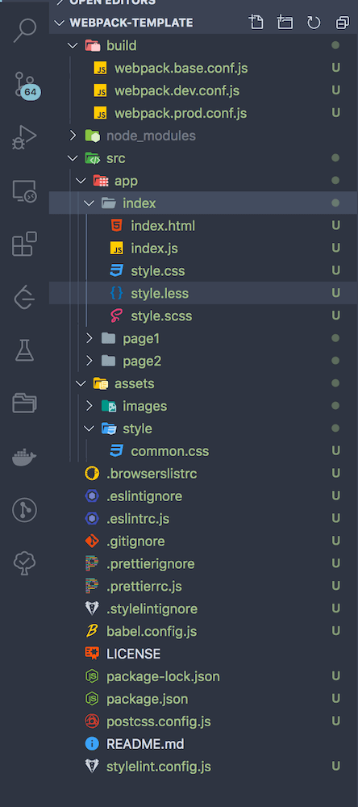

\[toc\]

## 前言

花了几天详细地学习了 `webpack` 的用法，基本上常用配置和一些主要的 `loader` 和 `plugin` 的用法和配置已经都学了个七七八八，不过真的要自己从头配置又有点无从下手的感觉。学习就是这样，看是一回事，做又是另一回事，只有在不断的练习中犯错，修正，不断的重复才能真正掌握。在学完 `webpack` 的基础知识之后就是要不断的重复手动配置和理解原理，在加上对优化方面的学习和实践，才能真正掌握这个强大的工具。

本文就整理出一个比较通用的 `webpack` 配置模版，作为一个实践练习，将一个项目从创建文件夹到安装包和编写配置文件的流程全部走一遍，顺便也复习复习之前的 `eslint` 和 `prettier` 的配置。

网络上的各种 `webpack` 相关的文章都说的很粗，很多细节都没说，作为一个新手看的很头疼，而且由于 `webpack 5` 也出来了，一些以前的文章中说的插件已经不维护或者不建议使用了。我的配置文件进行了非常详细的注释，并且几乎所有我知道的功能都进行了配置，如果你也是新手，相信会有一些帮助，如果你有问题，可以发邮件和我讨论。

> 如果你对 `webpack` 还不够熟悉，可以先看一下我的 `webpack` 学习笔记 [webpack 学习笔记](https://www.clloz.com/programming/front-end/2020/10/22/webpack-tutorial/ "webpack 学习笔记")

## 安装

本文所有代码都在 [Github](https://github.com/Clloz/webpack-template "Github")，所有配置功能都已测试通过，想要学习可以自行查看。

`npm install` 进行包的安装

`npm run dll` 生成预编译的模块，本例中用的 react 和 vue 做的测试

`npm run dev` 运行开发环境的打包配置，开启了热更新

`npm run build` 运行生产环境的打包配置，开启缓存压缩等等，具体看配置文件

`webpack` 的配置文件在 `build` 中，共四个，`webpack.base.conf.js` 为基础配置，`webpack.dev.conf.js` 为开发环境配置，`webpack.prod.conf.js` 为生产环境配置，都是使用 `webpack-merge` 进行合并，最后一个是 `wepback.dll.conf.js` 是用 `dllPlugin` 进行模块的预编译。

本实例使用的 `webpack` 版本为 `5.4.0`，`webpack-cli` 版本为 `4.2.0`，`webpack-dev-server` 为 `3.11.0`。

## 配置功能

- 多入口多环境配置
- 分离样式文件 `mini-css-extract-plugin`
- 对小图片和字体使用 `base64` 打包进 `HTML`
- 清除未使用的 `CSS`：`purgecss-webpack-plugin`
- 使用 `html-webpack-plugin`：生成入口文件，并进行压缩
- 使用 `friendly-errors-webpack-plugin` 优化命令行输出
- 使用 `stylelint-webpack-plugin` 进行 `CSS` 代码检查
- 使用 `html-webpack-tags-plugin` 进行 `html-webpack-plugin` 的增强，帮我们在入口 `HTML` 中插入 `tag`
- 使用 `thread-loader` 开启多线程的编译
- 开启 `babel-loader` 缓存
- 多 `loader` 分别设置 `publicPath`
- 添加 `eslint-loader` 对代码进行检查，同时有详细的 `eslint` 和 `prettier` 配置
- 使用 `postcss-loader` 和 `autoprefixer` 结合 `browserslist` 进行 `CSS` 自动添加浏览器前缀
- 使用 `DLLPlugin` 和 `DLLReferencePlugin` 进行模块预编译和调用
- 使用 `splitChunks` 进行公共模块的提取
- 开启开发环境的热模块更新
- 开启生产环境的 `TerserPlugin` 的并行压缩，并关闭开源证书文件的生成
- 使用 `CssMinimizerPlugin` 进行 `CSS` 的并行压缩
- 使用 `CleanWebpackPlugin` 清理打包目录
- 使用 `raw-loader` 将文件作为字符串引入
- 使用 `html-loader` 将 `html, js` 进行内联
- 多种打包效率检查工具，参考下面的包

## 需要安装的包

这里把各个不同的部分需要安装的包列出来，这样比较清晰，帮自己理清整个构建的逻辑，也方便复习。不是所有包都需要安装，我把一些可能会使用的都列出来了。

## webpack 相关

- webpack
- webpack-cli
- webpack-dev-server

## webpack loader

- CSS
    
    - `style-loader`：将样式放入一个 `style` 标签插入到 `head` 中，可以设置样式表内联
    - `css-loader`：处理样式表的依赖关系，处理完后交给 `style-loader`
    - `postcss-loader`：一个插件载台，可以配合插件实现很多功能，比如 `autoprefixer`，需要安装 `postcss`
    - `less-loader`：解析 `less`，需要安装 `less`
    - `sass-loader` 解析 `sass`，需要安装 `sass`
    - `stylus-loader`：解析 `stylus`，需要安装 `stylus`。`stylus` 的支持不是很好，你可以参考 [使用stylelint检测vue中的stylus代码](https://juejin.im/post/6854573221916868616 "使用stylelint检测vue中的stylus代码")
    - `px2rem-loader`：转换 `CSS` 中的单位到 `rem`，以实现不同设备的自适应
    - `style-resouces-loader`：我们可以将全局的样式放入一个单独的文件中，该 `loader` 能够在打包的的时候帮我们注入其他的样式文件，而不用我们在每一个样式文件中 `@import`。
    - `vue-cli-style-resources-loader`：同上
- image & file
    
    - file-loader
    - url-loader
- `JavaScript`
    
    - `thread-loader`：多线程打包
    - babel-loader：解析转换 `ES6+` 代码
    - `eslint-loader`：代码检查
    - `cache-loader`：缓存跟在后面的 `loader` 的处理结果，`webpack 5` 不再需要，因为内置了缓存配置，添加 `cache` 字段即可，详细配置参考官方文档
- `HTML`
    
    - `html-loader`：用来实现 `HTML` 和 `JavaScript` 内联，可以将文件作为字符串输出
    - `raw-loader`：将文件作为字符串输出
- Vue -`vue-loader`

## webpack plugin

- CSS
    
    - `mini-css-extract-plugin`：分离样式文件，不要在开发环境下使用，会导致样式无法热更新
    - `autoprefixer`：自动添加厂商前缀，作为 `postcss` 的插件
    - `postcss-preset-env`：使用比较新的的 `CSS` 特性，作为 `postcss` 的插件
    - `postcss-import`：支持各种 `@import` 作为文本直接导入（不知道是不是 `webpack 5` 内置了对 `@import` 的处理，不开启这个插件一样可以将 `@import` 引入的 `CSS` 直接插入当前 `CSS` 中
    - `postcss-url`：可以对 `url()` 函数中的路径进行各种配置（没研究出来具体的用法，官方文档没有给出在 `webpack` 和 `postcss.config.js` 中的配置）
    - `stylelint`：样式代码检查工具，需要安装 `stylelint-config-standard`
    - `cssnano`：`CSS` 压缩器
    - `optimize-css-assets-webpack-plugin`：调用 `cssnano` 进行代码压缩，需要分离样式文件，webpack 5 建议换成下面的 `css-minimizer-webpack-plugin`
    - `css-minimizer-webpack-plugin`：`webpack 5` 建议使用这个插件进行 `CSS` 的压缩
    - `lib-flexible`：不是插件，是实现自适应的工具，需要添加到生产环境，并且要内联到 `HTML` 上，注意该插件会在 `body` 上设置 `font-size`，所以不要在 `body` 上设置字体。目前该库已经不维护，官方也不建议使用，而是建议用 `vm` 来实现自适应，这里不展开，可以参考 [自适应方案](https://github.com/amfe/article/issues/17 "自适应方案")
    - `html-inline-css-webpack-plugin`：可以用来实现 `CSS` 内联
    - `purgecss-webpack-plugin`：擦除没用到的 `CSS`
- HTML
    
    - `html-webpack-plugin`：生成入口 `HTML`，支持多入口和压缩等功能，`webpack 5` 安装 `html-webpack-plugin@next`
- `JavaScript`
    
    - `terser-webpack-plugin`：`JavaScript` 代码压缩，支持并行压缩，并建议开启。
    - `splitChunks`：内置插件，进行代码分割
    - `html-webpack-tags-plugin`：分离基础库
    - `html-webpack-externals-plugin`: 分离基础库
    - `definePlugin`：配置全局变量
    - `providePlugin`：配置全局模块
    - `DLLPlugin`：预编译资源模块，将一些全局模块比如 `react`，`react-dom` 等通用库和组件进行分包，生成 `manifast.json` 文件，该文件是对分离包的描述
    - `DLLReferencePlugin`：通过 `manifast.json` 对分离包进行引用
- 效率工具
    
    - `HotModuleReplacementPlugin`：模块热替换
    - `hard-source-webpack-plugin`：模块缓存，`webpack 5` 不再需要，因为内置了缓存配置，添加 `cache` 字段即可，详细配置参考官方文档
    - `clean-webpack-plugin`：自动清理打包目录
    - `cross-env`：设置环境变量
    - `webpack-bundle-analyzer`：生成一张表示模块构成图，帮我们分析 `bundle` 构成
    - `bundlesize`：自动化体积监控工具，需要在 `package.json` 进行配置
    - `ModuleConcatenationPlugin`：`scope hoisting` 减少包裹模块的匿名函数，从而减小打包的体积，`production` 模式默认开启。
    - `friendly-errors-webpack-plugin`：优化打包命令行输出
    - `copy-webpack-plugin`：用来复制一个单独的文件或者整个目录到新建的文件夹下，通常用在我们打包的时候，将一些文件放到指定的文件夹下
    - `webpack-dashboard`：将打包信息在控制台可视化
    - `speed-measure-webpack-plugin`：分析构建过程中在各个 `loader` 和 `plugin` 上花费的时间

> 注意，如果使用 `webpack 5` 那么几乎所有和缓存相关的插件都不需要了，因为 `webpack 5` 有一个字段 `cache` 来设置缓存，缓存默认在 `development` 模式下开启，`production` 模式下关闭，你也可以自己配置，参考官方文档。

## 其他 webpack 工具

- `corss-env`：设置环境变量
- `webpack-merge`：多环境配置文件合并工具
- `depcheck`: 分析我们实际使用的依赖，清理没有用到的包

## babel

- @babel/cli
- @babel/core
- @babel/preset-env
- @babel/plugin-transform-runtime：用来帮我们自动引入转换模块中使用到的 `ES6+` 代码需要的函数（函数一般在插件中）
- @babel/plugin-syntax-dynamic-import
- @babel/polyfill：包含如下两项（现在 `@babel/polyfill` 已经被弃用，官方推荐 `core-js`）
    
    - `@babel/plugin-transform-regenerator`：支持 `generator` 和 `async`
    - `@babel/runtime-corejs3`
- `@babel/plugin-syntax-jsx`
- React
    
    - `@babel/preset-react`
- Vue
    
    - `@vue/babel-plugin-transform-vue-jsx`
    - `@vue/babel-helper-vue-jsx-merge-props`

## 代码检查和格式化

- eslint
    
    - `eslint-config-airbnb-base`：可以选择的 `eslint` 配置之一，用 `npx install-peerdeps --dev eslint-config-airbnb-base` 进行安装
    - `eslint-config-airbnb`：如果需要使用 `react` 则使用这个，用 `npx install-peerdeps --dev eslint-config-airbnb` 进行安装
- eslint-plugin-html
- eslint-plugin-prettier
- eslint-config-prettier
- prettier
- stylelint
- stylelint-config-standard
- babel-eslint
- Vue
    
    - `eslint-plugin-vue`
    - `@vue/cli-plugin-eslint`
- React
    
    - eslint-plugin-react：在 `extends` 中添加 `eslint:recommended`

## Vue

- `vue-cli`
- `vue`
- `vue-router`
- `vue-template-compiler`

## React

- `create-react-app`
- `react`
- `react-dom`
- `react-router-dom`

## 配置文件

- `webpack.base.conf.js`
- `webpack.dev.conf.js`
- `webpack.prod.conf.js`
- `webpack.dll.conf.js`
- `.eslintrc.js`
- `.prettierrc.js`
- `babel.config.js`
- `stylelint.config.js`
- `postcss.config.js`
- `.browserlistrc`

## 目录结构



## 配置文件

由于配置文件比较大，就不贴在这里了，请到 `Github` 查看：[代码地址](https://github.com/Clloz/webpack-template "Github")

## webpack.base.conf.js

```javascript
const path = require('path');
const webpack = require('webpack');
const glob = require('glob');
// 清除没有用到的 CSS
const PurgeCSSPlugin = require('purgecss-webpack-plugin');
// 按模版自动生成入口 HTML，功能非常丰富，比如多入口，HTML 压缩等
// 参考官方文档，webpack 5 安装 html-webpack-plugin@next
const HtmlWebpackPlugin = require('html-webpack-plugin');
// 优化打包命令行输出
const FriendlyErrorsWebpackPlugin = require('friendly-errors-webpack-plugin');
// CSS 检查，需要安装 stylelint 并进行配置，stylelint 的配置参考官方文档
const StyleLintPlugin = require('stylelint-webpack-plugin');
// 将一些公共资源作为 tag 添加到入口 HTML 中，是对 HtmlWebpackPlugin 的增强
const HtmlWebpackTagsPlugin = require('html-webpack-tags-plugin');

const PATHS = {
    src: path.join(__dirname, '../src'),
};

// 根据 src 目录生成 entry 和 html-webpack-plugin 的配置
const setMPA = () => {
    const entry = {};
    const htmlWebpackPlugins = [];
    const entryFiles = glob.sync(path.join(__dirname, '../src/app/*/index.js'));
    Object.keys(entryFiles).forEach(index => {
        const entryFile = entryFiles[index];
        const match = entryFile.match(/src\/app\/(.*)\/index\.js/);
        const pageName = match && match[1];
        entry[pageName] = entryFile;
        htmlWebpackPlugins.push(
            new HtmlWebpackPlugin({
                inlineSource: '.css$',
                template: path.join(__dirname, `../src/app/${pageName}/index.html`),
                filename: `${pageName}.html`,
                chunks: [pageName], // 这里似乎必须写成数组，不然所有chunk都会打包进每一个html
                // excludeChunks: ['index', 'page2'],
                inject: true,
                minify: {
                    html5: true,
                    collapseWhitespace: true,
                    preserveLineBreaks: false,
                    minifyCSS: true,
                    minifyJS: true,
                    removeComments: false,
                },
            }),
        );
    });
    return {
        entry,
        htmlWebpackPlugins,
    };
};
const { entry, htmlWebpackPlugins } = setMPA();

module.exports = {
    // 目前 webpack-dev-server 在配置 browserslist 的时候无法启用 live reloading & HMR, 需要加上下面的配置
    target: process.env.NODE_ENV === 'development' ? 'web' : 'browserslist',
    entry,
    module: {
        rules: [
            {
                test: /\.js$/,
                exclude: /node_modules/, // 排除 node_modules 文件夹
                use: [
                    {
                        loader: 'thread-loader', // 将后面的 loader 放置在一个 worker 池里面运行，以达到多线程构建。
                        options: {
                            workers: 3, // 配置 thread-loader 的 worker 数
                        },
                    },
                    {
                        loader: 'babel-loader',
                        options: {
                            cacheDirectory: true, // 开启 babel-loader 缓存
                        },
                    },
                    'eslint-loader', // 配置 eslint 进行代码检查
                ],
            },
            {
                test: /\.(png|jpg|jpeg|gif|svg)$/,
                loader: 'url-loader',
                options: {
                    limit: 3000,
                    name: 'images/[name][hash:8].[ext]',
                    // publicPath: '/images/', // 很多 loader 可以单独设置 publicPath
                },
            },
            {
                test: /.(woff|woff2|eot|otf|ttf)$/,
                loader: 'file-loader',
                options: {
                    limit: 10000,
                    name: '[name].[hash:8].[ext]',
                },
            },
        ],
    },
    plugins: [
        new PurgeCSSPlugin({
            paths: glob.sync(`${PATHS.src}/app/**/*`, { nodir: true }),
            // paths: globAll.sync([
            //     `${PATHS.src}/app/index/*`,
            //     `${PATHS.src}/app/page1/*`,
            //     `${PATHS.src}/app/page2/*`,
            // ]),
        }),
        // 用 stylelint 检查 CSS
        new StyleLintPlugin({
            context: path.join(__dirname, '../src'),
            files: ['**/*.{html,vue,css,sass,scss}'],
            fix: false,
            cache: true,
            emitErrors: true,
            failOnError: false,
        }),
        // 优化打包命令行输出
        new FriendlyErrorsWebpackPlugin(),

        // 调用处理好的 dll 包，可以配置多个
        new webpack.DllReferencePlugin({
            manifest: require('../dll/vue.json'), // eslint-disable-line
        }),
        new webpack.DllReferencePlugin({
            manifest: require('../dll/react.json'), // eslint-disable-line
        }),
        // 直接插入基础库，可以以 cdn 的形式
        new HtmlWebpackTagsPlugin({
            append: false, // 如果是 true 表示插入在最后
            scripts: [
                // { path: 'http://127.0.0.1:8080/react4099a463c42053c458c2.dll.js' },
                // { path: 'http://127.0.0.1:8080/vue31be234e8395380e3d75.dll.js' },
                { path: '../dll/react4099a463c42053c458c2.dll.js' },
                { path: '../dll/vue31be234e8395380e3d75.dll.js' },
                { path: '../node_modules/lib-flexible/flexible.js' },
            ],
        }),
    ].concat(htmlWebpackPlugins),
    optimization: {
        // 代码分割
        splitChunks: {
            chunks: 'all',
            minSize: 30000,
            minRemainingSize: 0,
            minChunks: 2,
            maxAsyncRequests: 5,
            maxInitialRequests: 3,
            automaticNameDelimiter: '~',
            usedExports: true,
            cacheGroups: {
                vendors: {
                    test: /[\\/]node_modules[\\/]/,
                    name: 'vendors',
                    minChunks: 2,
                    priority: -10,
                    reuseExistingChunk: true,
                },
                common: {
                    minChunks: 2,
                    priority: -20,
                    name: 'common',
                    reuseExistingChunk: true,
                    minSize: 0,
                },
            },
        },
    },
    // stats: 'errors-only', // 只输出错误信息，简化打包的命令行输出
};
```

## webpack.dev.conf.js

```javascript
const path = require('path');
const webpack = require('webpack');
const { merge } = require('webpack-merge');
const baseConfig = require('./webpack.base.conf');

const devConfig = {
    mode: 'development',
    output: {
        path: path.resolve(__dirname, 'dist'),
        filename: '[name].js',
    },
    module: {
        rules: [
            {
                test: /\.css$/,
                use: [
                    'style-loader',
                    'css-loader',
                    'postcss-loader',
                    {
                        loader: 'px2rem-loader',
                        options: {
                            remUnit: 75,
                            remPrecision: 8,
                        },
                    },
                ],
            },
            {
                test: /\.scss$/,
                use: [
                    'style-loader',
                    'css-loader',
                    { loader: 'postcss-loader', options: { sourceMap: true } },
                    { loader: 'sass-loader', options: { sourceMap: true } },
                ],
            },
            {
                test: /\.less$/,
                use: [
                    'style-loader',
                    'css-loader',
                    { loader: 'postcss-loader', options: { sourceMap: true } },
                    { loader: 'less-loader', options: { sourceMap: true } },
                ],
            },
        ],
    },
    // 开启模块热更新
    plugins: [new webpack.HotModuleReplacementPlugin()],
    // 配置 devserver
    devServer: {
        contentBase: './', // devServer 的启动目录，必须要以 / 结尾，因为需要是一个目录，一般不需要开启
        // publicPath: '../public/', // 告诉当前启动的 devServer 你的静态资源路径是什么，主要是为了在我们设置了 output.publicPath 的时候能够在开发环境正常访问静态资源
        host: '127.0.0.1',
        port: '8082',
        hot: true,
        open: true,
        stats: 'errors-only',
    },
    // 开启 source-map
    devtool: 'source-map',
};

module.exports = merge(baseConfig, devConfig);
```

## webpack.prod.conf.js

```javascript
const path = require('path');
const { merge } = require('webpack-merge');
// 代码压缩工具，支持并行压缩
const TerserPlugin = require('terser-webpack-plugin');
// 清理打包目录
const { CleanWebpackPlugin } = require('clean-webpack-plugin');
// 分离 CSS 生成文件而不是用 style 标签插入
const MiniCSSExtractPlugin = require('mini-css-extract-plugin');

// webpack 5 之前的版本进行 CSS 压缩的工具
// const OptimizeCSSAssetsPlugin = require('optimize-css-assets-webpack-plugin');
// const cssnano = require('cssnano');

// webpack 5 推荐使用的 CSS 研所工具，支持并行
const CssMinimizerPlugin = require('css-minimizer-webpack-plugin');

// 模块缓存 webpack 5 不再需要，因为内置了缓存配置，添加 `cache` 字段即可，详细配置参考官方文档
// const HardSourceWebpackPlugin = require('hard-source-webpack-plugin');

// 一些效率工具，自行选择
// 生成图片直观显示打包信息
// const BundleAnalyzer = require('webpack-bundle-analyzer').BundleAnalyzerPlugin;

// 图形化命令行打包输出
const DashboardPlugin = require('webpack-dashboard/plugin');

// 自动化体积监控工具，需要在 `package.json` 进行配置
// const Bundlesize = require('bundlesize');

// 分析构建过程中在各个 `loader` 和 `plugin` 上花费的时间
// const SpeedMeasurePlugin = require('speed-measure-webpack-plugin');

const baseConfig = require('./webpack.base.conf');

const prodConfig = {
    // mode: 'none', //test tree shaking
    mode: 'production',
    output: {
        path: path.resolve(__dirname, '../dist'),
        filename: '[name][chunkhash:8].js',
        // publicPath 设置在浏览器访问的时候资源的前缀，
        // 比如你打包出一个文件 mmm.jpg, 如果你设置了 publicPath，实际访问的时候的 url 就成为 /public/mmm.jpg，意味着你需要把图片放到对应的 public 目录中才能访问到。
        // 所以这是一个用来设置静态资源的配置，因为项目部署的时候可能静态资源没有按开发时候的路径部署，需要统一修改的时候使用
        // 在使用 html-webpack-plugin 插件打包后的html文件，引入js文件的路径为 publicPath + 打包路径
        // 设置相对路径就是相对于 入口 HTML的路径，如果你设置 / 开始的路径就是相对于服务器根目录的路径，需要开启 web 服务器，或者使用绝对路径，比如 cdn
        publicPath: './', // 这里我设置了 /dist/ 就需要在项目根目录开启 http-server，如果想直接打开 dist 中的 html 访问就设置为 ./ 即可
        chunkFilename: '[name][chunkhash:8].js', // 设置非入口 chunk 的 name
    },
    module: {
        rules: [
            {
                test: /\.css$/,
                use: [
                    MiniCSSExtractPlugin.loader,
                    'css-loader',
                    'postcss-loader',
                    {
                        loader: 'px2rem-loader',
                        options: {
                            remUnit: 75,
                            remPrecision: 8,
                        },
                    },
                ],
            },
            {
                test: /\.scss$/,
                use: [
                    MiniCSSExtractPlugin.loader,
                    'css-loader',
                    { loader: 'postcss-loader', options: { sourceMap: true } },
                    { loader: 'sass-loader', options: { sourceMap: true } },
                ],
            },
            {
                test: /\.less$/,
                use: [
                    MiniCSSExtractPlugin.loader,
                    'css-loader',
                    { loader: 'postcss-loader', options: { sourceMap: true } },
                    { loader: 'less-loader', options: { sourceMap: true } },
                ],
            },
        ],
    },
    // webpack 5 新特性，开启缓存，缓存默认只在 development 模式下开启，有 memery 和 filesystem 两种，具体参考文档
    cache: {
        type: 'memory',
    },
    plugins: [
        // 分离提取 CSS 文件
        new MiniCSSExtractPlugin({
            filename: '[name]_[contenthash:8].css',
            chunkFilename: '[name].[contenthash].css',
        }),
        new CleanWebpackPlugin(), // 清理打包目录
        // webpack 5 之前使用的 css 压缩工具，webpack 5 之后建议用 CssMinimizerPlugin 代替
        // new OptimizeCSSAssetsPlugin({
        //     assetsNameRegExp: /\.css$/g,
        //     cssProcessor: cssnano,
        // }),

        // new HardSourceWebpackPlugin(), // 模块缓存 webpack 5 不再需要，因为内置了缓存配置，添加 `cache` 字段即可，详细配置参考官方文档

        new DashboardPlugin(),
        // new SpeedMeasurePlugin(),
        // new Bundlesize(),
        // new BundleAnalyzer(),
    ],
    optimization: {
        minimize: true,
        minimizer: [
            new TerserPlugin({
                parallel: true, // 开启并行压缩
                extractComments: false, // 不生成 license.text
            }),
            // webpack 5 CSS 压缩工具
            new CssMinimizerPlugin({
                parallel: true, // 开启并行压缩
            }),
        ],
    },
};

module.exports = merge(baseConfig, prodConfig);
```

## 一些小问题

## socks-node connect refused

如果项目启动后热更新无效，并且控制台一直弹出类似 `http://localhost:8080/sockjs-node/info?t=xxxxxx net::ERR_CONNECT_REFUSED` 这样的错误，很可能是你的机器切换了网络环境，比如更换了 `wifi` 导致的，由于 `ip` 变更导致浏览器和 `node` 之间的通信失效。解决办法就是 `npm run serve` 重启服务即可。具体细节可以参考 [segmentfault](https://segmentfault.com/q/1010000005045512 "segmentfault") 下该问题的回答。

## 总结

本文是我作为一个初学者进行的 `webpack` 实战训练，如果你也是个新手，希望这篇文章对你有所帮助。

## 参考文章

1. [webpack4 多页面，多环境配置](https://juejin.im/post/6844903671445061640#heading-2 "webpack4 多页面，多环境配置")