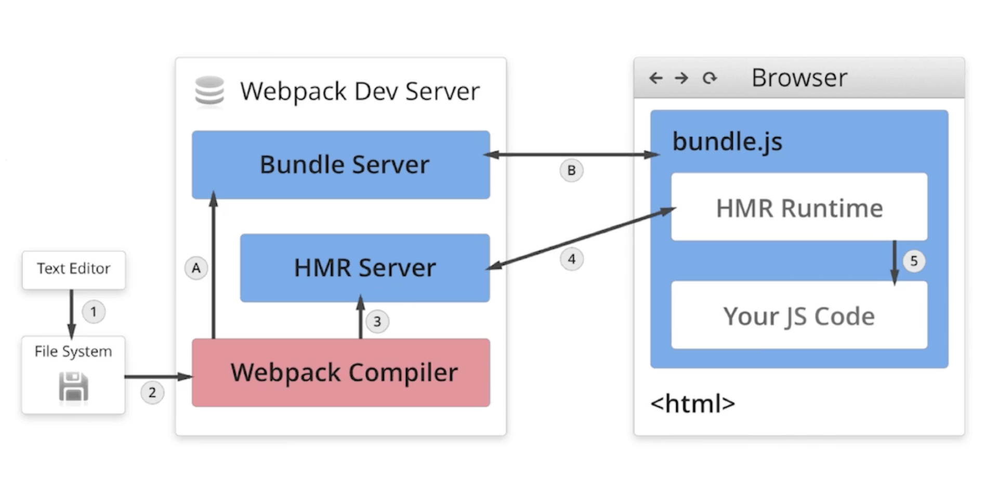
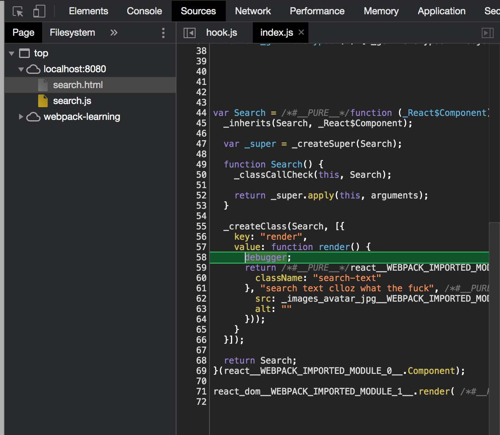
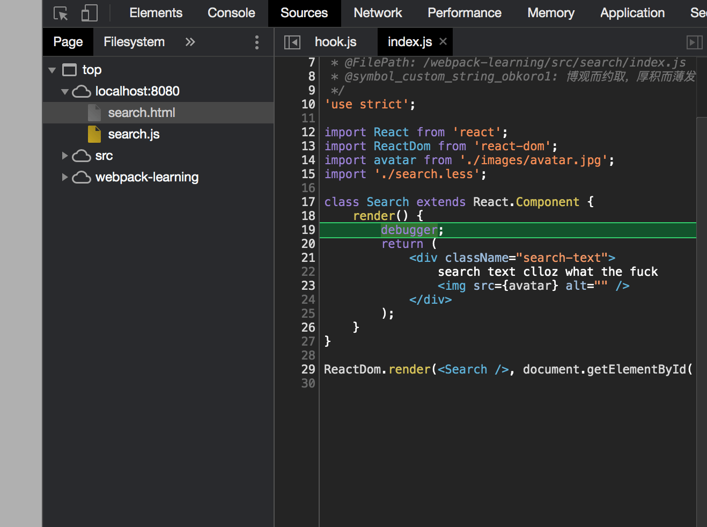
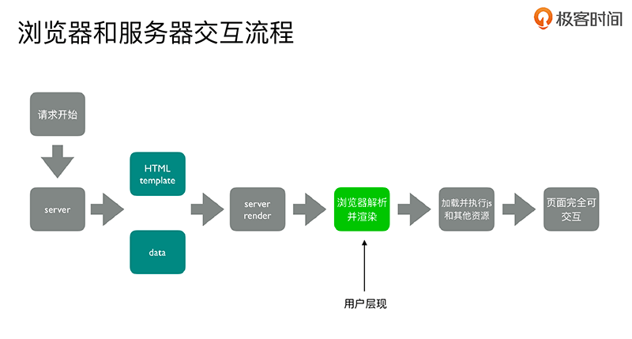
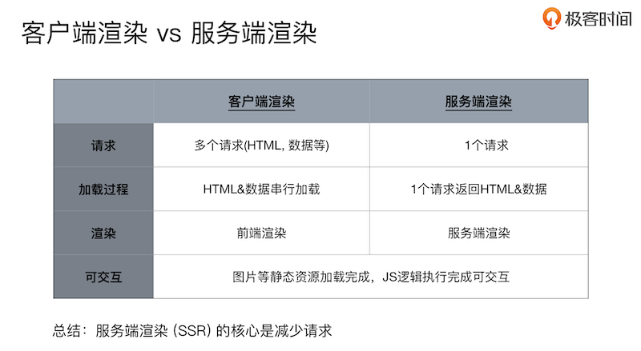

\[toc\]

## 前言

本文是学习 `玩转webpack` 和 《Webpack实战：入门、进阶和调优》的学习笔记。

## webpack 的一些概念

参考 [术语表 - webpack](https://webpack.docschina.org/glossary/ "术语表 - webpack")

## 如何查找依赖

基本的方式就是从入口开始以字符串的形式读取文件，然后解析成抽象语法树，找到依赖，然后不断递归，生成依赖树。

## 配置文件

`webpack` 配置文件组成

- `entry`: 入口文件，默认值为 `./src/index.js`
- `outpu`: 打包文件的输出，默认值为 `./dist/index.js`
- `mode`: 选择开发环境还是生产环境
- `module`：`loader` 配置，通过配置 `rules` 数组实现
- `plugins`：插件配置

零配置 `webpack` 只包含 `entry` 和 `output`，值为默认值。

每次运行 `webpack` 命令都需要输入其在 `node_modules` 中的对应路径，有两个解决办法，一个是使用 `npx`；另一个是在 `package.json` 中添加 `build` 命令，原理就是局部安装的模块会在 `node_modules/.bin` 中添加软链接。

我也也可以在 `webpack` 命令后面加上一些参数，比如 `--env`，`--entry`，`--config` 等等，查看命令行参数可以用命令 `npx webpack -h`，在我们写一些小 `demo` 的时候不想写配置文件的时候可以用这个方法来简单配置，当配置复杂的时候还是必须要写配置文件。

## chunk

`chunk` 的意思是代码块，在 `webpack` 中可以理解为被抽象和包装过的一些模块。它就像一个装着很多文件的文件夹，里面的文件就是各个模块。`webpack` 在这些模块外面加了一层包裹形成了 `chunk`。根据配置不同，一个工程打包时可能会产生一个或多个 `chunk`。

如果工程只有一个入口，那么默认 `chunkname` 为 `main`，如果有多个入口，需要我们为每个入口定义 `chunkname`，`[name]` 占位符就是用的 `chunkname`，如果没有定义 `chunkname` 则用 `chunk id`。

```javascript
module.exports = {
    entry: {
        index: '/src/index.js', //chunk name is index
        lib: './src/lib.js' //chunk name is lib
    }
};
```

## bundle

从入口文件开始检索，将所有的依赖关系生成一颗依赖树，最终得到一个 `chunk`，由这个 `chunk` 得到的打包产物成为 `bundle`，一般一个 `entry` 对应一个 `chunk` 和一个 `bundle`，但是也有不同情况，`chunk` 和 `bundle` 的区别参考 [Webpack 理解 Chunk](https://juejin.im/post/6844903889393680392 "Webpack 理解 Chunk")

## vendor

有时一些第三方的库非常大，如果一起打包到我们代码的 `bundle` 中会让最后打包出的代码体积非常大，对页面性能和白屏时间等都不友好，并且只要我们一改动代码，这些第三方库也要跟着更新。所以就有了提取 `vendor` 的需求， `vendor` 的意思是供应商，一般就是指我们工程中使用的库，框架等第三方模块集中打包而产生的 `bundle`。

## 资源入口

`webpack` 通过 `context` 和 `entry` 来确定入口文件的路径。其中 `context` 使用很少，它的意思就是 `base dictionary` 基础路径，是一个绝对路径，默认就是当前项目的根目录（配置文件所在路径）。`entry` 则是指定入口文件的路径。

`entry` 有单入口和多入口两种配置方式，单入口是一个字符串，多入口则是一个对象。单入口适合单页应用，而多入口则适合多页应用。

```javascript
module.exports = {
    entry: './path/to/my/entry/index.js',
};
module.exports = {
    entry: {
        app: './src/app.js',
        adminApp: './src/adminApp.js',
    },
};
```

`entry` 还可以是数组和函数，函数只要返回字符串数组或者对象的任意形式即可。数组会将多个资源预先合并，最后一个元素作为实际的入口文件路径，即除最后一个元素，前面的元素会作为模块被加载到入库文件中，其实就是将多个模块都打包到一起的意思。

```javascript
module.exports = {
    entry: ['babel-polyfill', './src/index.js'],
};

//等同于下面的配置
//webpack.config.js
module.exports = {
    entry: './src/index.js',
};

//index.js
import 'babel-polyfill';
```

## 资源出口

我们打包的文件要有一个输出的目的地，也就是配置文件中的 `output` 字段，其中最主要和常用的两个就是 `path` 和 `filename`，`path` 的功能和入口的 `context` 有点类似，即指定资源输出的一个 `base dictionary`，必须是一个绝对路径。`webpack4` 之后，`output.path` 已经默认为 `dist` 目录，除非我们需要更改它，否则不必单独配置。不过我在使用 `clean-webpack-plugin` 的时候发现不配置 `path` 它无法工作。

`output` 告诉 `webpack` 如何将打包后的文件输出到磁盘。单入口和多入口的 `output` 看上去区别不大，主要就是通过占位符确保文件名称的唯一性，在多入口的情况下，会用我们在 `entry` 中的 `key` 值也就是 `chunkname` 作为 `output` 的文件名。在生产环境的配置文件中，为了防止缓存导致的不刷新我们通常会加上 `chunkhash` 占位符，它是由 `md5` 生成的只和问价内容相关的 `hash`，只有文件内容变化才会变化，也不会影响到其他 `chunk`，一般我们选择 `8` 位 `hash`。

```javascript
module.exports = {
    entry: './path/to/my/entry/index.js',
    output: {
        filename: 'bundle.js',
        path: path.join(__dirname, 'dist'),
    },
};
module.exports = {
    entry: {
        app: './src/app.js',
        adminApp: './src/adminApp.js',
    },
    output: {
        filename: '[name].js', //占位符实现文件名唯一
        path: path.join(__dirname, 'dist'),
    },
};
```

资源出口中有一个字段时 `chunkFilename`，它主要是给异步加载模块进行打包用的。比如我们在我们的模块中用 `import()` 异步加载了一个模块，肯定不能把这个异步加载的模块和普通的模块打包到一起，必须要单独打包。这个单独打包的异步模块就称为非入口(`non-entry`) `chunk` 文件，如果我们要给这些非入口 `chunk` 配置 `filename` 就需要使用 `chunkFilename` 这个字段。该字段默认值是 `[id]` 占位符，不过在 `webpack5` 中这个 `id` 似乎不像以前是一个数字，`webpack5` 中模块的键名 `key` 就是模块的相对路径。当然 `import()` 的执行也很简单，`__webpack_require__.e(/*! import() */ "src_add-content_js").then()`，因为 `import()` 返回的是一个 `Promise`，代码中的 `src_add-content_js`就是打包出来的异步模块名字。

关于这个知识点，推荐两篇文章 [webpack 中，filename 和 chunkFilename 的区别是什么？](https://www.cnblogs.com/skychx/p/webpack-filename-chunkFilename.html "webpack 中，filename 和 chunkFilename 的区别是什么？")，[Webpack 异步按需加载](https://www.xheldon.com/webpack-details-one.html "Webpack 异步按需加载")

* * *

资源出口中还有一个关键配置是 `publicPath`，一般在生产环境使用，它主要是解决静态资源部署的问题，生产环境中，我们的静态资源很可能上 `cdn`，或者目录结构和开发环境并不相同，这时候我们原来写在项目中的路径就无法使用了，`publicPath` 可以为我们统一修改这些静态资源的链接。`path` 加上 `filename` 是文件在本地硬盘上的真实路径（我们开发时使用），而加上 `publicPath` 就是我们在浏览器上看到的页面上的链接的路径。

这个配置项会加到每个 `runtime` 或 `loader` （和 `webpack` 相关的路径）产生的 `URL` 中，所以这个配置项在大多数情况下都是以 `/` 结尾。比如我们在一个 `css` 中的 `background-image` 的 `url` 写的是一个相对路径，实际生产环境，这些图片静态资源都被部署到其他地方，或者是使用 `cdn` 访问，我们不可能一个一个去修改，我们在 `webpack.prod.js` 中设置 `publickPath`，`webpack` 在打包的时候会自动为我们加上设置的路径前缀。

`devServer` 的配置中也有 `publicPath`，`webpack-dev-server` 打包的内容是放在内存中的，这些打包后的资源对外的的根目录就是 `publicPath`，换句话说，这里我们设置的是打包后资源存放的位置，就是把 `output.path` 覆盖了。注意的是静态资源仍然使用 `output.publicPath`。`devServer` 的 `publicPath` 的默认值是 `/`，也就是说如果打包文件时 `bundle.js`，我们可以通过 `localhost:8080/bundle.js` 来访问，如果你设置了 `publicPath` 为 `/assets/`，那么就需要通过 `localhost:8080/assets/bundle.js` 来访问。如果你用 `html-webpack-plugin` 设置了入口 `html` 文件，那么就可以通过 `localhost:8080/assets/html-filename.html` 来访问。`devServer.publicPath` 和 `output.publicPath` 不同，它不能使用相对路径。

> 通过访问 `http://localhost:8080/webpack-dev-server` 可以得到 `devServer` 启动后的资源访问路径。

`devServer.contentBase` 则是设置项目启动时的根目录。

本段参考 [Webpack中publicPath详解](https://juejin.im/post/6844903601060446221 "Webpack中publicPath详解")

## module

先介绍一下 `loader`，`webpack` 默认只支持 `js` 和 `json` 两种文件类型，如果我们想要支持其他类型的文件的打包就要使用 `loader`。`loaders` 能够将其支持的文件类型转化成有效的模块并添加到依赖图中。`loader` 本身是一个函数，接受源文件作为参数，返回转换的结果。目前比较常用的 `loader` 有：

- `babel-loader`：转换 `ES6+` 等新语法特性。需要同时安装 `@babel/core` 和 `@babel/preset-env`。需要注意
- `css-loader`: 支持 `.css` 文件的加载和解析，转换成 `CommonJS` 对象。
- `style-loader`：将样式通过 `<style>` 标签插入 `head` 中。
- `less-loader`：将 `less` 转换成 `css`。
- `ts-loader`：将 `TS` 转换成 `JS`。
- `file-loader`：进行图片、字体等文件的打包。返回的是带 `output.publicPath` 的路径，该 `loader` 支持配置 `filename` 和 `publicPath`（会覆盖 `output.publicPath`）。
- `url-loader`：进行图片、字体等文件的打包，可以设置较小资源的自动 `base64`。可以设置一个阈值，大于阈值与 `file-loader` 一样返回 `publicPath`，小于阈值时则返回文件 `base64` 形式的编码。
- `raw-loader`：将文件以字符串的形式导入。
- `thread-loader`：多进程打包 `css` 和 `js`。
- `vue-loader`：用于处理`vue` 组件，将单文件组件中的模版，`js` 和演示进行拆分。安装是需要同时安装 `vue` 和 `vue-template-compiler`（用来编译 `Vue` 模版），还要安装对应的 `loader` 来处理样式。

`loader` 的配置就在 `modules` 字段中的 `rules` 数组中进行配置，每个数组元素表示一种 `loader` 配置，每个元素都是一个对象，一般包含两个字段：`test` 表示文件的匹配规则（正则表达式），`use` 表示使用哪个 `loader`，`use` 也可以是一个数组，有多个配置，比如 `url-loader` 的 `use` 字段就需要 `loader` 和 `option` 两个字段。这里需要注意的是如果一种文件使用多个 `loader`，比如同时使用 `css-loader` 和 `style-loader`，要注意先后顺序。`loader` 是链式调用，是从右往左，所以这里要把 `css-loader` 写到右边，这样 `css-loader` 处理玩的结果在传给 `style-loader` 处理。

```javascript
module.exports = {
  module: {
    rules: [
      { test: /\.css$/, use: ['style-loader', 'css-loader'] },
      { test: /\.ts$/, use: 'ts-loader' }
    ]
  }
};
```

* * *

`rules` 还有一个配置是 `exclude` 和 `include`，主要是用来排除或包含指定目录下的模块，可以接收正则表达式或表示文件绝对路径的字符串，以及由它们组成的数组。

比如 `exclude: /node_modules/` 就表示 `node_modules` 中的模块不会执行该条 `rules`。这主要是为了提高打包速度，让一些没有必要打包的模块被忽略。比如我们使用 `babel-loader` 是为了处理 `ES6+`，但如果有些模块已经被编译为 `ES5` 了，那么就没有必要再进行处理。

`include` 则表示只对正则匹配成功的模块应用这条规则。`exclude` 和 `include`同时存在的时候，`exclude` 的优先级更高。它们两者结合可以有很多种用法，主要是依靠正则表达式和优先级的特性。

* * *

在 `webpack` 中被夹在的模块称为 `resource`，而家在这称为 `issuer`，我们在 `rules` 中的配置都是针对 `resource` 的，如果我们想要对家在这进行限制，就可以在 `rules` 中使用字段 `issuer`。比如下面的配置就表示只有 `/src/pages` 目录下的 `js` 可以引用 `css`。

```json
{
    test: /\.css$/,
    use: ['style-loader', 'css-loader'],
    issuer: {
        test: /\.js&/,
        include: /src\/pages/,
    }
},
```

当需要同时约束 `resource` 和 `issuer` 的时候可以使用下面的形式：

```javascript
{
    use: ['style-loader', 'css-loader'],
        resource: {
            test: /\.css$/,
                exclude: /node_modules/,
        },
            issuer: {
                test: /\.js$/,
                    exclude: /node_modules/,
            },
},
```

* * *

`webpack` 中的 `loader` 按照执行顺序可以分为 `pre`，`inline`，`normal` 和 `post`，我们直接定义的 `loader` 一般都属于 `normal`，`inline` 官方不推荐使用，`pre` 和 `post` 可以使用 `enforce` 来指定，`pre` 表示在所有 `loader` 之前执行，而 `post` 则表示在所有 `loader` 之后执行。

事实上 `loader` 的执行顺序是根据我们配置文件中的顺序执行的，使用 `enforce` 主要目的是使模块规则更清晰，可读性更强，因为实际的项目中，配置文件可能非常大，很难保证不会出错，所以使用 `enforce` 强制指定执行顺序是一个比较可靠的方法。

* * *

有时候会遇到现有的 `loader` 无法很好满足需求的情况，这时候就要对咸鱼的 `loader` 进行修改或者编写一个新的 `loader`。`loader` 本身是一个函数，它接收对应的文件的字符串，或者上一个 `loader` 处理的结果，输出给下一个 `loader`或者 `webpack`，逻辑并不复杂。下面是一个实现为每一个 `js` 文件添加 `use strict` 的 `loaer`，出处是 《webpack实战：入门、进阶与调优》的第 `4.5` 章，里面详细说了如何自己编写一个 `loader`，感兴趣的同学可以自己去看一下。

```javascript
var loaderUtils = require('loader-utils');
var SourceNode = require('source-map').SourceNode;
var SourceMapConsumer = require('source-map').SourceMapConsumer;
module.exports = function (content，sourceMap) {
    if (this.cacheable) {
        this.cacheable();
    }
    var useStrictPrefix = "'use strict';\n\n";
    var options = loaderUtils.getOptions(this) || {};

    if (options.sourceMap && sourceMap) {
        var currentRequest = loaderUtils.getCurrentRequest(this);
        var node = SourceNode.fromStringWithSourceMap(content, new SourceMapConsumer(sourceMap));
        node.prepend(useStrictPrefix);
        var result = node.toStringWithSourceMap({ file: currentRequest });
        var callback = this.async();
        callback(null, result.code, result.map.toJSON());
    }

    return useStrictPrefix + content;
};
```

## plugins

`loader`，它是一个转换器，将 `A` 文件进行编译成 `B` 文件，比如：将 `A.less` 转换为 `A.css`，单纯的文件转换过程。 `plugin` 是一个扩展器，它丰富了 `webpack` 本身，针对是 `loader` 结束后，`webpack` 打包的整个过程，它并不直接操作文件，而是基于事件机制工作，会监听 `webpack` 打包过程中的某些节点，执行广泛的任务。

`plugins` 是用来增强 `webpack` 功能的工具，比如打包文件的优化，资源管理和环境变量的注入等，插件是 `webpack` 的支柱功能。`webpack` 自身也是构建于你在 `webpack` 配置中用到的相同的插件系统之上。可以简单理解为 `loader` 没法做的事情就需要用 `plugins` 来做，比如在构建之前删除原来的构建文件，就可以用 `plugins` 来完成。`plugins` 作用于整个构建过程。`webpack` 插件是一个具有 `apply` 属性的 `JavaScript` 对象。`apply` 属性会被 `webpack compiler` 调用，并且 `compiler` 对象可在整个编译生命周期访问。

```javascript
module.exports = {
  entry: './path/to/my/entry/file.js',
  output: {
    filename: 'my-first-webpack.bundle.js',
    path: path.resolve(__dirname, 'dist')
  },
  module: {
    rules: [
      {
        test: /\.(js|jsx)$/,
        use: 'babel-loader'
      }
    ]
  },
  plugins: [
    new webpack.optimize.UglifyJsPlugin(),
    new HtmlWebpackPlugin({template: './src/index.html'})
  ]
};
```

下面列出一些常见的 `plugins`：

- `CommonChunkPlugin`：将 `chunks` 相同的模块代码提取成公共的 `js`。
- `CleanWebpackPlugin`：清理构建目录。
- `ExtractTextWebpackPlugin`： 将 `CSS` 从 `bundle` 里面提取成一个独立的 `CSS` 文件。
- `CopyWebPackPlugin`：将文件或者文件夹拷贝到构建的输出目录。
- `HTMLWebpackPlugin`：创建 `HTML` 文件去承载输出的 `bundle`。
- `UglifyjsWebpackPlugin`：压缩 `JS`。
- `ZipWebpackPlugin`：将打包的文件生成一个 `zip` 包。

## mode

`mode` 用来指定当前打包的环境，`webpack` 将使用相应模式的内置优化，默认值为 `production`。

- `development` ：会将 `process.env.NODE_ENV` 的值设为 `development`。启用 `NamedChunksPlugin` 和 `NamedModulesPlugin`。
- `production`： 会将 `process.env.NODE_ENV` 的值设为 `production`。启用 `FlagDependencyUsagePlugin`, `FlagIncludedChunksPlugin`, `ModuleConcatenationPlugin`, `NoEmitOnErrorsPlugin`, `OccurrenceOrderPlugin`, `SideEffectsFlagPlugin` 和 `UglifyJsPlugin`。
- `none`：不使用任何默认优化选项。

> `Error: Cannot find module ‘webpack-cli/bin/config-yargs‘` 报错是 `webpack` 和 `webpack-cli` 版本不兼容，可以将 `webpack-cli` 退回到 `3.3` 版本。这个报错的原因是由于 `webpack-cli` 版本 `4`，删除了 `webpack-cli/bin/config-yargs` 文件。`webpack` 的 `issue` 中给出的解决方案是在安装了 `webpack5` 和 `webpack-cli4` 的情况下，用 `webpack serve` 命令代替原来的 `webpack-dev-server`，这是他们的最新的更新。注意新的命令中间没有横线，还有一点要注意的就是 `--open` 在新的命令中需要提供参数比如 `'Google Chrome'`，这在 `webpack-dev-server` 的文档中也有，不给参数将会报错，而不是像 `webpack-dev-server` 一样打开默认浏览器。

在 `node` 中，有全局变量 `process` 表示的是当前的 `node` 进程。`process.env` 包含着关于系统环境的信息。但是 `process.env` 中并不存在 `NODE_ENV` 这个东西。`NODE_ENV` 是用户一个自定义的变量，在 `webpack` 中它的用途是判断生产环境或开发环境的依据的。更多关于 `NODE_ENV` 的详情参考文章 [浅入浅出理解webpack中的NODE\_ENV及新特性mode](https://www.cnblogs.com/fe-linjin/p/11963765.html "浅入浅出理解webpack中的NODE_ENV及新特性mode")

`NODE_ENV` 最早是 `express`(web框架)自己定的一个环境变量, 通过设置不同的值以在生产和开发环境作出相应动作. 随着该框架的流行, 通过该值的设置区分生产和开发环境变得广为接受, 很多工具也遵循了该做法。`npm` 也有如下规定：

> With the--productionflag (or when theNODE\_ENVenvironment variable is set toproduction), npm will not install modules listed indevDependencies.

在使用 `NODE_ENV` 的时候我们要区分在 `node` 中使用的 `NODE_ENV` 和在 `JS` 中使用的 `NODE_ENV`。前者是一个真正的环境变量，我们在执行 `webpack` 或者其他命令的时候会用到的，后者只是一个 `webapck` 打包的时候的一个全局变量。因为 `webpack` 是在 `node` 中运行的，所以环境变量自然会用到，也就是真正的环境变量，我们可以在 `webpack` 的配置文件中访问到。而如果只是设置 `mode`，其实只是 `webpack` 在打包时添加了一个所有模块能访问到的全局变量，方便我们在写 `js` 的时候根据开发和生产环境的不同来判断哪些代码要执行（也可以用 `webpack.definePlugin`，`mode` 本质就是设置 `definePlugin`：`Sets process.env.NODE_ENV on DefinePlugin to value development. Enables useful names for modules and chunks.`）。所以，要设置真正的环境变量，必然不是在 `webpack` 配置文件里面设置的，基本上常用的有两种方式，一个是在 `script` 的 `webpack` 命令前面加上 `NODE_ENV=production`（如果是 `windows` 前面要加上 `set`，`cross-env` 就是设置的这个），另一个就是 `webpack-cli` 给了 `webpack` 命令一个参数，我们可以任意设置想要的环境变量（只在运行时有效），这个参数是 `--env`，具体用法可以参考[官方文档](https://webpack.js.org/guides/environment-variables/ "官方文档")，需要将 `module.exports` 从一个对象改为一个函数，`env` 将作为一个参数传入。关于 `mode` 和 `NODE_ENV` 的关系请看 [webpack设置环境变量的误区](https://juejin.im/post/6844904023791796237 "webpack设置环境变量的误区")，

## 样式处理

## 分离样式文件

我们通过 `import` 的方式将样式表引入 `js`，然后用 `css-loader` 和 `style-loader` 处理的样式最后会以 `style` 标签的形式出现在页面上。但是很多时候我们希望是以文件的形式部署，因为这更有利于客户端缓存。`webpack` 社区有专门进行样式文件分离的插件 `mini-css-extract-plugin`。

该插件除了需要添加到 `plugins` 当中，还需要将插件的 `loader` 添加到 `css` 的 `loader` 中去（不需要 `style-loader`，直接用 `css-loader` 处理完再交给该插件即可。

当我们有多个文件入口时，会打包出多个 `css` 文件，这时候我们需要给文件命名。同样，这里我们可以使用 `[name]` 占位符，和 `output.filename` 一样，这里也表示的是 `chunkname`。

`mini-css-extract-plugin` 有一个优点就是它支持按需加载，举个例子 `a.js` 通过 `import()` 异步加载了 `b.js`，`b.js` 中加载了 `style.css`，`mini-css-extract-plugin` 会单独打包出这个 `css`，最后通过 `a.js` 动态出入 `link` 标签的方式加载到页面。

对于 `sass` 的安装 `sass-loader` 和 `sass` 即可，想要在浏览器上查看 `sass` 的源码，需要开启 `sourceMap`。当然也可以用 `mini-css-extract-plugin` 进行样式分离。`less` 用法类似。

## PostCSS

`PostCSS` 单独说是因为它不算一个 `CSS` 预编译期，它是一个编译插件的容器，它的工作模式是接收样式源代码并交给编译插件处理，最后输出 `CSS`，我们可以自己指定用哪些插件来实现特定的功能。

`PostCSS` 使用 `postcss-loader` 来与 `webpack` 链接，可以单独使用，也可以和 `css-loader` 结合使用。单独使用的时候不建议使用 `@import` 语句，会产生冗余代码，所以官方建议将 `postcss-loader` 放在 `css-loader` 之后。`PostCSS` 需要一个独立的配置文件 `postcss.config.js`。

> 我们在不用打包工具的时候，`@import` 要放在 `css` 的顶部才能生效，在使用打包工具的时候，由于打包工具会提前解析 `import` 和 `require` 所以即使写在后面也没有关系。

`PostCSS` 最广泛的一个应用就是自动添加厂商前缀，需要安装 `autoprefiexer` 插件。有一些 `CSS3` 的属性还没有统一，我们在使用的时候需要加上内核的前缀，目前主要的内核前缀有 `Trident -ms`，`Geko -moz`，`Webkit -webkit` 和 `Presto -o`，如果需要手动添加这些前缀，还是一件比较麻烦的事情。不过我们可以利用 `PostCSS` 的 `autoprefixer` 插件自动补齐 `CSS3` 属性前缀。`autoprefixer` 是在打包完成后样式生成后进行处理。我们需要安装 `postcss-loader` 和 `autoprefixer`，具体配置参考下面的示例：

```javascript
module: {
    rules: [
        {
            test: /.less$/,
            use: [
                MiniCssExtractPlugin.loader,
                'css-loader',
                'less-loader',
                {
                    loader: 'postcss-loader',
                    options: {
                        postcssOptions: {
                            plugins: [require('autoprefixer')],
                        },
                    },
                },
            ],
        },
    ]
},
```

你也可以在 `use` 中只写一个 `postcss-loader`，然后创建一个 `postcss.config.js`：

```javascript
module.exports = {
  plugins: [
    require('autoprefixer')
  ]
}
```

如果你想要对 `autoprefixer` 进行参数配置，可以在 `package.json` 中添加如下字段：

```json
 "browserslist": [
    "defaults",
    "not IE 11",
    "not IE_Mob 11",
    "maintained node versions"
  ]
```

也可以创建一个单独的 `.browserslistrc` 文件：

```json
defaults
not IE 11
not IE_Mob 11
maintained node versions
```

关于 `PostCSS` 和 `browserlist` 的文档参考 [PostCSS - Github](https://github.com/postcss/autoprefixer#options "PostCSS - Github") 和 [browserslist](https://github.com/browserslist/browserslist#queries "browserslist")。

> 如果打包出现 `Error: Universal Chunk Loading is not implemented yet`，移除 `browserslistrc` 中的 `maintained node versions` 和 `node traget` 选项，或者修改为兼容的选项。

* * *

另一个比较常用的插件是 `stylelint`，它是一个 `CSS` 的质量检测工具，类似于 `eslint`，我们可以为其添加各种规则来统一代码风哥，确保代码质量。具体设置参考官网 [stylelint](https://stylelint.docschina.org/user-guide/rules/ "stylelint")

`CSSNext` 可以让我们使用最新的 `CSS` 语法特性，会帮我们把最新的语法特性翻译成浏览器能接受的属性和形式，我们可以在配置中设置要支持的浏览器。详情查看官网 [CSSNext](https://cssnext.github.io/ "CSSNext")

## 文件监听

文件监听是在源码发生变化时，自动重新构建出新的输出文件。`webpack` 开启文件监听有两种方式：

- 启动 `webpack` 命令时带上 `--watch` 参数
- 在 `webpack.config.js` 配置文件中设置 `watch` 为 `true`

文件监听的原理就是 `webpack` 会对文件的最后编辑事件进行轮询判断，当判断某个文件发生了变化，它会等待 `300ms`，然后进行重新打包。关于 `watch` 的配置字段如下：

```javascript
module.exports = {
    watch: true, //默认是 false
    watchOptions: { //只有watch为true，该配置才有意义
        ignored: /node_modules/, //默认为空，不监听的文件或者文件夹，支持正则匹配
        aggregateTimeout: 300, //监听到变化发生后会等 300ms再去执行，默认 300ms
        poll: 1000, //判断文件是否发生变化是通过不停询问系统指定文件有没有变化实现的，默认每秒询问1000次
    }
}
```

但是这样的方式还有个问题就是我们还是每次都要刷新一下浏览器才能看到更新内容。要解决这个问题可以使用 `webpack-dev-server` 进行热更新。`webpack-dev-server` 其实并没有刷新浏览器，也没有输出文件，而是把内容放在内存中实现的，所以它的构建速度更快，它通常需要和 `HotModuleReplacementPlugin` 结合使用(该插件为 `webpack` 内置)。我们可以在 `package.json` 中添加 `"dev": "webpack-dev-server --open"` 的 `script` 来使用 `webpack-dev-server`，`--open` 会自动帮我们打开浏览器。`plugins` 的配置如下：

```javascript
    plugins: [new webpack.HotModuleReplacementPlugin()],
    devServer: {
        contentBase: './dist',
            hot: true,
    },
```

除了使用 `webpack-dev-server` 和 `HotModuleReplacementPlugin` 之外还可以使用 `webpack-dev-middleware`。`webpack-dev-middleware` 将输出的文件传输给服务器，适用于更加灵活的定制场景。使用这种方式需要和 `node` 的 `server` 配合，比如 `express`，`koa`。贴一个 `express` 的例子：

```javascript
const express = require('express');
const webpack = require('webpack');
const webpackDevMiddleware = require('webpack-dev-middleware');

const app = express();
const config = require('./wepack.config.js');
const compiler = webpack(config);

app.use(
    webpackDevMiddleware(compiler, {
        publicPath: config.output.publicPath,
    }),
);

app.listen(3000, function () {
    console.log('example app listen in port 3000!\n');
});
```

热更新的原理和过程见下图：



各部分功能分别是：

- `webpack compiler`：将 `js` 编译成 `bundle`。
- `HMR Server`：将热更新的文件传输给 `HMR runtime`。
- `Bundle Server`：一个 `web` 服务器，提供文件在浏览器的访问，比如通过 `localhost:8080` 访问。
- `HMR runtime`：会被注入到浏览器更新文件的变化，让 `bundle.js` 和服务器建立连接，通常是 `websocket`。
- `bundle.js`：构建输出的文件。

热更新可以分为两个过程，第一个过程是启动阶段，对应图中的 `1 -> 2 -> A -> B`，文件被改变后，文件系统的文件由 `Webpack Compiler` 编译然后传给 `Bundle Server`，让浏览器能够通过服务器 `localhost` 访问到编译后的文件。另一个过程就是文件的更新，对应图中的 `1 -> 2 -> 3 -> 4 -> 5`，同样是文件更新后由 `Webpack Compiler` 编译然后发送给 `HMR Server`，`HMR Server` 比对后知道哪些模块发生了变化，通知 `HMR Runtime`(通常是以 `json` 的形式)，`HMR Runtime` 就会改变对应的代码，我们就能够在浏览器看到变化。

## 文件指纹

浏览器会对请求进行缓存知道过期或更新，缓存的时间由服务器决定，合理的利用缓存能够有效的提升网站性能，这也是我们为什么要提取 `css` 和一些公共模块的一个原因，一些不容易发生变化的内容就不要频繁重新加载了。但是同时也带来一个问题就是如果我们有一个资源进行了 `bug fix`，有时候浏览器还是在使用缓存，我们的更新接没法立即看到进行测试。要解决这个问题组好的办法就是更改资源的 `url`，这样可以迫使所有客户端都去下载最新的资源，这也是早期的前端开发会在 `url` 后面加上时间戳的原因。

文件指纹就是指打包后输出的文件名的后缀。通常被用来做版本管理，只修改改变的文件的指纹，其他文件保持不变，依然可以使用缓存。常见的生成文件指纹的方法有三种：

- `Hash`：和整个项目的构建相关，只要项目文件有更改，整个项目的 `Hash` 就会改变。
- `ChunkHash`：和 `webpack` 打包的 `chunk` 有关，不同的 `entry` 生成不同的 `chunkhash` 值。
- `ContentHash`：根据文件内容来定义 `hash`，文件内容不变，`ContentHash` 不变。

> `chunkhash` 是无法和热更新一起使用的。

`JS` 文件指纹的设置只要在 `output` 中添加 `chunkhash` 占位符即可。对于 `CSS` 文件使用 `MniCssExtractPlugin` 设置 `ContentHash`。图片和字体等文件的指纹是用由 `md5` 生成的表示文件内容的 `hash`。和之前 `output` `name` 一样，这里的 `hash` 都是使用占位符，下面列出一些占位符的含义：

- `[ext]`：资源后缀名
- `[name]`：文件名称
- `[path]`：文件相对路径
- `[folder]`：文件所在文件夹
- `[contenthash]`：文件内容 `hash`，默认是 `md5` 生成。后面接 `:number` 表示取 `hash` 值的前多少位，`md5` 的哈希值默认是 `32` 位。
- `[hash]`：文件内容 `hash`，默认是 `md5` 生成。
- `[emoji]`：一个随机的指代文件内容的 `emoji`。

```javascript
module.exports = {
    entry: {
        app: './src/index.js',
        search: './src/search.js',
    },
    output: {
        filename: '[name][chunkhash:8].js',
        path: path.join(__dirname, 'dist'),
    },
    module: {
        rules: [
            {
                test: /.(png|jpg|gif|jpeg)$/,
                use: [
                    {
                        loader: 'file-loader',
                        option: {
                            name: 'img/[name][hash:8].[ext]',
                        },
                    },
                ],
            },
        ],
    },
    plugins: [
        new MiniCssExtractPlugin({
            filename: '[name][contenthash:8].css',
        }),
    ],
};
```

有了 `chunkname` 之后还有个问题就是每次打包后的文件名都变了，如果我们是用自己手写的 `HTML` 文件做入口的话，意味着每次打包我们都要手动修改引入的资源地址，这当然是不合理的。我们可以用 `html-webpack-plugin` 来帮我们自动生成入口 `HTML`，它会帮我们把打包好的文件自动添加到生成的 `HTML` 中。

它能够支持我们的模版，为多个 `chunk` 生成多个 `html`，压缩 `html` 代码等等。该插件的详细配置参考 [html-webpack-plugin - github](https://github.com/jantimon/html-webpack-plugin "html-webpack-plugin - github")。

## 代码压缩

通常在将资源发布到线上环境之前，我们通常都会进行代码压缩，或者叫 `uglify`，一般来说就是移除多余的空格，换行以及执行不到的代码，缩短变量名，在不影响代码的执行的前提下缩短代码，让项目体积显著变小。同时 `uglify` 之后的代码很难阅读，也一定程度上提高了代码的安全性。

压缩 `js` 的工具用的比较多的有两个 `UglifyJS` （`webpack 3` 继承）和 `terser` （`webpack 4` 继承），后者支持 `ES6+` 的代码压缩，更加面向未来，所以 `webpack4` 默认使用 `terser-webpack-pugin`。

`uglify` 的配置在 `optimization.minimize` 中，如果开启了 `production` 模式则该功能自动开启，不需要我们进行配置。我们也可以手动安装 `uglifyjs-webpack-plugin` 插件，然后配置参数，比如开启并行压缩等。

`terser-webpack-plugin` 在 `webpack 4` 的 `production` 模式下是自动开启的，它的主要配置参数有如下这些：

- `test`：`terser` 的作用范围。
- `include`：是 `terser` 额外对某些文件或者目录生效。
- `exclude`：排除某些文件或者目录。
- `cache`：师傅开启缓存，某人的缓存目录为 `node_modules/.cache/tesrser-webpack-plugin`，通过传入字符串类型的值可以修改缓存路径。
- `parallel`：允许使用多个进程进行并行压缩，强烈建议开启，可以传入数字设置进程数。
- `sourceMap`：师傅生成 `source map`，需要同时配置 `devtool`。
- `terserOptions`：`terser` 压缩配置，是一个对象，设置一些其他配置选项，比如是否可对变量重命名，是否兼容 `IE8` 等。

下面是一个简单的配置例子：

```javascript
const TerserPlugin = require('terser-webpack-plugin');
module.exports = {
    optimization: {
        minimizer: [
            new TerserPlugin({
                test: /\.js(\?.*)?$/i,
                exclude: /\/excludes/,
            })
        ]
    }
}
```

* * *

`CSS` 的压缩需要使用 `optimize-css-assets-webpack-plugin` 插件来压缩，该插件本质上是使用的压缩器 `cssnano`，所以要安装 `cssnano`。需要注意的是，使用该插件的前提是使用 `mini-css-extract-plugin` 将样式表提取成文件了。

```javascript
var OptimizeCssAssetsPlugin = require('optimize-css-assets-webpack-plugin');
module.exports = {
  module: {
    rules: [
      {
        test: /\.css$/,
        loader: ExtractTextPlugin.extract('style-loader', 'css-loader')
      }
    ]
  },
  plugins: [
    new ExtractTextPlugin('styles.css'),
    new OptimizeCssAssetsPlugin({
      assetNameRegExp: /\.optimize\.css$/g,
      cssProcessor: require('cssnano'),
      cssProcessorPluginOptions: {
        preset: ['default', { discardComments: { removeAll: true } }],
      },
      canPrint: true
    })
  ]
};
```

`HTML` 文件的压缩使用 `html-webpack-plugin`，一个 `HTML` 文件对应一个插件配置，可以参考如下配置。

```javascript
plugins: [
    new HtmlWebpackPlugin({
        template: path.join(__dirname, './src/index.html'),
        filename: 'index.html',
        chunk: ['index'],
        inject: true,
        minify: {
            html5: true,
            collapseWhitespace: true,
            preserveLineBreaks: false,
            minifyCSS: true,
            minifyJS: true,
            removeComments: false,
        },
    }),
    new HtmlWebpackPlugin({
        template: path.join(__dirname, './src/search.html'),
        filename: 'search.html',
        chunk: ['search'],
        inject: true,
        minify: {
            html5: true,
            collapseWhitespace: true,
            preserveLineBreaks: false,
            minifyCSS: true,
            minifyJS: true,
            removeComments: false,
        },
    }),
],
```

## bundle 体积监控和分析

为了保证良好的用户体验，我们可以对打包输出的 `bundle` 进行监控，如果有过大的模块看看能不能替换或者拆分后按需加载。这里提几个监控的方法，比如 `vscode` 的 `import cost` 的插件，不过不是很好用，支持的语法比较有限，比企鹅计算比较慢。`webpack-bundle-analyzer` 插件能够帮我们分析 `bundle` 构成，会生成一张 `bundle` 模块组成结构图。使用方法也很简单：

```javascript
const Analyzer = require('webpack-bundle-analyzer').BundleAnalyzerPlugin;

plugins: [ new Analyzer() ],
```

还有一个 `bundlesize` 工具包尅帮我们进行自动化体积监控分析，只要在 `package.json` 进行如下配置：

```json
{
    "bundlesize": [
        {
            "path": "./bundle.js",
            "maxSize": "50 kB"
        }
    ],
    "scripts": {
        "test:size": "bundlesize"
    }
}
```

## 清理目录

如果不对输出目录进行清理，会造成输出目录的文件越来越多。一个比较简单的办法就是在 `npm script` 对应的打包命令前面加上 `rm -rf ./dist &&` 来实现。我们也可以利用 `webpack` 的插件 `clean-webpack-plugin` 来实现。注意 `const { CleanWebpackPlugin } = require('clean-webpack-plugin');` 需要大括号，使用直接在 `plugins` 加上 `new CleanWebpackPlugin(),` 即可。

> 有一点需要注意的，使用 `clean-webpack-plugin` 必须要要在 `output` 中配置 `path`，不然无法清理目录。

## px2rem 以及资源内联

使用 `px2rem-loader` 和 `lib-flexible` 能够比较方便地实现移动端不同设备的自适应。

```javascript
module: {
        rules: [
            {
                test: /.less$/,
                use: [
                    MiniCssExtractPlugin.loader,
                    'css-loader',
                    'less-loader',
                    {
                        loader: 'postcss-loader',
                        options: {
                            postcssOptions: {
                                plugins: [require('autoprefixer')],
                            },
                        },
                    },
                    {
                        loader: 'px2rem-loader',
                        options: {
                            remUnit: 75,
                            remPrecision: 8,
                        },
                    },
                ],
            },
        ],
    },
```

`lib-flexible` 需要添加到生产环境的依赖中去，这里有个问题是 `lib-flexible` 是要加到页面上的，我们如何实现模块内联到 `html` 上，也就是资源内联问题。资源内联就是把 `css` 或者 `js` 内联到 `html` 中去参与打包，或者是图片字体文件如何内联到代码中去参与打包。资源内联有如下一些作用：

- 页面框架的初始化脚本运行。比如 `lib-flexible` 需要在页面打开的时候根据页面的宽高计算根元素字体大小。
- 上报相关打点。比如一些和加载相关的代码，`js`，`css` 是否加载完成等代码需要内联到 `html`。
- `CSS` 内联避免页面闪动。把首屏的的 `CSS` 内联到 `HTML` 中可以让 `CSS` 随着 `HTML` 请求一起回来，确保不会影响首屏的渲染。
- 资源的内联可以减少 `HTTP` 请求的数量，比如可以把一些小图片或者字体内联（url-loader 可以实现转 `base64` 内联）。

`HTML` 和 `JS` 的内联可以使用 `html-loader` 来实现，`HTML` 内联的情况可以是一段需要被很多文件复用的 `HTML` 结构，比如手机页面的 `meta` 标签等，在内联的 `js` 中如果有使用 `ES6` `ES7` 的语法，需要先用 `babel-loader` 转换然后再用 `html-loader` 进行内联。这里有个问题就是，内联的 `js` 有注释似乎没有进行删除，没有找到好的解决办法。

```html
<%= require('html-loader!./meta.html') %>
    <script>
    <%= require('html-loader!babel-loader!../node_modules/lib-flexible/flexible.js') %>
    </script>
```

`CSS` 的内联可以使用 `style-loader` 或者 `html-inline-css-webpack-plugin` 插件。

```javascript
module: {
    rules: [
        {
            test: /\.scss$/,
            use: [
                {
                    loader: 'style-loader',
                    option: {
                        insertAt: 'top', //样式表插入到 <head>
                        singleton: true, // 所有的 <style> 合成一个
                    }
                }
            ]
        }
    ]
}
```

## 多页面应用打包

单页面应用 `SPA` 就是把所有的业务都放到一个大的入口中，不同的子业务都是同一个 `url`，只是 `url` 之后的 `hash` 不同。多页面应用 `MPA` 就是发布后有很多入口，每一个页面都是单独的业务，多页面应用的优点是每个页面是解耦的，并且对 `SEO` 更友好。

我们可以手动设置 `entry` 为多个，包括 `HtmlWebpackPlugin` 也可以设置多个，但是当我们要添加页面的时候每次都要手动添加是非常麻烦的，我们可以利用 `glob` 解析我们的 `src` 目录，得到入口文件的数组，不过有个前提条件就是我们将每一个页面放到 `src` 下面的单独文件夹中，统一每一个页面的入口文件都是 `index.js`，`html` 模版是 `index.html`。这样我们可以利用 `js` 来生成我们的入口和插件配置字段。代码如下：

```javascript
const setMPA = () => {
    const entry = {};
    const htmlWebpackPlugins = [];
    const entryFiles = glob.sync(path.join(__dirname, 'src/*/index.js'));

    Object.keys(entryFiles).map(index => {
        const entryFile = entryFiles[index];
        const match = entryFile.match(/src\/(.*)\/index\.js/);
        const pageName = match && match[1];

        entry[pageName] = entryFile;
        htmlWebpackPlugins.push(
            new HtmlWebpackPlugin({
                inlineSource: '.css$',
                template: path.join(__dirname, `src/${pageName}/index.html`),
                filename: `${pageName}.html`,
                chunks: ['vendors', pageName],
                inject: true,
                minify: {
                    html5: true,
                    collapseWhitespace: true,
                    preserveLineBreaks: false,
                    minifyCSS: true,
                    minifyJS: true,
                    removeComments: false,
                },
            }),
        );
    });

    return {
        entry,
        htmlWebpackPlugins,
    };
};
const { entry, htmlWebpackPlugins } = setMPA();
```

然后我们可以吧 `entry` 用我们返回的 `entry` 值替换，在 `plugins` 数组后面 `concat` 上生成的 `HtmlWebpackPlugin` 配置。这只是一个示例，其他的需要动态生成的配置也可以参考这个做法。

## Source Map

如果我们在开发环境中要进行调试，面多打包压缩后的 `js` 代码是没法进行的，所以就需要 `source map` 来帮助我们。简单说，`Source map` 就是一个信息文件，里面储存着位置信息。也就是说，转换后的代码的每一个位置，所对应的转换前的位置。有了它，出错的时候，除错工具将直接显示原始代码，而不是转换后的代码，并且有助于我们查看调用栈信息，十分有利于调试。这无疑给开发者带来了很大方便。关于 `source map` 的科普可以看一看阮一峰老师的文章： [JavaScript Source Map 详解](https://www.ruanyifeng.com/blog/2013/01/javascript_source_map.html "JavaScript Source Map 详解")。

一般情况下我们只在开发环境开启 `source map`，在生产环境会关闭，因为这回将我们的业务逻辑暴露出来。如果要对线上的问题进行排查可以将 `source map` 上传到错误监控系统。

`webpack` 支持多种 `source map` 的形式，除了配置 `devtool: 'source-map'` 以外，还可以根据不同的需求选择 `cheap-source-map` 或者 `eval-source-map` 等，各种 `source map` 的意义如下 ：

- `eval`： 使用 `eval` 包裹模块代码。
- `source map`：产生 `.map` 文件
- `cheap`：不包含列信息。
- `inline`：将 `.map` 作为 `DataURI` 嵌入，不生成单独的 `.map` 文件。
- `module`：包含 `loader` 的 `source map`

我么可以用这些关键词进行搭配，比如 `cheap-module-eval-source-map`。通常这些其他选项都是一些劫掠版本，因为生成完整的 `source map` 会演唱整体构建事件，如果对打包速度有要求，可以选择一个简化的 `source map`。在没有设置 `source map` 的时候，我们用 `debugger` 打断点在浏览器调试的时候，我们会发现 `source` 中的代码都是 `webpack` 打包后的代码，即使没有经过压缩也不是很好阅读。当我们配置了 `devtool: 'source-map'` 后我们就能在 `Chrome` 的开发者工具中的 `sources` 选项卡下面的 `webpack://` 目录中找到解析后的工程源码。效果如下图：

未设置 `devtool` 

设置 `devtool` 为 `source-map` 

`CSS`,`SCSS` 和 `LESS` 需要在 `loader` 的 `option` 中设置 `sourceMap` 为 `true`。

上面也说过，通常来说 `source map` 不应该在生产环境使用，而且由于生产环境的 `ugifyjs-webpack-plugin` 只支持完全的 `source map`，所以我们只能选择 `source-map`，`hidden-source-map` 和 `nosources-source-map` 三种。

## 异步资源加载

资源异步加载主要解决的问题是，当模块数量过多，资源体积过大，可以把一些暂时用不到的模块延迟加载。这样页面楚辞渲染的时候用户下载的资源会比较小，后续的模块等到恰当的实际再去触发加载。一般也会称为按需加载。

在我们使用 `webpack` 时我们有两种异步加载的方式：`import()` 和 `require.ensure()`。目前官方比较推荐的是 `import()`。关于 `import()` 用法可以参考我的 [前端模块化](https://www.clloz.com/programming/front-end/js/2020/10/24/js-module/#import-2 "前端模块化")，`import()` 返回的是一个 `Promise` 对象。看一个例子：

```javascript
//foo.js
import { add } from './bar.js';
console.log(add(2, 3));

//bar.js
export function add(a, b) {
    return a + b;
}
```

这是一个同步加载的例子，假设这个 `bar.js` 非常大，同时我们在楚辞渲染的时候并不需要他，我们就可以使用异步加载。

```javascript
//foo.js
import('./bar.js').then(({ add }) => {
    console.log(add(2, 3));
})

//bar.js
export function add(a, b) {
    return a + b;
}
```

最后我们可以看到打包结果，`dist` 中有一个单独对应 `bar.js` 的文件。其实异步加载的处理并不复杂，核心就是一个 `__webpack_require__.f.j` 和 `__webpack_require__.l`，代码如下，其实也就是用 `document.createElement('script')` 创建 `script` 标签，加到 `head` 中。不过比较奇怪的是在浏览器开发者工具中我们可以看到 `network` 中的请求，但是 `head` 中看不到加上的标签，这是 `webpack` 在 `__webpack_require__.l` 中将添加的 `script` 删除了，不过我没理解这么做的目的，当然一个已经加载完成的 `script` 删除后不影响其实用，它的环境已经生成（注意 `onload` 是在 `script` 标签加载并且执行完同步代码之后才出发的）。

```javascript
__webpack_require__.f.j = function(chunkId, promises) {
/******/                // JSONP chunk loading for javascript
/******/                var installedChunkData = __webpack_require__.o(installedChunks, chunkId) ? installedChunks[chunkId] : undefined;
/******/                if(installedChunkData !== 0) { // 0 means "already installed".
/******/        
/******/                    // a Promise means "currently loading".
/******/                    if(installedChunkData) {
/******/                        promises.push(installedChunkData[2]);
/******/                    } else {
/******/                        if(true) { // all chunks have JS
/******/                            // setup Promise in chunk cache
/******/                            var promise = new Promise(function(resolve, reject) {
/******/                                installedChunkData = installedChunks[chunkId] = [resolve, reject];
/******/                            });
/******/                            promises.push(installedChunkData[2] = promise);
/******/        
/******/                            // start chunk loading
/******/                            var url = __webpack_require__.p + __webpack_require__.u(chunkId);
/******/                            // create error before stack unwound to get useful stacktrace later
/******/                            var error = new Error();
/******/                            var loadingEnded = function(event) {
/******/                                if(__webpack_require__.o(installedChunks, chunkId)) {
/******/                                    installedChunkData = installedChunks[chunkId];
/******/                                    if(installedChunkData !== 0) installedChunks[chunkId] = undefined;
/******/                                    if(installedChunkData) {
/******/                                        var errorType = event && (event.type === 'load' ? 'missing' : event.type);
/******/                                        var realSrc = event && event.target && event.target.src;
/******/                                        error.message = 'Loading chunk ' + chunkId + ' failed.\n(' + errorType + ': ' + realSrc + ')';
/******/                                        error.name = 'ChunkLoadError';
/******/                                        error.type = errorType;
/******/                                        error.request = realSrc;
/******/                                        installedChunkData[1](error);
/******/                                    }
/******/                                }
/******/                            };
/******/                            __webpack_require__.l(url, loadingEnded, "chunk-" + chunkId);
/******/                        } else installedChunks[chunkId] = 0;
/******/                    }
/******/                }
/******/        };

//__webpack_require__.l
!function() {
/******/        var inProgress = {};
/******/        var dataWebpackPrefix = "webpack-examples:";
/******/        // loadScript function to load a script via script tag
/******/        __webpack_require__.l = function(url, done, key) {
/******/            if(inProgress[url]) { inProgress[url].push(done); return; }
/******/            var script, needAttach;
/******/            if(key !== undefined) {
/******/                var scripts = document.getElementsByTagName("script");
/******/                for(var i = 0; i < scripts.length; i++) {
/******/                    var s = scripts[i];
/******/                    if(s.getAttribute("src") == url || s.getAttribute("data-webpack") == dataWebpackPrefix + key) { script = s; break; }
/******/                }
/******/            }
/******/            if(!script) {
/******/                needAttach = true;
/******/                script = document.createElement('script');
/******/        
/******/                script.charset = 'utf-8';
/******/                script.timeout = 120;
/******/                if (__webpack_require__.nc) {
/******/                    script.setAttribute("nonce", __webpack_require__.nc);
/******/                }
/******/                script.setAttribute("data-webpack", dataWebpackPrefix + key);
/******/                script.src = url;
/******/            }
/******/            inProgress[url] = [done];
/******/            var onScriptComplete = function(prev, event) {
/******/                // avoid mem leaks in IE.
/******/                script.onerror = script.onload = null;
/******/                clearTimeout(timeout);
/******/                var doneFns = inProgress[url];
/******/                delete inProgress[url];
/******/                script.parentNode && script.parentNode.removeChild(script);
/******/                doneFns && doneFns.forEach(function(fn) { return fn(event); });
/******/                if(prev) return prev(event);
/******/            }
/******/            ;
/******/            var timeout = setTimeout(onScriptComplete.bind(null, undefined, { type: 'timeout', target: script }), 120000);
/******/            script.onerror = onScriptComplete.bind(null, script.onerror);
/******/            script.onload = onScriptComplete.bind(null, script.onload);
/******/            needAttach && document.head.appendChild(script);
/******/        };
/******/    }();
```

我在上面的 `output` 部分讲了 `ChunkFilename` 是用来设置异步 `chunk` 的 `output` 名字的，其实我们也可以在模块中用注释进行命名，在进行 `import` 的地方，比如 `let epm = import(/*webpackChunkName: "epm"*/ './modules.js');`，该一步模块就会被打包到 `epm.js`，当然如果你在 `output.chunkFilename` 中配置了占位符，也会生效。

## 代码分割

对于大型的 `Web` 应用来讲，把所有的代码都打包到一个文件中显然是不合理的。比较合理的想法就是把首屏的代码打包到一起，后面的逻辑按需加载或者懒加载，这样才能够提高应用的效率。懒加载的方式一般来说有两种，一种是 `CommonJS` 的 `require.ensure`，另一种是 `ES6` 的动态 `import`，这个需要 `babel` 进行转换。安装并配置 `@babel/plugin-syntax-dynamic-import` 插件即可。

最简单的代码分割方式就是使用多个入口，比如实际开发中有些库和工具是不会变的，我们可以把他们放到一个单独的入口中去，用一个数组来处理他们的依赖关系（数组前面的项都会被 `import` 到最后一个项中，实际入口是最后一个元素）。这种方式比较适合哪些将接口绑定在全局对象上的库，因为业务代码中模块无法直接饮用库中的模块，二者属于不同的依赖树。

## 基础库分离

对于代码的分割还有一个问题就是我们如何将公共的部分提取出来，避免重复的加载。这样一方面提升我们的打包速度，另一方面也可以减小整个工程的体积。并且打包出来的文件有利于客户端的缓存。这也就是基础库分离的一个主要目的。目前最主要的代码分割手段是 `webpack4` 之后提供的 `optimization.splitChunks`。

首先要说明，在前面已经讲过，异步加载的模块 `webpack` 默认个就是自动分割了，我们可以用 `output.chunkFilename` 对这些分割后的模块进行命名。其实这就是 `splitChunks` 在我们不进行配置的情况下的工作模式，我们这里主要讲的是 `splitChunks` 如何配置同步引入的代码的分割。

`splitChunks` 有一些默认提取条件：

- `chunks` 可被多次共享或者来自 `node_modules` 的通用模块才会被提取。在默认情况下，只要是 `node_modules` 下的模块，即便只有一个模块引用也符合该条件。
- 提取后的 `JavaScript chunk` 要大于 `30kB`（压缩和 `gzip` 之前），`CSS chunk` de tijid ayu `50kB`。这主要是因为如果资源太小，提取的意义不大。
- 在按需加载的过程中，并行请求的资源最大值小于等于 `5`，按需加载指的就是 `require.ensure()` 或者 `import()`，他们都是动态插入 `script` 标签。因为么一个请求都要花费建立和释放连接的成本，所以我们不希望同时加载过多的资源，因此提取规则只在并行请求不多的时候生效。
- 首次加载时，并行请求的资源数最大值小于等于3，和上一条的原因类似，但是页面首次加载的时候对性能要求更高，所以阈值也更低。

`webpack` 就是通过这些条件来确定一个模块是否要被提取，只有满足全部条件才提取。当满足这些默认条件是，即使我们没有对 `optimization.splitChunks` 进行配置也会进行提取。为了更好的了解 `splitChunks` 是如何工作的，我们看一看它的默认配置：

```javascript
splitChunks: {
    chunks: "async", //匹配模式，async，initial 和 all，分别对应异步 chunk，入口 chunk 和 两种都开启
    minSize: 30000,
    minChunks: 1,
    maxAsyncRequests: 5,
    maxInitialRequests: 3,
    automaticNameDelimiter: '~', //名称分隔符
    name: true,
    cacheGroups: { //分离 chunk 时的规则，有 vendor 和 default 两种，vendor用于提取所有 node_modules 中符合条件的模块，default 用于多次被引用的模块，当一个模块同时符合多个 cacheGroups 时，根据priority 确定优先级，我们也可以自定义 cacheGroups
        vendors: {
            test: /[\\/]node_modules[\\/]/,
            name: 'vendor',
            priority: -10
        },
    default: {
            minChunks: 2,
            priority: -20,
            reuseExistingChunk: true
        }
    }
}
```

可以任意写两个入口测试一下，引入同一个模块，可以发现这个模块会被独立打包，并且在浏览器的 `head` 能够看到这个 `script`。

关于 `splitChunkPlugin` 的详细配置参考 [spilit-chunk-plugin - webpack](https://webpack.js.org/plugins/split-chunks-plugin/ "spilit-chunk-plugin - webpack")

* * *

将一些基础库比如 `react`，`react-dom` 通过 `cdn` 的方式引入，不打入 `bundle` 中，有利于打包速度。方法就是使用 `html-webpack-tags-plugin`。我们把整个项目都需要使用的公共包都用这种法师加载可以有效提高打包的速度和大保温架你的大小。

```javascript
new HtmlWebpackTagsPlugin({
    scripts: [
        {
            path: 'https://now8.gtimg.com/now/lib/16.8.6/react.min.js',
            external: {
                packageName: 'react',
                variableName: 'React',
            },
        },
        {
            path: 'https://now8.gtimg.com/now/lib/16.8.6/react-dom.min.js',
            external: {
                packageName: 'react-dom',
                variableName: 'ReactDOM',
            },
        },
    ],
}),
```

## 环境配置

上面的 `mode` 小节我已经详细说了如何设置环境，以及全局变量和环境的区别，这一节讲一讲如何在不同环境使用不同的配置。

一般来说有两种方式，一种就是只用一个配置文件，也就是 `webpack` 的默认配置文件 `webpack.config.json`，然后依赖命令中传入的环境参数在配置文件中判断哪些功能启用或者关闭，比如我们在 `package.json` 里面的 `script` 中设置了 `NODE_ENV`，我们就可以在 `webpack.config.json` 中用 `process.env.NODE_ENV` 进行判断。

当然上面这种在实际开发中使用的不多，一般只有我们个人写一些小项目会用。大部分情况下我们都是为不同的环境创建不同的配置文件，开发环境是 `webpack.dev.js`，开发环境是 `webpack.prod.js`，然后在 `script` 中用 `--config` 参数来传入调用哪个配置文件。但是这种方式还可以进行优化，因为开发环境和生产环境还是有很多代码是重复的。如果这部分重复的代码发生变化，我们就要爱两个文件中分别修改，所以我们可以将两个文件中重复的部分提取出来，单独创建一个 `webpack.common.js`，然后在另外两个文件中引入这个文件，再分别添加上自己的配置即可。当然这些名字都可以改，根据自己或者团队的习惯。

这里提一下上面没有仔细说的 `webpack.definePlugin`，它的主要作用是注入全局变量的，不过注意，不是绑定在 `window` 上的，只是我们在每一个模块都可以访问到。如果我们设置了 `mode` 就不用在 `definePlugin` 设置环境变量了。在 `definePlugin` 中设置全局变量如果值是字符串需要在外面加上 `JSON.stringify` 进行序列化，否则我们在使用时字符串会变成变量。

```javascript
//这段在模块中调用全局变量的代码，如果设置的时候没有进行序列化，会得到最下面的结果
if (process.env.NODE_ENV === 'production') {
    console.log('production');
}

new webpack.DefinePlugin({
    'process.env.NODE_ENV': 'production',
})

// production是一个变量，并不是我们想象中的字符串
if (production === 'production') {
    console.log('production');
}
```

* * *

对于需要配置多种打包环境的项目来说，`webpack-merge` 是一个非常实用的工具。假设我们的项目有 `3` 种不同的配置，分别对应本地环境、测试环境和生产环境，每一个环境对应的配置各不相同，但也有一些公共的部分，我们就可以提取公共部分。

比如我们有一个公共配置 `webpack.common.js`，如果没有其他工具，我们需要在开发环境的配置中引入并混入公共配置，一般会这么写：

```javascript
const commonConfig = require('./webpack.common.js');
module.exports = Object.assign(commonConfig, {
    //
})
```

但是这样的混入很暗进行比较细的配置修改，还是比较麻烦。另一种思路就是不混入，直接在 `commonConfig` 上修改属性，具体操作可以参考这篇文章 [为什么我们要做三份 Webpack 配置文件](https://zhuanlan.zhihu.com/p/29161762 "为什么我们要做三份 Webpack 配置文件")。

`webpack-merge` 其实就是对对象合并的逻辑进行了封装，让我们能够以混入的语法实现上面第二种思路的配置合并。它的基础用法如下：

```javascript
const commonConfig = { ... };

const productionConfig = { ... };

const developmentConfig = { ... };

module.exports = env => {
  switch(env) {
    case 'development':
      return merge(commonConfig, developmentConfig);
    case 'production':
      return merge(commonConfig, productionConfig);
    default:
      throw new Error('No matching configuration was found!');
  }
}
```

想要了解更多可以看 `webpack-merge` 的文档：[webpack-merge - Github](https://github.com/survivejs/webpack-merge "webpack-merge - Github")

## tree shaking 摇树优化

`webpack4` 以后在 `mode=production` 情况下默认开启，借鉴自 `rollup`。`tree shaking` 的概念就是只打包模块中被使用到的方法，没有使用的方法会在 `uglify` 阶段被擦除。`webpack` 默认支持，`babel` 配置中设置 `modules: false` 即可在 `production mode` 下自动开启。要求是必须是 `ES6` 语法，`CJS` 不支持。

了解 `tree shaking` 的原理先要了解 `DCE dead code elimination`，所谓 `dead code` 就是代码不会被执行，不可到达；或者代码执行的结果不会被用到；以及代码只会影响死变量，只写不读，比如你用一个函数修改了一个变量，但是这个变量没有被使用过。

```javascript
if (false) {
    console.log('this will never run.')
}
```

`tree shaking` 的原理就是利用 `ES6` 的语法特点，就是 `ES6` 的模块只能作为模块的顶层语句出现，`import` 的模块名只能是字符串常量（`CommonJS` 的模块可以根据自己的需求动态 `require`），`import binding` 是 `immutable` 的。所以可以看出 `tree shaking` 还是对于代码进行静态的分析，所以必须要 `ES6` 的语法才能生效。对于分析后的 `dead code` ，`tree shaking` 会用注释增加标记，然后在 `uglify` 阶段把一些没用的代码删除掉。

我们可以通过改变 `mode` 对 `tree-shaking` 进行测试，比如如下的模块：

```javascript
export function a() {
    return 'this is function a.';
}

export function b() {
    return 'this is function b.';
}
```

如果我们 `import {a , b} from 'tree-shaking.js'` 之后，只调用了 `a` 方法，那么在 `mode: production` 的情况下只有 `a` 方法会被打包，而 `b` 方法不会打包进最后的 `bundle` 中；如果是在 `mode: none` 的情况下则 `a， b` 都会被打包进 `bundle`。需要注意，一定要调用，如果只是用 `import` 引入的话，即使在 `mode: none` 的情况下不会被打包进 `bundle`。

## Scope Hosting

一般情况下，我们的模块打包后都是如下的样子：

```javascript
/* 6 */
/***/ (function(__unused_webpack_module, __webpack_exports__, __webpack_require__) {

__webpack_require__.r(__webpack_exports__);
/* harmony default export */ __webpack_exports__["default"] = (__webpack_require__.p + "avatar_6701277c.jpg");

/***/ }),

/* 7 */
/***/ (function(__unused_webpack_module, __webpack_exports__, __webpack_require__) {

__webpack_require__.r(__webpack_exports__);
/* harmony export */ __webpack_require__.d(__webpack_exports__, {
/* harmony export */   "a": function() { return /* binding */ a; },
/* harmony export */   "b": function() { return /* binding */ b; }
/* harmony export */ });
function a() {
  return 'this is function a.';
}
function b() {
  return 'this is function b.';
}
/***/ })
```

我们可以看到模块都被放入一个个的闭包中，当我们的代码增多出现几百几千个模块的时候就会有大量的函数闭包包裹代码，体积会非常大。并且运行时创建的函数作用域过多，导致运行时的内存开销变大。

`webpack` 的模块转换主要做两个事情，一个是用模块初始化函数包裹函数，另一个是将 `import` 转换成 `__wepack_require__`，`export` 也会做相应的处理。最后打包出来的结果是一个 `IIEF`（匿名闭包，立即执行函数），`modules` 是一个数组，每一项是一个模块初始化函数，`__wepack_require__` 用来加载模块，返回一个 `module.exports`，通过 `__webpack_require__(0)` 启动程序。

为了解决这个问题，`webpack3` 引入了 `scope hoisting` 机制（也是从 `rollup` 借鉴），他的原理就是将所有模块的代码按照引用顺序放在一个函数作用域里，然后适当重命名一些变量防止变量名冲突。通过这个机制可以有效减少闭包代码和内存开销。在 `mode: production` 中该机制是默认开启的，和 `tree shaking` 一样，这也是只支持 `ES6` 语法，因为这同样需要静态的检查模块的依赖，动态加载的模块是无法判断的。该机制对应的插件是 `ModuleConcatenationPlugin`，在 `production` 模式下默认开启。

## 打包库和组件

`rollup` 更适合打包组件和库，不过也有使用 `webpack` 的场景。我们要打包库和组件的配置其实也很简答，主要就是配置 `output` 和压缩机制。比如我们写一个大数加法的插件，`export default` 一个函数，想打包成 `.min.js` 的压缩文件，可以进行如下配置：

```javascript
const TerserPlugin = require('terser-webpack-plugin');
module.exports = {
    entry: {
        'large-number': './src/index.js',
        'large-number.min': './src/index.js',
    },
    output: {
        filename: '[name].js',
        library: 'largeNumber',
        libraryTarget: 'umd',
        libraryExport: 'default',
    },
    mode: 'none',
    optimization: {
        minimize: true,
        minimizer: [
            new TerserPlugin({
                include: /\.min\.js$/,
            }),
        ],
    },
},
```

在 `webpack4` 之后，`terser-webpack-plugin` 的压缩功能在 `production` 模式下也是默认开启的，如果你只想压缩 `min.js`，那么可以设置 `mode` 为 `none`，然后用 `optimization` 进行设置。`uglifyjs` 插件在 `3.0` 之前是不支持 `ES6` 语法的，所以这里默认使用的是 `terser`。

最后是包的发布，我们可以在入口处(`package.json` 中的 `main` 字段，默认是 `index.js`)写下如下代码：

```javascript
if (process.env.NODE_ENV === 'production') {
    module.exports = require('./dist/large-number.min.js');
} else {
    module.exports = require('./dist/large-number.js');
}
```

也就是 `production` 模式下就输出压缩版，非 `production` 模式就输出未压缩版。发布的需要先将源切换回官方源 `npm config set registry https://registry.npmjs.org`，然后 `npm login` 或者 `npm adduser` 输入你的信息，然后发布即可，注意，包名如果和别人重复了需要修改，会提示你 `403 You do not have permission to publish "large-number"`。如果你没有切换回官方源，而是使用的淘宝的镜像，即使成功登录也会报错：`404 Not Found - PUT https://registry.npmjs.org/large-number - Not found`。

## 服务端渲染 SSR

我们先来了解一下客户端渲染的流程，请求到 `HTML` 以后开始解析 `DOM`，`css` 会阻塞 `DOM` 的渲染，不阻塞 `DOM` 的解析。`CSS` 会阻塞 `JS` 的执行，所以 `JS` 执行的时候位于它前面的 `CSS` 和 `DOM` 都解析渲染完成。`JS` 会阻塞 `DOM` 的解析渲染，每遇到一个 `<script>` 标签都会将之前的 `DOM` 和 `CSS` 进行渲染。当所有同步的 `JS` 执行完成，整个页面的 `DOM` 构建和渲染都完成，已经可以进行交互了，触发 `DOMComtentLoaded` 事件，然后加载异步的图片等其他资源，整个过程是一个串行的加载执行过程。

服务端渲染的优势就是所有的模版等资源都是在服务端，我们可以把多个请求数量优化成一个。另外客户端渲染的时候依赖于用户的网络，而服务端渲染都是在内网的机器上进行，速度更开更稳定，最后的效果就是一个 `HTML` 返回所有数据。流程大概如下：



服务端渲染的核心就是减少请求。主要的作用就是减少白屏时间，对于 `SEO` 比较友好。



服务端渲染打包的图片无法显示可以在 `file-loader` 中配置 `esModule: false,` 或者在引用图片的位置加上 `.default`，比如 `const avatar = require('./images/avatar.jpg');` 使用变量的时候就是 `avatar.default`。

## 优化命令行输出

默认情况下的命令行输出会有很多不必要的信息，我们主要关心的是是否打包成功以及有哪些警告报错。我们可以通过设置 `stats` 和 `friendly-errors-webpack-plugin` 插件来实现。

## 构建异常和中断处理

在构建失败后输入命令 `echo $?` 可以返回错误码。

## webpack 实用插件

## webpack-dashboard

`webpack` 每次构建结束后都会在控制台输出一些信息，但是结构非常乱，特别是 `webpack 5`，打印的信息都没有对齐，看着眼花。`webpack-dashboard` 是一个将构建信息进行可视化的一个插件，使用非常简单，安装然后在插件中引入即可。

## speed-measure-webpack-plugin

`SMP` 可以帮助我们分析构建过程中在各个 `loader` 和 `plugin` 上花费的时间，这能够帮助我们找出需要优化的部分。使用方法就是将输出的 `webpack` 对象包裹在 `smp.wrap()` 中即可。目前该插件还不能支持 `webpack 5`。

## 参考文章

- 学习[webpack5](https://juejin.im/post/6882663278712094727 "webpack5")
- 《Webpack实战：入门、进阶与调优》