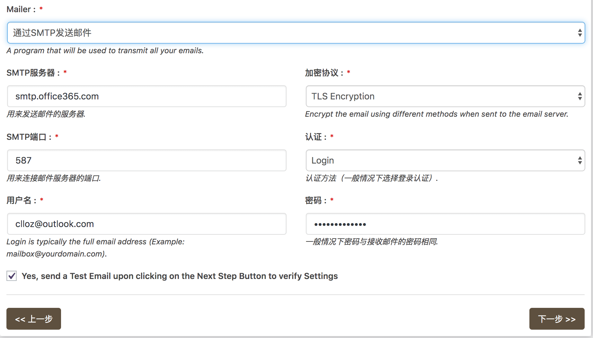

\[toc\]

## 前言

`wordpress` 虽然提供了评论邮件提醒的功能，不过我发现好像并不收到，最近博客有些评论都不能及时看到，都要点进评论才能看到，这样很不方便，于是搞了一下 `smtp` 邮件发送的配置。

## wordpress 的设置

首先是要在 `用户 -> 个人资料` 里面填上自己的邮箱，就填写要接受提醒的邮箱，然后在 `设置 -> 讨论` 中将邮件提醒的 `发送电子邮件提醒我` 的两个选项钩上。

## 配置插件

## WP-Mail-Bank

我在尝试了几个插件以后觉得还是这个插件比较好用，一个是插件的 `configure` 页面比较清爽，配置也比较简单，并且不用付费就能看到邮件发送的统计。插件的配置也很简单，跟着向导就可以了。最重要的配置见下图，我使用的是 `outlook` 邮箱，所以使用 `SMTP` 发送邮件，加密方式为 `SmartTSL`，端口为 `587`，登录方式就使用 `login` 即可，比较简单。点击下一步后会发送一个测试邮件，就是用你配置的这个邮箱用 `SMTP` 的方式登录发送邮件到测试邮箱（测试邮箱任意，检测能否登录成功并发送成功）。我在第一次发送测试邮箱的时候，发送失败，并且 `Microsoft` 账户收到安全风险的邮件，登录 `microsoft` 账户后查看最近的活动，然后信任自己的服务器即可，需要注意的是，这个信任生效不是即时的，可能需要等几分钟，然后在发送测试邮件就没有问题了。现在我们在收到用户评论的时候就能收到邮件提醒了，方便我们及时回复。

## Lightweight subscribe to comments

还有一个需求就是当用户的评论被别人回复的时候给他们发送一个提醒，我的网站毕竟访问量很少，如果有人在留言板提问，可能不知道什么时候会有人来回复他，所以最好是能给用户发送一个邮件，告诉他回复的内容。我找来找去没找到合适的插件（自己动不了手只能寄人篱下，自己要用的东西还是自己搞最好），就这个 `Lightweight subscribe to comments` 还算接近我的需求，因为这个插件是只要用户订阅了这篇文章，那么这篇文章只要出现新的回复用户就会收到邮件，但是我希望的是用户自己的评论被回复的时候才会收到邮件，不过姑且先用着吧，毕竟这个功能很简单，插件一共就两个文件，后面再自己改一改。这个插件可以自己定义回复的格式，并且用户在回复的时候可以选择是否订阅，也可以随时退订，还算是挺周全的。邮件的发送也是通过上面配置的 `smtp` 发送的，所以没有配置 `smtp` 应该是无法使用的。

## 总结

不管是用 `emacs`、`vim` 还是 `wordpress`，我都发现配置，插件最好是自己用的自己写，因为说实话每个人的需求和习惯都是不同的，别人写的插件或者配置很难是完美符合你的要求的，当然也不用所有的都从零开始写，如果别人已经有非常好的作品，也可以在那个基础上来配置出适合自己的东西。所以前提就是自己用的工具至少要能够懂得他工作的原理，比如 `wordpress` 插件是如何工作的，哪些 `API`，拿到一个插件的源码的时候能够看懂，也能够动手改需求。`emacs` 和 `vim` 就更是了，如果不完全搞懂其实很难把它们用下去的，因为搞懂 `emacs` 的高手是把 `emacs` 动手打造成高铁甚至是飞机在用，而你要么是开着拖拉机，要么是拿着别人的高铁飞机不知所措，一不小心那个零件出了问题你完全不知道怎么回事，反而耽误大把时间，这样的话还不如直接用别人搞好的定制快车比如 `vscode` 这样的工具。所以我是觉得在用一个工具的同时要学习他，哪怕是 `IDE` 也要多挖掘功能，从最基础的快捷键和命令，比如 `vscode` 的多光标的使用等，到自己开发插件，自己写自己的配置，刚开始可能很慢也记住住，但是只要坚持下去，肯定能够产生质的飞跃，极大提高自己的效率，最重要的是逼着自己沿着这条路走下去，直到手熟为止，像 `emacs` 有段时间不用，快捷键可能又忘了，一定要常用。开始的时候比较痛苦，但是长期来看绝对是非常有价值的，因为在学习的过程中你还学涉及到方方面面的知识，还能够多阅读高手的代码，肯定对自己的学习有很大的帮助。而且不同的平台基本理念和操作也都是有共通之处的，完全融会贯通一两个，其他的也就一通百通了。