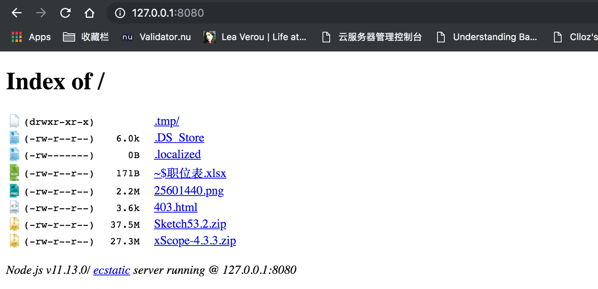

\[toc\]

## 前言

我的博客的 `web` 服务用用的 `apache`，对于网站，我们有很多文件不希望被访问，特别是有些目录会在被用户访问以后显示 `index` 就是文件的索引，`web` 服务器可以帮我们配置我们想要的功能，下面就来分享一下我的 `.htaccess` 的设置。

## .htaccess

`.htaccess` 是 `apache` 的分布式配置文件，提供了仅针对所在目录的改变配置的方法，会作用于所有子目录，可以帮我们实现如 `网页301重定向、自定义404错误页面、改变文件扩展名、允许/阻止特定的用户或者目录的访问、禁止目录列表、配置默认文档` 等功能。`apache` 的配置文件是在 `/etc/httpd/conf/httpd.conf`，修改这个文件会作用于所有通过 `web` 服务器访问的文件，为了配置的灵活，我们还是在自己的网站所在目录进行配置比较好，只要在我们网站根目录创建 `.htaccess`文件就可以了。

## 需要的功能

## 禁止目录浏览

`apache` 默认是开启目录浏览的，就是当我们访问网站的一些文件夹时，由于没有路由定向，会显示一个 `Index of /wp-content` 的页面，显示访问的文件夹下的文件列表，这是非常不安全的，我们不希望被用户看到我们网站下所有的文件。



使用下面的配置，禁用当前目录的 `index`。

```php
# Disable directory browsing
Options All -Indexes
```

## IP 黑名单

这个功能用来禁止一些你想拉黑的 `IP` 访问你的网站，我没有使用，不过如果你要用的话用下面的方法配置：

```php
# Block one or more IP address.
# Replace IP_ADDRESS_* with the IP you want to block

<Limit GET POST>
order allow,deny
deny from IP_ADDRESS_1
deny from IP_ADDRESS_2
allow from all
</Limit>
```

其中的 `IP_ADDRESS_1` 就是用来存放你要禁止的 `IP`。

## 禁止用户访问 wp-includes

`wp-includes` 是 `wordpress` 的核心文件所在，并且所有的插件和主题也不会访问该文件夹，所以我们应该禁止所有用户访问这个文件夹，用正则表达式来 `Rewrite`，让访问 `wp-includes` 的请求直接 `rewrite` 为 `403`。

```bash
# Block wp-includes folder and files
<IfModule mod_rewrite.c>
RewriteEngine On
RewriteBase /
RewriteRule ^wp-admin/includes/ - [F,L]
RewriteRule !^wp-includes/ - [S=3]
RewriteRule ^wp-includes/[^/]+.php$ - [F,L]
RewriteRule ^wp-includes/js/tinymce/langs/.+.php - [F,L]
RewriteRule ^wp-includes/theme-compat/ - [F,L]
</IfModule>
```

`RewriteRule` 后面的第一个参数是匹配请求 `url` 的正则表达式，`-` 后面的是 `flag`，`F` 表示将 `url` 重写到 `403`，`L` 表示最后一条，就跟 `switch case` 中的 `break差不多`，匹配成功就不会执行下面的了。

## 仅允许选定的IP访问 wp-admin

这个功能我没有使用，也就是只有配置中的IP才能访问后台，如果你有需要可以用如下配置

```php
# Limit logins and admin by IP
<Limit GET POST PUT>
order deny,allow
deny from all
allow from your-ip
allow from IP_ADDRESS_2
</Limit>
```

## 只允许访问 wp-content 中特定类型的文件

我们也不希望用户访问 `wp-content` 中的文件，但是由于 `wp-content` 中有插件和主题所需要的一些样式文件等等，如果我们禁止了一切请求，那么我们在后台操作的时候会发现界面一团糟，一些插件的功能无法使用了，因为它们没法访问到 `wp-content` 中的文件，所以一个折中的办法是，我们只允许一些固定类型的文件可以被访问，比如 `css，js` 等。需要注意的是，下面的配置要在 `wp-content` 文件夹中新建一个 `.htaccess`，如果你还想写在根目录下的文件中，记得加上路径。

```php
# Disable access to all file types except the following
Order deny,allow
Deny from all
<Files ~ ".(xml|css|js|jpe?g|png|gif|pdf|docx|rtf|odf|zip|rar)$">
Allow from all
</Files>
```

## 拒绝用户访问wp-config.php和.htaccess

`wp-config.php` 包含了你的数据库用户名密码等非常敏感的信息，所以我们应该禁止任何人访问这个文件。

```php
# Deny access to wp-config.php file
<files wp-config.php>
order allow,deny
deny from all
</files>
```

至于 `.htaccess` 文件 `apache` 在自己的配置文件中似乎已经禁止了，如果你不放心，把下面的配置加到你的文件中。

```php
# Deny access to all .htaccess files
<files ~ "^.*.([Hh][Tt][Aa])">
order allow,deny
deny from all
satisfy all
</files>
```

## 重定向到 https 以及自定义错误页面

我的网站开启了 `https` 所以我把所有的请求重定向到80端口了；如果你把错误页面弄漂亮一点，自己上传一个，然后添加到配置中去，配置如下：

```php
<IfModule mod_rewrite.c>
RewriteEngine On
RewriteBase /
RewriteCond %{SERVER_PORT} 80
RewriteRule ^(.*)$ https://www.clloz.com/$1 [R=301,L]
ErrorDocument 403 /403.html
ErrorDocument 404 /404.html
ErrorDocument 500 /500.html
ErrorDocument 503 /503.html
</IfModule>
```

## wordpress 会重制你的 .htaccess

这个问题我在另一篇[文章](http://https://www.clloz.com/programming/assorted/wordpress/2018/10/24/htaccess-reset/ "文章")里面已经写过，这里再说一下，当你在后台点击设置中的固定链接时，`wordpress` 会重制 `.htaccess` 中的一部分，当你编辑 `.htaccess` 的时候应该已经发现了，有几行代码原来就在其中，被 `# BEGIN WordPress # END WordPress` 包裹的部分，就是这部分会被重制，所以你自己的配置就不要写到这中间去了，否则一不小心就被重置了。

## 总结

虽然我们的个人博客可能并没有很多人访问，也不太会有人特意攻击，但是做好安全工作是一个好的习惯，也是不错的经验。如果你使用 `nginx` 就 `google` 一下吧，我一直也想把 `web` 服务器换 `nginx`不过一直没时间折腾，等有闲暇了在搞。

## 参考文章

[Best .htaccess Snippets to Improve WordPress Security](https://www.wpexplorer.com/htaccess-wordpress-security/ "Best .htaccess Snippets to Improve WordPress Security")