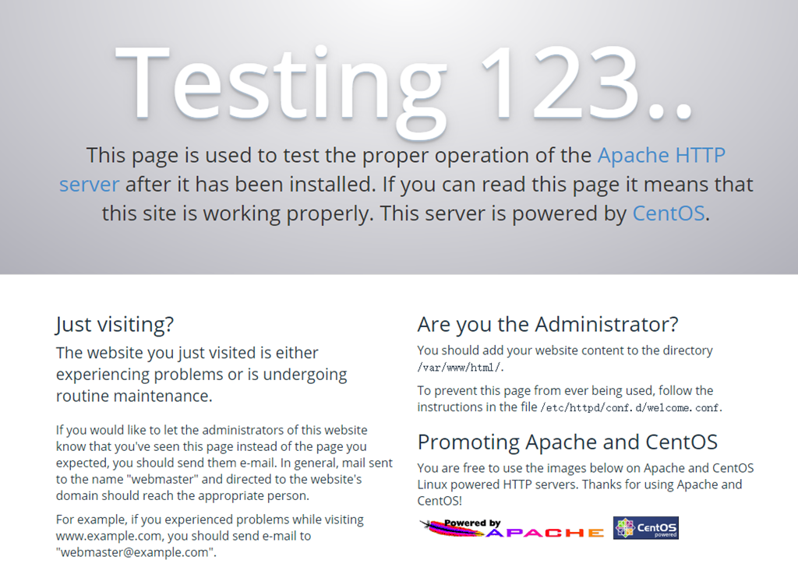
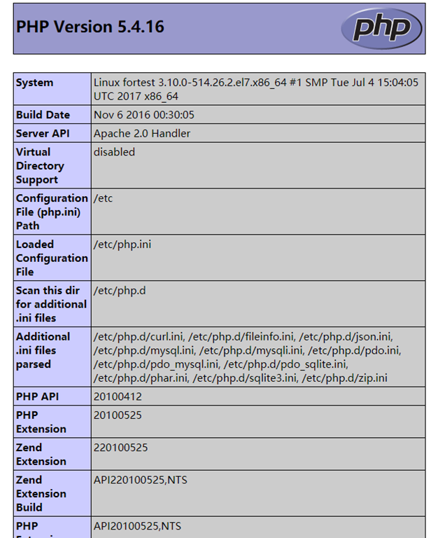
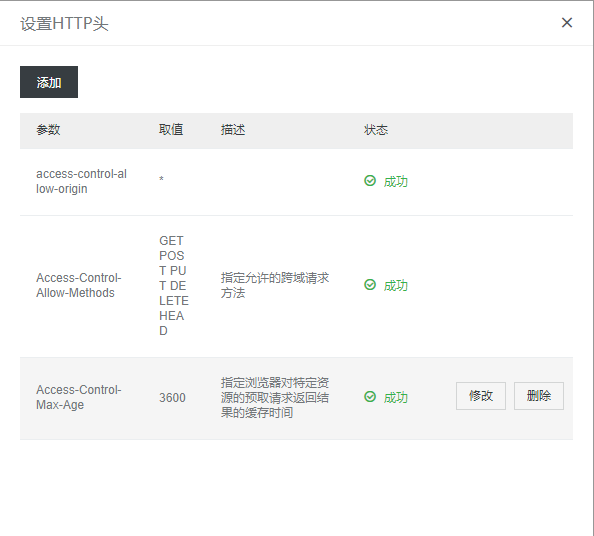

\[toc\]

## 前言

一直想搞一个自己的博客，限于自己的行动力和能力问题一直没搞，在尝试了 `github pages` 和 `jekyll` 以后还是决定买个阿里云的 `ECS` 来弄一个 `wordpress` 博客，在搞得差不多以后有尝试了一下阿里云的对象存储 `OSS` 和 `CDN` 加速，这篇文章就来跟大家说说这中间的过程。我的系统是 `CentOS7.3`。

## LAMP 环境设置

## 安装 apache

`apache` 在默认源里面就有，所以直接执行下面命令即可安装：`yum -y install httpd`

启动httpd：`systemctl start httpd`

开机自动启动： `systemctl enable httpd`

测试，在浏览器中输入你服务器的ip地址（或者你解析到该 `ip` 地址的域名），如果成功安装会显示如下页面：



## 安装 mysql 或者 mariadb

`CentOS` 默认安装的是`mariadb`，默认源里也移除了 `mysql` 用 `mariadb` 代替，所以比较方便的方法就是直接用 `mariadb`，不过我是麻烦了一点安装了 `mysql`，由于默认源里没有，所以不能 `yum` 安装，要去 `mysql` 官网 `YUM` 源 `rpm` 安装包.

- 下载 `mysq` l源安装包 `wget http://dev.mysql.com/get/mysql57-community-release-el7-8.noarch.rpm`
- 安装 `mysql` 源： `yum localinstall mysql57-community-release-el7-8.noarch.rpm`
- 安装 `mysql`： `yum install mysql-community-server`
- 启动 `mysql`： `systemctl start mysqld.service`
- 开机启动 `mysql`： `systemctl enable mysqld.service`
- 获取默认密码： `grep 'temporary password' /var/log/mysqld.log`
- 使用默认密码登录： `mysql -uroot -p`
- 修改默认密码： `ALTER USER 'root'@'localhost' IDENTIFIED BY 'yourpassword';`

> 注意：`mysql5.7` 默认安装了密码安全检查插件（`validate_password`），默认密码检查策略要求密码必须包含：大小写字母、数字和特殊符号，并且长度不能少于8位。否则会提示 `ERROR 1819` (`HY000)`: `Your password does not satisfy the current policy requirements` 错误。

## 安装 php

安装 `php` 以及需要的组件 `yum -y install php php-mysql php-gd php-ldap php-odbc php-pear php-xml php-xmlrpc php-mbstring php-snmp php-soap curl` 测试是否安装成功： 在 `apache` 网站根目录`/var/www/html`下新建一个 `info.php` 文件,内容为`<?php phpinfo(); ?>`，然后重启 `httpd`:`systemctl restart httpd.service`，用服务器公网 `ip` 访问该文件 `ip/info.php`，如果安装没有问题则显示如下界面：



## 安装 wordpress

## 创建数据库

- 登录数据库： `mysql -u root -p`
- 创建数据库： `CREATE DATABASE wordpress;`
- 创建数据库用户和密码： `CREATE USER wordpressuser@localhost IDENTIFIED BY 'wordress_password';`
- 设置 `wordpressuser` 访问 `wordpress` 数据库权限： `GRANT ALL PRIVILEGES ON wordpress.* TO wordpressuser@localhost IDENTIFIED BY 'wordress_password';`
- 刷新数据库设置： `FLUSH PRIVILEGES;`
- 退出数据库： `exit`

## 安装wordpress

- 下载安装包： `wget https://wordpress.org/latest.tar.gz`
- 解压： `tar xzvf latest.tar.gz`
- 复制到网站根目录： `cp -avr wordpress /var/www/html`
- 编辑wp-config.php文件：

```bash
# 切换到wordpress目录
cd /var/www/html/wordpress
# 复制wp-config.php文件
cp wp-config-sample.php wp-config.php
# 编辑wp-config.php文件
sudo vim wp-config.php
```

配置数据库参数：

```bash
// ** MySQL settings - You can get this info from your web host ** //
/** The name of the database for WordPress */
define('DB_NAME', 'database_name_here');
/** MySQL database username */
define('DB_USER', 'username_here');
/** MySQL database password */
define('DB_PASSWORD', 'password_here');
/** MySQL hostname */
define('DB_HOST', 'localhost');
```

完成以上工作以上，你就可以登录 `wordpress` 创建自己的博客了。

> 安装完成后删除 `wordpress` 根目录中的 `readme.html` 和 `license.txt`。

## wordpress 升级提示另一更新正在进行

这是由于在升级 `Wordpress`时，`Wordpress` 会在数据库 `wp_options` 表中增加 `core_updater.lock` 记录。如中途打断 `Wordpress` 升级，这个记录会留在数据库中。当下次升级时， `Wordpress` 检测到此记录的存在就会返回”另一更新正在进行”。 解决办法：

```sql
mysql -u root -p
use wordpress;
select * from wp_options where option_name='core_updater.lock';
delete from wp_options where option_name='core_updater.lock';
```

## 设置禁止访问的目录

当我们创建好我们的 `wordpress`，配置好我们的主题，我们已经可以开始写文章，也可以通过域名访问我们的博客了，但是我们发现，`wordpress` 目录下有很多文件夹，比如 `wp-content`，`wp-includes`，当我们在浏览器中访问这些文件夹的时候，页面会显示 `index of` 列出文件夹下的文件，这是非常不安全的，所以我们要在 `web` 服务器里面禁止别人访问这些文件夹，当有人尝试访问这些文件的时候，给他一个 `403`。具体怎么操作呢，就是在 `http.conf` 中加上如下内容：

```bash
<Directory /var/www/XXX>
    Options FollowSymLinks
    AllowOverride None
    Order allow,deny
    allow from all
</Directory>
```

现在我们再访问 `wp-includes` 就会显示 `403`，如果你觉得 `web` 服务器的 `403` 太难看了，你可以自己写个 `403`，`404` 的页面，然后放到根目录下，在 `http.conf` 中加上`ErrorDocument 403 /403.html`就可以了。

## 配置网站的 https 访问

`https` 的访问首先是要申请证书，阿里云提供免费的证书，申请完成后绑定自己的域名，然后是下载证书，阿里云有详细的步骤说明，如何在对应的服务器上安装证书，安装完成后我们就能通过 `https` 访问我们的网站了。当然，要看到小绿锁还要保证自己的页面安全，包括页面上的图片的静态资源都必须是 `https` 的。还有一个需要配置的内容是强制 `HTTP` 全部跳转到 `HTTPS`，配置也很简单，在根目录新建 `.htaccess` 文件（如果已经存在就不用新建），在其中加上如下配置：

```bash
<IfModule mod_rewrite.c>
 RewriteEngine On
 RewriteBase /
 RewriteCond %{SERVER_PORT} 80
 RewriteRule ^(.*)$ https://www.clloz.com/$1 [R=301,L]
</IfModule>
```

现在网站的所有的 `HTTP` 请求（即端口 `80` 的请求），全部都重定向至 `HTTPS`（即端口 `443`）。

> 注意：重新设置 `wordpress` 固定链接规则以后，`.htaccess` 会重置，需要重新设置。

## 阿里云的 CDN

尝试了一下阿里云的 `CDN`，买了一个 `100G` 的资源包，一年是 `9` 块，很便宜，写下配置方法。 在 `cdn` 控制台选择 `域名管理->添加域名`，域名可以设置为 `cdn.test.com`，业务类型选择图片小文件，源站类型选择源站域名，填上自己的主域名就可以了，端口根据自己的网站选择。审核通过以后就可以进域名进行配置了。配置内容比较简单，有两点需要提一下，一个是 `https` 的开启，可以在 `ssl` 证书那里进行推送，不过也可以在配置页面申请，申请时间比较长，大概 `4~5` 分钟左右。另外一点就是 `http` 头的设置，`cdn` 加速以后，你的网站上的图片，`js` 等小文件都是 `cdn` 的域名，这时候出现一个问题就是字体文件跨域导致了 `403`，页面上的字体文件被拒绝访问了，我尝试了很多方法在 `apache` 中配置都没成功，不过 `cdn` 的配置页面有个 `http` 头的配置可以帮我们解决这个问题，具体配置看图：



添加完这三条规则以后就没有问题了。

> 记得在域名解析中添加该域名的 `cname` 解析。

## 对象存储 OSS

很多人都用的七牛的存储，我图方便就在阿里云上弄了，`OSS` 的配置也非常简单。要提的两点：第一点是读写权限设置成公共读写，不然文件的链接是由时间限制的，另外一点就是绑定的域名（如 `img.test.com` )如果要开启 `cdn`，记得要删除原来的 `cname` 解析记录，添加 `cdn` 控制台给的 `cname` 记录就可以了。